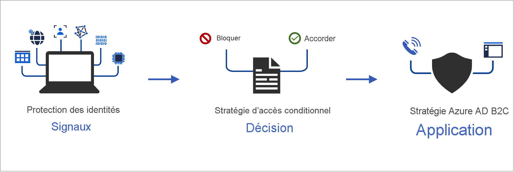

# <a name="add-conditional-access-to-user-flows-in-azure-active-directory-b2c"></a>Ajouter l’accès conditionnel à des flux d’utilisateurs dans Azure Active Directory B2C

[!INCLUDE [active-directory-b2c-choose-user-flow-or-custom-policy](../../includes/active-directory-b2c-choose-user-flow-or-custom-policy.md)]

L’accès conditionnel peut être ajouté à vos flux d’utilisateurs Azure Active Directory B2C (Azure AD B2C) ou stratégies pesonnalisées pour gérer les connexions risquées à vos applications. L’accès conditionnel Azure Active Directory (Azure AD) est l’outil qu’Azure AD B2C utilise pour réunir des signaux, prendre des décisions et appliquer des stratégies d’organisation.



Automatiser l’évaluation des risques avec des conditions de stratégie signifie que les connexions risquées sont immédiatement identifiées, puis corrigées ou bloquées.

## <a name="service-overview"></a>Présentation du service

Azure AD B2C évalue chaque événement de connexion et s’assure que toutes les conditions requises sont remplies avant d’accorder l’accès à l’utilisateur. Durant cette phase d’**évaluation**, le service d’accès conditionnel évalue les signaux collectés par les détections de risques Identity Protection lors des événements de connexion. Le résultat de ce processus d’évaluation correspond à un ensemble de revendications indiquant si la connexion doit être accordée ou bloquée. La stratégie Azure AD B2C utilise ces revendications pour agir au sein du flux d’utilisateur, comme pour bloquer l’accès ou amener l’utilisateur à opter pour une correction spécifique comme l’authentification multifacteur (MFA). Le blocage de l’accès prévaut sur tous les autres paramètres.

::: zone pivot="b2c-custom-policy"
L’exemple suivant présente un profil technique d’accès conditionnel utilisé pour évaluer la menace de connexion.

```XML
<TechnicalProfile Id="ConditionalAccessEvaluation">
  <DisplayName>Conditional Access Provider</DisplayName>
  <Protocol Name="Proprietary" Handler="Web.TPEngine.Providers.ConditionalAccessProtocolProvider, Web.TPEngine, Version=1.0.0.0, Culture=neutral, PublicKeyToken=null" />
  <Metadata>
    <Item Key="OperationType">Evaluation</Item>
  </Metadata>
  ...
</TechnicalProfile>
```

Pour veiller à ce que les signaux Identity Protection soient évalués correctement, vous pouvez appeler le profil technique `ConditionalAccessEvaluation` pour tous les utilisateurs, notamment les [comptes locaux et sociaux](technical-overview.md#consumer-accounts). Sinon, Identity Protection indique un degré de risque incorrect associé aux utilisateurs.

::: zone-end

Lors de la phase de *correction* qui s’ensuit, l’utilisateur reçoit une demande d’authentification multifacteur. Une fois l’opération terminée, Azure AD B2C informe Identity Protection que la menace de connexion identifiée a été corrigée et indique la méthode utilisée. Dans cet exemple, Azure AD B2C indique que l’utilisateur a correctement effectué la demande d’authentification multifacteur.

La correction peut aussi se produire par le biais d’autres canaux, par exemple, quand le mot de passe du compte est réinitialisé, soit par l’administrateur, soit par l’utilisateur. Vous pouvez vérifier l’*état du risque* de l’utilisateur dans le [rapport sur les utilisateurs à risque](identity-protection-investigate-risk.md#navigating-the-risky-users-report).

::: zone pivot="b2c-custom-policy"

> [!IMPORTANT]
> Pour corriger correctement le risque dans le parcours, vérifiez que le profil technique *Correction* est appelé après l’exécution du profil technique *Évaluation*. Si *Évaluation* est appelé sans *Correction*, l’état du risque est *Risqué*.

Quand la recommandation du profil technique *Évaluation* retourne `Block`, l’appel du profil technique *Évaluation* n’est pas nécessaire. L’état du risque est défini sur *Risqué*.

L’exemple suivant présente un profil technique d’accès conditionnel utilisé pour corriger la menace identifiée :

```XML
<TechnicalProfile Id="ConditionalAccessRemediation">
  <DisplayName>Conditional Access Remediation</DisplayName>
  <Protocol Name="Proprietary" Handler="Web.TPEngine.Providers.ConditionalAccessProtocolProvider, Web.TPEngine, Version=1.0.0.0, Culture=neutral, PublicKeyToken=null"/>
  <Metadata>
    <Item Key="OperationType">Remediation</Item>
  </Metadata>
  ...
</TechnicalProfile>
```

::: zone-end

## <a name="components-of-the-solution"></a>Composants de la solution

Voici les composants qui activent l’accès conditionnel dans Azure AD B2C :

- **Flux d’utilisateur** ou **stratégie personnalisée** qui guide l’utilisateur tout au long du processus de connexion et d’inscription.
- **Stratégie d’accès conditionnel** qui regroupe des signaux pour prendre des décisions et appliquer des stratégies organisationnelles. Lorsqu’un utilisateur se connecte à votre application via une stratégie Azure AD B2C, la stratégie d’accès conditionnel utilise des signaux Azure AD Identity Protection pour identifier les connexions risquées et présente l’action corrective appropriée.
- **Application inscrite** qui dirige les utilisateurs vers le flux d’utilisateur Azure AD B2C ou la stratégie personnalisée appropriée.
- [Navigateur TOR](https://www.torproject.org/download/) pour simuler une connexion risquée.

## <a name="service-limitations-and-considerations"></a>Limitations et considérations relatives au service

Lorsque vous utilisez l’accès conditionnel Azure AD, prenez en compte ce qui suit :

- Identity Protection est disponible pour les identités locales et sociales, telles que Google ou Facebook. Pour les identités sociales, vous devez manuellement activer l’accès conditionnel. La détection est limitée, car les informations d’identification du compte de réseau social sont gérées par le fournisseur d’identité externe.
- Dans les locataires Azure AD B2C, seul un sous-ensemble des stratégies d’[accès conditionnel Azure AD](../active-directory/conditional-access/overview.md) est disponible.


## <a name="prerequisites"></a>Prérequis

[!INCLUDE [active-directory-b2c-customization-prerequisites-custom-policy](../../includes/active-directory-b2c-customization-prerequisites-custom-policy.md)]

## <a name="pricing-tier"></a>Niveau tarifaire

Azure AD B2C **Premium P2** est nécessaire pour créer des stratégies de connexion risquée. Les locataires **Premium P1** peuvent créer une stratégie basée sur l’emplacement, l’application, des stratégies basées sur l’utilisateur ou le groupe. Pour plus d’informations, consultez [Modifier votre niveau tarifaire Azure AD B2C](billing.md#change-your-azure-ad-pricing-tier).

## <a name="prepare-your-azure-ad-b2c-tenant"></a>Préparer votre locataire Azure AD B2C

Pour ajouter une stratégie d’accès conditionnel, désactivez les paramètres de sécurité par défaut :

1. Connectez-vous au [portail Azure](https://portal.azure.com/).
2. Sélectionnez l’icône **Annuaire et abonnement** dans la barre d’outils du portail, puis sélectionnez le répertoire qui contient votre locataire Azure AD B2C.
3. Sous **Services Azure**, sélectionnez **Azure AD B2C**. Vous pouvez également utiliser la zone de recherche pour rechercher et sélectionner **Azure AD B2C**.
4. Sélectionnez **Propriétés**, puis **Gérer les paramètres de sécurité par défaut**.

   

5. Sous **Activer les paramètres de sécurité par défaut**, sélectionnez **Non**.

   

## <a name="add-a-conditional-access-policy"></a>Ajouter une stratégie d’accès conditionnel

Une stratégie d’accès conditionnel est une instruction if-then des affectations et des contrôles d’accès. Une stratégie d’accès conditionnel regroupe des signaux pour prendre des décisions et appliquer des stratégies organisationnelles. L’opérateur logique entre les affectations est *And*. L’opérateur de chaque affectation est *Ou*.


Pour ajouter une stratégie d’accès conditionnel :

1. Dans la Portail Azure, recherchez et sélectionnez **Azure AD B2C**.
1. Sous **Sécurité**, sélectionnez **Accès conditionnel**. La page **Stratégies d’accès conditionnel** s’ouvre.
1. Sélectionnez **+ Nouvelle stratégie**.
1. Entrez le nom de la stratégie, par exemple *Bloquer une connexion risquée*.
1. Sous **Affectations**, choisissez **Utilisateurs et groupes**, puis sélectionnez l’une des configurations prises en charge suivantes :

    |Inclure  |Licence | Notes  |
    |---------|---------|---------|
    |**Tous les utilisateurs** | P1, P2 |Si vous choisissez d’inclure **Tous les utilisateurs**, cette stratégie affecte tous vos utilisateurs. Pour être sûr de ne pas vous bloquer, excluez votre compte administratif en choisissant **Exclure**, puis en sélectionnant **Rôles d’annuaire** et **Administrateur général** dans la liste. Vous pouvez également sélectionner **Utilisateurs et groupes**, puis votre compte dans la liste **Sélectionner les utilisateurs exclus**.  | 
 
1. Sélectionnez **Applications cloud ou actions**, puis **Sélectionner les applications**. Recherchez votre [application par partie de confiance](tutorial-register-applications.md).

1. Sélectionnez **Conditions**, puis sélectionnez l’une des conditions suivantes. Par exemple, sélectionnez **Risque de connexion** et les niveaux de risque **Élevé**, **Moyen** et **Faible**.
    
    |Condition  |Licence  |Notes  |
    |---------|---------|---------|
    |**Risque de l’utilisateur**|P2|Le risque utilisateur reflète la probabilité qu'une identité ou un compte donné soit compromis.|
    |**Risque à la connexion**|P2|Le risque à la connexion reflète la probabilité qu’une requête d’authentification donnée soit rejetée par le propriétaire de l’identité.|
    |**Plateformes d’appareils**|Non pris en charge| Caractérisé par le système d’exploitation qui s’exécute sur un appareil. Pour plus d’informations, consultez [Plateformes d’appareils](../active-directory/conditional-access/concept-conditional-access-conditions.md#device-platforms).|
    |**Emplacements**|P1, P2|Les emplacements nommés peuvent inclure les informations du réseau IPv4 public, le pays ou la région, ou les zones inconnues qui ne correspondent pas à des pays ou régions spécifiques. Pour plus d’informations, consultez [Emplacements](../active-directory/conditional-access/concept-conditional-access-conditions.md#locations). |
 
1. Sous **Contrôles d’accès**, sélectionnez **Accorder**. Indiquez ensuite si vous souhaitez bloquer ou accorder l’accès :
    
    |Option  |Licence |Remarque  |
    |---------|---------|---------|
    |**Bloquer l’accès**|P1, P2| Empêche l’accès en fonction des conditions spécifiées dans cette stratégie d’accès conditionnel.|
    |**Accorder l’accès** avec **Exiger l’authentification multifacteur**|P1, P2|En fonction des conditions spécifiées dans cette stratégie d’accès conditionnel, l’utilisateur doit utiliser l’authentification multifacteur Azure AD B2C.|

1. Sous **Activer une stratégie**, sélectionnez l’une des options suivantes :
    
    |Option  |Licence |Remarque  |
    |---------|---------|---------|
    |**Rapport seul**|P1, P2| Le mode rapport seul permet aux administrateurs d’évaluer l’impact des stratégies d’accès conditionnel avant de les activer dans leur environnement. Nous vous recommandons de vérifier la stratégie avec cet état et de déterminer l’impact sur les utilisateurs finaux sans imposer l’authentification multifacteur ni bloquer les utilisateurs. Pour plus d’informations, consultez [Examiner les résultats de l’accès conditionnel dans le rapport d’audit](#review-conditional-access-outcomes-in-the-audit-report).|
    | **Activé**| P1, P2| La stratégie d’accès est évaluée mais pas appliquée. |
    | **Désactivé** | P1, P2| La stratégie d’accès n’est pas activée et n’a aucun effet sur les utilisateurs. |

1. Activez votre stratégie d’accès conditionnel de test en sélectionnant **Créer**.

## <a name="conditional-access-template-1-sign-in-risk-based-conditional-access"></a>Modèle d’accès conditionnel 1 : Accès conditionnel basé sur les risques de connexion

La plupart des utilisateurs ont un comportement normal qui peut être suivi. Lorsqu’ils dévient de cette norme, il peut être risqué de les autoriser à se connecter uniquement. Vous pouvez bloquer ces utilisateurs ou simplement leur demander d’effectuer une authentification multifacteur pour prouver qu’ils sont vraiment ceux qu’ils prétendent être.

Un risque de connexion reflète la probabilité qu’une requête d’authentification donnée soit rejetée par le propriétaire de l'identité. Les locataires Azure AD B2C disposant de licences P2 peuvent créer des stratégies d’accès conditionnel incorporant les [détections de risques de connexion d’Azure AD Identity Protection](../active-directory/identity-protection/concept-identity-protection-risks.md#sign-in-risk). Veuillez noter les [limitations relatives aux détections de protection des identités pour B2C](./identity-protection-investigate-risk.md?pivots=b2c-user-flow#service-limitations-and-considerations).

Si un risque est détecté, les utilisateurs peuvent effectuer l’authentification multifacteur pour résoudre automatiquement et fermer l’événement de connexion risquée afin d’éviter toute perturbation inutile pour les administrateurs.

Configurez l’accès conditionnel par le biais du portail Azure ou des API Microsoft Graph pour activer une stratégie d’accès conditionnel en fonction des risques de connexion qui exige une authentification multifacteur quand le risque de connexion est *moyen* ou *élevé*.

### <a name="enable-with-conditional-access-policy"></a>Activer avec la stratégie d’accès conditionnel

1. Connectez-vous au **portail Azure**.
2. Accédez à **Azure AD B2C** > **Sécurité** > **Accès conditionnel**.
3. Sélectionnez **Nouvelle stratégie**.
4. Donnez un nom à votre stratégie. Nous recommandons aux organisations de créer une norme explicite pour les noms de leurs stratégies.
5. Sous **Affectations**, sélectionnez **Utilisateurs et groupes**.
   1. Sous **Inclure**, sélectionnez **Tous les utilisateurs**.
   2. Sous **Exclure**, sélectionnez **Utilisateurs et groupes**, puis choisissez les comptes d’accès d’urgence ou de secours de votre organisation. 
   3. Sélectionnez **Terminé**.
6. Sous **Applications ou actions cloud** > **Inclure**, sélectionnez **Toutes les applications cloud**.
7. Dans **Conditions** > **Risque de connexion**, définissez **Configurer** sur **Oui**. Sous **Sélectionner le niveau de risque de connexion auquel cette stratégie s’applique** 
   1. Sélectionnez **Haut** et **Moyen**.
   2. Sélectionnez **Terminé**.
8. Sous **Contrôles d’accès** > **Accorder**, sélectionnez **Accorder l'accès**, **Requérir l’authentification multifacteur**, et sélectionnez **Sélectionner**.
9. Confirmez vos paramètres et réglez **Activer la stratégie** sur **Activé**.
10. Sélectionnez **Créer** pour créer votre stratégie.

### <a name="enable-with-conditional-access-apis-optional"></a>Activer avec les API d’accès conditionnel (facultatif)

Créez une stratégie d’accès conditionnel en fonction des risques de connexion avec les API MS Graph. Pour plus d’informations, consultez [API d’accès conditionnel](../active-directory/conditional-access/howto-conditional-access-apis.md#graph-api).

Le modèle suivant peut être utilisé pour créer une stratégie d’accès conditionnel avec le nom complet « Template 1 : Require MFA for medium+ sign-in risk » en mode rapport seul.

```json
{
    "displayName": "Template 1: Require MFA for medium+ sign-in risk",
    "state": "enabledForReportingButNotEnforced",
    "conditions": {
        "signInRiskLevels": [ "high" ,
            "medium"
        ],
        "applications": {
            "includeApplications": [
                "All"
            ]
        },
        "users": {
            "includeUsers": [
                "All"
            ],
            "excludeUsers": [
                "f753047e-de31-4c74-a6fb-c38589047723"
            ]
        }
    },
    "grantControls": {
        "operator": "OR",
        "builtInControls": [
            "mfa"
        ]
    }
}
```

## <a name="add-conditional-access-to-a-user-flow"></a>Ajouter l’accès conditionnel à un flux d’utilisateur

Après avoir ajouté la stratégie d’accès conditionnel Azure AD, activez l’accès conditionnel dans votre flux d’utilisateur ou votre stratégie personnalisée. Quand vous activez l’accès conditionnel, vous n’avez pas besoin de spécifier un nom de stratégie.

Plusieurs stratégies d’accès conditionnel peuvent s’appliquer à un utilisateur individuel à tout moment. Dans ce cas, la stratégie de contrôle d’accès la plus stricte est prioritaire. Par exemple, si une stratégie demande une authentification multifacteur, tandis qu’une autre bloque l’accès, l’utilisateur est bloqué.

## <a name="enable-multi-factor-authentication-optional"></a>Activer l’authentification multifacteur (facultatif)

Quand vous ajoutez un accès conditionnel à un flux d’utilisateur, envisagez d’utiliser l’**authentification multifacteur (MFA)** . Les utilisateurs peuvent utiliser un code à usage unique par SMS ou voix, ou un mot de passe à usage unique par e-mail pour l’authentification multifacteur. Les paramètres MFA sont configurés séparément des paramètres d’accès conditionnel. Vous pouvez choisir parmi les options MFA suivantes :

- **Désactivé** – MFA n’est jamais appliquée pendant la connexion, et les utilisateurs ne sont pas invités à s’inscrire à MFA dans le cadre de l’inscription ou de la connexion.
- **Toujours activé** – MFA est toujours requise, quelle que soit votre configuration de l’accès conditionnel. Lors de l’inscription, les utilisateurs sont invités à s’inscrire dans MFA. Lors de la connexion, si les utilisateurs ne sont pas déjà inscrits à l’authentification multifacteur, ils sont invités à s’y inscrire.
- **Conditionnel** – Lors de l’inscription et de la connexion, les utilisateurs sont invités à s’inscrire à l’authentification MFA (à la fois les nouveaux utilisateurs et les utilisateurs existants qui ne sont pas inscrits à l’authentification MFA). Lors de la connexion, l’authentification MFA est appliquée uniquement quand une évaluation de la stratégie d’accès conditionnel active l’exige :

   - Si le résultat est un défi d’authentification MFA sans risque, l’authentification MFA est appliquée. Si l’utilisateur n’est pas déjà inscrit à l’authentification multifacteur, il est invité à s’y inscrire.
   - Si le résultat est un défi d’authentification MFA en raison d’un risque *et* que l’utilisateur n’est pas inscrit dans MFA, la connexion est bloquée.

   > [!NOTE]
   > Avec la disponibilité générale de l’accès conditionnel dans Azure AD B2C, les utilisateurs sont désormais invités à s’inscrire à une méthode d’authentification multifacteur lors de l’inscription. Les flux d’utilisateur d’inscription que vous avez créés avant la mise à disposition générale ne reflètent pas automatiquement ce nouveau comportement, mais vous pouvez inclure le comportement en créant des flux d’utilisateurs.

::: zone pivot="b2c-user-flow"

Pour activer l’accès conditionnel pour un flux d’utilisateur, assurez-vous que la version prend en charge l’accès conditionnel. Ces versions de flux d’utilisateurs sont étiquetées **Recommandé**.

1. Connectez-vous au [portail Azure](https://portal.azure.com).

1. Sélectionnez l’icône **Annuaire et abonnement** dans la barre d’outils du portail, puis sélectionnez le répertoire qui contient votre locataire Azure AD B2C.

1. Sous **Services Azure**, sélectionnez **Azure AD B2C**. Vous pouvez également utiliser la zone de recherche pour rechercher et sélectionner **Azure AD B2C**.

1. Sous **Stratégies**, sélectionnez **Flux utilisateur**. Sélectionnez ensuite le flux d’utilisateur.

1. Sélectionnez **Propriétés** et vérifiez que le flux d’utilisateur prend en charge l’accès conditionnel en recherchant le paramètre libellé **Accès conditionnel**.
 
   

1. Dans la section **Authentification multifacteur**, sélectionnez le **Type de méthode** souhaité, puis, sous **Application MFA**, sélectionnez **Conditionnel**.
 
1. Dans la section **Accès conditionnel**, cochez la case **Appliquer les stratégies d’accès conditionnel**.

1. Sélectionnez **Enregistrer**.


::: zone-end

::: zone pivot="b2c-custom-policy"

## <a name="add-conditional-access-to-your-policy"></a>Ajouter l’accès conditionnel à votre stratégie

1. Découvrez un exemple de stratégie d’accès conditionnel sur [GitHub](https://github.com/azure-ad-b2c/samples/tree/master/policies/conditional-access).
1. Dans chaque fichier, remplacez la chaîne `yourtenant` par le nom de votre locataire Azure AD B2C. Par exemple, si le nom de votre locataire B2C est *contosob2c*, toutes les instances de `yourtenant.onmicrosoft.com` deviennent `contosob2c.onmicrosoft.com`.
1. Téléchargez les fichiers de stratégie.
 
### <a name="configure-claim-other-than-phone-number-to-be-used-for-mfa"></a>Configurer une revendication autre que le numéro de téléphone à utiliser pour l’authentification multifacteur

Dans la stratégie d’accès conditionnel ci-dessus, la méthode de transformation de revendication `DoesClaimExist` vérifie si une revendication contient une valeur, par exemple si la revendication `strongAuthenticationPhoneNumber` contient un numéro de téléphone. 

La transformation des revendications ne se limite pas à la revendication `strongAuthenticationPhoneNumber`. Selon le scénario, vous pouvez utiliser n’importe quelle autre revendication. Dans l’extrait de code XML suivant, c’est la revendication `strongAuthenticationEmailAddress` qui est plutôt vérifiée. La revendication que vous choisissez doit avoir une valeur valide, sans quoi la revendication `IsMfaRegistered`est définie sur `False`. Quand sa valeur est `False`, l’évaluation de la stratégie d’accès conditionnel retourne un type d’autorisation `Block`, ce qui empêche l’utilisateur d’accomplir le flux d’utilisateur.

```XML
 <ClaimsTransformation Id="IsMfaRegisteredCT" TransformationMethod="DoesClaimExist">
  <InputClaims>
    <InputClaim ClaimTypeReferenceId="strongAuthenticationEmailAddress" TransformationClaimType="inputClaim" />
  </InputClaims>
  <OutputClaims>
    <OutputClaim ClaimTypeReferenceId="IsMfaRegistered" TransformationClaimType="outputClaim" />
  </OutputClaims>
 </ClaimsTransformation>
```

## <a name="test-your-custom-policy"></a>Tester votre stratégie personnalisée

1. Sélectionnez la stratégie `B2C_1A_signup_signin_with_ca` ou `B2C_1A_signup_signin_with_ca_whatif` pour ouvrir sa page de présentation. Sélectionnez ensuite **Exécuter le flux d’utilisateur**. Sous **Application**, sélectionnez *webapp1*. L’**URL de réponse** doit être `https://jwt.ms`.
1. Copiez l’URL sous **Exécuter le point de terminaison du flux d’utilisateur**.

1. Pour simuler une connexion risquée, ouvrez le [navigateur Tor](https://www.torproject.org/download/) et utilisez l’URL que vous avez copiée à l’étape précédente pour vous connecter à l’application inscrite.

1. Entrez les informations demandées dans la page de connexion, puis essayez de vous connecter. Le jeton est envoyé à `https://jwt.ms` et vous devez le voir. Dans le jeton décodé jwt.ms, vous devez voir que la connexion a été bloquée.

::: zone-end

::: zone pivot="b2c-user-flow"

## <a name="test-your-user-flow"></a>Tester votre flux d’utilisateur

1. Sélectionnez le flux d’utilisateur que vous avez créé pour ouvrir sa page de présentation, puis sélectionnez **Exécuter le flux d’utilisateur**. Sous **Application**, sélectionnez *webapp1*. L’**URL de réponse** doit être `https://jwt.ms`.

1. Copiez l’URL sous **Exécuter le point de terminaison du flux d’utilisateur**.

1. Pour simuler une connexion risquée, ouvrez le [navigateur Tor](https://www.torproject.org/download/) et utilisez l’URL que vous avez copiée à l’étape précédente pour vous connecter à l’application inscrite.

1. Entrez les informations demandées dans la page de connexion, puis essayez de vous connecter. Le jeton est envoyé à `https://jwt.ms` et vous devez le voir. Dans le jeton décodé jwt.ms, vous devez voir que la connexion a été bloquée.

::: zone-end

## <a name="review-conditional-access-outcomes-in-the-audit-report"></a>Examiner les résultats de l’accès conditionnel dans le rapport d’audit

Pour examiner le résultat d’un événement d’accès conditionnel

1. Connectez-vous au [portail Azure](https://portal.azure.com/).

2. Sélectionnez l’icône **Annuaire et abonnement** dans la barre d’outils du portail, puis sélectionnez le répertoire qui contient votre locataire Azure AD B2C.

3. Sous **Services Azure**, sélectionnez **Azure AD B2C**. Vous pouvez également utiliser la zone de recherche pour rechercher et sélectionner **Azure AD B2C**.

4. Sous **Activités**, sélectionnez **Journaux d’audit**.

5. Filtrez le journal d’audit en choisissant **B2C** comme **Catégorie** et **IdentityProtection** comme **Type de ressource d’activité**. Ensuite, sélectionnez **Appliquer**.

6. Passez en revue l’activité d’audit des sept derniers jours. Les types d’activité suivants sont inclus :

   - **Évaluer les stratégies d’accès conditionnel** : cette entrée du journal d’audit indique qu’une évaluation de l’accès conditionnel a été effectuée pendant une authentification.
   - **Atténuer l’utilisateur** : cette entrée indique que l’accord ou les exigences d’une stratégie d’accès conditionnel ont été satisfaites par l’utilisateur final, et que cette activité a été signalée au moteur de risque afin d’atténuer (réduire le risque) utilisateur.

7. Sélectionnez une entrée de journal **Évaluer la stratégie d’accès conditionnel** dans la liste pour ouvrir la page **Détails de l’activité : Journal d’audit**, qui affiche les identificateurs du journal d’audit, ainsi que ces informations dans la section **Détails supplémentaires** :

   - **ConditionalAccessResult** : accord requis par l’évaluation de la stratégie conditionnelle.
   - **AppliedPolicies** : liste de toutes les stratégies d’accès conditionnel où les conditions ont été satisfaites et les stratégies sont activées.
   - **ReportingPolicies** : liste des stratégies d’accès conditionnel qui ont été définies en mode rapport seul et où les conditions ont été satisfaites.

## <a name="next-steps"></a>Étapes suivantes

[Personnaliser l’interface utilisateur dans un flux d’utilisateur Azure AD B2C](customize-ui-with-html.md)
