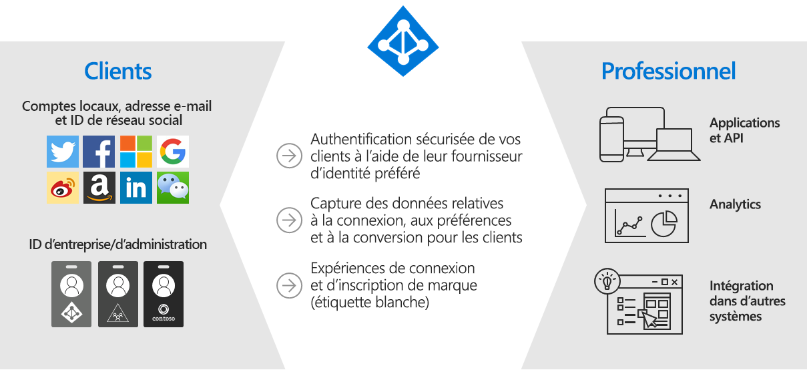
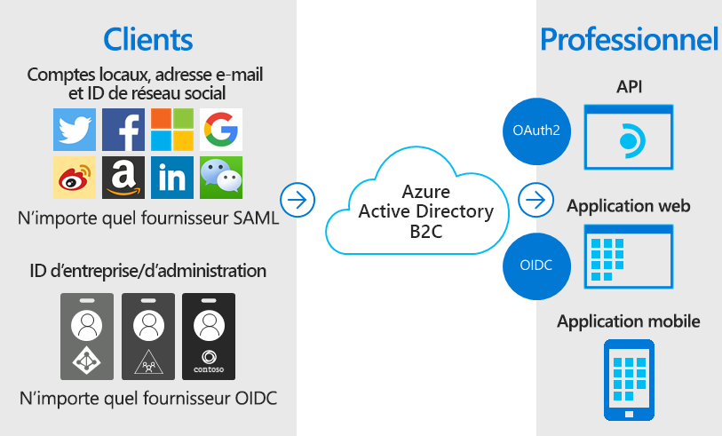
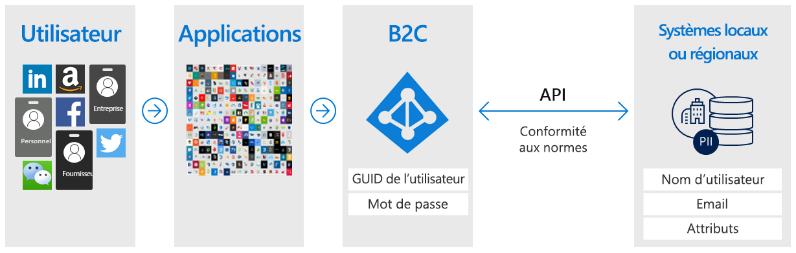
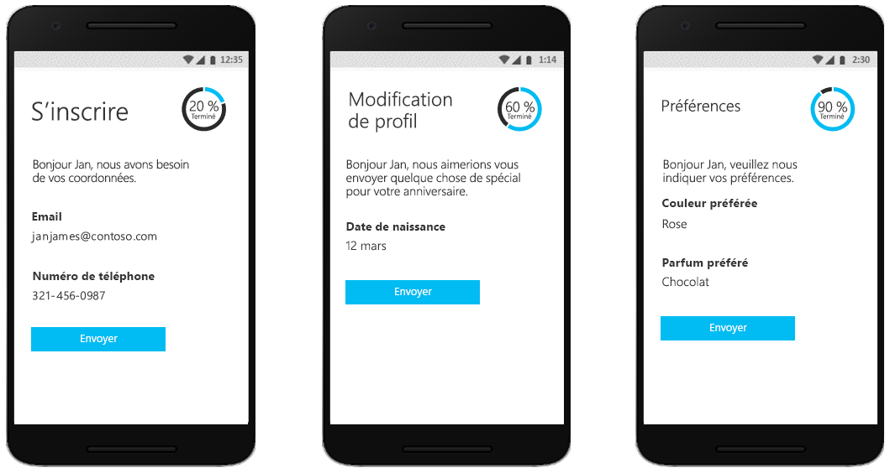
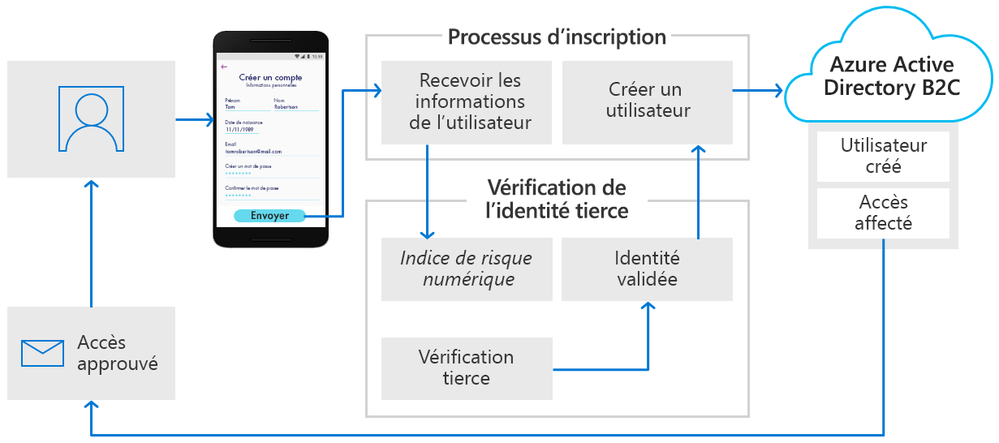
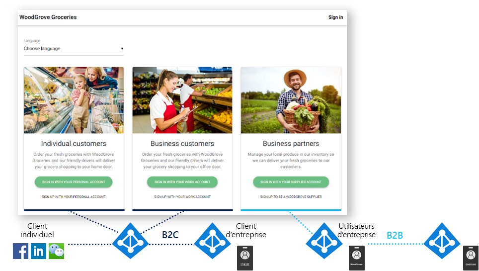

# Qu’est-ce qu’Azure Active Directory B2C ?

Azure Active Directory B2C fournit une identité entreprise- client en tant que service. Vos clients utilisent leurs identités de compte local, d’entreprise ou de réseau social par défaut pour bénéficier d’un accès par authentification unique à vos applications et API.

Azure Active Directory B2C (Azure AD B2C) est une solution de gestion des identités et des accès clients, capable de prendre en charge des millions d’utilisateurs et des milliards d’authentifications par jour. Elle prend en charge la mise à l’échelle et la sécurité de la plateforme d’authentification, surveillant et gérant automatiquement les menaces, telles que les attaques par déni de service, pulvérisation de mot de passe ou force brute.

## Solution d’identité personnalisée respectant la marque

Azure AD B2C est une solution d’authentification de marque blanche. Vous pouvez personnaliser la totalité de l’expérience utilisateur avec votre marque, de manière à la fondre parfaitement dans vos applications web et mobiles.

Personnalisez chaque page affichée par Azure AD B2C lorsque vos utilisateurs s’inscrivent, se connectent et modifient leurs informations de profil. Personnalisez aussi le code HTML, CSS et JavaScript dans vos parcours utilisateur pour que l’expérience Azure AD B2C ressemble à une partie native de votre application.

## Accès avec authentification unique et identité fournie par l’utilisateur

Le service Azure AD B2C utilise des protocoles d’authentification reposant sur des normes, dont OpenID Connect, OAuth 2.0 et SAML. Il s’intègre à la plupart des applications modernes et logiciels du commerce.

En jouant le rôle d’autorité d’authentification centrale pour vos applications web, applications mobiles et API, Azure AD B2C vous permet de créer une solution d’authentification unique (SSO) pour celles-ci. Centralisez la collecte des informations de profil utilisateur et de préférence, et capturez une analytique détaillée sur le comportement de connexion et la conversion d’inscription.

## Intégration aux magasins d’utilisateurs externes

Azure AD B2C fournit un annuaire pouvant contenir 100 attributs personnalisés par utilisateur. Cependant, vous pouvez également intégrer des systèmes externes. Par exemple, vous utilisez Azure AD B2C pour l’authentification, mais déléguez les données client à une base de données externe de gestion de la relation client (CRM) ou de fidélisation des clients en tant que source de confiance.

Un autre scénario de magasin d’utilisateurs externes consiste à laisser Azure AD B2C gérer l’authentification pour votre application tout en intégrant un système externe qui stocke les données des profils utilisateur ou les données personnelles. Par exemple, pour répondre aux exigences de résidence des données, telles que les stratégies de stockage de données régionales ou locales.

Azure AD B2C peut faciliter la collecte des informations au niveau de l’utilisateur lors de l’inscription ou de la modification de profil, puis transmettre ces données au système externe. Par la suite, lors d’authentifications ultérieures, Azure AD B2C peut récupérer les données du système externe et, si nécessaire, les inclure dans le cadre de la réponse du jeton d’authentification qu’il envoie à votre application.

## Profilage progressif

Une autre option de parcours utilisateur comprend le profilage progressif. Le profilage progressif permet à vos clients d’effectuer rapidement leur première transaction en recueillant une quantité minime d’informations. Ensuite, il collecte petit à petit plus de données de profil auprès du client lors de connexions futures.

## Vérification et confirmation d’identités tierces

Utilisez Azure AD B2C pour faciliter la vérification et la confirmation d’identités en recueillant des données utilisateur, puis en les passant à un système tiers afin de procéder à la validation, au scoring de confiance et à l’approbation autorisant la création de comptes d’utilisateur.

Ce sont là seulement quelques-unes des actions qu’il vous est possible d’accomplir avec Azure AD B2C en tant que plateforme d’identités d’entreprise-client. Les sections suivantes de cette présentation vous guident tout au long d’une application de démonstration qui utilise Azure AD B2C. Vous êtes également invité à passer directement à une [vue d’ensemble technique plus détaillée d’Azure AD B2C](technical-overview.md).

## Exemple : WoodGrove Groceries

[WoodGrove Groceries][woodgrove] est une application web en ligne créée par Microsoft pour illustrer quelques fonctionnalités Azure AD B2C. Les sections suivantes passent en revue plusieurs options d’authentification fournies par Azure AD B2C sur le site web de WoodGrove.

### Présentation de l’entreprise

WoodGrove est une épicerie en ligne qui vend de la nourriture aux particuliers et aux professionnels. Ses clients professionnels achètent de la nourriture pour le compte de leur société, ou pour les différents commerces qu’ils dirigent.

### Options de connexion

WoodGrove Groceries propose différentes options de connexion, en fonction de la relation que ses clients établissent avec le magasin :

* Les clients **particuliers** peuvent s’inscrire ou se connecter avec des comptes individuels, par exemple à l’aide d’un fournisseur d’identité de réseau social, ou d’une adresse e-mail et d’un mot de passe.
* Les clients **professionnels** peuvent s’inscrire ou se connecter avec leurs informations d’identification d’entreprise.
* Les **partenaires** et les fournisseurs sont des personnes qui approvisionnent l’épicerie en denrées à vendre. L’identité du partenaire est fournie par [Azure Active Directory B2B](../active-directory/external-identities/what-is-b2b.md).

### Authentifier les clients particuliers

Lorsqu’un client sélectionne **Sign in with your personal account** (Connectez-vous avec votre compte personnel), il est redirigé vers une page de connexion personnalisée, hébergée par Azure AD B2C. Vous pouvez remarquer dans l’image suivante que nous avons personnalisé l’interface utilisateur (IU) pour qu’elle ressemble à celle du site web de WoodGrove Groceries. Les clients de WoodGrove ignorent que l’expérience d’authentification est hébergée et sécurisée par Azure AD B2C.

WoodGrove permet à ses clients de s’inscrire et de se connecter en utilisant leurs comptes Google, Facebook ou Microsoft comme fournisseur d’identité. Ils peuvent, sinon, s’inscrire au moyen de leur adresse e-mail et d’un mot de passe pour créer ce que l’on appelle un *compte local*.

Quand un client sélectionne **Sign up with your personal account** (Inscrivez-vous avec votre compte personnel), puis **Sign up now** (Inscrivez-vous maintenant), une page d’inscription personnalisée s’affiche.

Après avoir indiqué une adresse e-mail et sélectionné **Send verification code** (Envoyer le code de vérification), il reçoit le code envoyé par Azure AD B2C. Une fois qu’il a entré son code, sélectionné **Verify code**, puis indiquez les autres informations demandées dans le formulaire, il doit aussi accepter les conditions d’utilisation du service.

Le fait de cliquer sur le bouton **Create** déclenche la redirection de l’utilisateur par Azure AD B2C vers le site web de WoodGrove Groceries. Lors de la redirection, Azure AD B2C transmet un jeton d’authentification OpenID Connect à l’application web WoodGrove. L’utilisateur est maintenant connecté et prêt à utiliser le site, son nom d’affichage apparaît dans l’angle supérieur droit pour indiquer qu’il est connecté.

### Authentifier les clients professionnels

Lorsqu’un client sélectionne une des options sous **Business clients**, le site web de WoodGrove Groceries appelle une autre stratégie Azure AD B2C que celle utilisée pour les particuliers.

Cette stratégie propose à l’utilisateur de se servir de ses informations d’identification d’entreprise pour l’inscription et la connexion. Dans l’exemple de WoodGrove, les utilisateurs sont invités à se connecter avec un compte professionnel ou scolaire. Cette stratégie utilise une [application Azure AD multilocataire](../active-directory/develop/howto-convert-app-to-be-multi-tenant.md) et le point de terminaison Azure AD `/common` pour fédérer Azure AD B2C avec n’importe quel client Microsoft 365 dans le monde.

### Authentifier les partenaires

Le lien **Sign in with your supplier account** (Connectez-vous avec votre compte fournisseur) utilise la fonctionnalité de collaboration d’Azure Active Directory B2B. Azure AD B2B constitue un groupe de fonctionnalités au sein d’Azure Active Directory pour gérer les identités des partenaires. Ces identités peuvent être fédérées à partir d’Azure Active Directory afin d’accéder aux applications protégées par Azure AD B2C.

Apprenez-en davantage sur Azure AD B2B avec la [Présentation de l’accès utilisateur invité dans Azure Active Directory B2B](../active-directory/external-identities/what-is-b2b.md).

<!-- UNCOMMENT WHEN REPO IS UPDATED WITH LATEST DEMO CODE
### Sample code

If you'd like to jump right into the code to see how the WoodGrove Groceries application is built, you can find the repository on GitHub:

[Azure-Samples/active-directory-external-identities-woodgrove-demo][woodgrove-repo] (GitHub)
-->

## Étapes suivantes

Maintenant que vous avez une idée de ce qu’est Azure AD B2C, et de son utilité dans quelques-uns des scénarios qui ont été évoqués, découvrez-en un peu plus sur ses fonctionnalités et aspects techniques.

> [!div class="nextstepaction"]
> [Vue d’ensemble technique d’Azure AD B2C >](technical-overview.md)

<!-- LINKS - External -->
[woodgrove]: https://aka.ms/ciamdemo
[woodgrove-repo]: https://github.com/Azure-Samples/active-directory-external-identities-woodgrove-demo