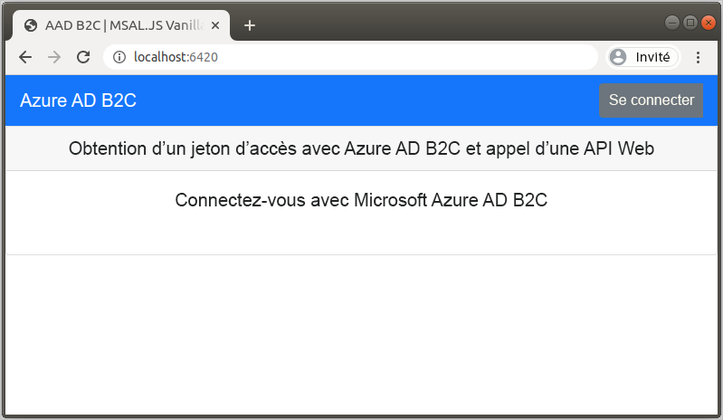
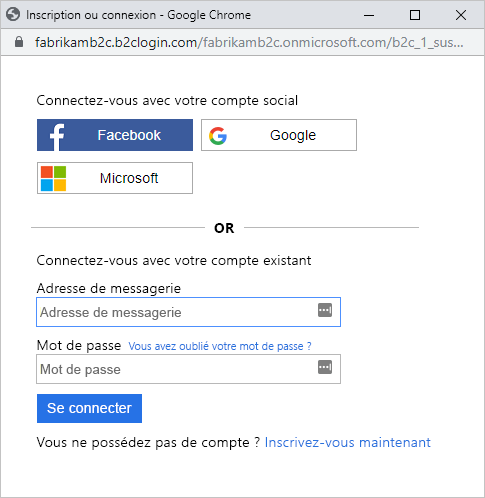
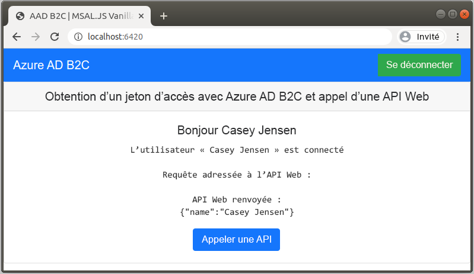

# <a name="quickstart-set-up-sign-in-for-a-single-page-app-using-azure-active-directory-b2c"></a>Démarrage rapide : Configurer la connexion pour une application monopage à l’aide d’Azure Active Directory B2C

Azure Active Directory B2C (Azure AD B2C) assure la gestion des identités de cloud pour préserver la protection de votre application, de votre entreprise et de vos clients. Azure AD B2C permet à vos applications de s’authentifier auprès de comptes des réseaux sociaux et de comptes d’entreprise à l’aide de protocoles standard ouverts. Dans ce démarrage rapide, vous utilisez un exemple d’application monopage pour vous connecter à l’aide d’un fournisseur d’identité sociale et appeler une API web protégée par Azure AD B2C.

[!INCLUDE [quickstarts-free-trial-note](../../includes/quickstarts-free-trial-note.md)]

## <a name="prerequisites"></a>Prérequis

- [Visual Studio Code](https://code.visualstudio.com/)
- [Node.JS](https://nodejs.org/en/download/)
- Compte de réseau social Facebook, Google ou Microsoft
- Exemple de code GitHub : [active-directory-b2c-javascript-msal-singlepageapp](https://github.com/Azure-Samples/active-directory-b2c-javascript-msal-singlepageapp)

    Vous pouvez [télécharger l’archive zip](https://github.com/Azure-Samples/active-directory-b2c-javascript-msal-singlepageapp/archive/master.zip) ou cloner le dépôt :

    ```console
    git clone https://github.com/Azure-Samples/active-directory-b2c-javascript-msal-singlepageapp.git
    ```

## <a name="run-the-application"></a>Exécution de l'application

1. Démarrez le serveur en exécutant les commandes suivantes à partir de l’invite de commandes Node.js :

    ```console
    cd active-directory-b2c-javascript-msal-singlepageapp
    npm install && npm update
    npm start
    ```

    Le serveur démarré par *server.js* affiche le port sur lequel il est à l’écoute :

    ```console
    Listening on port 6420...
    ```

1. Accédez à l’URL de l’application. Par exemple : `http://localhost:6420`.

    

## <a name="sign-in-using-your-account"></a>Connectez-vous à l’aide de votre compte

1. Sélectionnez **Se connecter** pour démarrer le parcours utilisateur.
1. Azure AD B2C présente une page de connexion d’une entreprise fictive appelée Fabrikam pour l’exemple d’application web. Pour vous inscrire au moyen d’un fournisseur d’identité sociale, sélectionnez le bouton en regard du fournisseur d’identité que vous souhaitez utiliser.

    

    Vous vous authentifiez (vous connectez) avec les informations d’identification de votre compte de réseau social et autorisez l’application à lire les informations de votre compte de réseau social. En accordant l’accès, l’application peut extraire des informations de profil du compte de réseau social, telles que votre nom et votre ville.

1. Terminez le processus de connexion pour le fournisseur d’identité.

## <a name="access-a-protected-api-resource"></a>Accéder à une ressource d’API protégée

Cliquez sur **Call API** (Appeler une API) pour que votre nom d’affichage soit retourné par l’API web sous forme d’un objet JSON.



L’exemple d’application monopage inclut un jeton d’accès dans la requête envoyée à la ressource de l’API web protégée.

## <a name="next-steps"></a>Étapes suivantes

Dans ce guide de démarrage rapide, vous avez utilisé un exemple d’application monopage pour :

- Vous connecter avec un fournisseur d’identité sociale
- Créer un compte d’utilisateur Azure AD B2C (créé automatiquement lors de la connexion)
- Appeler une API web protégée par Azure AD B2C

Passez maintenant à la création de votre propre locataire Azure AD B2C.

> [!div class="nextstepaction"]
> [Créer un locataire Azure Active Directory B2C dans le portail Azure](tutorial-create-tenant.md)
