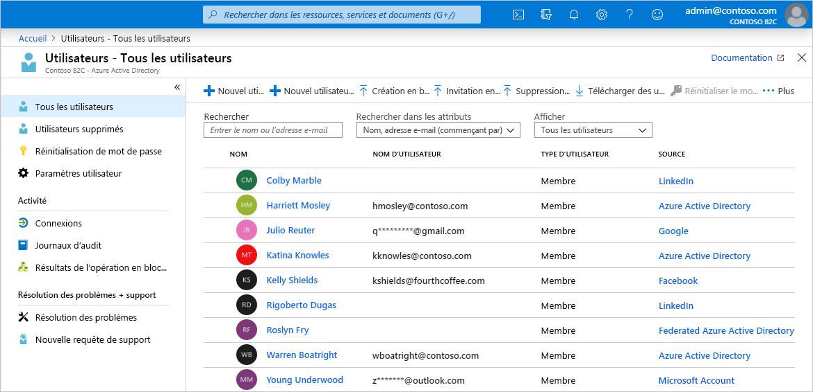
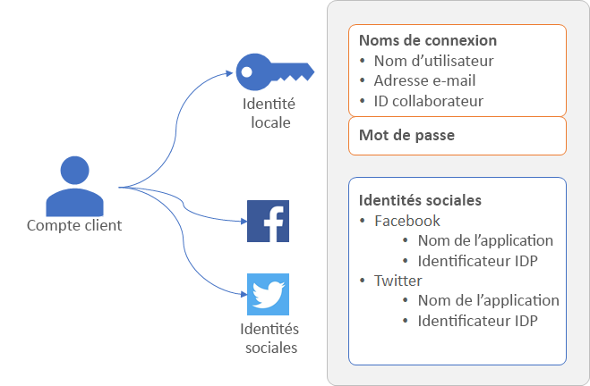
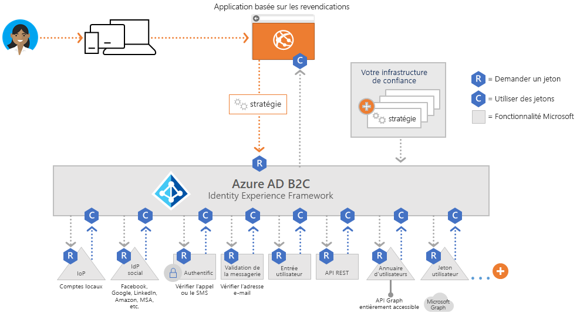
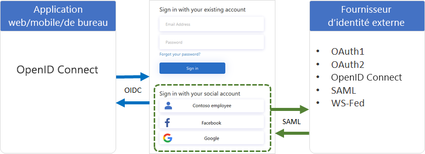
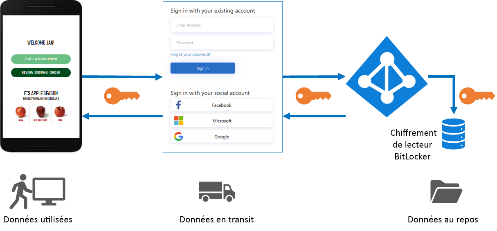
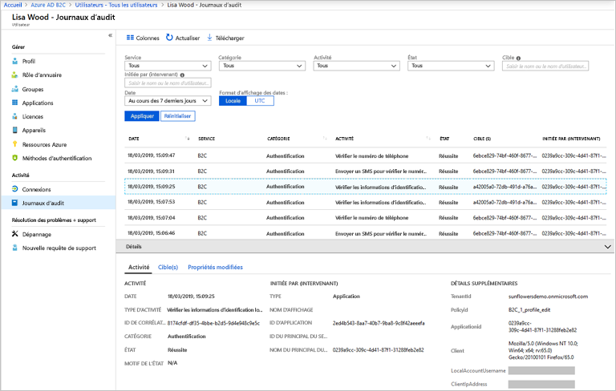

# Vue d’ensemble technique et fonctionnelle d’Azure Active Directory B2C

En complément à la rubrique[À propos d’Azure Active Directory B2C](overview.md), cet article présente une introduction plus détaillée du service. Sont abordées ici les ressources principales que vous utilisez dans le service, les fonctionnalités qui lui sont associées et la façon dont celles-ci vous permettent de fournir à vos clients une expérience d’identité entièrement personnalisée dans vos applications.

## Locataire Azure AD B2C

Dans Azure Active Directory B2C (Azure AD B2C), un *locataire* représente votre organisation, et constitue un annuaire d’utilisateurs. Chaque locataire Azure AD B2C est distinct et indépendant des autres locataires Azure AD B2C. Un locataire Azure AD B2C n’est pas un locataire Azure Active Directory ; d’ailleurs vous disposez peut-être déjà de ce dernier.

Les ressources principales que vous utilisez dans un locataire Azure AD B2C sont les suivantes :

* **Annuaire** : l’*annuaire* est l’emplacement où Azure AD B2C stocke les informations d’identification et les données de profil de vos utilisateurs, ainsi que les inscriptions de vos applications.
* **Inscriptions d’applications** : vous inscrivez vos applications web, mobiles et natives auprès d’Azure AD B2C pour activer la gestion des identités. Il en va de même pour toute API que vous souhaitez protéger avec Azure AD B2C.
* **Flux utilisateur** et **stratégies personnalisées** : il s’agit des expériences d’identités intégrées (flux utilisateur) et entièrement personnalisables (stratégies personnalisées) pour vos applications.
  * Utilisez les *flux utilisateur* pour une configuration rapide et l’activation de tâches d’identité courantes, telles que l’inscription, la connexion et la modification de profil.
  * Utilisez les *stratégies personnalisées* pour activer les expériences utilisateur non seulement par rapport aux tâches d’identité courantes, mais aussi pour élaborer la prise en charge des workflows d’identités complexes, propres à votre organisation, à vos clients, employés, partenaires et citoyens.
* **Fournisseurs d’identités** : les paramètres de fédération pour les acteurs suivants :
  * les fournisseurs d’identités *de réseau social*, comme Facebook, LinkedIn ou Twitter, que vous souhaitez prendre en charge dans vos applications ;
  * les fournisseurs d’identités *externes* qui prennent en charge les protocoles d’identité standard, tels que OAuth 2.0, OpenID Connect, etc.
  * les comptes *locaux* qui permettent aux utilisateurs de s’inscrire et de se connecter au moyen d’un nom d’utilisateur (d’une adresse e-mail ou d’un autre ID) et d’un mot de passe.
* **Clés** : ajoutez et gérez des clés de chiffrement pour la signature et la validation des jetons, des secrets clients, des certificats et des mots de passe.

Un locataire Azure AD B2C est la première ressource que vous devez créer pour commencer à utiliser Azure AD B2C. Découvrez comment, dans le [Tutoriel : Créer un locataire Azure Active Directory B2C](tutorial-create-tenant.md).

## Comptes dans Azure AD B2C

Azure AD B2C définit plusieurs types de comptes utilisateur. Azure Active Directory, Azure Active Directory B2B et Azure Active Directory B2C partagent ces types de comptes.

* **Compte professionnel** : les utilisateurs dotés de comptes professionnels peuvent accéder aux ressources d’un locataire et, lorsqu’ils sont dotés d’un rôle d’administrateur, peuvent aussi gérer des locataires. Les utilisateurs disposant de comptes professionnels peuvent créer des comptes consommateur, réinitialiser des mots de passe, bloquer/débloquer des comptes et définir des autorisations ou attribuer un compte à un groupe de sécurité.
* **Compte invité** : les utilisateurs externes que vous invitez dans votre locataire en tant qu’invités. Un scénario standard pour inviter un utilisateur dans votre locataire Azure AD B2C consiste à partager les responsabilités d’administration.
* **Compte consommateur** : les comptes consommateur sont les comptes créés dans votre annuaire Azure AD B2C, lorsque les utilisateurs effectuent le parcours utilisateur d’inscription dans une application que vous avez enregistrée dans votre locataire.

 *Figure : Annuaire d’utilisateurs d’un locataire Azure AD B2C dans le portail Azure*

### Comptes consommateur

Avec un compte *consommateur*, les utilisateurs peuvent se connecter aux applications que vous avez sécurisées au moyen d’Azure AD B2C. Toutefois, les utilisateurs disposant de comptes consommateur ne peuvent pas accéder aux ressources Azure, par exemple au portail Azure.

Un compte consommateur peut être associé à ces types d’identités :

* **Identité locale**, avec le nom d’utilisateur et le mot de passe stockés localement dans l’annuaire Azure AD B2C. Nous faisons souvent référence à ces identités en parlant de « comptes locaux ».
* **Identités de réseau social** ou **d’entreprise**, sachant que l’identité de l’utilisateur est managée par un fournisseur d’identité fédéré, comme Facebook, Microsoft, ADFS ou Salesforce.

Un utilisateur disposant d’un compte consommateur peut se connecter avec plusieurs identités, par exemple un nom d’utilisateur, une adresse e-mail, un ID employé, un ID gouvernement, etc. Un compte unique peut avoir plusieurs identités, qu’elles soient locales et de réseaux sociaux.

 *Figure : Compte consommateur unique doté de plusieurs identités dans Azure AD B2C*

Azure AD B2C vous permet de gérer les attributs courants des profils de comptes consommateur, tels que le nom d’affichage, le nom, le prénom, la ville, etc. Vous pouvez également étendre le schéma Azure AD pour stocker des informations supplémentaires sur vos utilisateurs, comme leur pays/région ou lieu de résidence, leur langue par défaut et leurs préférences (par exemple, s’ils souhaitent s’abonner à un bulletin d’informations ou activer l’authentification multifacteur).

Apprenez-en davantage sur les types de comptes utilisateur dans Azure AD B2C avec [Vue d’ensemble des comptes d’utilisateur dans Azure Active Directory B2C](user-overview.md).

## Fournisseurs d’identité externes

Vous pouvez configurer Azure AD B2C pour permettre aux utilisateurs de se connecter à votre application avec des informations d’identification de fournisseurs d’identités de réseau social ou d’entreprise externes (IdP). Azure AD B2C prend en charge les fournisseurs d’identité externe, comme Facebook, compte Microsoft, Google, Twitter et tout fournisseur d’identité prenant en charge les protocoles OAuth 1.0, OAuth 2.0, OpenID Connect et SAML.

Avec la fédération des fournisseurs d’identités externes, vous pouvez donner à vos consommateurs la possibilité de se connecter avec leurs comptes de réseaux sociaux ou d’entreprise existants, sans avoir à créer de compte spécialement pour votre application.

Dans la page d’inscription ou de connexion, Azure AD B2C affiche une liste de fournisseurs d’identités externes à partir de laquelle l’utilisateur peut faire son choix pour se connecter. Dès lors qu’il a sélectionné un des fournisseurs d’identités externes, il est emmené (redirigé) sur le site web du fournisseur sélectionné pour terminer le processus de connexion. Une fois l’utilisateur dûment connecté, il est retourné à Azure AD B2C pour l’authentification du compte dans votre application.

Pour voir comment ajouter des fournisseurs d’identité dans Azure AD B2C, consultez [Ajouter des fournisseurs d’identité à vos applications dans Azure Active Directory B2C](add-identity-provider.md).

## Expériences d’identité : flux utilisateur ou stratégies personnalisées

Le framework de stratégie extensible d’Azure AD B2C constitue son point fort. Les stratégies décrivent les expériences d’identité de vos utilisateurs, comme l’inscription, la connexion et la modification de profil.

Dans Azure AD B2C, il existe deux voies principales à suivre pour fournir ces expériences d’identité : les flux utilisateur et les stratégies personnalisées.

* Les **flux utilisateur** sont des stratégies prédéfinies, intégrées et configurables que nous fournissons, afin que vous puissiez créer des expériences d’inscription, de connexion et de modification de stratégie en quelques minutes.

* Les **stratégies personnalisées** vous permettent de créer vos propres parcours utilisateur pour des scénarios d’expérience d’identité complexes.

Les flux utilisateur comme les stratégies personnalisées sont pilotés par *Identity Experience Framework*, le moteur d’orchestration des stratégies d’Azure AD B2C.

### Flux utilisateur

Pour vous aider à rapidement configurer les tâches d’identité les plus courantes, le portail Azure inclut plusieurs stratégies configurables et prédéfinies, appelées *flux utilisateur*.

Vous pouvez configurer des paramètres de flux utilisateur comme ceux mentionnés ici, pour contrôler les comportements d’expérience d’identité dans vos applications :

* Types de compte utilisés pour la connexion, comme les comptes de réseaux sociaux de type Facebook, ou les comptes locaux qui utilisent une adresse e-mail et un mot de passe pour cette connexion
* Attributs à collecter auprès du consommateur, comme le prénom, le code postal ou le pays/la région de résidence
* Azure AD Multi-Factor Authentication (MFA)
* Personnalisation de l’interface utilisateur
* Ensemble de revendications dans un jeton que votre application reçoit dès que l’utilisateur a terminé le flux utilisateur
* Gestion des sessions
* ...et bien plus.

La plupart des scénarios d’identité courants pour la majorité des applications monopage, web et mobiles peuvent être efficacement définis et implémentés à l’aide des flux utilisateur. Nous vous recommandons d’utiliser les flux d’utilisateur intégrés, sauf si vous avez des scénarios de parcours utilisateur complexes qui nécessitent toute la flexibilité offerte par les stratégies personnalisées.

Apprenez-en davantage sur les flux utilisateur avec [Flux d’utilisateur dans Azure Active Directory B2C](user-flow-overview.md).

### Stratégie personnalisée

Les stratégies personnalisées donnent accès à toute la puissance du moteur d’orchestration Identity Experience Framework (IEF). Avec les stratégies personnalisées, vous pouvez tirer parti d’IEF pour créer pratiquement n’importe quelle expérience possible et imaginable d’authentification, d’enregistrement d’utilisateur ou de modification de profil.

Identity Experience Framework vous donne la possibilité de construire des parcours utilisateur avec toutes sortes de combinaisons d’étapes. Par exemple :

* Fédération avec d’autres fournisseurs d’identités
* Défis d’authentification multifacteur (MFA) internes ou de tiers
* Collecte d’entrées utilisateur
* Intégration à des systèmes externes à l’aide de la communication API REST

Chaque parcours utilisateur est défini par une stratégie, et vous pouvez créer autant de stratégies que vous le souhaitez pour offrir la meilleure expérience utilisateur qui soit pour votre organisation.

Une stratégie personnalisée est définie par plusieurs fichiers XML qui se font mutuellement référence dans une chaîne hiérarchique. Les éléments XML définissent des aspects de l’expérience d’identité, entre autres : le schéma des revendications, les transformations de revendications, les définitions de contenu, les fournisseurs de revendications, les profils techniques et les étapes d’orchestration du parcours utilisateur.

La puissante flexibilité des stratégies personnalisées représente la solution la mieux adaptée lorsque vous devez créer des scénarios d’identité complexes. Les développeurs qui configurent des stratégies personnalisées doivent définir les relations de confiance dans leurs moindres détails pour inclure les points de terminaison de métadonnées et les définitions exactes des échanges de revendications, et configurer les secrets, les clés et les certificats selon les besoins de chaque fournisseur d’identité.

Apprenez-en davantage sur les stratégies personnalisées avec [Stratégies personnalisées dans Azure Active Directory B2C](custom-policy-overview.md).

## Protocoles et jetons

- Pour les applications, Azure AD B2C prend en charge les protocoles [OAuth 2.0](protocols-overview.md), [OpenID Connect](openid-connect.md) et [SAML](saml-service-provider.md) pour les parcours utilisateur. Votre application démarre le parcours utilisateur en envoyant des demandes d’authentification à Azure AD B2C. Le résultat d’une demande à Azure AD B2C est un jeton de sécurité, de type [jeton d’ID, jeton d’accès](tokens-overview.md) ou jeton SAML. Ce jeton de sécurité définit l’identité de l’utilisateur dans l’application.

- Pour les identités externes, Azure AD B2C prend en charge la fédération avec tout fournisseur d’identité OAuth 1.0, OAuth 2.0, OpenID Connect et SAML.

Le schéma suivant montre comment Azure AD B2C peut communiquer via divers protocoles, au sein du même flux d’authentification :

1. L’application par partie de confiance initie une requête d’autorisation auprès d’Azure AD B2C à l’aide d’OpenID Connect.
1. Quand un utilisateur de l’application choisit de se connecter avec un fournisseur d’identité externe utilisant le protocole SAML, Azure AD B2C appelle le protocole SAML pour communiquer avec ce fournisseur d’identité.
1. À l’issue de l’opération de connexion de l’utilisateur au fournisseur d’identité externe, Azure AD B2C retourne le jeton à l’application par partie de confiance au moyen d’OpenID Connect.

## Intégration d’applications

Lorsqu’un utilisateur veut se connecter à votre application, qu’il s’agisse d’une application web, mobile, de bureau ou monopage (SPA), cette application initie une requête d’autorisation sur un point de terminaison fourni par un flux d’utilisateur ou une stratégie personnalisée. Le flux d’utilisateur ou la stratégie personnalisée définit et contrôle l’expérience de l’utilisateur. Lorsque ce dernier termine un flux utilisateur, par exemple le flux *d’inscription ou de connexion*, Azure AD B2C génère un jeton, puis redirige l’utilisateur vers votre application.

Plusieurs applications peuvent utiliser le même flux utilisateur ou la même stratégie personnalisée. Une seule application peut utiliser plusieurs flux utilisateur ou stratégies personnalisées.

Par exemple, pour se connecter à une application, l’application utilise le flux utilisateur *d’inscription ou de connexion*. Une fois connecté, l’utilisateur peut avoir envie de modifier son profil ; l’application initie donc une autre requête d’autorisation, cette fois-ci au moyen du flux utilisateur de *modification de profil*.

## Expérience utilisateur harmonieuse

Dans Azure AD B2C, vous pouvez concevoir les expériences d’identité de vos utilisateurs de manière à ce que les pages qu’ils affichent s’amalgament harmonieusement avec l’apparence personnalisée de votre marque. Vous bénéficiez d’un contrôle presque total sur le contenu HTML et CSS présenté à vos utilisateurs lorsqu’ils suivent les parcours d’identité de votre application. Grâce à cette flexibilité, vous pouvez conserver la marque et la cohérence visuelle entre votre application et Azure AD B2C.

Pour plus d’informations sur la personnalisation de l’interface utilisateur, consultez [À propos de la personnalisation de l’interface utilisateur dans Azure Active Directory B2C](customize-ui-with-html.md).

## Localisation

La personnalisation de la langue dans Azure AD B2C vous permet de prendre en charge plusieurs langues pour répondre aux besoins de votre client. Microsoft fournit les traductions en 36 langues, mais vous pouvez également utiliser vos propres traductions pour n’importe quelle langue. Même si votre expérience est disponible dans une seule langue, vous pouvez personnaliser n’importe quel texte sur les pages.

Découvrez comment fonctionne la localisation dans [Personnalisation de la langue dans Azure Active Directory B2C](language-customization.md).

## Ajouter votre propre logique métier

Si vous choisissez d’utiliser des stratégies personnalisées, vous pouvez intégrer une API RESTful à un parcours utilisateur pour ajouter votre propre logique métier au parcours. Par exemple, Azure AD B2C peut échanger des données avec un service RESTful pour effectuer les actions suivantes :

* Afficher des messages d’erreur conviviaux, personnalisés.
* Valider les entrées utilisateur pour empêcher la persistance de données mal formées dans votre annuaire d’utilisateurs. Vous pouvez, par exemple, modifier les données entrées par l’utilisateur, comme la mise en majuscules de son prénom s’il l’a entré en minuscules.
* Enrichir les données utilisateur en intégrant davantage votre application métier d’entreprise.
* À l’aide d’appels RESTful, vous pouvez envoyer des notifications Push, mettre à jour des bases de données d’entreprise, exécuter un processus de migration utilisateur, gérer les autorisations, auditer des bases de données, etc.

Les programmes de fidélité sont un autre scénario activé par la prise en charge d’Azure AD B2C pour l’appel d’API REST. Par exemple, votre service RESTful peut recevoir l’adresse e-mail d’un utilisateur, interroger votre base de données de clients, puis retourner le numéro de fidélité de l’utilisateur à Azure AD B2C. Les données retournées peuvent être stockées dans le compte Directory de l’utilisateur dans Azure AD B2C, puis être évaluées ultérieurement dans les étapes suivantes de la stratégie, ou être incluses dans le jeton d’accès.

Vous pouvez ajouter un appel d’API REST à n’importe quelle étape du parcours utilisateur défini par une stratégie personnalisée. Par exemple, vous pouvez appeler une API REST :

* lors de la connexion, juste avant la validation des informations d’identification par Azure AD B2C ;
* immédiatement après la connexion ;
* avant la création par Azure AD B2C d’un compte dans l’annuaire ;
* après la création par Azure AD B2C d’un compte dans l’annuaire ;
* avant l’émission d’un jeton d’accès par Azure AD B2C.

Pour savoir comment utiliser les stratégies personnalisées qui permettent l’intégration de l’API RESTful dans Azure AD B2C, consultez [Intégrer les échanges de revendications d’API REST dans votre stratégie personnalisée Azure AD B2C](custom-policy-rest-api-intro.md).

## Protéger les identités des clients

Azure AD B2C est conforme à la sécurité, à la confidentialité et aux autres engagements décrits dans le [Centre de confidentialité Azure](https://www.microsoft.com/trustcenter/cloudservices/azure).

Les sessions sont modélisées en tant que données chiffrées, avec la clé de déchiffrement connue uniquement du service d’émission de jeton de sécurité Azure AD B2C. Un algorithme de chiffrement renforcé, AES-192, est utilisé. La confidentialité et l’intégrité de tous les chemins de communication sont protégées au moyen de TLS. Notre service d’émission de jeton de sécurité utilise un certificat de validation étendue (EV) pour TLS. En général, le service d’émission de jeton de sécurité atténue les attaques par scripts intersites (XSS) en ne restituant pas les entrées non approuvées.

### Accès aux données utilisateur

Les locataires Azure AD B2C partagent de nombreuses caractéristiques avec les locataires Azure Active Directory d’entreprise, utilisés pour les employés et les partenaires. Les aspects partagés incluent des mécanismes d’affichage des rôles d’administration, d’affectation des rôles et d’audit des activités.

Vous pouvez attribuer des rôles pour contrôler quelles personnes peuvent effectuer certaines actions administratives dans Azure AD B2C, y compris :

* Créer et gérer tous les aspects des flux d’utilisateurs
* Créer et gérer le schéma d’attribut disponible pour tous les flux d’utilisateurs
* Configurer des fournisseurs d’identités pour une utilisation dans une fédération directe
* Créer et gérer des stratégies de framework de confiance dans Identity Experience Framework (stratégies personnalisées)
* Gérer les secrets pour la fédération et le chiffrement dans Identity Experience Framework (stratégies personnalisées)

Pour plus d’informations sur les rôles Azure AD, notamment la prise en charge des rôles d’administration Azure AD B2C, consultez [Autorisations des rôles d’administrateur dans Azure Active Directory](../active-directory/roles/permissions-reference.md).

### Authentification multifacteur (MFA)

L’authentification multifacteur (MFA) AD B2C participe à la sécurisation de l’accès aux données et aux applications tout en maintenant une simplicité de gestion pour vos utilisateurs. MFA fournit une sécurité supplémentaire en exigeant une deuxième forme d’authentification, et procure une authentification renforcée en proposant toute une palette de méthodes d’authentification faciles à utiliser. Vos utilisateurs peuvent être amenés à s’authentifier par l’intermédiaire de MFA, selon les choix de configuration que vous avez faits en tant qu’administrateur.

Découvrez comment activer MFA dans les flux d’utilisateurs en consultant [Activer l’authentification multifacteur dans Azure Active Directory B2C](multi-factor-authentication.md).

### Verrouillage intelligent de compte

Pour éviter les tentatives de détection de mot de passe par force brute, Azure AD B2C utilise une stratégie sophistiquée permettant de verrouiller les comptes en fonction de l’adresse IP de la requête, des mots de passe entrés et de plusieurs autres facteurs. La durée du verrouillage est automatiquement augmentée suivant le risque et le nombre de tentatives.

Pour plus d’informations sur la gestion des paramètres de protection de mot de passe, consultez [Gérer les menaces existant sur les ressources et les données dans Azure Active Directory B2C](threat-management.md).

### Complexité du mot de passe

Lors de l’inscription ou de la réinitialisation de mot de passe, vos utilisateurs doivent fournir un mot de passe qui respecte des règles de complexité. Par défaut, Azure AD B2C applique une stratégie de mot de passe fort. Azure AD B2C fournit également des options de configuration permettant de spécifier les exigences en matière de complexité pour les mots de passe utilisés par vos clients.

Vous pouvez configurer les exigences en matière de complexité de mot de passe dans les [flux utilisateur](password-complexity.md) et dans les [stratégies personnalisées](password-complexity.md).

## Audit et journaux

Azure AD B2C produit des journaux d’audit contenant des informations sur les activités liées à ses ressources, ses jetons émis et ses accès administrateur. Vous pouvez utiliser ces journaux d’audit pour comprendre l’activité de la plateforme et diagnostiquer les problèmes. Les entrées du journal d’audit sont disponibles peu de temps après la survenue de l’activité qui a généré l’événement.

Dans un journal d’audit, qui est disponible pour votre locataire Azure AD B2C ou un utilisateur particulier, vous trouvez des informations, notamment :

* Activités relatives à l’autorisation d’un utilisateur d’accéder à des ressources B2C (par exemple, un administrateur qui accède à la liste des stratégies B2C)
* Activités relatives aux attributs d’annuaire récupérés quand un administrateur se connecte en utilisant le Portail Microsoft Azure
* Opérations de création, lecture, mise à jour et suppression (CRUD) sur les applications B2C
* Opérations CRUD sur les clés stockées dans un conteneur de clé B2C
* Opérations CRUD sur les ressources B2C (par exemple, stratégies et fournisseurs d’identité)
* Validation des informations d’identification des utilisateurs et de l’émission des jetons

Pour plus de détails sur les journaux d’audit, consultez [Accès aux journaux d’audit Azure AD B2C](view-audit-logs.md).

### Insights sur l’utilisation

Azure AD B2C vous permet de savoir à quel moment les personnes s’inscrivent ou se connectent à votre application web, où vos utilisateurs se trouvent, ainsi que les navigateurs et les systèmes d’exploitation qu’ils utilisent. En intégrant Azure Application Insights à Azure AD B2C à l’aide de stratégies personnalisées, vous pouvez obtenir des informations sur la façon dont les utilisateurs s’inscrivent, se connectent, réinitialisent leur mot de passe ou modifient leur profil. Grâce à de telles informations, vous pouvez prendre des décisions fondées sur des données pour les cycles de développement à venir.

Apprenez-en davantage sur l’analytique de l’utilisation en consultant [Suivre le comportement des utilisateurs dans Azure Active Directory B2C à l’aide d’Application Insights](analytics-with-application-insights.md).

## Étapes suivantes

Maintenant que vous disposez d’une vue plus détaillée des fonctionnalités et les aspects techniques d’Azure Active Directory B2C, commencez à utiliser notre [tutoriel pour la création d’un client Azure Active Directory B2C](tutorial-create-tenant.md).
