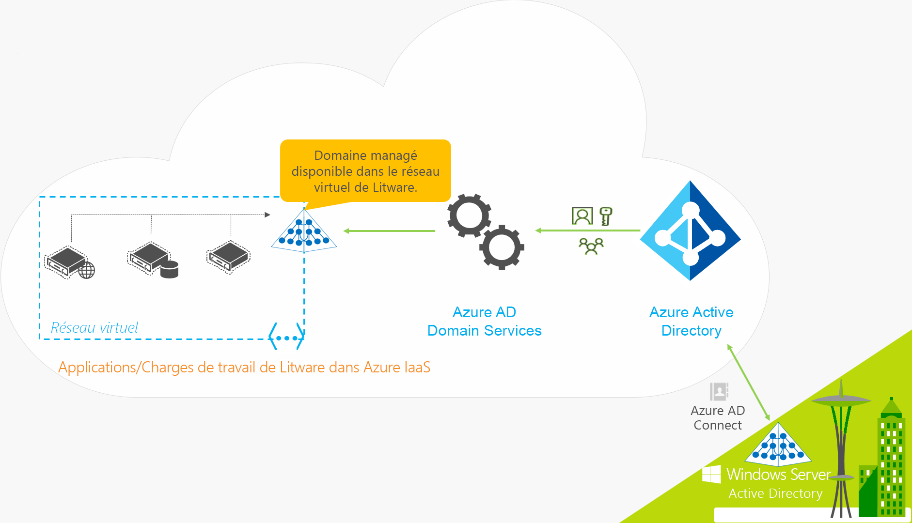
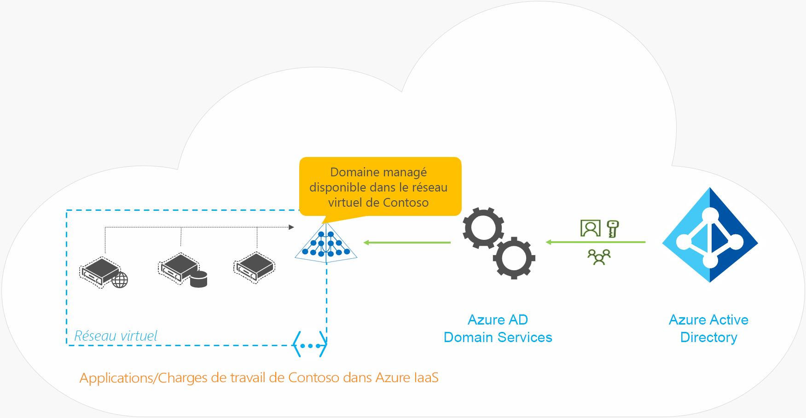

# Cas d’usage et scénarios courants pour Azure Active Directory Domain Services

Azure Active Directory Domain Services (Azure AD DS) fournit des services de domaine managés, comme la jonction de domaine, la stratégie de groupe, le protocole LDAP et l’authentification Kerberos/NTLM. Azure AD DS s’intègre à votre locataire Azure AD existant, permettant ainsi aux utilisateurs de se connecter à l’aide de leurs informations d’identification actuelles. Vous utilisez ces services de domaine sans avoir à déployer, gérer et corriger des contrôleurs de domaine dans le cloud, ce qui permet un lift-and-shift plus fluide des ressources locales sur Azure.

Cet article décrit quelques scénarios métier courants dans lesquels Azure AD DS offre de la valeur et répond à ces besoins.

## Méthodes courantes pour fournir des solutions d’identité dans le cloud

Lorsque vous migrez des charges de travail existantes vers le cloud, les applications prenant en charge les répertoires peuvent utiliser LDAP pour l’accès en lecture ou en écriture à un répertoire AD DS local. Les applications s’exécutant sous Windows Server sont généralement déployées sur des machines virtuelles jointes à un domaine, et peuvent être gérées de façon sécurisée à l’aide de la stratégie de groupe. Pour authentifier les utilisateurs finaux, les applications peuvent également s’appuyer sur l’authentification intégrée de Windows, telle que l’authentification Kerberos ou NTLM.

Les administrateurs informatiques utilisent souvent l’une des solutions suivantes pour fournir un service d’identité aux applications qui s’exécutent dans Azure :

* Configurez une connexion VPN de site à site entre les charges de travail qui s’exécutent dans Azure et un environnement AD DS local.
    * Les contrôleurs de domaine locaux fournissent ensuite l’authentification par le biais de la connexion VPN.
* Créez des contrôleurs de domaine de réplication à l’aide de machines virtuelles Azure pour étendre le domaine ou la forêt AD DS à partir de l’environnement local.
    * Les contrôleurs de domaine qui s’exécutent sur des machines virtuelles Azure assurent l’authentification et répliquent les informations d’annuaire à partir de l’environnement AD DS local.
* Déployez un environnement AD DS autonome dans Azure à l’aide de contrôleurs de domaine qui s’exécutent sur des machines virtuelles Azure.
    * Les contrôleurs de domaine qui s’exécutent sur des machines virtuelles Azure assurent l’authentification, mais aucune information d’annuaire n’est répliquée à partir d’un environnement AD DS local.

Grâce à ces approches, les connexions VPN au répertoire local rendent les applications vulnérables aux problèmes ou pannes réseau temporaires. Si vous déployez des contrôleurs de domaine à l’aide de machines virtuelles dans Azure, l’équipe informatique doit gérer les machines virtuelles, puis sécuriser, corriger, superviser, sauvegarder et dépanner les contrôleurs de domaine.

Azure AD DS offre des alternatives à la nécessité de créer des connexions VPN dans un environnement AD DS local ou d’exécuter et de gérer des machines virtuelles dans Azure pour fournir des services d’identité. En tant que service managé, Azure AD DS réduit la complexité de la création d’une solution d’identité intégrée pour les environnements hybrides et cloud uniquement.

> [!div class="nextstepaction"]
> [Comparer Azure AD DS avec Azure AD et AD DS automanagé sur des machines virtuelles Azure ou en local][compare]

## Azure AD DS pour les organisations hybrides

De nombreuses organisations exécutent une infrastructure hybride qui comprend des charges de travail d’application cloud et locales. Les applications héritées migrées vers Azure dans le cadre d’une stratégie lift-and-shift peuvent utiliser des connexions LDAP traditionnelles pour fournir des informations d’identité. Pour prendre en charge cette infrastructure hybride, les informations d’identité d’un environnement AD DS local peuvent être synchronisées avec un locataire Azure AD. Azure AD DS peut ensuite fournir ces applications héritées dans Azure avec une source d’identités, sans qu’il soit nécessaire de configurer ni de gérer la connectivité des applications vers les services d’annuaire locaux.

Examinons un exemple de Litware Corporation, une organisation hybride qui exécute des ressources locales et Azure :

* Les applications et charges de travail de serveurs nécessitant des services de domaine sont déployées dans un réseau virtuel dans Azure.
    * Cela peut inclure des applications héritées migrées vers Azure dans le cadre d’une stratégie lift-and-shift.
* Afin de synchroniser les informations d’identité du répertoire local avec le locataire Azure AD, la société Litware Corporation a déployé [Azure AD Connect][azure-ad-connect].
    * Les informations d’identité incluent les comptes d’utilisateurs et les appartenances aux groupes.
* L’équipe informatique de Litware active Azure AD DS pour son locataire Azure AD dans ce réseau virtuel ou un réseau virtuel homologué.
* Les applications et machines virtuelles déployées dans le réseau virtuel Azure peuvent ensuite utiliser des fonctionnalités Azure AD DS telles que la jonction de domaine, la lecture LDAP, la liaison LDAP, l’authentification NTLM et Kerberos et la stratégie de groupe.

> [!IMPORTANT]
> Azure AD Connect doit uniquement être installé et configuré pour la synchronisation avec des environnements AD DS locaux. L’installation d’Azure AD Connect n’est pas prise en charge dans un domaine managé pour resynchroniser des objets sur Azure AD.

## Azure AD DS pour les organisations cloud uniquement

Un locataire cloud uniquement Azure AD ne dispose pas d’une source d’identité locale. Par exemple, les comptes d’utilisateur et les appartenances aux groupes sont créés et gérés directement dans Azure AD.

Examinons maintenant un exemple pour Contoso, une organisation cloud uniquement qui utilise Azure AD pour l’identité. Toutes les identités des utilisateurs, leurs informations d’identification et les appartenances aux groupes sont créées et gérées dans Azure AD. Il n’existe aucune configuration supplémentaire d’Azure AD Connect pour synchroniser des informations d’identité à partir d’un répertoire local.

* Les applications et charges de travail de serveurs nécessitant des services de domaine sont déployées dans un réseau virtuel dans Azure.
* L’équipe informatique de Contoso active Azure AD DS pour son locataire Azure AD dans ce réseau virtuel ou un réseau virtuel homologué.
* Les applications et machines virtuelles déployées dans le réseau virtuel Azure peuvent ensuite utiliser des fonctionnalités Azure AD DS telles que la jonction de domaine, la lecture LDAP, la liaison LDAP, l’authentification NTLM et Kerberos et la stratégie de groupe.

## Administration sécurisée des machines virtuelles Azure

Pour vous permettre d’utiliser un jeu unique d’informations d’identification AD, les machines virtuelles Azure peuvent être jointes à un domaine managé par Azure AD DS. Cette approche réduit les problèmes de gestion des informations d’identification, comme la maintenance des comptes administrateurs locaux sur chaque machine virtuelle ou des comptes et mots de passe distincts entre les environnements.

Les machines virtuelles jointes à un domaine managé peuvent également être administrées et sécurisées à l’aide d’une stratégie de groupe. Les bases de référence de sécurité exigées peuvent être appliquées aux machines virtuelles pour les verrouiller conformément aux directives de sécurité de l’entreprise. Par exemple, vous pouvez utiliser des fonctionnalités de gestion de stratégie de groupe pour restreindre les types d’applications pouvant être exécutés sur ces machines virtuelles.

Intéressons-nous à un exemple de scénario courant. Les serveurs et d’autres infrastructures arrivant en fin de vie, Contoso souhaite transférer de nombreuses applications actuellement hébergées en local vers le cloud. La norme informatique actuelle exige que les serveurs hébergeant les applications d’entreprise soient joints à un domaine et gérés au moyen d’une stratégie de groupe.

L’administrateur informatique de Contoso préfère joindre à un domaine les machines virtuelles déployées sur Azure pour en faciliter l’administration, car les utilisateurs peuvent alors se connecter à l’aide de leurs informations d’identification d’entreprise. Quand elles sont jointes à un domaine, les machines virtuelles peuvent aussi être configurées pour se conformer aux bases de référence de sécurité exigées avec des objets stratégie de groupe. Contoso préfère ne pas déployer, superviser et gérer ses propres contrôleurs de domaine dans Azure.

Azure AD DS convient parfaitement à ce cas d’usage. Un domaine managé vous permet de joindre des machines virtuelles à un domaine, d’utiliser un seul jeu d’informations d’identification et d’appliquer une stratégie de groupe. Le domaine étant managé, vous n’avez pas besoin de configurer et de gérer les contrôleurs de domaine vous-même.

### Notes de déploiement

Les considérations de déploiement suivantes s’appliquent à cet exemple de cas d’usage :

* Les domaines managés utilisent une seule structure d’unité d’organisation plate par défaut. Toutes les machines virtuelles jointes à un domaine se trouvent dans une seule unité d’organisation. Si vous le souhaitez, vous pouvez créer des [unités d’organisation personnalisées][custom-ou].
* Azure AD DS utilise un objet de stratégie de groupe (GPO) intégré pour les conteneurs d’utilisateurs et d’ordinateurs. Pour plus de contrôle, vous pouvez [créer des GPO personnalisés][create-gpo] et les cibler vers des unités d’organisation personnalisées.
* Azure AD DS prend en charge le schéma de l’objet de base de l’ordinateur AD. Vous ne pouvez pas étendre le schéma de l’objet de l’ordinateur.

## Lift-and-shift des applications locales qui utilisent une authentification par liaison LDAP

Comme exemple de scénario, Contoso dispose d’une application locale achetée auprès d’un éditeur de logiciels indépendant il y a de nombreuses années. L’application est actuellement en mode de maintenance par l’éditeur et nécessite des modifications hors de prix. Cette application possède un front-end web qui collecte les informations d’identification de l’utilisateur à l’aide d’un formulaire web, puis authentifie les utilisateurs en effectuant une liaison LDAP vers l’environnement AD DS local.

Contoso souhaite faire migrer cette application vers Azure. L’application doit continuer à fonctionner en l’état, sans nécessiter de modifications. De plus, les utilisateurs doivent être en mesure de s’authentifier à l’aide de leurs informations d’identification d’entreprise existantes, sans formation supplémentaire. Les utilisateurs finaux doivent clairement savoir où l’application s’exécute.

Pour ce scénario, Azure AD DS permet aux applications d’effectuer des liaisons LDAP dans le cadre du processus d’authentification. Les applications locales héritées peuvent être faire l’objet d’un lift-and-shift vers Azure et continuer à authentifier en toute transparence les utilisateurs sans avoir besoin d’apporter des modifications à leur configuration ou expérience utilisateur.

### Notes de déploiement

Les considérations de déploiement suivantes s’appliquent à cet exemple de cas d’usage :

* Assurez-vous que l’application n’a pas besoin de modifier/d’écrire dans l’annuaire. L’accès en écriture LDAP à un domaine managé n’est pas pris en charge.
* Vous ne pouvez pas modifier les mots de passe directement sur un domaine managé. Les utilisateurs finaux peuvent modifier leur mot de passe soit à l’aide du [mécanisme de modification de mot de passe en libre-service Azure AD][sspr], soit depuis le répertoire local. Ces modifications sont automatiquement synchronisées et disponibles dans le domaine managé.

## Lift-and-shift des applications locales qui utilisent une lecture LDAP pour accéder à l’annuaire

Comme dans l’exemple de scénario précédent, supposons que Contoso a une application métier locale développée il y a presque une décennie. Cette application prend en charge les annuaires et a été conçue pour utiliser le protocole LDAP pour lire les informations/attributs des utilisateurs à partir d’AD DS. L’application ne modifie pas les attributs et n’écrit pas dans l’annuaire.

Contoso souhaite migrer cette application vers Azure et mettre hors-service l’ancien matériel local qui l’héberge actuellement. L’application ne peut pas être réécrite pour utiliser des API d’annuaire modernes comme l’API Microsoft Graph basée sur REST. Une option lift-and-shift est nécessaire pour migrer l’application afin qu’elle s’exécute dans le cloud, sans modification de code ni réécriture de l’application.

Pour faciliter ce scénario, Azure AD DS permet aux applications d’effectuer des lectures LDAP depuis le domaine managé afin d’obtenir les informations d’attribut nécessaires. L’application n’a pas besoin d’être réécrite, si bien qu’un lift-and-shift sur Azure permet aux utilisateurs de continuer à l’utiliser sans même qu’ils ne se rendent compte que son emplacement d’exécution a changé.

### Notes de déploiement

Les considérations de déploiement suivantes s’appliquent à cet exemple de cas d’usage :

* Assurez-vous que l’application n’a pas besoin de modifier/d’écrire dans l’annuaire. L’accès en écriture LDAP à un domaine managé n’est pas pris en charge.
* Vérifiez que l’application ne nécessite pas un schéma Active Directory étendu/personnalisé. Les extensions de schéma ne sont pas prises en charge dans Azure AD DS.

## Migrer une application de service ou démon locale vers Azure

Certaines applications incluent plusieurs niveaux, dont l’un doit effectuer des appels authentifiés à un niveau back-end, tel qu’une base de données. Les comptes de service Active Directory sont couramment utilisés dans ces scénarios. Lorsque vous effectuez un lift-and-shift d’une application vers Azure, Azure AD DS vous permet de continuer à utiliser des comptes de service de la même façon. Vous pouvez choisir d’utiliser le même compte de service que celui synchronisé à partir de votre annuaire local sur Azure AD ou de créer une unité d’organisation personnalisée, puis de créer un compte de service distinct dans cette unité d’organisation. Quelle que soit l’approche, les applications continuent de fonctionner de la même façon pour effectuer des appels authentifiés à d’autres niveaux et services.

Dans cet exemple de scénario, Contoso est équipé d’une application de coffre de logiciel personnalisée qui inclut un front-end web, un serveur SQL et un serveur FTP back-end. L’authentification intégrée de Windows qui utilise des comptes de service authentifie le font-end web auprès du serveur FTP. Le serveur web frontal est configuré pour fonctionner comme un compte de service. Le serveur principal est configuré pour autoriser l’accès depuis le compte de service pour le serveur web frontal. Contoso ne souhaite pas déployer et gérer ses propres machines virtuelles contrôleurs de domaine dans le cloud pour déplacer cette application sur Azure.

Pour ce scénario, les serveurs qui hébergent le front-end web, le serveur SQL et le serveur FTP peuvent être migrés vers des machines virtuelles Azure et joints à un domaine managé. Les machines virtuelles peuvent alors utiliser le même compte de service dans leur annuaire local pour les besoins d’authentification de l’application, lequel est synchronisé par le biais d’Azure AD à l’aide d’Azure AD Connect.

### Notes de déploiement

Les considérations de déploiement suivantes s’appliquent à cet exemple de cas d’usage :

* Vérifiez que les applications utilisent un nom d’utilisateur et un mot de passe pour l’authentification. L’authentification basée sur un certificat ou une carte à puce n’est pas prise en charge par Azure AD DS.
* Vous ne pouvez pas modifier les mots de passe directement sur un domaine managé. Les utilisateurs finaux peuvent modifier leur mot de passe soit à l’aide du [mécanisme de modification de mot de passe en libre-service Azure AD][sspr], soit depuis le répertoire local. Ces modifications sont automatiquement synchronisées et disponibles dans le domaine managé.

## Déploiements des services Bureau à distance Windows Server dans Azure

Vous pouvez utiliser Azure AD DS pour fournir des services de domaine managés à vos serveurs Bureau à distance déployés sur Azure.

Pour plus d’informations sur ce scénario de déploiement, consultez le guide pratique pour [intégrer Azure AD Domain Services à votre déploiement RDS][windows-rds].

## Clusters HDInsight joints à un domaine

Vous pouvez configurer un cluster Azure HDInsight qui est joint à un domaine managé avec Apache Ranger activé. Vous pouvez créer et appliquer des stratégies Hive par le biais d’Apache Ranger et autoriser des utilisateurs, comme des scientifiques des données, à se connecter à Hive à l’aide d’outils ODBC, comme Excel ou Tableau. Nous poursuivons nos efforts pour ajouter d’autres charges de travail, comme HBase, Spark et Storm à HDInsight joint à un domaine.

Pour plus d’informations sur ce scénario de déploiement, consultez le guide pratique pour [configurer des clusters HDInsight joints à un domaine][hdinsight].

## Étapes suivantes

Pour bien démarrer, vous devez [Créer et configurer un domaine managé Azure Active Directory Domain Services][tutorial-create-instance].

<!-- INTERNAL LINKS -->
[hdinsight]: ../hdinsight/domain-joined/apache-domain-joined-configure-using-azure-adds.md
[tutorial-create-instance]: tutorial-create-instance.md
[custom-ou]: create-ou.md
[create-gpo]: manage-group-policy.md
[sspr]: ../active-directory/authentication/overview-authentication.md#self-service-password-reset
[compare]: compare-identity-solutions.md
[azure-ad-connect]: ../active-directory/hybrid/whatis-azure-ad-connect.md

<!-- EXTERNAL LINKS -->
[windows-rds]: /windows-server/remote/remote-desktop-services/rds-azure-adds