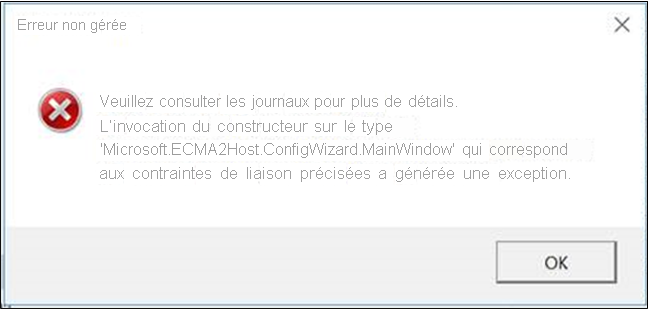
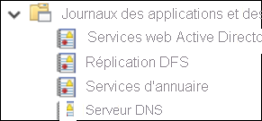
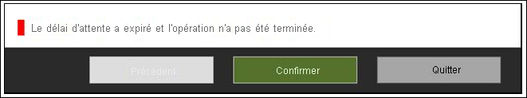

# <a name="troubleshoot-ecma-connector-host-issues"></a>Résoudre les problèmes liés à l’hôte du connecteur ECMA

>[!IMPORTANT]
> Actuellement, la préversion du provisionnement local n’est disponible que sur invitation. Pour demander l’accès à la fonctionnalité, utilisez le [formulaire de demande d’accès](https://aka.ms/onpremprovisioningpublicpreviewaccess). Nous allons ouvrir la préversion à un plus grand nombre de clients et de connecteurs au cours des prochains mois, car nous préparons la disponibilité générale.

## <a name="troubleshoot-test-connection-issues"></a>Résoudre les problèmes de test de connexion
Après la configuration de l’agent de provisionnement et de l’hôte ECMA, il est temps de tester la connectivité du service de provisionnement Azure AD (Azure Active Directory) à l’agent de provisionnement, l’hôte ECMA et l’application. Pour effectuer ce test de bout en bout, sélectionnez **Tester la connexion** dans l’application dans le portail Azure. En cas d’échec du test de connexion, essayez les étapes de résolution des problèmes suivantes :

 1. Vérifiez que l’agent et l’hôte ECMA sont en cours d’exécution :
     1. Sur le serveur où l’agent est installé, ouvrez **Services** en accédant à **Démarrer** > **Exécuter** > **Services.msc**.
     1. Sous **Services**, vérifiez que les services **Microsoft Azure AD Connect Agent Updater**, **Microsoft Azure AD Connect Provisioning Agent** et **Microsoft ECMA2Host** sont présents, et que leur état est *En cours d’exécution*.
    
        

 1. Accédez au dossier où l’hôte ECMA a été installé en sélectionnant **Résolution des problèmes** > **Scripts** > **TestECMA2HostConnection**. Exécutez le script. Ce script envoie une requête SCIM GET ou POST pour vérifier que l’hôte du connecteur ECMA fonctionne et répond aux requêtes. Il doit être exécuté sur le même ordinateur que le service d’hôte du connecteur ECMA proprement dit.
 1. Vérifiez que l’agent est actif en accédant à votre application dans le portail Azure, en sélectionnant **connectivité administrateur**, en sélectionnant la liste déroulante des agents, puis en vérifiant que votre agent est actif.
 1. Vérifiez si le jeton secret fourni est identique au jeton secret local. Accédez à l’environnement local, fournissez à nouveau le jeton secret, puis copiez-le dans le portail Azure.
 1. Vérifiez que vous avez attribué au moins un agent à l’application dans le portail Azure.
 1. Après avoir attribué un agent, vous devez attendre de 10 à 20 minutes pour finaliser l’inscription. Le test de connectivité ne fonctionne pas tant que l’inscription n’est pas terminée.
 1. Veillez à utiliser un certificat valide. Accédez à l’onglet **Paramètres** de l’hôte ECMA pour générer un nouveau certificat.
 1. Redémarrez l’agent de provisionnement en accédant à la barre des tâches sur votre machine virtuelle, en recherchant l’agent de provisionnement Microsoft Azure AD Connect. Cliquez avec le bouton droit sur **Arrêter**, puis sélectionnez **Démarrer**.
 1. Lorsque vous fournissez l’URL du locataire dans le portail Azure, veillez à ce qu’il respecte le modèle suivant. Vous pouvez remplacer `localhost` par votre nom d’hôte, mais cela n’est pas obligatoire. Remplacez `connectorName` par le nom du connecteur que vous avez spécifié dans l’hôte ECMA.
 
    ```
    https://localhost:8585/ecma2host_connectorName/scim
    ```

## <a name="unable-to-configure-the-ecma-host-view-logs-in-event-viewer-or-start-the-ecma-host-service"></a>Impossible de configurer l’hôte ECMA, d’afficher les journaux dans l’observateur d’événements ou de démarrer le service Hôte ECMA

Pour résoudre les problèmes suivants, exécutez l’hôte ECMA en tant qu’administrateur :

* J’obtiens une erreur lorsque j’ouvre l’Assistant Hôte ECMA.

   

* Je peux configurer l’Assistant Hôte ECMA, mais je ne vois pas les journaux de l’hôte ECMA. Dans ce cas, vous devez ouvrir l’hôte en tant qu’administrateur et configurer un connecteur de bout en bout. Cette étape peut être simplifiée par l’exportation d’un connecteur existant et sa réimportation. 

   

* Je peux configurer l’Assistant Hôte ECMA, mais je ne parviens pas à démarrer le service Hôte ECMA.

   


## <a name="turn-on-verbose-logging"></a>Activer la journalisation détaillée 

Par défaut, la valeur `switchValue` pour l’hôte du connecteur ECMA est définie sur `Error`. Ce paramètre signifie qu’elle ne consigne que les événements qui sont des erreurs. Pour activer la journalisation détaillée pour l’Assistant ou le service Hôte ECMA, affectez la valeur `Verbose` à `switchValue` aux deux emplacements, comme indiqué.

L’emplacement du fichier pour la journalisation détaillée du service est C:\program Files\Microsoft ECMA2Host\Service\Microsoft.ECMA2Host.Service.exe.config.
  ```
  <?xml version="1.0" encoding="utf-8"?> 
  <configuration> 
      <startup>  
          <supportedRuntime version="v4.0" sku=".NETFramework,Version=v4.6" /> 
      </startup> 
      <appSettings> 
        <add key="Debug" value="true" /> 
      </appSettings> 
      <system.diagnostics> 
        <sources> 
      <source name="ConnectorsLog" switchValue="Verbose"> 
            <listeners> 
              <add initializeData="ConnectorsLog" type="System.Diagnostics.EventLogTraceListener, System, Version=2.0.0.0, Culture=neutral, PublicKeyToken=b77a5c561934e089" name="ConnectorsLog" traceOutputOptions="LogicalOperationStack, DateTime, Timestamp, Callstack"> 
                <filter type=""/> 
              </add> 
            </listeners> 
          </source> 
          <!-- Choose one of the following switchTrace:  Off, Error, Warning, Information, Verbose --> 
          <source name="ECMA2Host" switchValue="Verbose"> 
            <listeners>  
              <add initializeData="ECMA2Host" type="System.Diagnos
  ```

L’emplacement du fichier pour la journalisation détaillée de l’Assistant est C:\Program Files\Microsoft ECMA2Host\Wizard\Microsoft.ECMA2Host.ConfigWizard.exe.config.
  ```
        <source name="ConnectorsLog" switchValue="Verbose"> 
          <listeners> 
            <add initializeData="ConnectorsLog" type="System.Diagnostics.EventLogTraceListener, System, Version=2.0.0.0, Culture=neutral, PublicKeyToken=b77a5c561934e089" name="ConnectorsLog" traceOutputOptions="LogicalOperationStack, DateTime, Timestamp, Callstack"> 
              <filter type=""/> 
            </add> 
          </listeners> 
        </source> 
        <!-- Choose one of the following switchTrace:  Off, Error, Warning, Information, Verbose --> 
        <source name="ECMA2Host" switchValue="Verbose"> 
          <listeners> 
            <add initializeData="ECMA2Host" type="System.Diagnostics.EventLogTraceListener, System, Version=4.0.0.0, Culture=neutral, PublicKeyToken=b77a5c561934e089" name="ECMA2HostListener" traceOutputOptions="LogicalOperationStack, DateTime, Timestamp, Callstack" /> 
  ```

## <a name="target-attribute-is-missing"></a>L’attribut cible est manquant 
Le service d’approvisionnement découvre automatiquement des attributs dans votre application cible. Si vous constatez qu’un attribut cible est manquant dans la liste d’attributs cibles du portail Azure, exécutez l’étape de résolution des problèmes suivante :

 1. Passez en revue la page **Sélectionner les attributs** de la configuration de votre hôte ECMA pour vérifier que l’attribut a été sélectionné afin d’être exposé dans le portail Azure.
 1. Vérifiez que le service Hôte ECMA est activé. 
 1. Examinez les journaux de l’hôte ECMA pour vérifier qu’une requête /schemas a été effectuée, et passez en revue les attributs dans la réponse. Ces informations seront utiles pour la résolution du problème.

## <a name="collect-logs-from-event-viewer-as-a-zip-file"></a>Collecter les journaux à partir de l’observateur d’événements en tant que fichier zip

Accédez au dossier où l’hôte ECMA a été installé en sélectionnant **Résolution des problèmes** > **Scripts**. Exécutez le script `CollectTroubleshootingInfo` en tant qu’administrateur. Vous pouvez l’utiliser pour capturer les journaux dans un fichier zip et les exporter.

## <a name="review-events-in-event-viewer"></a>Examiner les événements dans l’observateur d’événements

Une fois le mappage du schéma d’hôte de connecteur ECMA configuré, démarrez le service pour qu’il écoute les connexions entrantes. Surveillez ensuite les requêtes entrantes.

  1. Sélectionnez le menu **Démarrer**, entrez **observateur d’événements**, puis sélectionnez **Observateur d’événements**. 
  1. Dans l’**Observateur d’événements**, développez les journaux **Applications et services**, puis sélectionnez **Journaux Microsoft ECMA2Host**. 
  1. À mesure que les modifications sont reçues par l’hôte du connecteur, les événements sont écrits dans le journal des applications. 

## <a name="understand-incoming-scim-requests"></a>Comprendre les requêtes SCIM entrantes

Les requêtes effectuées par Azure AD à l’agent d’approvisionnement et à l’hôte du connecteur utilisent le protocole SCIM. Les requêtes effectuées de l’hôte vers des applications utilisent le protocole pris en charge par l’application. Les requêtes de l’hôte à l’agent pour Azure AD s’appuient sur SCIM. Pour en savoir plus sur l’implémentation de SCIM, consultez [Tutoriel : Développer et planifier le provisionnement d’un point de terminaison SCIM dans Azure Active Directory](use-scim-to-provision-users-and-groups.md).

Au début de chaque cycle de provisionnement, avant d’effectuer le provisionnement à la demande et lors du test de la connexion, le service de provisionnement Azure AD effectue généralement un appel d’utilisateur pour un [utilisateur factice](use-scim-to-provision-users-and-groups.md#request-3) afin de s’assurer que le point de terminaison cible est disponible et qu’il renvoie des réponses conformes à SCIM. 


## <a name="how-do-i-troubleshoot-the-provisioning-agent"></a>Comment résoudre les problèmes liés à l’agent d’approvisionnement ?
Vous pouvez rencontrer les scénarios d’erreur suivants.

### <a name="agent-failed-to-start"></a>Échec du démarrage de l’agent

Vous pouvez recevoir un message d’erreur indiquant ceci :

« Le service « Microsoft Azure AD Connect Provisioning Agent » n’a pas pu démarrer. Vérifiez que vous disposez des droits suffisants pour démarrer les services système ». 

Ce problème est généralement dû à une stratégie de groupe qui a empêché l’application d’autorisations sur le compte d’ouverture de session du service NT local créé par le programme d’installation (NT SERVICE\AADConnectProvisioningAgent). Ces autorisations sont nécessaires pour démarrer le service.

Pour résoudre ce problème :

1. Connectez-vous au serveur avec un compte Administrateur.
1. Ouvrez **Services** en y accédant ou en accédant à **Démarrer** > **Exécuter** > **Services.msc**.
1. Sous **Services**, double-cliquez sur **Agent de provisionnement Microsoft Azure AD Connect**.
1. Sous l’onglet **Ouvrir une session**, remplacez **ce compte** par celui d’un administrateur de domaine. Ensuite, redémarrez le service. 

Ce test vérifie que vos agents peuvent communiquer avec Azure via le port 443. Ouvrez un navigateur et accédez à l’URL précédents à partir du serveur sur lequel l’agent est installé.

### <a name="agent-times-out-or-certificate-is-invalid"></a>Le délai de l’agent a expiré ou le certificat n’est pas valide

Les messages d’erreur suivants peuvent s’afficher si vous essayez d’inscrire l’agent.



Ce problème est généralement dû au fait que l’agent ne peut pas se connecter au service d’identité hybride, et nécessite donc la configuration d’un proxy HTTP. Pour résoudre ce problème, configurez un proxy sortant. 

L’agent de provisionnement prend en charge l’utilisation du proxy sortant. Vous pouvez le configurer en modifiant le fichier de configuration *C:\Program Files\Microsoft Azure AD Connect Provisioning Agent\AADConnectProvisioningAgent.exe.config* de l'agent. Ajoutez les lignes suivantes à la fin du fichier, juste avant la balise `</configuration>` de fermeture.
Remplacez les variables `[proxy-server]` et `[proxy-port]` par le nom de votre serveur proxy et les valeurs de port.

```xml
    <system.net>
        <defaultProxy enabled="true" useDefaultCredentials="true">
            <proxy
                usesystemdefault="true"
                proxyaddress="http://[proxy-server]:[proxy-port]"
                bypassonlocal="true"
            />
        </defaultProxy>
    </system.net>
```
### <a name="agent-registration-fails-with-security-error"></a>L’inscription de l’agent échoue avec une erreur de sécurité

Vous pouvez recevoir un message d’erreur lorsque vous installez l’agent de provisionnement cloud.

Ce problème est généralement dû à l’incapacité de l’agent à exécuter les scripts d’inscription PowerShell en raison des stratégies d’exécution PowerShell locales.

Pour résoudre ce problème, modifiez les stratégies d’exécution PowerShell sur le serveur. Les stratégies de la machine et de l’utilisateur doivent être définies sur *Undefined* ou *RemoteSigned*. Si elles sont définies sur *Unrestricted*, vous verrez ce message d’erreur. Pour plus d’informations, consultez [Stratégies d’exécution PowerShell](/powershell/module/microsoft.powershell.core/about/about_execution_policies?view=powershell-6). 

### <a name="log-files"></a>Fichiers journaux

Par défaut, l’agent émet peu de messages d’erreur et d’informations sur la trace de la pile. Vous trouverez les journaux de suivi dans le dossier C:\ProgramData\Microsoft\Azure AD Connect Provisioning Agent\Trace.

Pour recueillir davantage d’informations afin de résoudre les problèmes liés à l’agent :

1. Installez le module PowerShell AADCloudSyncTools comme décrit dans [Module PowerShell AADCloudSyncTools pour la synchronisation cloud Azure AD Connect](../../active-directory/cloud-sync/reference-powershell.md#install-the-aadcloudsynctools-powershell-module).
1. Utilisez l’applet de commande PowerShell `Export-AADCloudSyncToolsLogs` pour capturer les informations. Utilisez les commutateurs suivants pour affiner votre collecte de données. Utilisez :

      - **SkipVerboseTrace** pour exporter uniquement les journaux actuels sans capturer les journaux détaillés (par défaut = false).
      - **TracingDurationMins** pour spécifier une durée de capture différente (par défaut = 3 minutes).
      - **OutputPath** pour spécifier un autre chemin de sortie (par défaut = les documents de l’utilisateur).

---------------------

Azure AD vous permet de superviser le service de provisionnement dans le cloud et de collecter les journaux locaux. Le service d’approvisionnement émet des journaux pour chaque utilisateur qui a été évalué dans le cadre du processus de synchronisation. Ces journaux peuvent être utilisés via l'[interface utilisateur du portail Azure, les API et l’analytique des journaux d'activité](../reports-monitoring/concept-provisioning-logs.md). L’hôte ECMA génère également des journaux locaux. Il affiche chaque requête de provisionnement qui a été reçue et la réponse qui a été envoyée à Azure AD.

### <a name="agent-installation-fails"></a>Échec de l’installation de l’agent
* L’erreur `System.ComponentModel.Win32Exception: The specified service already exists` indique que l’hôte ECMA précédent n’a pas été correctement désinstallé. Désinstallez l’application hôte. Accédez à Program Files et supprimez le dossier de l’hôte ECMA. Vous souhaiterez peut-être stocker le fichier de configuration à des fins de sauvegarde. 
* L’erreur suivante indique qu’un prérequis n’a pas été satisfait. Assurez-vous que .NET 4.7.1 est installé.

  ```
    Method Name : <>c__DisplayClass0_1 : 
    RegisterNotLoadedAssemblies Error during load assembly: System.Management.Automation.resources.dll
    --------- Outer Exception Data ---------
    Message: Could not load file or assembly 'file:///C:\Program Files\Microsoft ECMA2Host\Service\ECMA\System.Management.Automation.resources.dll' or one of its dependencies. The system cannot find the file specified.

  ```


## <a name="next-steps"></a>Étapes suivantes

- [Installation de l’hôte du connecteur Azure AD ECMA](on-premises-ecma-install.md)
- [Configuration de l’hôte du connecteur Azure AD ECMA](on-premises-ecma-configure.md)
- [Connecteur SQL générique](on-premises-sql-connector-configure.md)
- [Tutoriel : Connecteur SQL générique pour l’Hôte de connecteur ECMA](tutorial-ecma-sql-connector.md)