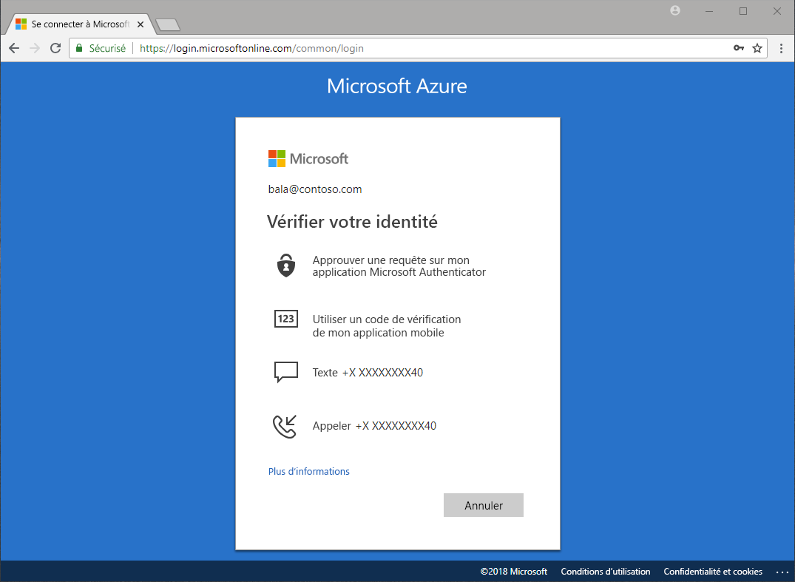

# Quelles méthodes sont disponibles pour l'authentification ?

Les actualités rapportent des cas de mots de passe volés et d’identités compromises. Exiger un second facteur en plus d’un mot de passe augmente immédiatement la sécurité de votre organisation. Microsoft Azure Active Directory (Azure AD) inclut des fonctionnalités, comme l’authentification multifacteur (Azure MFA) et la réinitialisation de mot de passe en libre-service (SSPR) Azure AD, permettant aux administrateurs de protéger les organisations et les utilisateurs avec des méthodes d’authentification supplémentaires.

Lorsqu’un utilisateur doit accéder à une application sensible, réinitialiser son mot de passe ou activer Windows Hello, il peut être invité à effectuer une vérification supplémentaire pour prouver son identité.

Une vérification supplémentaire peut se présenter sous la forme des méthodes d’authentification suivantes :

* Code fourni dans un e-mail ou SMS
* Appel téléphonique
* Notification ou un code sur son téléphone
* Réponses aux questions de sécurité

L’authentification multifacteur Azure et la réinitialisation de mot de passe en libre-service Azure AD permettent aux administrateurs de contrôler la configuration, la stratégie, la surveillance et les rapports à l’aide d’Azure AD et du portail Azure pour protéger leurs organisations.

## Réinitialisation de mot de passe libre-service

La réinitialisation de mot de passe en libre-service offre à vos utilisateurs la possibilité de réinitialiser leur mot de passe, sans intervention de l’administrateur, quand et où ils en ont besoin.

> [!VIDEO https://www.youtube.com/embed/hc97Yx5PJiM]

Options de réinitialisation de mot de passe en libre-service :

* **Modification de mot de passe :** je connais mon mot de passe mais je souhaite le remplacer.
* **Réinitialisation de mot de passe :** je ne parviens pas à me connecter et je souhaite réinitialiser mon mot de passe à l’aide d’une ou de plusieurs méthodes d’authentification approuvées.
* **Déverrouillage de compte :** je ne parviens pas à me connecter, car mon compte est verrouillé, et je souhaite le déverrouiller à l’aide d’une ou de plusieurs méthodes d’authentification approuvées.

## Azure Multi-Factor Authentication

Azure Multi-Factor Authentication (MFA) est la solution de vérification en deux étapes de Microsoft. À l’aide des méthodes d’authentification approuvées par l’administrateur, Azure MFA contribue à sécuriser l’accès aux données et aux applications, tout en répondant à la demande de processus d’authentification simple.

## Étapes suivantes

L’étape suivante consiste à approfondir ce concept et à configurer la réinitialisation de mot de passe en libre-service et l’authentification multifacteur Azure.

Pour commencer avec la réinitialisation de mot de passe en libre-service, consultez l’[article sur l’activation du démarrage rapide de la réinitialisation de mot de passe en libre-service](quickstart-sspr.md).

Pour en savoir plus sur la réinitialisation de mot de passe en libre-service, consultez l’article [Découverte approfondie de la réinitialisation de mot de passe libre-service dans Azure AD](concept-sspr-howitworks.md).

Pour en savoir plus sur l’authentification multifacteur Azure, consultez l’article [Fonctionnement : Azure Multi-Factor Authentication](concept-mfa-howitworks.md).