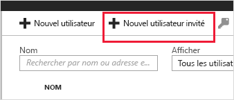

# Démarrage rapide : Ajouter des utilisateurs invités à votre annuaire dans le portail Azure

Vous pouvez inviter n’importe quelle personne à collaborer avec votre organisation en l’ajoutant à votre annuaire en tant qu’utilisateur invité. Vous pouvez envoyer un e-mail d’invitation contenant un lien d’échange, ou envoyer un lien direct vers l’application que vous souhaitez partager. L’utilisateur invité peut se connecter avec sa propre identité professionnelle, scolaire ou sociale.

Dans ce guide de démarrage rapide, vous allez ajouter un utilisateur invité à Azure AD, envoyer une invitation et voir à quoi ressemble le processus d’échange d’invitation.

Si vous n’avez pas d’abonnement Azure, créez un [compte gratuit](https://azure.microsoft.com/free/?WT.mc_id=A261C142F) avant de commencer.

## Conditions préalables requises

Pour suivre le scénario décrit dans ce didacticiel, vous avez besoin de ce qui suit :

 - Un rôle qui vous permet de créer des utilisateurs dans votre annuaire de locataire, tel que le rôle Administrateur général ou l’un des rôles d’annuaire administrateur limités.
 - Un compte e-mail valide que vous pouvez ajouter à votre annuaire de locataire et que vous pouvez utiliser pour recevoir l’e-mail d’invitation de test.

## Ajouter un utilisateur invité dans Azure AD

1. Connectez-vous au [Portail Azure](https://portal.azure.com/) en tant qu’administrateur Azure AD.
2. Sélectionnez **Azure Active Directory** dans le volet de gauche.
3.  Sous **Gérer**, sélectionnez **Utilisateurs**.

    

4.  Sélectionnez **Nouvel utilisateur invité**.

    

5. Dans la page **Nouvel utilisateur**, sélectionnez **Inviter un utilisateur**, puis ajoutez les informations de l’utilisateur invité. 

   - **Nom.** Prénom et nom de l’utilisateur invité.
   - **Adresse e-mail (obligatoire)** . Adresse e-mail de l’utilisateur invité.
   - **Message personnel (facultatif)**  : inclure un message d’accueil personnalisé pour l’utilisateur invité.
   - **Groupes** : permet d’ajouter l’utilisateur invité à un ou plusieurs groupes.
   - **Rôle d’annuaire** : si vous devez attribuer des autorisations d’administration Azure AD à l’utilisateur, vous pouvez les ajouter à un rôle Azure AD. 

6. Sélectionnez **Inviter** pour envoyer automatiquement l’invitation à l’utilisateur invité. Une notification s’affiche dans le coin supérieur droit avec le message **Utilisateur invité avec succès**. 
7.  Après avoir envoyé l’invitation, le compte d’utilisateur est automatiquement ajouté au répertoire en tant qu’invité.

## Affecter une application à l’utilisateur invité
Ajoutez l’application Salesforce à votre locataire de test, puis affectez l’utilisateur invité de test à l’application.
1.  Connectez-vous au portail Azure en tant qu’administrateur Azure AD.
2.  Dans le volet gauche, sélectionnez **Applications d’entreprise**.
3.  Sélectionnez **Nouvelle application**.
4. Sous **Ajouter à partir de la galerie**, recherchez **Salesforce**, puis sélectionnez-le.

    
5. Sélectionnez **Ajouter**.
6. Sous **Gérer**, sélectionnez **Mode d’authentification unique**. Ensuite, sous **Mode d’authentification unique**, sélectionnez **Authentification par mot de passe**, puis cliquez sur **Enregistrer**.
7. Sous **Gérer**, sélectionnez **Utilisateurs et groupes** > **Ajouter un utilisateur** > **Tous les groupes**.
8. Utilisez la zone de recherche pour rechercher l’utilisateur de test (si nécessaire), puis sélectionnez l’utilisateur de test dans la liste. Puis cliquez sur **Sélectionner**.
9. Sélectionnez **Attribuer**. 

## Accepter l’invitation
Connectez-vous en tant qu’utilisateur invité pour voir l’invitation.
1.  Connectez-vous au compte e-mail de l’utilisateur invité de test.
2.  Dans votre boîte de réception, recherchez l’e-mail « Vous êtes invité ».

    

3.  Dans le corps de l’e-mail, sélectionnez **Commencer**. La page **Révision des autorisations** s’ouvre dans le navigateur. 

    

4. Sélectionnez **Accepter**. Le panneau d’accès s’ouvre et montre les applications auxquelles l’utilisateur invité peut accéder.

## Nettoyer les ressources
Lorsque vous n’en avez plus besoin, supprimez l’utilisateur invité de test et l’application de test.
1.  Connectez-vous au portail Azure en tant qu’administrateur Azure AD.
2.  Sélectionnez **Azure Active Directory** dans le volet de gauche.
3.  Sous **Gérer**, sélectionnez **Applications d’entreprise**.
4.  Ouvrez l’application **Salesforce**, puis sélectionnez **Supprimer**.
5.  Sélectionnez **Azure Active Directory** dans le volet de gauche.
6.  Sous **Gérer**, sélectionnez **Utilisateurs**.
7.  Sélectionnez l’utilisateur invité, puis sélectionnez **Supprimer l’utilisateur**.

## Étapes suivantes
Dans ce tutoriel, vous avez créé un utilisateur invité dans le portail Azure et envoyé une invitation pour partager des applications. Ensuite, vous avez vu le processus d’échange d’invitation du point de vue de l’utilisateur invité, et vérifié que l’application s’affichait bien dans le panneau d’accès de l’utilisateur invité. Pour plus d’informations sur l’ajout d’utilisateurs invités pour la collaboration, consultez [Ajouter des utilisateurs Azure Active Directory B2B Collaboration dans le portail Azure](add-users-administrator.md).
