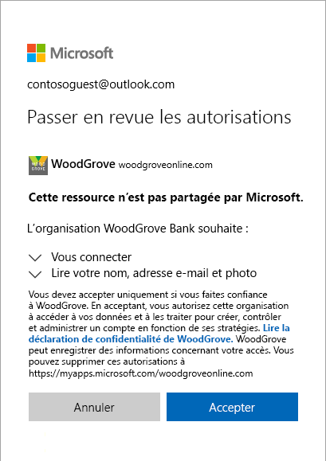
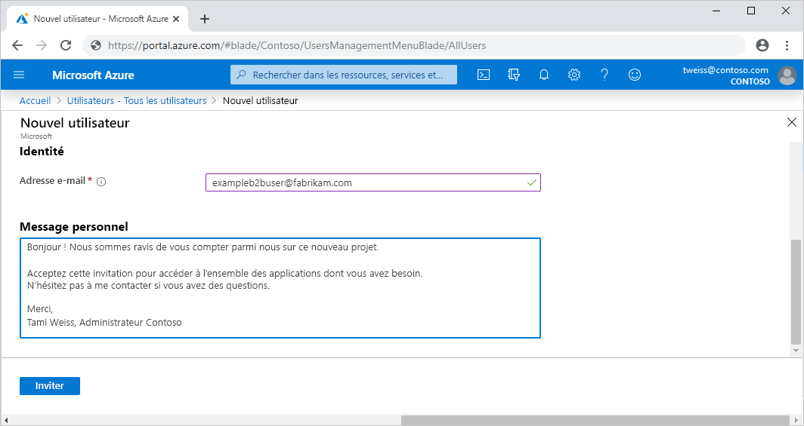
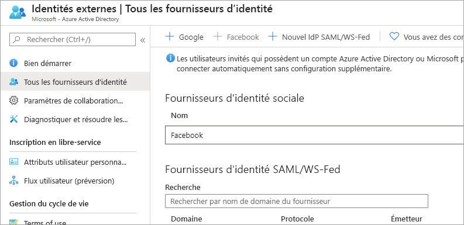
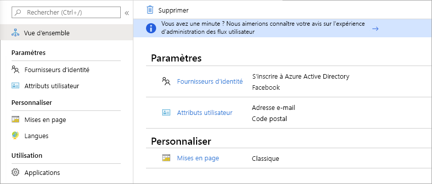

# Qu’est-ce que l’accès utilisateur invité dans Azure Active Directory B2B ?

Azure Active Directory (Azure AD) B2B Collaboration vous permet de partager de manière sécurisée les applications et les services de votre entreprise avec des utilisateurs invités et des partenaires externes issus de n’importe quelle organisation, tout en conservant le contrôle sur vos propres données d’entreprise. Collaborez de manière sécurisée avec des partenaires externes issus de petites ou grandes entreprises, même s’ils n’utilisent pas Azure AD ou n’ont pas de service informatique. Un simple processus d’invitation et d’échange d’invitation permet à vos partenaires d’utiliser leurs propres informations d’identification pour accéder aux ressources de votre société. Les développeurs peuvent utiliser les API B2B d’Azure AD pour personnaliser le processus d’invitation ou pour écrire des applications telles que des portails d’inscription libre-service.

Regardez la vidéo pour savoir comment collaborer de manière sécurisée avec les utilisateurs invités, en les invitant à se connecter aux applications et aux services de votre entreprise avec leur propre identité.

La vidéo suivante fournit une vue d’ensemble utile.

>[!VIDEO https://www.youtube.com/embed/AhwrweCBdsc]

   > [!IMPORTANT]
   > **À compter du 31 mars 2021**, Microsoft ne prendra plus en charge l’échange d’invitations en créant des locataires et des comptes Azure AD non managés pour les scénarios de collaboration B2B. Dans cette optique, nous encourageons les clients à choisir l’[authentification au moyen d’un code secret à usage unique envoyé par e-mail](one-time-passcode.md). Nous serions heureux de recevoir vos commentaires sur cette fonctionnalité d’évaluation publique, et sommes ravis de vous proposer encore plus de moyens de collaborer.

## Collaborer avec tous les partenaires qui utilisent leur propre identité

Avec Azure AD B2B, vos partenaires utilisent leur propre solution de gestion des identités. Votre organisation n’a donc aucuns frais administratifs externes à payer.

- Les partenaires utilisent leurs propres identités et informations d’identification. Azure AD n’est donc pas nécessaire.
- Vous n’avez pas à gérer les comptes externes ni les mots de passe.
- Vous n’avez pas à synchroniser les comptes ni à gérer les cycles de vie des comptes.  

## Inviter des utilisateurs invités avec un simple processus d’invitation et d’échange d’invitation

Les utilisateurs invités peuvent se connecter à vos applications et services avec leurs propres identités professionnelles, scolaires ou sociales. Si l’utilisateur invité n’a pas de compte Microsoft ni de compte Azure AD, un compte est créé pour lui au moment où il active l’invitation. 

- Invitez les utilisateurs avec l’identité e-mail de leur choix.
- Envoyez directement un lien vers une application, ou envoyez une invitation au panneau d’accès de l’utilisateur invité.
- Les utilisateurs invités suivent quelques étapes simples d’échange d’invitation pour se connecter.

## Utiliser des stratégies pour partager vos applications et vos services de manière sécurisée

Vous pouvez utiliser des stratégies d’autorisation pour protéger le contenu de votre entreprise. Les stratégies d’accès conditionnel, telles que l’authentification multifacteur, peuvent être appliquées :

- Au niveau du locataire
- Au niveau de l’application
- Pour certains utilisateurs invités afin de protéger les données et les applications d’entreprise

## Ajouter facilement des utilisateurs invités dans le portail Azure AD

En tant qu’administrateur, vous pouvez facilement ajouter des utilisateurs invités à votre organisation dans le portail Azure.

- Créez un utilisateur invité dans Azure AD, comme vous le feriez pour ajouter tout autre utilisateur.
- L’utilisateur invité reçoit immédiatement une invitation personnalisable qui lui permet de se connecter à son panneau d’accès.
- Les utilisateurs invités de l’annuaire peuvent être affectés à des applications ou à des groupes.  

## Déléguer à chaque propriétaire d’application ou de groupe la gestion de ses propres utilisateurs invités

Vous pouvez déléguer la gestion des utilisateurs invités aux propriétaires d’applications, afin qu’ils puissent les ajouter directement aux applications qu’ils souhaitent partager, qu’il s’agisse ou non d’une application Microsoft.

- Les administrateurs configurent la gestion des applications et des groupes libre-service.
- Les utilisateurs qui ne sont pas administrateurs utilisent leur [panneau d’accès](https://myapps.microsoft.com) pour ajouter des utilisateurs invités aux applications ou aux groupes.

## Personnaliser l’expérience d’intégration des utilisateurs invités B2B

Intégrez vos partenaires externes de façon personnalisée en fonction des besoins de votre organisation.

- Utilisez la [gestion des droits d’utilisation Azure AD](https://docs.microsoft.com/azure/active-directory/governance/entitlement-management-overview) pour configurer des stratégies qui vous aident à [gérer les accès pour les utilisateurs externes](https://docs.microsoft.com/azure/active-directory/governance/entitlement-management-external-users#how-access-works-for-external-users).
- Utilisez les [API d’invitation B2B Collaboration](https://developer.microsoft.com/graph/docs/api-reference/v1.0/resources/invitation) pour personnaliser vos expériences d’intégration.

## Intégrer avec des fournisseurs d’identité

Azure AD prend en charge les fournisseurs d’identité externes tels que Facebook, les comptes Microsoft, Google ou des fournisseurs d’identité d’entreprise. Vous pouvez configurer une fédération avec des fournisseurs d’identité afin que vos utilisateurs externes puissent se connecter avec leurs comptes sociaux ou d’entreprise existants au lieu de créer un compte uniquement pour votre application. En savoir plus sur les fournisseurs d’identité pour les identités externes.

## Créer un flux utilisateur d’inscription en libre-service (préversion)

Avec un flux utilisateur d’inscription en libre-service, vous pouvez créer une expérience d’inscription pour des utilisateurs externes qui souhaitent accéder à vos applications. Dans le cadre du processus d’inscription, vous pouvez fournir des options pour différents fournisseurs d’identité de réseaux sociaux ou d’entreprise, et collecter des informations sur l’utilisateur. En savoir plus sur l’[inscription en libre-service et sa configuration](self-service-sign-up-overview.md).

Vous pouvez également utiliser des [connecteurs d’API](api-connectors-overview.md) pour intégrer vos flux d’utilisateur d’inscription en libre-service à des systèmes cloud externes. Vous pouvez vous connecter avec des workflows d’approbation personnalisés, effectuer une vérification de l’identité, valider des informations fournies par l’utilisateur, et bien plus encore.

<!--TODO: Add screenshot with API connectors -->

## Étapes suivantes

- [Guide sur l’attribution de licences Azure AD B2B Collaboration](licensing-guidance.md)
- [Ajouter des utilisateurs invités B2B Collaboration dans le portail](add-users-administrator.md)
- [Comprendre le processus d’échange d’invitation](redemption-experience.md)
- Et, comme toujours, contactez l’équipe produit pour vos commentaires, discussions et suggestions par le biais de notre [Communauté technologique Microsoft](https://techcommunity.microsoft.com/t5/Azure-Active-Directory-B2B/bd-p/AzureAD_B2b).
