# Intégrer une forêt existante et une nouvelle forêt à un seul locataire Azure AD

Ce tutoriel vous guide tout au long de l’ajout du provisionnement cloud à un environnement d’identité hybride existant. 

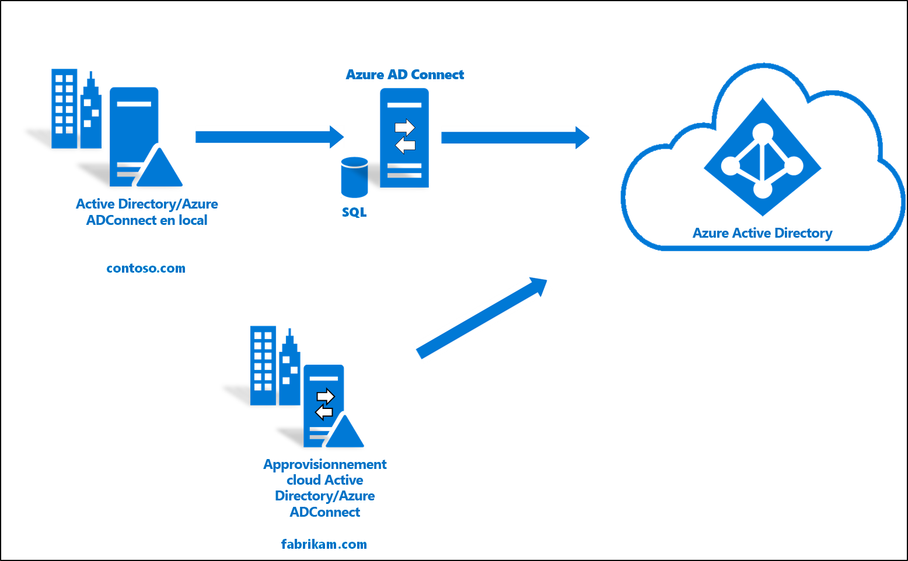

Vous pouvez utiliser l’environnement que vous créez dans ce tutoriel à des fins de test ou pour vous familiariser avec le fonctionnement d’une identité hybride. 

Dans ce scénario, une forêt existante est synchronisée sur un locataire Azure AD via la synchronisation Azure AD Connect. De plus, vous avez une nouvelle forêt que vous souhaitez synchroniser avec le même locataire Azure AD. Vous allez configurer le provisionnement cloud pour la nouvelle forêt. 

## Prérequis
### Dans le Centre d’administration Azure Active Directory

1. Créez un compte d’administrateur général « cloud uniquement » dans votre locataire Azure AD. De cette façon, vous pouvez gérer la configuration de votre locataire si vos services locaux venaient à échouer ou ne plus être disponibles. Découvrez comment [ajouter un compte d’administrateur général de type cloud uniquement](../fundamentals/add-users-azure-active-directory.md). Cette étape est essentielle si vous voulez éviter de vous retrouver en dehors de votre locataire.
2. Ajoutez un ou plusieurs [noms de domaine personnalisés](../fundamentals/add-custom-domain.md) à votre locataire Azure AD. Vos utilisateurs peuvent se connecter à l’aide de l’un de ces noms de domaine.

### Dans votre environnement local

1. Identifiez un serveur hôte joint à un domaine exécutant Windows Server 2012 R2 ou version ultérieure, avec au minimum 4 Go de RAM et le runtime .NET 4.7.1+ 

2. S’il existe un pare-feu entre vos serveurs et Azure AD, configurez les éléments suivants :
   - Assurez-vous que les agents peuvent effectuer des requêtes *sortantes* sur Azure AD sur les ports suivants :

     | Numéro de port | Utilisation |
     | --- | --- |
     | **80** | Télécharge les listes de révocation de certificats lors de la validation du certificat TLS/SSL |
     | **443** | Gère toutes les communications sortantes avec le service |
     | **8080** (facultatif) | Les agents signalent leur état toutes les 10 minutes sur le port 8080, si le port 443 n’est pas disponible. Cet état est affiché sur le portail Azure AD. |
     
     Si votre pare-feu applique les règles en fonction des utilisateurs d’origine, ouvrez ces ports au trafic provenant des services Windows exécutés en tant que service réseau.
   - Si votre pare-feu ou proxy vous permet de spécifier des suffixes sécurisés, ajoutez des connexions à **\*.msappproxy.net** et **\*.servicebus.windows.net**. Dans le cas contraire, autorisez l’accès aux [plages d’adresses IP du centre de données Azure](https://www.microsoft.com/download/details.aspx?id=41653), qui sont mises à jour chaque semaine.
   - Vos agents doivent accéder à **login.windows.net** et à **login.microsoftonline.com** pour l’inscription initiale. Par conséquent, ouvrez également votre pare-feu pour ces URL.
   - Pour valider le certificat, débloquez les URL suivantes : **mscrl.microsoft.com:80**, **crl.microsoft.com:80**, **ocsp.msocsp.com:80** et **www\.microsoft.com:80**. Ces URL étant utilisées pour la validation de certificat avec d’autres produits Microsoft, elles sont peut-être déjà débloquées.

## Installer l’agent de provisionnement Azure AD Connect
1. Connectez-vous au serveur joint au domaine.  Si vous utilisez le tutoriel [Environnement de base Active Directory et Azure](tutorial-basic-ad-azure.md), il s’agit de DC1.
2. Connectez-vous au portail Azure avec des informations d’identification d’administrateur général cloud uniquement.
3. Sur la gauche, sélectionnez **Azure Active Directory**, cliquez sur **Azure AD Connect** et, au centre, sélectionnez **Gérer le provisionnement (préversion)** . 
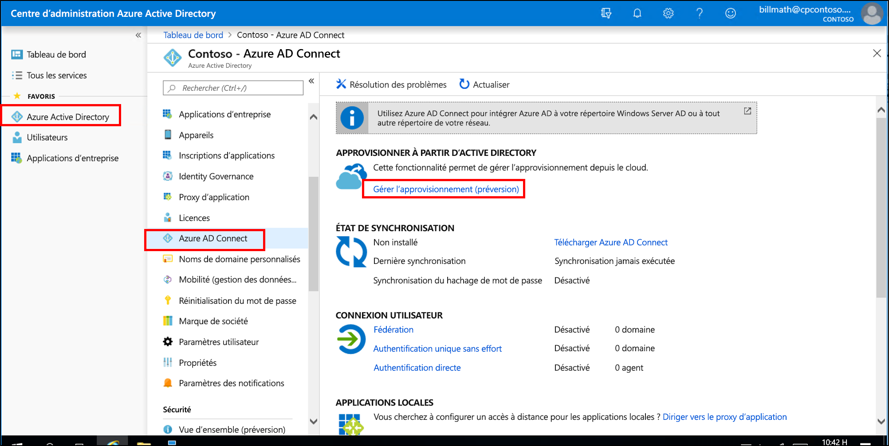 
4. Cliquez sur « Télécharger l’agent ».
5. Exécutez l’agent de provisionnement Azure AD Connect.
6. Dans l’écran de démarrage, **acceptez** les termes du contrat de licence et cliquez sur **Installer**. 
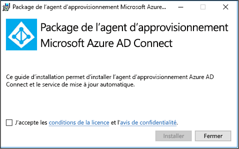 

7. Une fois cette opération terminée, l’Assistant de configuration démarre.  Connectez-vous avec votre compte d’administrateur général Azure AD.  Notez que si la sécurité renforcée d’Internet Explorer est activée, elle bloque la connexion.  Si c’est le cas, fermez l’installation, désactivez la sécurité renforcée d’Internet Explorer dans le Gestionnaire de serveur, puis cliquez sur l’**Assistant Agent de provisionnement AAD Connect** pour redémarrer l’installation.
8. Dans l’écran **Connexion à Active Directory**, cliquez sur **Ajout d’un annuaire**, puis connectez-vous avec votre compte d’administrateur de domaine Active Directory.  REMARQUE :  Le compte d’administrateur de domaine ne doit pas vous demander de changer de mot de passe. En cas d’expiration ou de changement du mot de passe, vous devez reconfigurer l’agent avec les nouvelles informations d’identification. Cette opération ajoute votre annuaire local.  Cliquez sur **Suivant**. 
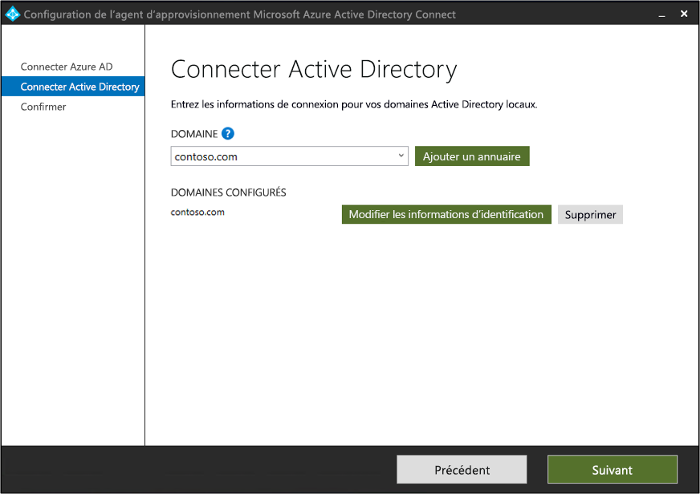 

9. Dans l’écran **Configuration terminée**, cliquez sur **Confirmer**.  Cette opération inscrit et redémarre l’agent. 
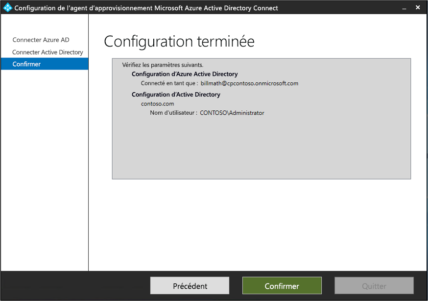 

10. Une fois cette opération terminée, vous devriez voir une notification : **La configuration de votre agent a été vérifiée avec succès.**  Vous pouvez cliquer sur **Quitter**. 
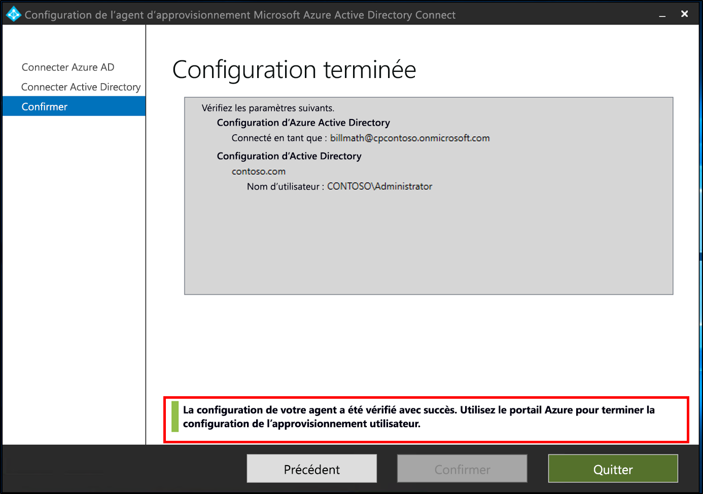 
11. Si vous voyez encore l’écran de démarrage initial, cliquez sur **Fermer**.

## Vérifier l’installation de l’agent
La vérification de l’agent se produit dans le portail Azure et sur le serveur local qui exécute l’agent.

### Vérification de l’agent dans le portail Azure
Pour vérifier que l’agent est visible par Azure, procédez comme suit :

1. Connectez-vous au portail Azure.
2. Sur la gauche, sélectionnez **Azure Active Directory**, cliquez sur **Azure AD Connect** et, au centre, sélectionnez **Gérer le provisionnement (préversion)** . 
 

3.  Dans l’écran **Provisionnement Azure AD (préversion)** , cliquez sur **Passer en revue tous les agents**.
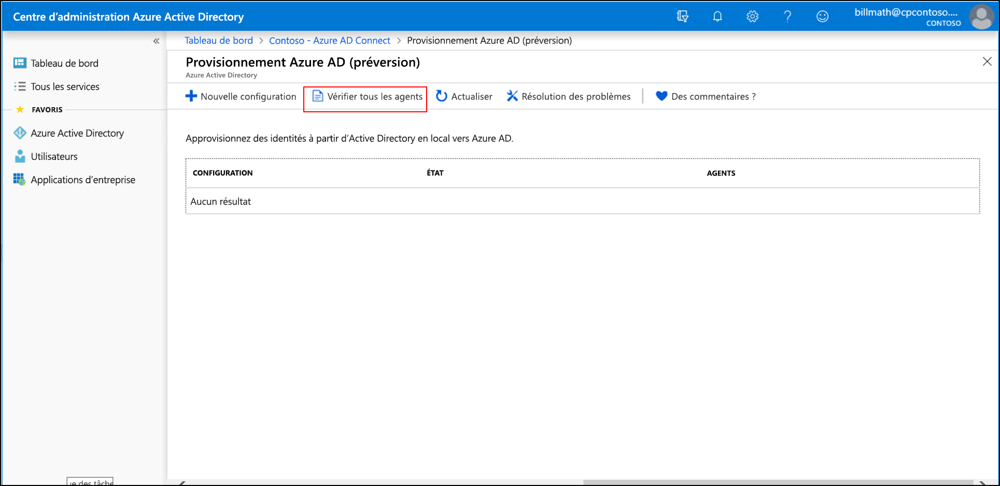 
 
4. Dans l’écran **Agents de provisionnement locaux**, vous voyez les agents que vous avez installés.  Vérifiez que l’agent en question est présent et qu’il est marqué comme étant **actif**.
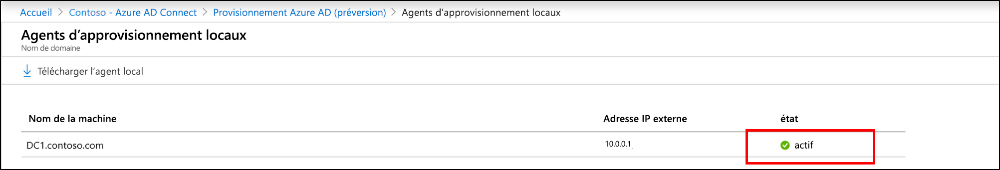 

### Sur le serveur local
Pour vérifier que l’agent est en cours d’exécution, effectuez les étapes suivantes :

1.  Connectez-vous au serveur avec un compte administrateur.
2.  Ouvrez **Services** en y accédant ou en accédant à Démarrer/Exécuter/Services.msc.
3.  Sous **Services**, assurez-vous que le **Programme de mise à jour de l’agent Microsoft Azure AD Connect** et l’**Agent de provisionnement Microsoft Azure AD Connect** sont présents, et que leur état est **En cours d’exécution**.
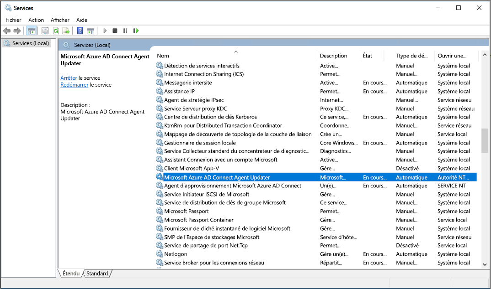

## Configurer le provisionnement cloud Azure AD Connect
 Pour configurer le provisionnement, suivez les étapes décrites ici.

1.  Connectez-vous au portail Azure AD.
2.  Cliquez sur **Azure Active Directory**.
3.  Cliquez sur **Azure AD Connect**.
4.  Sélectionnez **Gérer le provisionnement (préversion)** 
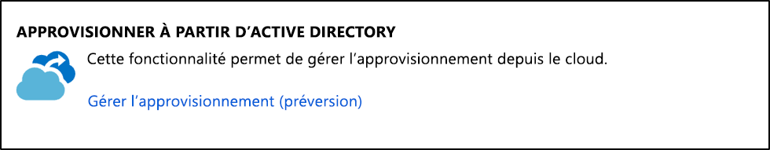
5.  Cliquez sur **Nouvelle configuration**
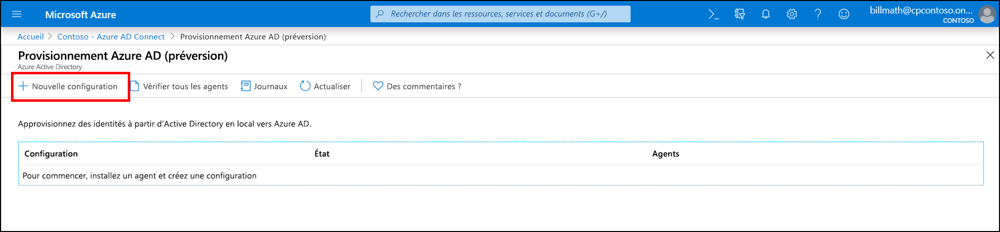
7.  Dans l’écran de configuration, entrez une adresse **e-mail de notification**, déplacez le sélecteur sur **Activer** et cliquez sur **Enregistrer**.

1.  L’état de la configuration doit maintenant être **Sain**.
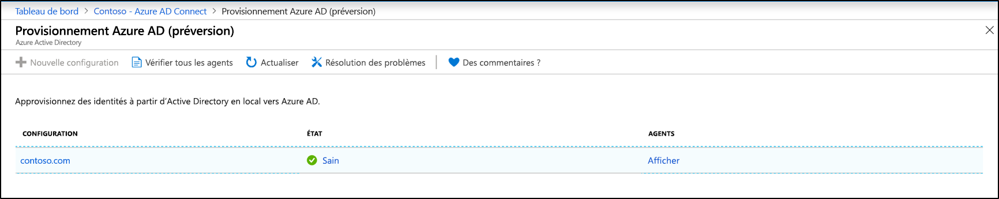

## Vérifier les utilisateurs créés et l’exécution de la synchronisation
Vous allez maintenant vérifier que les utilisateurs de l’annuaire local ont été synchronisés et figurent désormais dans le locataire Azure AD.  Cette opération peut prendre quelques heures.  Pour vérifier que les utilisateurs sont synchronisés, procédez comme suit.

1. Accédez au [portail Azure](https://portal.azure.com) et connectez-vous avec un compte qui dispose d’un abonnement Azure.
2. À gauche, sélectionnez **Azure Active Directory**
3. Sous **Gérer**, sélectionnez **Utilisateurs**.
4. Vérifiez que les nouveaux utilisateurs apparaissent dans le client. 
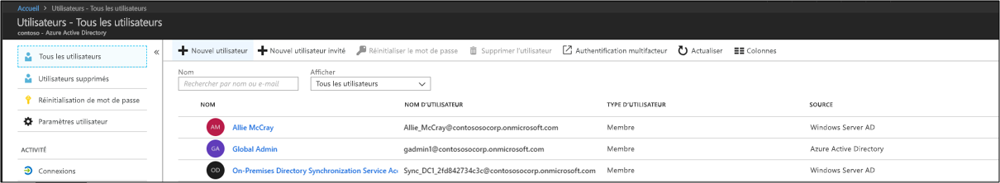 

## Tester la connexion avec un des utilisateurs

1. Accédez à [https://myapps.microsoft.com](https://myapps.microsoft.com).
2. Connectez-vous avec un compte d’utilisateur créé dans le nouveau locataire.  Vous devez vous connecter en utilisant le format suivant : (user@domain.onmicrosoft.com). Saisissez le même mot de passe que celui utilisé par l’utilisateur pour se connecter en local. 
   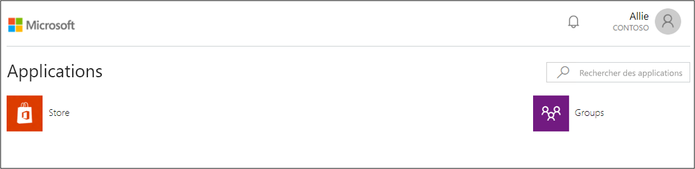 

Vous venez de configurer un environnement d’identité hybride que vous pouvez utiliser à des fins de test et pour vous familiariser avec les fonctionnalités Azure.

## Étapes suivantes 

- [Présentation du provisionnement](what-is-provisioning.md)
- [Présentation du provisionnement cloud Azure AD Connect](what-is-cloud-provisioning.md)