# Provisionnement cloud pilote pour une forêt AD synchronisée existante 

Ce tutoriel vous guide tout au long du pilotage du provisionnement cloud pour une forêt Active Directory test déjà synchronisée à l’aide de la synchronisation Azure Active Directory (Azure AD) Connect.

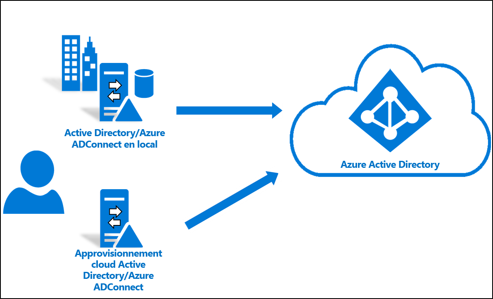

## Considérations
Avant de suivre ce tutoriel, tenez compte des éléments suivants :
1. Vous devez bien connaître les principes de base du provisionnement cloud. 
2. Veillez à exécuter la synchronisation Azure AD Connect version 1.4.32.0 ou ultérieure et à configurer les règles de synchronisation stipulées. Pendant la procédure, vous allez supprimer un groupe ou une unité d’organisation de test de l’étendue de la synchronisation Azure AD Connect. Le déplacement d’objets en dehors de l’étendue provoque la suppression de ces objets dans Azure AD. Dans le cas d’objets utilisateur, les objets figurant dans Azure AD sont supprimés de façon réversible et peuvent être restaurés. Dans le cas d’objets de groupe, les objets figurant dans Azure AD sont supprimés définitivement et ne peuvent pas être restaurés. Un nouveau type de lien a été introduit dans la synchronisation Azure AD Connect, qui empêchera la suppression dans le cas d’un scénario de pilotage. 
3. Vérifiez que ms-ds-consistencyGUID a été renseigné pour les objets figurant dans l’étendue pilote afin d’avoir une correspondance exacte entre le provisionnement cloud et les objets. Notez que la synchronisation Azure AD Connect ne renseigne pas ms-ds-consistencyGUID par défaut pour les objets de groupe.
4. Il s’agit d’un scénario avancé. Veillez à suivre avec précision les étapes décrites dans ce tutoriel.

## Prérequis
Voici les conditions préalables requises pour suivre ce didacticiel.
- Un environnement de test avec la synchronisation Azure AD Connect version 1.4.32.0 ou ultérieure
- Une unité d’organisation ou un groupe figurant dans l’étendue de la synchronisation et pouvant servir de pilote. Nous vous recommandons de commencer avec un ensemble réduit d’objets.
- Un serveur exécutant Windows Server 2012 R2 ou ultérieur, qui hébergera l’agent de provisionnement.  Ce serveur ne peut pas être identique au serveur Azure AD Connect.

## Mettre à jour Azure AD Connect

Au minimum, vous devez disposer d’[Azure AD Connect](https://www.microsoft.com/download/details.aspx?id=47594)1.4.32.0. Pour mettre à jour la synchronisation Azure AD Connect, suivez les étapes décrites dans [Azure AD Connect : Mettre à niveau vers la version la plus récente](../hybrid/how-to-upgrade-previous-version.md).  Cette étape est fournie si votre environnement de test ne dispose pas de la dernière version d’Azure AD Connect.

## Arrêter le planificateur
La synchronisation Azure AD Connect synchronise les modifications intervenant dans votre annuaire local à l’aide d’un planificateur. Pour pouvoir modifier et ajouter des règles personnalisées, vous pouvez désactiver le planificateur pour que les synchronisations ne s’exécutent pas pendant que vous travaillez à cette tâche.  Procédez comme suit :

1.  Sur le serveur qui exécute la synchronisation Azure AD Connect, ouvrez PowerShell avec des privilèges d’administrateur.
2.  Exécutez `Stop-ADSyncSyncCycle`.  Appuyez sur Entrée.
3.  Exécutez `Set-ADSyncScheduler -SyncCycleEnabled $false`.

## Créer une règle personnalisée de trafic entrant utilisateur

 1. Exécutez l’éditeur de synchronisation à partir d’un menu d’application dans le poste de travail comme indiqué ci-après : 
 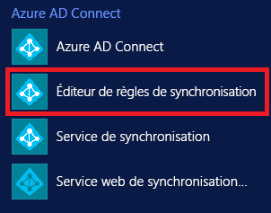 
 
 2. Sélectionnez **Inbound** (Entrant) dans la liste déroulante Direction, puis cliquez sur **Add new rule** (Ajouter une nouvelle règle).
 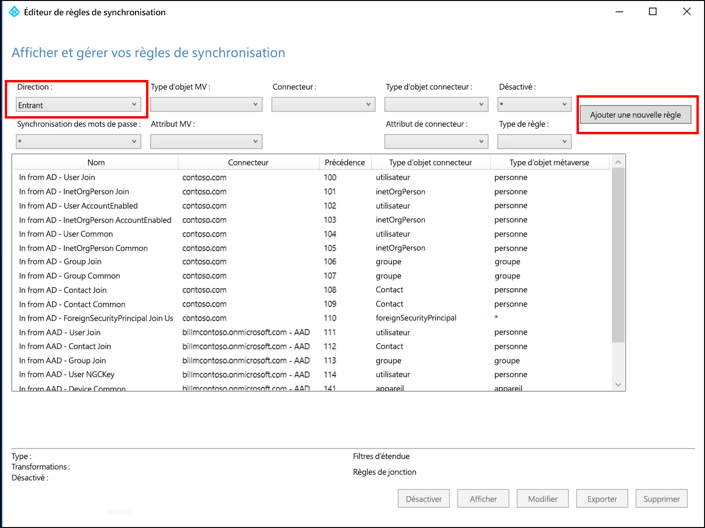 
 
 3. Dans la page **Description**, entrez les informations ci-dessous et cliquez sur **Suivant** :

    **Nom :** attribuez un nom explicite à la règle. 
    **Description :** ajoutez une description explicite.  
    **Connected System** (Système connecté) : choisissez le connecteur AD pour lequel vous écrivez la règle de synchronisation personnalisée. 
    **Connected System Object Type** (Type d’objet système connecté) : Utilisateur 
    **Metaverse Object Type** (Type d’objet métaverse) : Personne 
    **Link Type** (Type de lien) : Join 
    **Precedence** (Précédence) : indiquez une valeur unique dans le système. 
    **Tag** (Balise) : laissez ce champ vide. 
    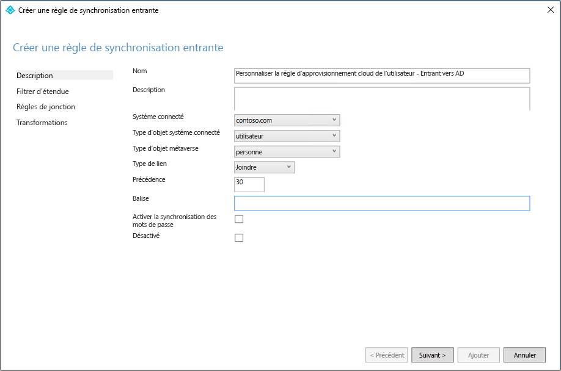 
 
 4. Dans la page **Scoping filter** (Filtre d’étendue), entrez l’unité d’organisation ou le groupe de sécurité sur lesquels vous souhaitez que le pilote s’appuie.  Pour filtrer sur l’unité d’organisation, ajoutez la partie UO du nom unique. Cette règle s’appliquera à tous les utilisateurs qui se trouvent dans cette unité d’organisation.  Par conséquent, si DN se termine par « OU=CPUsers,DC=contoso,DC=com », vous devez ajouter ce filtre.  Cliquez ensuite sur **Suivant**. 

    |Règle|Attribut|Operator|Valeur|
    |-----|----|----|-----|
    |Étendue d’unité d’organisation|DN|ENDSWITH|Nom unique de l’unité d’organisation.|
    |Étendue de groupe||ISMEMBEROF|Nom unique du groupe de sécurité.|

    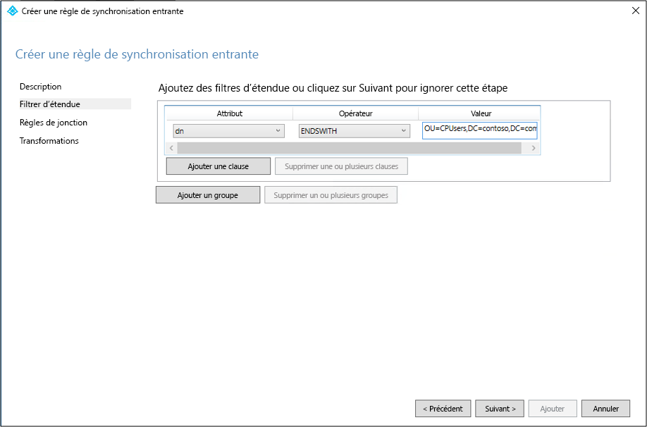 
 
 5. Dans la page **Join rules** (Règles de jointure), cliquez sur **Suivant**.
 6. Dans la page **Transformations**, ajoutez une transformation constante : spécifiez True pour l’attribut cloudNoFlow. Cliquez sur **Add**.
 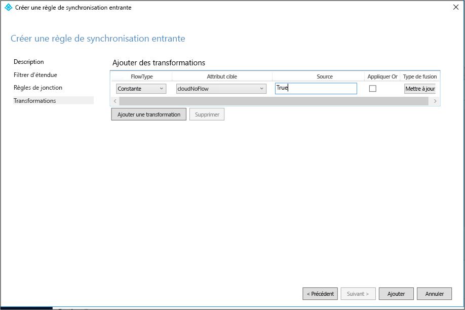 

Les mêmes étapes doivent être suivies pour tous les types d’objets (utilisateur, groupe et contact).

## Créer une règle personnalisée de trafic sortant utilisateur

 1. Sélectionnez **Outbound** (Sortant) dans la liste déroulante Direction, puis cliquez sur **Add new rule** (Ajouter une nouvelle règle).
 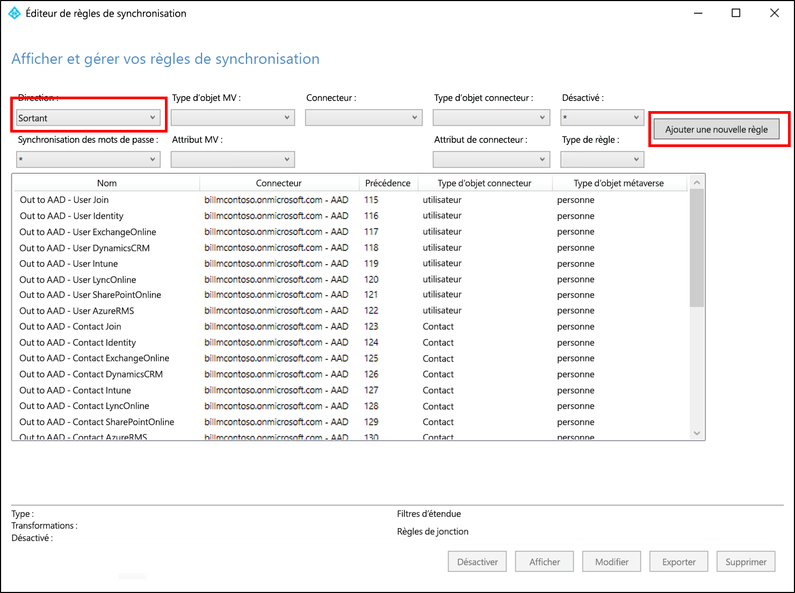 
 
 2. Dans la page **Description**, entrez les informations ci-dessous et cliquez sur **Suivant** :

    **Nom :** attribuez un nom explicite à la règle. 
    **Description :** ajoutez une description explicite.  
    **Connected System** (Système connecté) : choisissez le connecteur AD pour lequel vous écrivez la règle de synchronisation personnalisée. 
    **Connected System Object Type** (Type d’objet système connecté) : Utilisateur 
    **Metaverse Object Type** (Type d’objet métaverse) : Personne 
    **Link Type** (Type de lien) : JoinNoFlow 
    **Precedence** (Précédence) : indiquez une valeur unique dans le système. 
    **Tag** (Balise) : laissez ce champ vide. 
    
    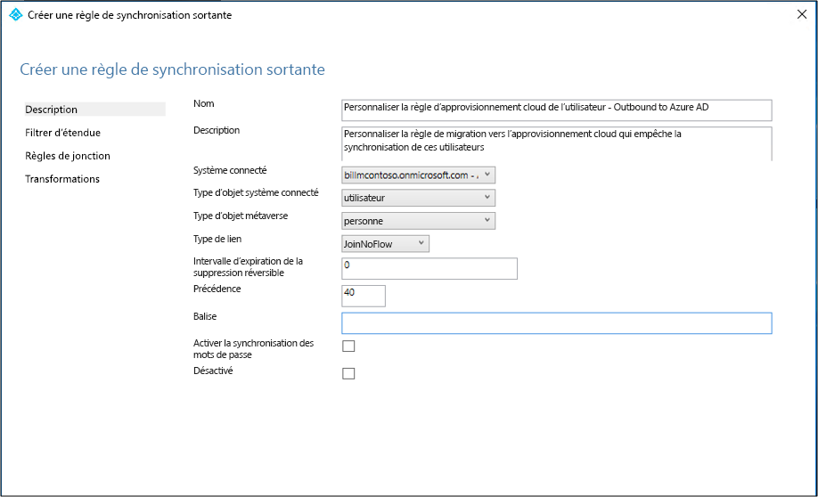 
 
 3. Dans la page **Scoping filter** (Filtre d’étendue), choisissez **cloudNoFlow** EQUAL **True**. Cliquez ensuite sur **Suivant**.
 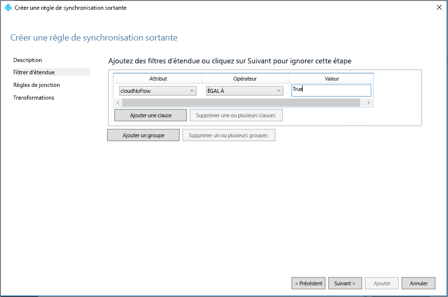 
 
 4. Dans la page **Join rules** (Règles de jointure), cliquez sur **Suivant**.
 5. Dans la page **Transformations**, cliquez sur **Add** (Ajouter).

Les mêmes étapes doivent être suivies pour tous les types d’objets (utilisateur, groupe et contact).

## Définir l’étendue de la synchronisation Azure AD Connect pour exclure l’unité d’organisation pilote
À présent, vous allez configurer Azure AD Connect pour exclure l’UO pilote qui a été créée ci-dessus.  L’agent de provisionnement cloud traitera la synchronisation de ces utilisateurs.  Suivez les étapes ci-dessous pour définir l’étendue d’Azure AD Connect.

 1. Sur le serveur qui exécute Azure AD Connect, double-cliquez sur l’icône Azure AD Connect.
 2. Cliquez sur **Configurer**
 3. Sélectionnez **Personnalisation des options de synchronisation**, puis cliquez sur Suivant.
 4. Connectez-vous à Azure AD, puis cliquez sur **Suivant**.
 5. Dans l’écran **Connexion de vos annuaires**, cliquez sur **Suivant**.
 6. Dans l’écran **Filtrage par domaine ou unité d’organisation**, sélectionnez **Synchroniser les domaines et les unités d’organisation sélectionnés**.
 7. Développez votre domaine et **désélectionnez** l’unité d’organisation **CPUsers**.  Cliquez sur **Suivant**.
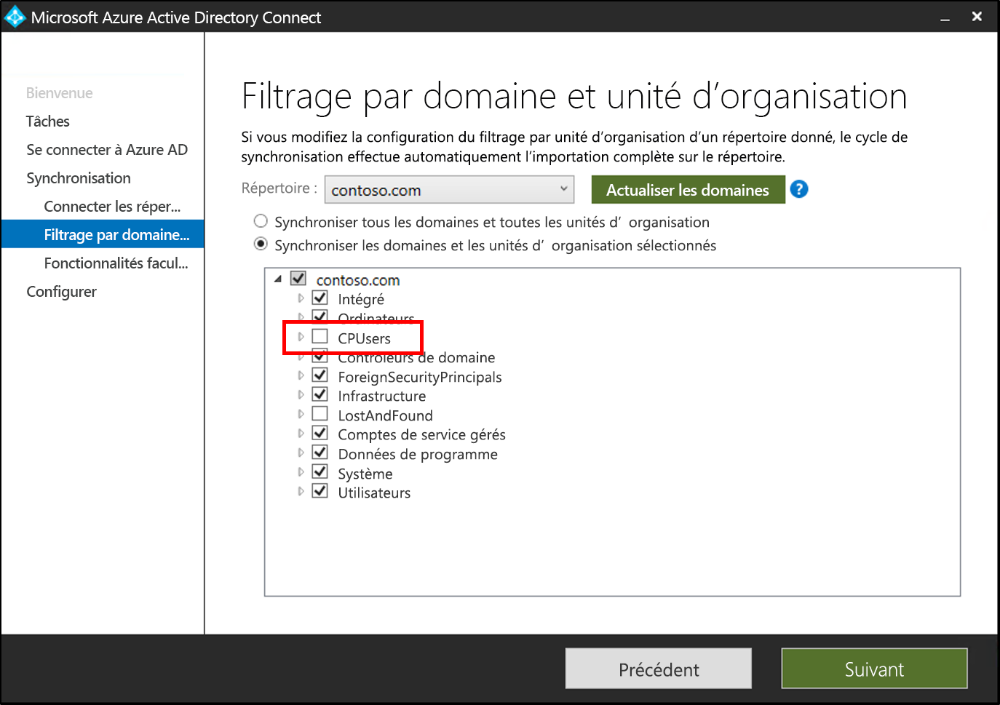 
 9. Dans l’écran **Fonctionnalités facultatives**, cliquez sur **Suivant**.
 10. Dans l’écran **Prêt à configurer**, cliquez sur **Configurer**.
 11. Une fois cette opération terminée, cliquez sur **Quitter**. 

## Démarrer le planificateur
La synchronisation Azure AD Connect synchronise les modifications intervenant dans votre annuaire local à l’aide d’un planificateur. Maintenant que vous avez modifié les règles, vous pouvez redémarrer le planificateur.  Procédez comme suit :

1.  Sur le serveur qui exécute la synchronisation Azure AD Connect, ouvrez PowerShell avec des privilèges d’administrateur.
2.  Exécutez `Set-ADSyncScheduler -SyncCycleEnabled $true`.
3.  Exécutez `Start-ADSyncSyncCycle`.  Appuyez sur Entrée.  

## Installer l’agent de provisionnement Azure AD Connect
1. Connectez-vous au serveur joint au domaine.  Si vous utilisez le tutoriel [Environnement AD et Azure de base](tutorial-basic-ad-azure.md), il s’agit de DC1.
2. Connectez-vous au portail Azure à l’aide des informations d’identification d’administrateur général cloud uniquement.
3. Sur la gauche, sélectionnez **Azure Active Directory**, cliquez sur **Azure AD Connect** et, au centre, sélectionnez **Gérer le provisionnement (préversion)** . 
 
4. Cliquez sur « Télécharger l’agent ».
5. Exécutez l’agent de provisionnement Azure AD Connect.
6. Dans l’écran de démarrage, **acceptez** les termes du contrat de licence et cliquez sur **Installer**. 
 

7. Une fois cette opération terminée, l’Assistant de configuration démarre.  Connectez-vous avec votre compte d’administrateur général Azure AD.  Notez que si la sécurité renforcée d’Internet Explorer est activée, elle bloque la connexion.  Si tel est le cas, fermez l’installation, désactivez la sécurité renforcée d’Internet Explorer dans le Gestionnaire de serveur, puis cliquez sur l’**Assistant de l’agent de provisionnement AAD Connect** pour redémarrer l’installation.
8. Dans l’écran **Connexion à Active Directory**, cliquez sur **Ajout d’un annuaire**, puis connectez-vous avec votre compte d’administrateur de domaine Active Directory.  REMARQUE :  Le compte d’administrateur de domaine ne doit pas avoir d’exigences de changement de mot de passe. En cas d’expiration ou de changement du mot de passe, vous devez reconfigurer l’agent avec les nouvelles informations d’identification. Cette opération ajoute votre annuaire local.  Cliquez sur **Suivant**. 
 

9. Dans l’écran **Configuration terminée**, cliquez sur **Confirmer**.  Cette opération inscrira et redémarrera l’agent. 
 

10. Une fois cette opération terminée, vous devriez voir une notification : **La configuration de votre agent a été vérifiée avec succès.**  Vous pouvez cliquer sur **Quitter**. 
 
11. Si vous voyez encore l’écran de démarrage initial, cliquez sur **Fermer**.

## Vérifier l’installation de l’agent
La vérification de l’agent se produit dans le portail Azure et sur le serveur local qui exécute l’agent.

### Vérification de l’agent dans le portail Azure
Pour vérifier que l’agent est visible par Azure, procédez comme suit :

1. Connectez-vous au portail Azure.
2. Sur la gauche, sélectionnez **Azure Active Directory**, cliquez sur **Azure AD Connect** et, au centre, sélectionnez **Gérer le provisionnement (préversion)** . 
 

3.  Dans l’écran **Provisionnement Azure AD (préversion)** , cliquez sur **Passer en revue tous les agents**.
 
 
4. Dans l’écran **On-premises provisioning agents** (Agents de provisionnement locaux), vous voyez les agents que vous avez installés.  Vérifiez que l’agent en question est présent et qu’il est marqué comme étant **désactivé**.  L’agent est désactivé par défaut par défaut parmi les  

### Sur le serveur local
Pour vérifier que l’agent est en cours d’exécution, procédez comme suit :

1.  Connectez-vous au serveur avec un compte administrateur.
2.  Ouvrez **Services** en y accédant ou en accédant à Démarrer/Exécuter/Services.msc.
3.  Sous **Services**, assurez-vous que le **Programme de mise à jour de l’agent Microsoft Azure AD Connect** et l’**Agent d’approvisionnement Microsoft Azure AD Connect** sont présents et que leur état est **En cours d’exécution**.

## Configurer le provisionnement cloud Azure AD Connect
Pour configurer le provisionnement, procédez comme suit :

 1. Connectez-vous au portail Azure AD.
 2. Cliquez sur **Azure Active Directory**.
 3. Cliquez sur **Azure AD Connect**.
 4. Sélectionnez **Gérer le provisionnement (préversion)** 
 . 
 5.  Cliquez sur **Nouvelle configuration**
 . 
 6.  Dans l’écran de configuration, entrez une adresse **e-mail de notification**, déplacez le sélecteur sur **Activer** et cliquez sur **Enregistrer**.
  
 7. Sous **Configurer**, sélectionnez **Tous les utilisateurs** pour modifier l’étendue de la règle de configuration.
 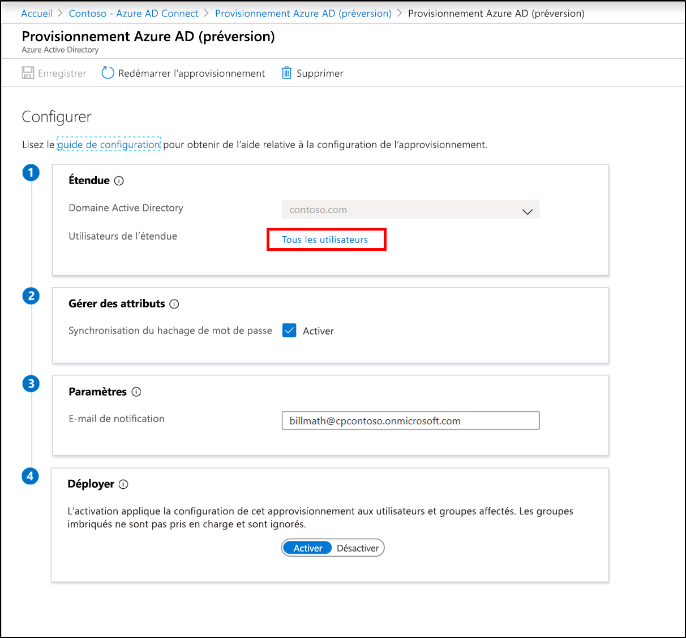 
 8. Sur la droite, modifiez l’étendue pour inclure l’unité d’organisation spécifique que vous venez de créer : « OU=CPUsers,DC=contoso,DC=com ».
 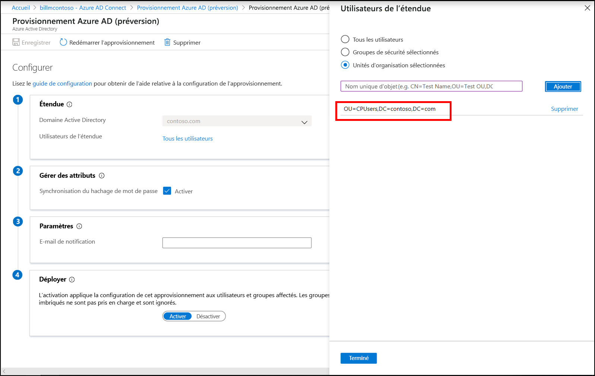 
 9.  Cliquez sur **Terminé** et sur **Enregistrer**.
 10. L’étendue doit maintenant être définie sur une unité d’organisation. 
  
 

## Vérifier que les utilisateurs sont provisionnés par provisionnement cloud
Vous allez maintenant vérifier que les utilisateurs de l’annuaire local ont été synchronisés et figurent maintenant dans le locataire Azure AD.  Cette opération peut prendre quelques heures.  Pour vérifier que les utilisateurs sont provisionnés par provisionnement cloud, procédez comme suit :

1. Accédez au [portail Azure](https://portal.azure.com) et connectez-vous avec un compte qui dispose d’un abonnement Azure.
2. À gauche, sélectionnez **Azure Active Directory**
3. Cliquez sur **Azure AD Connect**.
4. Cliquez sur **Gérer le provisionnement (préversion)** .
5. Cliquez sur le bouton **Journaux**.
6. Recherchez un nom d’utilisateur pour confirmer que l’utilisateur est provisionné par provisionnement cloud.

De plus, vous pouvez vérifier que l’utilisateur et le groupe existent dans Azure AD.

## Survenue d’un problème
Si le pilote ne fonctionne pas comme prévu, vous pouvez revenir à la configuration de la synchronisation Azure AD Connect en suivant les étapes ci-dessous :
1.  Désactivez la configuration du provisionnement dans le portail Azure. 
2.  Désactivez toutes les règles de synchronisation personnalisées créées pour le provisionnement cloud à l’aide de l’Éditeur de règles de synchronisation. La désactivation doit entraîner une synchronisation complète sur tous les connecteurs.

## Étapes suivantes 

- [Qu’est-ce que le provisionnement ?](what-is-provisioning.md)
- [Qu’est-ce que le provisionnement cloud Azure AD Connect ?](what-is-cloud-provisioning.md)

