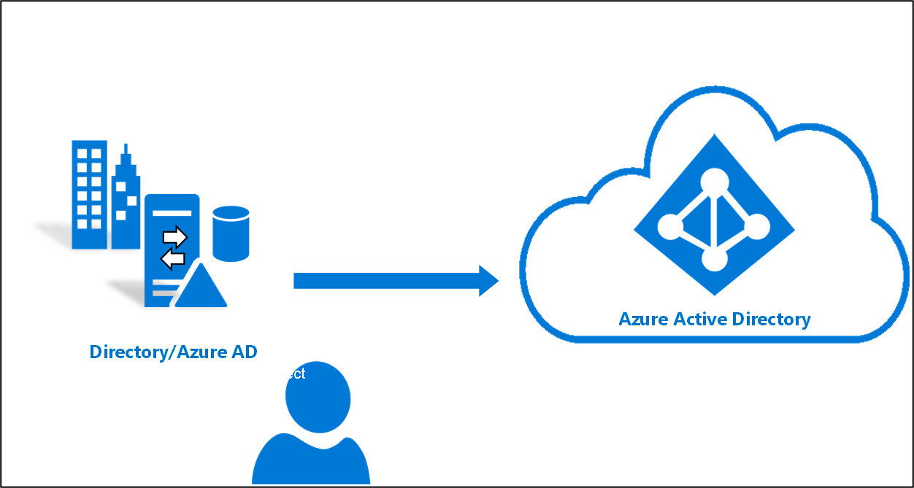

# Qu’est-ce que la synchronisation cloud Azure AD Connect ?
La synchronisation cloud Azure AD Connect est une nouvelle offre Microsoft conçue pour répondre à vos objectifs d’identités hybrides en matière de synchronisation des utilisateurs, groupes et contacts sur Azure AD.  Elle utilise pour cela l’agent de provisionnement cloud Azure AD au lieu de l’application Azure AD Connect.  Toutefois, elle peut être utilisée avec la synchronisation Azure AD Connect, et offre les avantages suivants :
    
- Prise en charge de la synchronisation sur un locataire Azure AD, à partir d’un environnement de forêt Active Directory déconnecté multiforêt. Les scénarios courants incluent la fusion et l’acquisition (dans lesquelles les forêts Active Directory de la société acquise sont isolées des forêts Active Directory de la société parente), et des sociétés qui ont historiquement plusieurs forêts Active Directory.
- Installation simplifiée avec des agents de provisionnement légers. Les agents jouent le rôle de pont entre Active Directory et Azure AD, avec toute la configuration de synchronisation gérée dans le cloud. 
- Plusieurs agents de provisionnement peuvent être utilisés pour simplifier les déploiements à haute disponibilité, particulièrement critiques pour les organisations qui reposent sur la synchronisation de hachage de mot de passe entre Active Directory et Azure AD.
- Prise en charge des grands groupes comptant jusqu’à 50 000 membres. Nous vous recommandons d’utiliser uniquement le filtre d’étendue d’unité d’organisation pour synchroniser les grands groupes.

## En quoi la synchronisation cloud Azure AD Connect est-elle différente de la synchronisation Azure AD Connect ?
Avec la synchronisation cloud Azure AD Connect, le provisionnement d’Active Directory vers Azure AD est orchestré dans Microsoft Online Services. Une organisation a uniquement besoin de déployer, dans son environnement IaaS ou local, un agent léger qui fait office de pont entre Azure AD et Active Directory. La configuration du provisionnement est stockée dans Azure AD et gérée dans le cadre du service.

## Vidéo sur la synchronisation cloud Azure AD Connect
La courte vidéo suivante donne une excellente vue d’ensemble de la synchronisation cloud Azure AD Connect :

> [!VIDEO https://youtube.com/embed/mOT3ID02_YQ]

## Comparaison entre la synchronisation Azure AD Connect et la synchronisation cloud

Le tableau suivant présente une comparaison entre la synchronisation Azure AD Connect et la synchronisation cloud Azure AD Connect :

| Fonctionnalité | Synchronisation Azure Active Directory Connect| Synchronisation cloud Azure Active Directory Connect |
|:--- |:---:|:---:|
|Connexion à une forêt AD locale|● |● |
| Connexion à plusieurs forêts AD locales |● |● |
| Connexion à plusieurs forêts Active Directory locales déconnectées | |● |
| Modèle d’installation d’agent léger | |● |
| Plusieurs agents actifs pour la haute disponibilité | |● |
| Connexion aux annuaires LDAP|●| | 
| Prise en charge des objets utilisateur |● |● |
| Prise en charge des objets groupe |● |● |
| Prise en charge des objets contact |● |● |
| Prise en charge des objets appareil |● | |
| Autorisation de la personnalisation de base pour les flux d’attributs |● |● |
| Synchronisation des attributs Exchange Online |● |● |
| Synchronisation des attributs d’extension 1-15 |● |● |
| Synchronisation des attributs Active Directory définis par le client (extensions d’annuaire) |● | |
| Prise en charge de la synchronisation de hachage de mot de passe |●|●|
| Prise en charge de l’authentification directe |●||
| Prise en charge de la fédération |●|●|
| Authentification unique transparente|● |●|
| Installation des supports sur un contrôleur de domaine |● |● |
| Prise en charge pour Windows Server 2016|● |● |
| Filtrage sur les domaines/unités d’organisation/groupes |● |● |
| Filtrage sur les valeurs d’attributs des objets |● | |
| Autorisation d’un ensemble minimal d’attributs à synchroniser (MinSync) |● |● |
| Autorisation du blocage des attributs circulant d’AD vers Azure AD |● |● |
| Autorisation de la personnalisation avancée pour les flux d’attributs |● | |
| Prise en charge de la réécriture (mots de passe, appareils, groupes) |● | |
| Support Azure AD Domain Services|● | |
| [Écriture différée d’Exchange hybride](../hybrid/reference-connect-sync-attributes-synchronized.md#exchange-hybrid-writeback) |● | |
| Nombre illimité d’objets par domaine AD |● | |
| Prise en charge d’un maximum de 150 000 objets par domaine AD |● |● |
| Groupes jusqu’à 50 000 membres |● |● |
| Grands groupes jusqu’à 250 000 membres |● |  |
| Références entre les domaines|● | |
| Approvisionnement à la demande|● |● |

## Étapes suivantes 

- [Présentation du provisionnement](what-is-provisioning.md)
- [Installer la synchronisation cloud](how-to-install.md)
