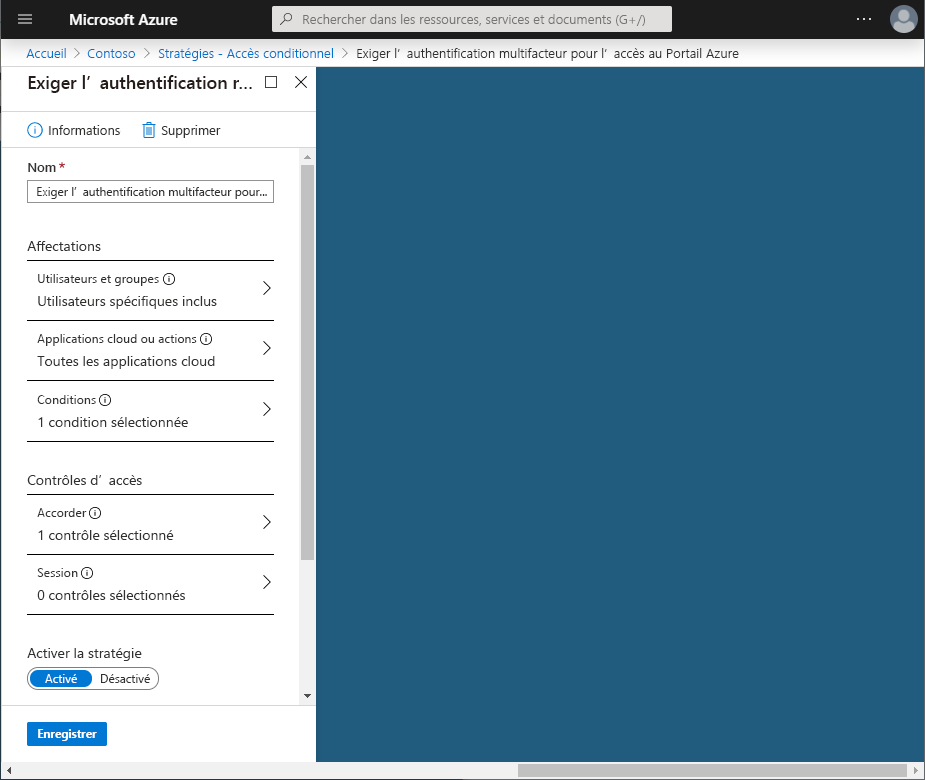
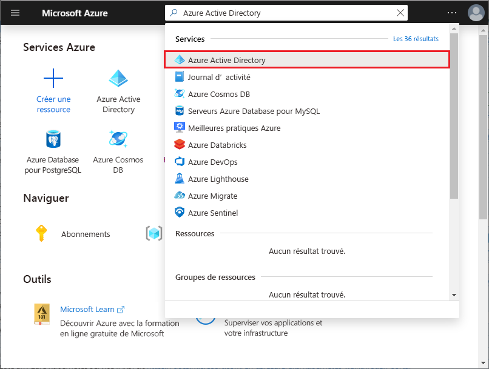

# Démarrage rapide : Exiger une authentification multifacteur (MFA) pour des applications spécifiques disposant d’un accès conditionnel à Azure Active Directory

Pour simplifier l’expérience de connexion de vos utilisateurs, vous pouvez autoriser ceux-ci à se connecter à vos applications cloud à l’aide d’un nom d’utilisateur et d’un mot de passe. Cependant, de nombreux environnements englobent au moins quelques applications pour lesquelles il est souhaitable d’exiger une forme plus forte de vérification de compte, telle qu’une authentification multifacteur (MFA). Cette stratégie peut s’appliquer pour accéder au système de courrier de votre organisation ou à vos applications de gestion des ressources humaines. Dans Azure Active Directory (Azure AD), vous pouvez atteindre cet objectif avec une stratégie d’accès conditionnel.

Ce démarrage rapide montre comment configurer une [stratégie d’accès conditionnel Azure AD](../active-directory-conditional-access-azure-portal.md) qui exige une authentification multifacteur pour une application cloud sélectionnée dans votre environnement.

Si vous n’avez pas d’abonnement Azure, créez un [compte gratuit](https://azure.microsoft.com/free/?WT.mc_id=A261C142F) avant de commencer.

## Prérequis

Pour suivre le scénario décrit dans ce démarrage rapide, vous avez besoin de ce qui suit :

- **Accès à l’édition Azure AD Premium** : l’accès conditionnel Azure AD est une fonctionnalité d’Azure AD Premium.
- **Un compte d’essai nommé Isabella Simonsen** : si vous ignorez comment créer un compte d’essai, voir [Ajouter des utilisateurs basés sur le cloud](../fundamentals/add-users-azure-active-directory.md#add-a-new-user).

Pour le scénario de ce guide de démarrage rapide, l'authentification multifacteur par utilisateur ne doit pas être activée sur votre compte de test. Pour plus d'informations, consultez [Comment exiger la vérification en deux étapes pour un utilisateur](../authentication/howto-mfa-userstates.md).

## Tester votre expérience

L’objectif de cette étape consiste à obtenir une impression de l’expérience sans stratégie d’accès conditionnel.

**Pour initialiser votre environnement :**

1. Connectez-vous à votre portail Azure en tant que Isabella Simonsen.
1. Déconnectez-vous.

## Créer votre stratégie d’accès conditionnel

Cette section montre comment créer la stratégie d’accès conditionnel requise. Le scénario de ce démarrage rapide utilise ce qui suit :

- le portail Azure en tant qu’espace réservé pour une application cloud qui exige une authentification multifacteur ; 
- Votre exemple d’utilisateur pour tester la stratégie d’accès conditionnel.  

Dans votre stratégie, définissez :

| Paramètre | Valeur |
| --- | --- |
| Utilisateurs et groupes | Isabella Simonsen |
| Applications cloud | Gestion Microsoft Azure |
| Accorder l'accès | Exiger une authentification multifacteur |

**Pour configurer votre stratégie d’accès conditionnel, procédez comme suit :**

1. Connectez-vous au [portail Azure](https://portal.azure.com) en tant qu’administrateur général, administrateur de sécurité ou administrateur de l’accès conditionnel.
1. Dans le Portail Azure, recherchez et sélectionnez **Azure Active Directory**.

   

1. Sur la page **Azure Active Directory**, dans la section **Sécurité**, cliquez sur **Accès conditionnel**.

   

1. Sur la page **Accès conditionnel**, dans la barre d’outils supérieure, cliquez sur **Nouvelle stratégie**.

   

1. Dans la page **Nouveau**, dans la zone de texte **Nom**, tapez **Exiger une authentification multifacteur pour l’accès au portail Azure**.

   

1. Dans la section **Affectation**, cliquez sur **Utilisateurs et groupes**.

   

1. Dans la page **Utilisateurs et groupes**, effectuez les étapes suivantes :

   

   1. Cliquez sur **Sélectionner des utilisateurs et des groupes**, puis choisissez **des utilisateurs et des groupes**.
   1. Cliquez sur **Sélectionner**.
   1. Dans la page **Sélectionner**, sélectionnez **Isabella Simonsen**, puis cliquez sur **Sélectionner**.
   1. Dans la page **Utilisateurs et groupes**, cliquez sur **Terminé**.

1. Cliquez sur **Applications cloud**.

   

1. Dans la page **Applications cloud**, procédez comme suit :

   

   1. Cliquez sur **Sélectionner les applications**.
   1. Cliquez sur **Sélectionner**.
   1. Dans la page **Sélectionner**, choisissez **Gestion Microsoft Azure**, puis cliquez sur **Sélectionner**.
   1. Dans la page **Applications cloud**, cliquez sur **Terminé**.

1. Dans la section **Contrôles d’accès**, cliquez sur **Accorder**.

   

1. Dans la page **Octroyer**, effectuez les étapes suivantes :

   

   1. Sélectionner **Accorder l’accès**.
   1. Sélectionnez **Exiger une authentification multifacteur**.
   1. Cliquez sur **Sélectionner**.

1. Dans la section **Activer la stratégie**, cliquez sur **Activée**.

   

1. Cliquez sur **Créer**.

## Évaluer une connexion simulée

À présent que vous avez configuré votre stratégie d’accès conditionnel, vous souhaitez probablement savoir s’il fonctionne comme prévu. Dans un premier temps, utilisez l’outil de stratégie d’accès conditionnel What If pour simuler une connexion de votre utilisateur de test. La simulation évalue l’impact de cette connexion sur vos stratégies et génère un rapport de simulation.  

Pour initialiser l’outil d’évaluation de stratégie **What If**, définissez ce qui suit :

- **Isabella Simonsen** en tant qu’utilisateur.
- **Gestion Microsoft Azure** en tant qu’application cloud.

Un clic sur **What If** a pour effet de créer un rapport de simulation indiquant ce qui suit :

- **Exiger une authentification multifacteur pour l’accès au portail Azure** sous **Stratégies qui vont s’appliquer**.
- **Exiger une authentification multifacteur** en tant que **Contrôles d’octroi**.

**Pour évaluer votre stratégie d’accès conditionnel :**

1. Dans la page [Accès conditionnel - Stratégies](https://portal.azure.com/#blade/Microsoft_AAD_IAM/ConditionalAccessBlade/Policies), dans le menu en haut, cliquez sur **What If**.  

   

1. Cliquez sur **Utilisateurs**, sélectionnez **Isabella Simonsen**, puis cliquez sur **Sélectionner**.

   

1. Pour sélectionner une application cloud, procédez comme suit :

   

   1. Cliquez sur **Applications cloud**.
   1. Dans la page **Applications cloud**, cliquez sur **Sélectionner les applications**.
   1. Cliquez sur **Sélectionner**.
   1. Dans la page **Sélectionner**, choisissez **Gestion Microsoft Azure**, puis cliquez sur **Sélectionner**.
   1. Dans la page Applications cloud, cliquez sur **Terminé**.

1. Cliquez sur **What If**.

## Tester votre stratégie d’accès conditionnel

Dans la section précédente, vous avez appris à évaluer une connexion simulée. En plus d’une simulation, vous devez tester votre stratégie d’accès conditionnel pour vous assurer qu’elle fonctionne comme prévu.

Pour tester votre stratégie, essayez de vous connecter à votre [portail Azure](https://portal.azure.com) à l’aide de votre compte de test **Isabella Simonsen**. Vous devriez voir s’afficher une boîte de dialogue vous demandant de configurer votre compte pour une vérification de sécurité supplémentaire.

## Supprimer des ressources

Lorsque vous n’en avez plus besoin, supprimez l’utilisateur de test et la stratégie d’accès conditionnel :

- Si vous ignorez comment supprimer un utilisateur Azure AD, voir [Supprimer des utilisateurs d’Azure AD](../fundamentals/add-users-azure-active-directory.md#delete-a-user).
- Pour supprimer votre stratégie, sélectionnez-la, puis cliquez sur **Supprimer** dans la barre d’outils Accès rapide.

    

## Étapes suivantes

> [!div class="nextstepaction"]
> [Exiger l’acceptation des conditions d’utilisation](require-tou.md)
> [Bloquer l’accès lorsqu’un risque de session est détecté](app-sign-in-risk.md)
