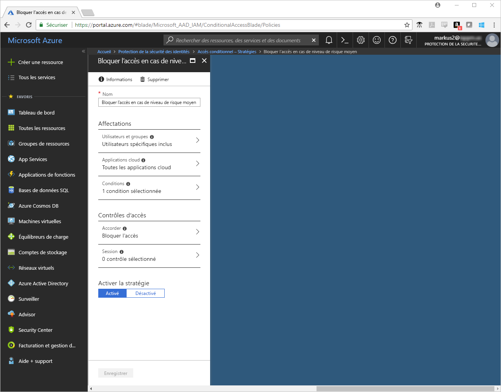
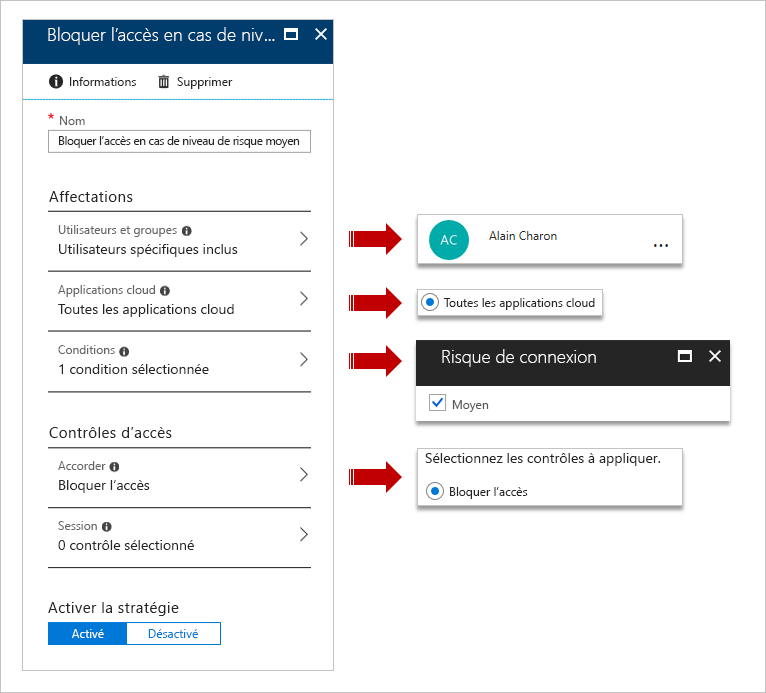
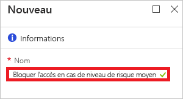
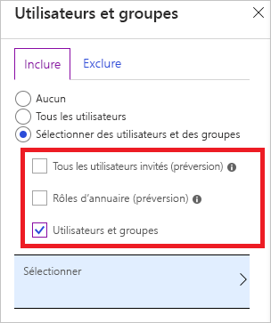
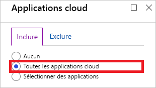
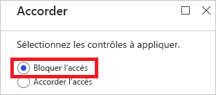
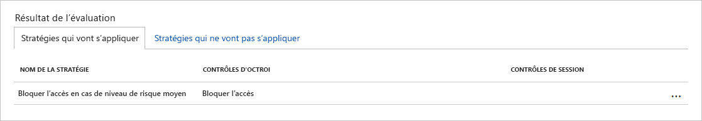
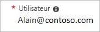

# Démarrage rapide : Bloquer l’accès lorsqu’un risque de session est détecté avec l’accès conditionnel Azure Active Directory  

Pour protéger votre environnement, vous devrez peut-être empêcher les utilisateurs suspects de se connecter. [Azure Active Directory (Azure AD) Identity Protection](../active-directory-identityprotection.md) analyse chaque connexion et calcule la probabilité qu’une tentative de connexion n’émane pas du propriétaire légitime d’un compte d’utilisateur. La probabilité (faible, moyenne ou élevée) est indiquée sous forme de valeurs calculées appelées [niveaux de risque de connexion](concept-conditional-access-conditions.md#sign-in-risk). En définissant la condition du risque de connexion, vous pouvez configurer une stratégie d’accès conditionnel afin de répondre aux niveaux de risque de connexion spécifiques.

Ce démarrage rapide décrit comment configurer une [stratégie d’accès conditionnel](../active-directory-conditional-access-azure-portal.md) qui bloque une connexion lorsqu’un niveau de risque de connexion configuré a été détecté.

Si vous n’avez pas d’abonnement Azure, créez un [compte gratuit](https://azure.microsoft.com/free/?WT.mc_id=A261C142F) avant de commencer.

## Conditions préalables requises

Pour suivre le scénario décrit dans ce didacticiel, vous avez besoin de ce qui suit :

- **Accès à une édition Azure AD Premium P2** : bien que l’accès conditionnel soit une fonctionnalité d’Azure AD Premium P1, vous avez besoin d’une édition P2, car le scénario de ce démarrage rapide implique Identity Protection.
- **Identity Protection** : Identity Protection doit être activé pour suivre le scénario de ce démarrage rapide. Pour en savoir plus sur l’activation d’Identity Protection dans Azure AD, consultez la page [Activer Azure Active Directory Identity Protection](../identity-protection/overview-identity-protection.md).
- **Navigateur Tor** : le [navigateur Tor](https://www.torproject.org/projects/torbrowser.html.en) est conçu pour vous aider à préserver votre confidentialité en ligne. Identity Protection détecte les connexions à partir du navigateur Tor en tant que connexions depuis des adresses IP anonymes, offrant un niveau de risque moyen. Pour plus d’informations, consultez [Détections des risques dans Azure Active Directory](../reports-monitoring/concept-risk-events.md).  
- **Un compte test nommé Alain Charon** : si vous ignorez comment créer un compte test, consultez la page [Ajouter des utilisateurs basés sur le cloud](../fundamentals/add-users-azure-active-directory.md#add-a-new-user).

## Tester la connexion

L’objectif de cette étape consiste à vérifier que votre compte test peut accéder à votre locataire à l’aide du navigateur Tor.

**Pour tester la connexion :**

1. Connectez-vous à votre [portail Azure](https://portal.azure.com) en tant que **Alain Charon**.
1. Déconnectez-vous.

## Créer votre stratégie d’accès conditionnel

Le scénario de ce guide de démarrage rapide utilise une connexion établie à partir d’un navigateur Tor pour générer une détection de risque de type **Connexions depuis des adresses IP anonymes** ayant été détectée. Le niveau de risque de cette détection des risques est moyen. Pour répondre à cette détection des risques, définissez la condition de risque de connexion sur Moyen. Dans un environnement de production, vous devez définir la condition de risque de connexion sur Élevé ou sur Moyen à élevé.

Cette section montre comment créer la stratégie d’accès conditionnel requise. Dans votre stratégie, définissez :

| Paramètre | Valeur |
| --- | --- |
| Utilisateurs et groupes | Alain Charon  |
| Applications cloud | Toutes les applications cloud |
| Risque à la connexion | Moyenne |
| Accorder | Bloquer l’accès |

**Pour configurer votre stratégie d’accès conditionnel, effectuez les étapes suivantes :**

1. Connectez-vous au [portail Azure](https://portal.azure.com) en tant qu’administrateur général, administrateur de sécurité ou administrateur de l’accès conditionnel.
1. Dans la barre de navigation gauche du portail Azure, cliquez sur **Azure Active Directory**.

   

1. Sur la page **Azure Active Directory**, dans la section **Sécurité**, cliquez sur **Accès conditionnel**.

   

1. Dans la page **Accès conditionnel**, dans la barre d’outils en haut, cliquez sur **Ajouter**.

   

1. Sur la page **Nouveau**, dans la zone de texte **Nom**, saisissez **Block access for medium risk level**.

   

1. Dans la section **Affectation**, cliquez sur **Utilisateurs et groupes**.

   

1. Sur la page **Utilisateurs et groupes** :

   

   1. Cliquez sur **Sélectionner des utilisateurs et des groupes**, puis choisissez **des utilisateurs et des groupes**.
   1. Cliquez sur **Sélectionner**.
   1. Dans la page **Sélectionner**, sélectionnez **Alain Charon**, puis cliquez sur **Sélectionner**.
   1. Dans la page **Utilisateurs et groupes**, cliquez sur **Terminé**.
1. Cliquez sur **Applications cloud**.

   

1. Sur la page **Applications cloud** :

   

   1. Cliquez sur **Toutes les applications cloud**.
   1. Cliquez sur **Done**.
1. Cliquez sur **Conditions**.

   

1. Dans la page **Conditions** :

   

   1. Cliquez sur **Risque de connexion**.
   1. Sous **Configurer**, cliquez sur **Oui**.
   1. Pour le niveau de risque de connexion, sélectionnez **Moyen**.
   1. Cliquez sur **Sélectionner**.
   1. Dans la page **Conditions**, cliquez sur **Terminé**.
1. Dans la section **Contrôles d’accès**, cliquez sur **Accorder**.

   

1. Sur la page des **octrois** :

   

   1. Sélectionnez **Bloquer l’accès**.
   1. Cliquez sur **Sélectionner**.
1. Dans la section **Activer la stratégie**, cliquez sur **Activée**.

   

1. Cliquez sur **Créer**.

## Évaluer une connexion simulée

À présent que vous avez configuré votre stratégie d’accès conditionnel, vous souhaitez probablement savoir s’il fonctionne comme prévu. Dans un premier temps, utilisez **l’outil de stratégie d’accès conditionnel What If** pour simuler une connexion de votre utilisateur de test. La simulation évalue l’impact cette connexion sur vos stratégies et génère un rapport de simulation.  

Lorsque vous exécutez **l’outil de stratégie d’accès conditionnel What If** pour ce scénario, le paramètre **Block access for medium risk level** doit apparaître sous **Stratégies qui vont s’appliquer**.

**Pour évaluer votre stratégie d’accès conditionnel :**

1. Dans la page [Accès conditionnel - Stratégies](https://portal.azure.com/#blade/Microsoft_AAD_IAM/ConditionalAccessBlade/Policies), dans le menu en haut, cliquez sur **What If**.  

   

1. Cliquez sur **Utilisateur**, sélectionnez **Alain Charon** sur la page **Utilisateurs**, puis cliquez sur **Sélectionner**.

   

1. Dans **Risque de connexion**, choisissez **Moyen**.

   

1. Cliquez sur **What If**.

## Tester votre stratégie d’accès conditionnel

Dans la section précédente, vous avez appris à évaluer une connexion simulée. En plus d’une simulation, vous devez tester votre stratégie d’accès conditionnel pour vous assurer qu’elle fonctionne comme prévu.

Pour tester votre stratégie, essayez de vous connecter à votre [portail Azure](https://portal.azure.com) en tant que **Alain Charon** à l’aide du navigateur Tor. Votre tentative de connexion doit être bloquée par votre stratégie d’accès conditionnel.

## Nettoyer les ressources

Lorsque vous n’en avez plus besoin, supprimez l’utilisateur test, le navigateur Tor et la stratégie d’accès conditionnel :

- Si vous ignorez comment supprimer un utilisateur Azure AD, voir [Supprimer des utilisateurs d’Azure AD](../fundamentals/add-users-azure-active-directory.md#delete-a-user).
- Pour supprimer votre stratégie, sélectionnez-la, puis cliquez sur **Supprimer** dans la barre d’outils Accès rapide.

   

- Pour savoir comment supprimer le navigateur Tor, consultez la page de [désinstallation](https://tb-manual.torproject.org/uninstalling/).

## Étapes suivantes

> [!div class="nextstepaction"]
> [Exiger l’acceptation des conditions d’utilisation](require-tou.md)
> [Exiger une authentification multifacteur pour des applications spécifiques](app-based-mfa.md)
