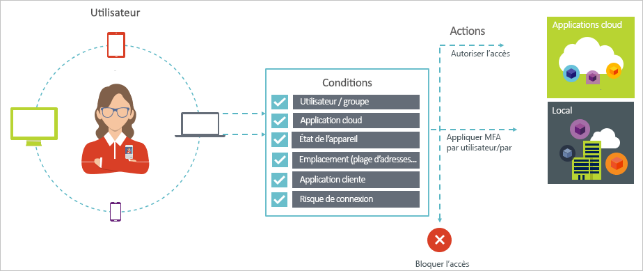

# Qu’est-ce que l’accès conditionnel ?

La sécurité est une priorité pour les organisations qui utilisent le cloud. L’un des aspects clés de la sécurité en matière de gestion des ressources du cloud est l’identité et l’accès. Dans les environnements mobiles et cloud, les utilisateurs peuvent accéder aux ressources de votre organisation en utilisant différents appareils et applications, n’importe où. Il en suffit donc plus de contrôler les personnes autorisées à accéder à une ressource. Afin de maîtriser l’équilibre entre sécurité et productivité, dans une décision du contrôle d’accès, vous devez aussi tenir compte des moyens d’accéder à une ressource. L’accès conditionnel Azure Active Directory (Azure AD) répond à ce besoin. L’accès conditionnel est une fonctionnalité d’Azure Active Directory. Avec l’accès conditionnel, vous pouvez implémenter des décisions de contrôle d’accès automatisées pour accéder à vos applications cloud qui sont basées sur des conditions.

Des stratégies d’accès conditionnel sont appliquées au terme de la première authentification à un facteur. L’accès conditionnel ne constitue donc pas une première ligne de défense dans des scénarios comme les attaques par déni de service, mais il peut utiliser des signaux émanant de ces événements (par exemple, le niveau de risque de connexion, l’emplacement de la requête, etc.) pour déterminer l’accès.  

Cet article vous fournit une vue d’ensemble conceptuelle de l’accès conditionnel dans Azure AD.

## Scénarios courants

Tout d’abord, dans un appareil où mobilité et cloud occupent le premier plan, Azure Active Directory autorise une authentification unique sur les appareils, applications et services depuis n’importe où. Avec la prolifération des appareils (y compris des appareils BYOD), des réseaux d’entreprise externes et des applications SaaS tierces, vous êtes confronté à deux objectifs contradictoires :

- Permettre aux utilisateurs d’être productifs où et quand ils le veulent
- Protéger les ressources de l’entreprise à tout moment

À l’aide de stratégies d’accès conditionnel, vous pouvez appliquer les contrôles d’accès appropriés conformes aux conditions requises. L’accès conditionnel Azure AD vous fournit une sécurité supplémentaire chaque fois que nécessaire et ne freine pas l’utilisateur dans le cas contraire.

Voici quelques problèmes d’accès courants que l’accès conditionnel peut vous aider à résoudre :

- **[Risque à la connexion](conditions.md#sign-in-risk)**  : Azure AD Identity Protection détecte les risques à la connexion. Comment limite l’accès lorsqu’un risque à la connexion détecté signale une personne malveillante ? Et si vous souhaitez obtenir une preuve supplémentaire qu’une connexion a été effectuée par un utilisateur légitime ? Que se passe-t-il si vos doutes sont suffisamment forts pour même empêcher certains utilisateurs spécifiques d’accéder à une application ?  
- **[Emplacement réseau](location-condition.md)**  : Azure AD est accessible partout. Que faire si une tentative d’accès est effectuée depuis un emplacement réseau qui n’est pas contrôlé par votre service informatique ? La combinaison du nom d’utilisateur et du mot de passe peut fournir une preuve d’identité suffisante pour les tentatives d’accès effectuées depuis votre réseau d’entreprise. Comment faire pour demander une preuve d’identité plus forte pour les tentatives d’accès initiées depuis d’autres pays ou régions du monde inattendus ? Comment faire pour bloquer les tentatives d’accès depuis certains emplacements ?  
- **[Gestion des appareils](conditions.md#device-platforms)**  : dans Azure AD, les utilisateurs peuvent accéder aux applications cloud à partir d’un large éventail d’appareils, y compris des appareils mobiles et personnels. Comment faire pour que les tentatives d’accès soient uniquement effectuées avec des appareils gérés par votre service informatique ? Comment faire pour empêcher certains types d’appareils d’accéder aux applications cloud dans votre environnement ?
- **[Application cliente](conditions.md#client-apps)**  : aujourd'hui, vous pouvez accéder à de nombreuses applications de cloud en utilisant différents types d’applications comme les applications sur le Web, les applications mobiles ou les applications de bureau. Que faire lorsqu’une tentative d’accès est effectuée avec un type d’application cliente provoquant des problèmes connus ? Comment faire pour exiger qu’un appareil géré par votre service informatique soit utilisé pour certains types d’applications ?

Ces questions et les réponses associées représentent des scénarios d’accès courants pour l’accès conditionnel Azure AD.
L’accès conditionnel est une fonctionnalité d’Azure Active Directory qui permet de gérer les scénarios d’accès en utilisant une approche basée sur des stratégies.

> [!VIDEO https://www.youtube.com/embed/eLAYBwjCGoA]

## Stratégies d’accès conditionnel

Une stratégie d’accès conditionnel est une définition d’un scénario d’accès utilisant le modèle suivant :

**Quand cela se produit** définit la raison du déclenchement de votre stratégie. Cette raison est caractérisée par un groupe de conditions qui ont été remplies. Dans l’accès conditionnel Azure AD, les conditions d’attribution jouent un rôle spécial :

- **[Utilisateurs](conditions.md#users-and-groups)**  : les utilisateurs effectuent une tentative d’accès (**Qui**).
- **[Applications cloud](conditions.md#cloud-apps-and-actions)**  : les cibles d’une tentative d’accès (**Quoi**).

Ces deux conditions sont obligatoires dans une stratégie d’accès conditionnel. Outre les deux conditions obligatoires, vous pouvez également inclure des conditions supplémentaires qui décrivent le mode d’exécution de la tentative d’accès. Par exemple, il est courant que des appareils mobiles ou des emplacements situés en dehors du réseau d’entreprise soient utilisés. Pour plus d’informations, consultez [Conditions dans l’accès conditionnel Azure Active Directory](conditions.md).

Une stratégie d’accès conditionnel combine des conditions à des contrôles d’accès.

Avec l’accès conditionnel Azure AD, vous pouvez contrôler la façon dont les utilisateurs autorisés peuvent accéder à vos applications cloud. L’objectif d’une stratégie d’accès conditionnel est d’appliquer des contrôles d’accès supplémentaires sur une tentative d’accès à une application cloud en fonction de la méthode utilisée pour cela.

Adopter une approche basée sur des stratégies pour protéger l’accès aux applications cloud vous permet de commencer à définir les critères des stratégies de votre environnement à l’aide de la structure décrite dans cet article, sans vous préoccuper de la mise en œuvre technique.

## Accès conditionnel Azure AD et authentification fédérée

Les stratégies d’accès conditionnel s’intègrent en toute transparence avec [l’authentification fédérée](../../security/azure-ad-choose-authn.md#federated-authentication). Cette prise en charge inclut tous les contrôles et conditions pris en charge, et assure une visibilité sur la manière dont la stratégie est appliquée aux connexions des utilisateurs actifs à l’aide de la [création de rapports Azure AD](../reports-monitoring/concept-sign-ins.md).

*L’authentification fédérée avec Azure AD* signifie qu’un service d’authentification approuvé gère l’authentification des utilisateurs qui se connectent à Azure AD. Un service d’authentification approuvé est, par exemple, Active Directory Federation Services (ADFS), ou tout autre service de fédération. Dans cette configuration, l’authentification de l’utilisateur principal s’effectue au niveau du service, après quoi Azure AD est utilisé pour se connecter à des applications individuelles. L’accès conditionnel Azure AD est appliqué avant d’accorder l’accès à l’application à laquelle l’utilisateur tente d’accéder. 

Lorsque la stratégie d’accès conditionnel configurée requiert l’authentification multifacteur, Azure AD utilise par défaut Azure MFA. Si vous utilisez le service de fédération pour l’authentification multifacteur, vous pouvez configurer Azure AD pour vous rediriger vers le service de fédération lorsqu’une authentification multifacteur est nécessaire en définissant `-SupportsMFA` sur `$true` dans [PowerShell](https://docs.microsoft.com/powershell/module/msonline/set-msoldomainfederationsettings). Ce paramètre fonctionne pour les services d’authentification fédérée qui prennent en charge de la demande MFA émise par Azure AD avec `wauth= http://schemas.microsoft.com/claims/multipleauthn`.

Une fois que l’utilisateur s’est connecté au service d’authentification fédérée, Azure AD gère les autres exigences de la stratégie, notamment la conformité des appareils ou une application approuvée.

## Conditions de licence :

[!INCLUDE [Active Directory P1 license](../../../includes/active-directory-p1-license.md)]

Les clients avec [des licences Microsoft 365 Business](https://docs.microsoft.com/office365/servicedescriptions/microsoft-365-business-service-description) ont également accès aux fonctionnalités d’accès conditionnel. 

## Étapes suivantes

Pour apprendre à implémenter l’accès conditionnel dans votre environnement, consultez [Planifier votre déploiement d’accès conditionnel dans Azure Active Directory](plan-conditional-access.md).
