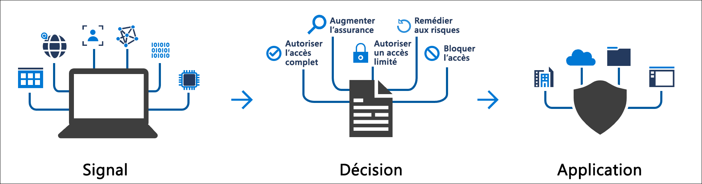
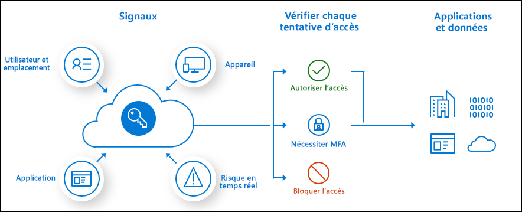

# Qu’est-ce que l’accès conditionnel ?

Le périmètre de sécurité moderne s’étend désormais au-delà du réseau d’une organisation pour inclure l’identité de l’utilisateur et de l’appareil. Les organisations peuvent utiliser ces signaux d’identité dans le cadre de leurs décisions de contrôle d’accès. 

> [!VIDEO https://channel9.msdn.com/Shows/Docs-Azure/Azure-AD-Conditional-Access/player]

L’accès conditionnel est l’outil utilisé par Azure Active Directory pour réunir des signaux, prendre des décisions et appliquer des stratégies d’organisation. L’accès conditionnel est au cœur du nouveau plan de contrôle basé sur les identités.

Les stratégies d’accès conditionnel, dans leur forme la plus simple, sont des instructions if-then : si un utilisateur souhaite accéder à une ressource, il doit effectuer une action. Exemple : Un responsable paie souhaite accéder à l’application de paie et il doit effectuer une authentification multifacteur pour y accéder.

Les administrateurs sont confrontés à deux objectifs principaux :

- Permettre aux utilisateurs d’être productifs où et quand ils le veulent
- Protéger les ressources de l’entreprise

En utilisant des stratégies d’accès conditionnel, vous pouvez appliquer les contrôles d’accès nécessaires pour garantir la sécurité de votre organisation sans pour autant freiner inutilement votre utilisateur.

> [!IMPORTANT]
> Des stratégies d'accès conditionnel sont appliquées au terme de l'authentification premier facteur. L'accès conditionnel n'est pas destiné à être la première ligne de défense d'une organisation pour des scénarios comme les attaques par déni de service (DoS), mais il peut utiliser les signaux de ces événements pour déterminer l'accès.

## Signaux courants

Les signaux courants que l’accès conditionnel peut prendre en compte lors d’une prise de décision en matière de stratégie sont notamment les suivants :

- Appartenance des utilisateurs ou appartenance à un groupe
   - Les stratégies peuvent ciblées des utilisateurs et des groupes spécifiques, ce qui donne aux administrateurs un contrôle plus précis sur l’accès.
- Informations d’emplacement IP
   - Les organisations peuvent créer des plages d’adresses IP approuvées qui peuvent être utilisées pour prendre des décisions en matière de stratégie. 
   - Les administrateurs peuvent spécifier des plages d’adresses IP de pays/régions entiers pour bloquer ou autoriser le trafic en provenance de ceux-ci.
- Appareil
   - Les utilisateurs disposant d’appareils de plateformes spécifiques ou marqués avec un état spécifique peuvent être utilisés lors de l’application de stratégies d’accès conditionnel.
- Application
   - Les utilisateurs qui tentent d’accéder à des applications spécifiques peuvent déclencher différentes stratégies d’accès conditionnel. 
- Détection des risques en temps réel et calculés
   - L’intégration de signaux à Azure AD Identity Protection permet aux stratégies d’accès conditionnel d’identifier le comportement des connexions à risque. Les stratégies peuvent ensuite forcer les utilisateurs à changer leur mot de passe ou à utiliser l’authentification multifacteur pour réduire leur niveau de risque ou pour que leur accès soit bloqué jusqu’à ce qu’un administrateur entreprenne une action manuelle.
- Microsoft Cloud App Security (MCAS)
   - Permet la supervision et le contrôle des sessions d’application et de l’accès aux applications utilisateur en temps réel, en renforçant la visibilité et le contrôle de l’accès à votre environnement cloud ainsi que des activités effectuées avec celui-ci.

## Décisions courantes

- Bloquer l’accès
   - Décision la plus restrictive
- Accorder l'accès
   - Décision la moins restrictive ; peut toujours nécessiter une ou plusieurs des options suivantes :
      - Exiger une authentification multifacteur
      - Exiger que l’appareil soit marqué comme conforme
      - Exiger un appareil joint Azure AD Hybride
      - Demander une application cliente approuvée
      - Exiger une stratégie de protection des applications (préversion)

## Stratégies couramment appliquées

De nombreuses organisations rencontrent des [problèmes d’accès courants que les stratégies d’accès conditionnel peuvent contribuer à résoudre](concept-conditional-access-policy-common.md) :

- Demande d’authentification multifacteur pour les utilisateurs disposant de rôles d’administration
- Demande d’authentification multifacteur pour les tâches de gestion Azure
- Blocage des connexions pour les utilisateurs tentant d’utiliser des protocoles d’authentification hérités
- Demande d’emplacements approuvés pour l’inscription à l’authentification multifacteur Azure AD
- Blocage ou octroi de l’accès à partir d’emplacements spécifiques
- Blocage des comportements de connexion à risque
- Demande d’appareils gérés par l’organisation pour des applications spécifiques

## Conditions de licence :

[!INCLUDE [Active Directory P1 license](../../../includes/active-directory-p1-license.md)]

Les clients avec [des licences Microsoft 365 Business Premium](/office365/servicedescriptions/microsoft-365-service-descriptions/microsoft-365-business-service-description) ont également accès aux fonctionnalités d’accès conditionnel. 

[Risque de connexion](concept-conditional-access-conditions.md#sign-in-risk) nécessite un accès à [Identity Protection](../identity-protection/overview-identity-protection.md)

## Étapes suivantes

- [Génération d’une stratégie d’accès conditionnel élément par élément](concept-conditional-access-policies.md)
- [Planification d’un déploiement d’accès conditionnel](plan-conditional-access.md)
- [En savoir plus sur Identity Protection](../identity-protection/overview-identity-protection.md)
- [En savoir plus sur Microsoft Cloud App Security](/cloud-app-security/what-is-cloud-app-security)
- [En savoir plus sur Microsoft Intune](/intune/index)
