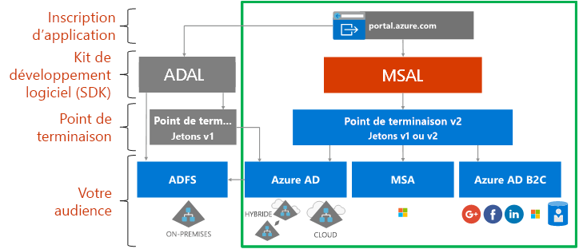

# À propos de la plateforme d’identités Microsoft

La plateforme d’identités Microsoft est une évolution de la plateforme de développeur et de service d’identité Azure Active Directory (Azure AD). Elle permet aux développeurs de générer des applications qui connectent toutes les identités Microsoft et obtiennent des jetons pour appeler Microsoft Graph, d’autres APIs Microsoft ou des API que des développeurs ont créées. C’est une plateforme complète qui se compose d’un service d’authentification, de bibliothèques open source, de fonctionnalités d’inscription et de configuration d’application (via un portail des développeurs et une API d’application), d’une documentation de développement exhaustive et d’exemples de code et autres contenus destinés aux développeurs. La plateforme d’identités Microsoft prend en charge les protocoles standard tels qu’OAuth 2.0 et OpenID Connect.

Jusqu’à présent, la plupart des développeurs utilisaient la plateforme Azure AD v1.0 pour authentifier les identités Azure AD (comptes professionnels et scolaires) en demandant des jetons du point de terminaison Azure AD v1.0, à l’aide d’Azure AD Authentication Library (ADAL), du portail Azure pour l’inscription et la configuration de l’application et de l’API Graph Azure AD pour la configuration de l’application par programmation. La plateforme Azure AD v1.0 est une offre de plateforme mature qui continuera à fonctionner pour les applications d’entreprise.

Pour développer et faire évoluer les fonctionnalités de la plateforme d’identités Microsoft, vous pouvez désormais authentifier un ensemble plus large d’identités Microsoft (identités Azure AD, comptes Microsoft tels qu’outlook.com et hotmail.com, et des comptes de réseaux sociaux et locaux via Azure AD B2C) par le biais de ce qu’on appelle le point de terminaison Azure AD v2.0. Vous allez utiliser ici la bibliothèque d’authentification Microsoft (MSAL) ou n’importe quelle bibliothèque OAuth 2.0 ou OpenID Connect open source, le portail Azure pour l’inscription et la configuration de l’application, et l’API Microsoft Graph pour la configuration de l’application par programmation. La plateforme d’identités Microsoft mise à jour (et en particulier les bibliothèques MSAL et la dernière expérience d’inscription d’application du portail Azure) a considérablement évolué au cours de l’année dernière. Pour finaliser cette version, nous encourageons les développeurs à développer et à tester leurs applications à l’aide de la dernière plateforme d’identités Microsoft.

Les applications utilisant les dernières bibliothèques ADAL et MSAL s’authentifieront de manière unique entre elles. Les applications mises à jour de la bibliothèque ADAL vers la bibliothèque MSAL conserveront l’état de connexion utilisateur. Les développeurs peuvent choisir de mettre à jour leurs applications vers la bibliothèque MSAL s’ils le souhaitent, car les applications créées avec la bibliothèque ADAL fonctionneront encore et seront toujours prises en charge.

## Expérience de la plateforme d’identités Microsoft

Le diagramme suivant illustre l’expérience d’identité Microsoft à un haut niveau, notamment l’expérience d’inscription d’application, les kits de développement logiciel (SDK), les points de terminaison et les identités prises en charge.

La plateforme d’identités Microsoft a deux points de terminaison (v1.0 et v2.0) et deux ensembles de bibliothèques de clients pour gérer ces points de terminaison. Lors du développement d’une nouvelle application, tenez compte des avantages et de l’état actuel des points de terminaison et des bibliothèques d’authentification. Tenez également compte de ces éléments :

* Plateformes prises en charge

    * [ADAL](active-directory-authentication-libraries.md) prend en charge .NET, JavaScript, iOS, Android, Java et Python
    * [Préversion de MSAL](reference-v2-libraries.md) prend en charge .NET, JavaScript, iOS et Android
    * Les deux points de terminaison prennent en charge l’intergiciel serveur .NET et Node.js pour protéger les API et la connexion. 

* La majeure partie de l’innovation, comme le consentement dynamique et le consentement incrémentiel, se trouve sur le point de terminaison v2.0 et la bibliothèque MSAL alors que nous continuons à prendre en charge v1.0 et la bibliothèque ADAL.

    Dans le portail Azure, vous deviez auparavant identifier statiquement toutes les étendues dont votre application avait besoin. Avec le point de terminaison v2.0 et les portails associés à ce point de terminaison, vous pouvez définir statiquement les étendues comme avant, ou vous pouvez les demander dynamiquement lorsque votre application a besoin de l’autorisation. Le caractère dynamique offre une fonctionnalité facultative en plus : le consentement incrémentiel. Le consentement incrémentiel vous permet de demander un sous-ensemble d’étendues dont vous avez besoin lorsqu’un utilisateur s’authentifie, puis de demander des étendues supplémentaires lorsqu’elles sont requises. 
    
    Par exemple, lorsque vous utilisez une application d’appareil photo sur un appareil mobile, l’utilisateur est invité à autoriser l’application à accéder à l’appareil photo et, uniquement lorsque l’utilisateur l’aura accepté, l’application pourra accéder à l’appareil photo et prendre une photo.  Lorsque l’application est prête à enregistrer la nouvelle photo, elle peut demander l’autorisation de lecture/écriture de photo. 

* Changements cassants possibles

    MSAL est approprié pour une utilisation dans un environnement de production. Nous fournissons la même prise en charge au niveau de la production pour MSAL que pour les bibliothèques de production actuelles. Tant que les bibliothèques sont disponibles en préversion, nous pouvons apporter, sans préavis, des modifications à l’API, au format de cache interne et à d’autres mécanismes de cette bibliothèque, que vous devrez appliquer via des améliorations de fonctionnalités ou des correctifs de bogues. Cela peut avoir un impact sur votre application. Par exemple, une modification apportée au format de cache peut avoir un impact sur vos utilisateurs, tel que leur demander de se reconnecter. Une modification de l’API peut vous obliger à mettre à jour votre code. Lorsque nous proposerons la version en disponibilité générale (GA), nous vous demanderons d’effectuer la mise à jour vers la version GA dans les six mois, car les applications écrites à l’aide de la préversion de la bibliothèque pourront ne plus fonctionner.

## Étapes suivantes

En savoir plus sur les versions v1.0 et v2.0.

* [À propos de la version v1.0](v1-overview.md)
* [À propos de la version v2.0](v2-overview.md)
