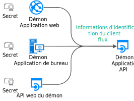
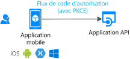

# Flux d’authentification et scénarios d’applications

Le point de terminaison de la plateforme d’identités Microsoft (v2.0) prend en charge l’authentification pour différents types d’architectures d’applications modernes. Toutes les architectures sont basées sur les protocoles standard [OAuth 2.0 et OpenID Connect](active-directory-v2-protocols.md).  Les applications se servent des [bibliothèques d’authentification](reference-v2-libraries.md) pour authentifier les identités et acquérir des jetons pour accéder aux API protégées.

Cet article décrit les différents flux d’authentification et les scénarios d’applications dans lesquels ils sont utilisés. Cet article fournit également des listes de :
- [Scénarios d’applications et flux d’authentification pris en charge](#scenarios-and-supported-authentication-flows).
- [Scénarios d’applications avec les plateformes et langages pris en charge](#scenarios-and-supported-platforms-and-languages).

## Catégories d’applications

Les jetons peuvent être obtenus à partir de plusieurs types d’applications, notamment :

- les applications web
- Applications mobiles
- Applications de bureau
- API Web

Ils peuvent également être obtenus à partir d’applications exécutées sur des appareils qui n’ont pas de navigateur ou qui s’exécutent sur IoT.

Les applications peuvent être catégorisées comme suit :

- [Ressources protégées et applications clientes](#protected-resources-vs-client-applications) : certains scénarios concernent la protection de ressources telles que des applications web ou des API web. D’autres scénarios concernent l’acquisition d’un jeton de sécurité pour appeler une API web protégée.
- [Avec utilisateurs ou sans utilisateurs](#with-users-or-without-users) : certains scénarios impliquent un utilisateur connecté, tandis que d’autres (comme les scénarios de démon) n’impliquent pas d’utilisateur.
- [Applications clientes monopages, publiques et confidentielles](#single-page-public-client-and-confidential-client-applications) : Il existe trois grandes catégories de types d’applications. Chacune est utilisée avec différents objets et bibliothèques.
- [Audience de connexion](v2-supported-account-types.md#certain-authentication-flows-dont-support-all-the-account-types) : les flux d’authentification disponibles diffèrent en fonction de l’audience de connexion. Certains flux sont disponibles uniquement pour les comptes professionnels ou scolaires. D’autres sont disponibles pour les comptes professionnels ou scolaires et pour les comptes Microsoft personnels. L’audience autorisée dépend des flux d’authentification.
- [Flux OAuth 2.0 pris en charge](#scenarios-and-supported-authentication-flows) :  les flux d’authentification sont utilisés pour implémenter les scénarios d’applications qui demandent des jetons. Il n’existe pas de mappage un-à-un entre des scénarios d’applications et des flux d’authentification.
- [Plateformes prises en charge](#scenarios-and-supported-platforms-and-languages) : Tous les scénarios d’applications ne sont pas disponibles pour toutes les plateformes.

### Ressources protégées et applications clientes

Les scénarios d’authentification impliquent deux activités :

- **Acquisition de jetons de sécurité pour une API web protégée** : Microsoft recommande d’utiliser des [bibliothèques d’authentification](reference-v2-libraries.md#microsoft-supported-client-libraries) pour acquérir des jetons, en particulier la famille de bibliothèques Microsoft MSAL (Microsoft Authentication Library).
- **Protection d’une API web ou d’une application web** : l’un des défis de la protection d’une API web ou d’une ressource d’application web consiste à valider le jeton de sécurité. Sur certaines plateformes, Microsoft propose des [bibliothèques d’intergiciels (middleware)](reference-v2-libraries.md#microsoft-supported-server-middleware-libraries).

### Avec utilisateurs ou sans utilisateurs

La plupart des scénarios d’authentification acquièrent des jetons pour le compte d’utilisateurs connectés.

Toutefois, il existe également des scénarios d’applications démon, dans lesquels les applications acquièrent des jetons pour elles-mêmes sans utilisateur.

### Applications clientes monopages, publiques et confidentielles

Les jetons de sécurité peuvent être acquis à partir de plusieurs types d’applications. On peut diviser ces applications en trois catégories :

- **Applications monopages** : Également appelées pages SPA (Single-Page Applications), il s’agit d’applications web dans lesquelles les jetons sont acquis à partir d’une application JavaScript ou TypeScript qui s’exécute dans le navigateur. De nombreuses applications modernes ont un front-end d’application monopage écrit principalement en JavaScript. L’application utilise souvent un framework comme Angular, React ou Vue. MSAL.js est la seule bibliothèque d’authentification Microsoft prenant en charge les applications monopages.

- **Applications clientes publiques** : ces applications connectent toujours des utilisateurs :
  - Applications de bureau appelant des API web au nom de l’utilisateur connecté
  - Applications mobiles
  - Applications s’exécutant sur des appareils qui n’ont pas de navigateur, comme ceux qui s’exécutent sur iOT

  Ces applications sont représentées par la classe MSAL [PublicClientApplication](msal-client-applications.md).

- **Applications clientes confidentielles** :
  - Applications web appelant des API web
  - API web appelant une API web
  - Applications démon, même implémentées en tant que service de console tel qu’un démon Linux ou un service Windows

  Ces types d’applications utilisent la classe [ConfidentialClientApplication](msal-client-applications.md).

## Scénarios d’application

Le point de terminaison de la plateforme d’identités Microsoft prend en charge l’authentification pour différents types d’architectures d’applications :

- Applications monopages
- les applications web
- API Web
- Applications mobiles
- Applications natives
- Applications démon
- Applications côté serveur

Les applications utilisent les différents flux d’authentification pour connecter les utilisateurs et obtenir des jetons pour appeler des API protégées.

### Une application monopage

De nombreuses applications web modernes sont créées en tant qu’applications monopages côté client et écrites avec JavaScript ou un framework SPA comme Angular, Vue.js et React.js. Ces applications s’exécutent dans un navigateur web. Leurs caractéristiques d’authentification diffèrent de celles des applications web traditionnelles côté serveur. Avec la plateforme d’identités Microsoft, les applications monopages peuvent connecter des utilisateurs et obtenir des jetons pour accéder à des services back-end ou à des API web.

Pour plus d’informations, consultez [Applications monopages](scenario-spa-overview.md).

### Une application web qui connecte un utilisateur

Pour protéger une application web qui connecte un utilisateur :

- Si vous développez en .NET, vous utilisez ASP.NET ou ASP.NET Core avec le middleware Open ID Connect ASP.NET. La protection d’une ressource implique la validation du jeton de sécurité, qui est effectuée par la bibliothèque d’[extensions IdentityModel pour .NET](https://github.com/AzureAD/azure-activedirectory-identitymodel-extensions-for-dotnet/wiki) et non par les bibliothèques MSAL.

- Si vous développez en Node.js, vous utilisez Passport.js.

Pour plus d’informations, consultez [Application web qui connecte les utilisateurs](scenario-web-app-sign-user-overview.md).

### Une application web qui connecte un utilisateur et appelle une API web pour le compte de l’utilisateur

Pour appeler une API web à partir d’une application web pour le compte d’un utilisateur, utilisez la classe MSAL **ConfidentialClientApplication**. Vous utilisez le flux de code d’autorisation et stockez le jeton acquis dans le cache de jetons. Le cas échéant, MSAL actualise les jetons et le contrôleur acquiert en mode silencieux des jetons à partir du cache.

Pour plus d’informations, consultez [Application web qui appelle des API web](scenario-web-app-call-api-overview.md).

### Une application de bureau appelant une API web pour le compte d’un utilisateur connecté

Pour qu’une application de bureau puisse appeler une API web qui connecte des utilisateurs, utilisez les méthodes d’acquisition de jetons interactives de la classe MSAL **PublicClientApplication**. Avec ces méthodes interactives, vous pouvez contrôler l’expérience de l’interface utilisateur de connexion. MSAL utilise un navigateur web pour cette interaction.

Il existe une autre possibilité pour les applications hébergées sur Windows qui s’exécutent sur des ordinateurs joints à un domaine Windows ou à Azure Active Directory (Azure AD). Ces applications peuvent acquérir un jeton en mode silencieux à l’aide de l’[authentification Windows intégrée](https://aka.ms/msal-net-iwa).

Les applications qui s’exécutent sur un appareil sans navigateur peuvent toujours appeler une API pour le compte d’un utilisateur. Pour s’authentifier, l’utilisateur doit se connecter sur un autre appareil doté d’un navigateur web. Ce scénario nécessite que vous utilisiez le [flux de code d’appareil](https://aka.ms/msal-net-device-code-flow).

Bien que nous ne recommandions pas son utilisation, le [flux Nom d’utilisateur/Mot de passe](https://aka.ms/msal-net-up) est disponible dans les applications clientes publiques. Ce flux est toujours nécessaire dans certains scénarios comme DevOps.

Toutefois, l’utilisation de ce flux impose des contraintes sur vos applications. Par exemple, les applications utilisant ce flux ne peuvent pas connecter un utilisateur qui doit effectuer une authentification multifacteur ou un accès conditionnel. Vos applications ne bénéficient pas non plus de l’authentification unique.

L’authentification avec le flux Nom d’utilisateur/Mot de passe va à l’encontre des principes de l’authentification moderne et n’est fournie que pour des raisons d’héritage.

Dans les applications de bureau, si vous souhaitez que le cache de jetons soit persistant, vous devez [personnaliser la sérialisation du cache de jetons](https://aka.ms/msal-net-token-cache-serialization). En implémentant une [double sérialisation du cache de jetons](https://aka.ms/msal-net-dual-cache-serialization), vous pouvez activer des caches de jetons offrant une compatibilité descendante et ascendante avec des générations précédentes de bibliothèques d’authentification. Les bibliothèques spécifiques incluent Azure AD Authentication Library pour .NET (ADAL.NET) version 3 et version 4.

Pour plus d’informations, consultez [Application de bureau qui appelle des API web](scenario-desktop-overview.md).

### Application mobile appelant une API web pour le compte d’un utilisateur interactif

Comme une application de bureau, une application mobile appelle les méthodes d’acquisition de jeton interactives de la classe MSAL **PublicClientApplication** afin d’acquérir un jeton pour appeler une API web.

MSAL iOS et MSAL Android utilisent le navigateur web du système par défaut. Toutefois, vous pouvez leur donner pour instruction d’utiliser l’affichage web incorporé à la place. Il existe des spécificités qui dépendent de la plateforme mobile : Plateforme Windows universelle (UWP), iOS ou Android.

Certains scénarios, comme ceux qui impliquent un accès conditionnel lié à l’ID d’appareil ou à l’inscription de l’appareil, nécessitent l’installation d’un [répartiteur](https://github.com/AzureAD/azure-activedirectory-library-for-dotnet/wiki/leveraging-brokers-on-Android-and-iOS) sur l’appareil. Le portail d’entreprise Microsoft sur Android et Microsoft Authenticator sur Android et iOS sont des exemples de répartiteurs. En outre, MSAL peut désormais interagir avec les répartiteurs.

> [!NOTE]
> Vous pouvez appliquer des stratégies de protection des applications à votre application mobile qui utilise MSAL.iOS, MSAL.Android ou MSAL.NET sur Xamarin. Par exemple, les stratégies peuvent empêcher un utilisateur de copier du texte protégé. L’application mobile est [gérée par Intune](https://docs.microsoft.com/intune/app-sdk) et reconnue par Intune en tant qu’application gérée. Le [SDK d’application Intune](https://docs.microsoft.com/intune/app-sdk-get-started) est distinct des bibliothèques MSAL et interagit avec Azure AD de façon autonome.

Pour plus d’informations, consultez [Application mobile qui appelle des API web](scenario-mobile-overview.md).

### Une API web protégée

Vous pouvez utiliser le point de terminaison de la plateforme d’identités Microsoft pour sécuriser des services web, comme l’API web RESTful de votre application. Une API web protégée est appelée avec un jeton d’accès pour sécuriser les données de l’API et authentifier les requêtes entrantes. L’appelant d’une API web ajoute un jeton d’accès dans l’en-tête d’autorisation d’une requête HTTP.

Si vous souhaitez protéger votre API web ASP.NET ou ASP.NET Core, vous devez valider le jeton d’accès. Pour cette validation, vous utilisez le middleware JWT ASP.NET. La validation est effectuée par la bibliothèque d’[extensions IdentityModel pour .NET](https://github.com/AzureAD/azure-activedirectory-identitymodel-extensions-for-dotnet/wiki), non par MSAL.NET.

Pour plus d’informations, consultez [API web protégée](scenario-protected-web-api-overview.md).

### Une API web appelant une autre API web pour le compte d’un utilisateur

Pour que votre API web protégée ASP.NET ou ASP.NET Core puisse appeler une autre API web pour le compte d’un utilisateur, votre application doit acquérir un jeton pour l’API web en aval. Pour ce faire, elle doit appeler la méthode [AcquireTokenOnBehalfOf](https://aka.ms/msal-net-on-behalf-of) de la classe **ConfidentialClientApplication**. Ces appels portent également le nom d’appels de service à service. Les API web qui appellent d’autres API web doivent fournir une sérialisation de cache personnalisée.

  

Pour plus d’informations, consultez [API web qui appelle des API web](scenario-web-api-call-api-overview.md).

### Une application démon appelant une API web dans le nom du démon

Les applications qui contiennent des processus de longue durée ou qui fonctionnent sans interaction utilisateur doivent également disposer d’un moyen d’accès aux API web sécurisées. Ces applications peuvent s’authentifier et obtenir des jetons à l’aide de l’identité d’application plutôt qu’avec l’identité déléguée d’un utilisateur. L’application prouve son identité à l’aide d’un certificat ou d’une clé secrète client.

Vous pouvez écrire de telles applications démon qui acquièrent un jeton pour l’application appelante en utilisant les méthodes d’acquisition d’[informations d’identification du client](https://aka.ms/msal-net-client-credentials) de la classe MSAL **ConfidentialClientApplication**. Ces méthodes nécessitent que l’application appelante ait inscrit un secret auprès d’Azure AD. L’application partage ensuite le secret avec le démon appelé. Parmi ces secrets, citons par exemple les mots de passe d’application, l’assertion de certificat ou l’assertion du client.

Pour plus d’informations, consultez [Application démon qui appelle des API web](scenario-daemon-overview.md).

## Scénarios et flux d’authentification pris en charge

Les scénarios qui impliquent l’acquisition de jetons mappent également à des flux d’authentification OAuth 2.0, comme détaillé dans [Protocoles de la plateforme d’identités Microsoft](active-directory-v2-protocols.md).

<table>
 <thead>
  <tr><th>Scénario</th> <th>Procédure pas à pas de scénario</th> <th>Flux et octroi OAuth 2.0</th> <th>Public visé</th></tr>
 </thead>
 <tbody>
  <tr>
   <td></td>
   <td><a href="scenario-spa-overview.md">Application à page unique</a></td>
   <td><a href="v2-oauth2-implicit-grant-flow.md">Implicite</a></td>
   <td>Comptes professionnels ou scolaires, comptes personnels et Microsoft Azure Active Directory B2C (Azure AD B2C)</td>
 </tr>

  <tr>
   <td></td>
   <td><a href="scenario-web-app-sign-user-overview.md">Une application web qui connecte des utilisateurs</a></td>
   <td><a href="v2-oauth2-auth-code-flow.md">Code d’autorisation</a></td>
   <td>Comptes professionnels ou scolaires, comptes personnels et Azure AD B2C</td>
 </tr>

  <tr>
   <td></td>
   <td><a href="scenario-web-app-call-api-overview.md">Une application web qui appelle des API web</a></td>
   <td><a href="v2-oauth2-auth-code-flow.md">Code d’autorisation</a></td>
   <td>Comptes professionnels ou scolaires, comptes personnels et Azure AD B2C</td>
 </tr>

  <tr>
   <td rowspan="3"></td>
   <td rowspan="4"><a href="scenario-desktop-overview.md">Une application de bureau qui appelle des API web</a></td>
   <td>Interactif à l’aide de <a href="v2-oauth2-auth-code-flow.md">Code d’autorisation</a> avec PKCE</td>
   <td>Comptes professionnels ou scolaires, comptes personnels et Azure AD B2C</td>
 </tr>

  <tr>
   <td>Authentification Windows intégrée</td>
   <td>Comptes professionnels ou scolaires</td>
 </tr>

  <tr>
   <td><a href="v2-oauth-ropc.md">Mot de passe de propriétaire de la ressource</a></td>
   <td>Comptes professionnels ou scolaires et Azure AD B2C</td>
 </tr>

  <tr>
   <td></td>
   <td><a href="v2-oauth2-device-code.md">Code d’appareil</a></td>
   <td>Comptes professionnels ou scolaires</td>
 </tr>

 <tr>
   <td rowspan="2"></td>
   <td rowspan="2"><a href="scenario-mobile-overview.md">Une application mobile qui appelle des API web</a></td>
   <td>Interactif à l’aide de <a href="v2-oauth2-auth-code-flow.md">Code d’autorisation</a> avec PKCE</td>
   <td>Comptes professionnels ou scolaires, comptes personnels et Azure AD B2C</td>
 </tr>

  <tr>
   <td><a href="v2-oauth-ropc.md">Mot de passe de propriétaire de la ressource</a></td>
   <td>Comptes professionnels ou scolaires et Azure AD B2C</td>
 </tr>

  <tr>
   <td></td>
   <td><a href="scenario-daemon-overview.md">Une application démon qui appelle des API web</a></td>
   <td><a href="v2-oauth2-client-creds-grant-flow.md">Informations d’identification du client</a></td>
   <td>Autorisations d’application uniquement sans utilisateur et utilisées uniquement dans les organisations Azure AD</td>
 </tr>

  <tr>
   <td></td>
   <td><a href="scenario-web-api-call-api-overview.md">Une API web qui appelle des API web</a></td>
   <td><a href="v2-oauth2-on-behalf-of-flow.md">Au nom de</a></td>
   <td>Comptes professionnels ou scolaires et comptes personnels</td>
 </tr>

 </tbody>
</table>

## Scénarios avec les plateformes et langages pris en charge

Les bibliothèques d’authentification Microsoft prennent en charge plusieurs plateformes :

- JavaScript
- .NET Framework
- .NET Core
- Windows 10/UWP
- Xamarin.iOS
- Xamarin.Android
- iOS natif
- macOS
- Android natif
- Java
- Python

Vous pouvez également utiliser différents langages pour générer vos applications. Notez que certains types d’applications ne sont pas disponibles sur toutes les plateformes.

Dans la colonne Windows du tableau suivant, chaque fois que .NET Core est mentionné, .NET Framework est également possible. Ce dernier est omis pour éviter d’encombrer la table.

|Scénario  | Windows | Linux | Mac | iOS | Android
|--|--|--|--|--|--|--|
| [Application à page unique](scenario-spa-overview.md)   |  MSAL.js |  MSAL.js |  MSAL.js |  MSAL.js |  MSAL.js
| [Application web qui connecte les utilisateurs](scenario-web-app-sign-user-overview.md)   |  ASP.NET Core |  ASP.NET Core |  ASP.NET Core
| [Application web qui appelle des API web](scenario-web-app-call-api-overview.md)     |  ASP.NET Core + MSAL.NET   MSAL Java  Flask + MSAL Python|  ASP.NET Core + MSAL.NET  MSAL Java  Flask + MSAL Python|  ASP.NET Core + MSAL.NET  MSAL Java   Flask + MSAL Python
| [Application de bureau qui appelle des API web](scenario-desktop-overview.md)      | MSAL.NET  MSAL Java   MSAL Python| MSAL.NET  MSAL Java  MSAL Python| MSAL.NET  MSAL Java  MSAL Python    MSAL.objc |
| [Application mobile qui appelle des API web](scenario-mobile-overview.md)    |  MSAL.NET  MSAL.NET | | |  MSAL.objc |  MSAL.Android
| [Application démon](scenario-daemon-overview.md)    | MSAL.NET  MSAL Java  MSAL Python|  MSAL.NET  MSAL Java  MSAL Python| MSAL.NET  MSAL Java  MSAL Python
| [API web qui appelle des API web](scenario-web-api-call-api-overview.md)     |  ASP.NET Core + MSAL.NET  MSAL Java  MSAL Python|  ASP.NET Core + MSAL.NET  MSAL Java  MSAL Python|  ASP.NET Core + MSAL.NET  MSAL Java  MSAL Python

Consultez également [Bibliothèques prises en charge par Microsoft selon le système d’exploitation/language](reference-v2-libraries.md#microsoft-supported-libraries-by-os--language).

## Étapes suivantes
Apprenez-en davantage sur les [notions de base de l’authentification](authentication-scenarios.md) et les [jetons d’accès](access-tokens.md).
