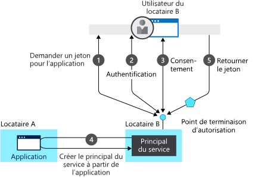

# Principes fondamentaux de l’authentification

## Présentation de l’authentification

Cet article aborde la plupart des concepts d’authentification que vous devez comprendre pour créer des applications web protégées, des API web ou des applications appelant des API web protégées. Si vous voyez un terme que vous ne connaissez pas, consultez notre [glossaire](developer-glossary.md) ou nos [Vidéos sur la plateforme d’identités Microsoft](identity-videos.md), qui couvrent les concepts de base.

L’**authentification** est le processus visant à prouver que vous êtes bien qui vous prétendez être. On abrège parfois l’authentification de cette manière : AuthN.

L’**autorisation** correspond à l’action d’accorder à une partie authentifiée le droit de faire quelque chose. Elle détermine les données auxquelles vous pouvez accéder, et ce que vous pouvez faire de ces données. On abrège parfois l’autorisation de cette manière : AuthZ.

Au lieu de créer des applications gérant chacune leurs propres informations de nom d’utilisateur et de mot de passe (ce qui entraîne une charge administrative importante lorsque vous devez ajouter ou supprimer des utilisateurs sur plusieurs applications), les applications peuvent déléguer cette responsabilité à un fournisseur d’identité centralisée.

Azure Active Directory (Azure AD) est un fournisseur d’identité centralisée, présent dans le cloud. La délégation de l’authentification et de l’autorisation à ce service permet des scénarios, tels que des stratégies d’accès conditionnel nécessitant la présence d’un utilisateur dans un lieu spécifique, l’utilisation de l’authentification multifacteur, ainsi que la possibilité pour l’utilisateur de se connecter une seule fois et d’être ensuite connecté automatiquement à toutes les applications web qui partagent le même annuaire centralisé. Cette fonctionnalité s’appelle l’authentification unique (SSO).

Un fournisseur d’identité centralisée est encore plus important pour les applications dont les utilisateurs se trouvant dans le monde entier ne se connectent nécessairement depuis le réseau de l’entreprise. Azure AD authentifie les utilisateurs et fournit des jetons d’accès. Un [jeton d’accès](https://docs.microsoft.com/azure/active-directory/develop/developer-glossary#access-token) est un jeton de sécurité émis par un serveur d’autorisation. Il contient des informations sur l’utilisateur et l’application pour lesquels le jeton est destiné, ce qui peut servir pour accéder aux API web et à d’autres ressources protégées.

La plateforme d’identités Microsoft simplifie l’authentification pour les développeurs d’application en fournissant l’identité en tant que service, avec la prise en charge des protocoles standard tels que [OAuth 2.0](https://oauth.net/2/) et [OpenID Connect](https://openid.net/connect/), ainsi que des bibliothèques open source pour différentes plateformes afin de vous permettre de commencer à coder rapidement. Elle permet aux développeurs de générer des applications qui connectent toutes les identités Microsoft et obtiennent des jetons pour appeler [Microsoft Graph](https://developer.microsoft.com/graph/), d’autres API Microsoft ou des API que des développeurs ont créées. Pour plus d’informations, consultez [Évolution de la plateforme d’identités Microsoft](about-microsoft-identity-platform.md).

### Locataires

Un fournisseur d’identité cloud est utilisé par de nombreuses organisations. Afin de séparer les utilisateurs de différentes organisations, Azure AD est partitionné en locataires, à raison d’un locataire par organisation.

Les locataires assurent le suivi des utilisateurs et de leurs applications associées. La plateforme d’identités Microsoft prend également en charge les utilisateurs qui se connectent avec des comptes Microsoft personnels.

Azure AD fournit également Azure Active Directory B2C, afin que les organisations puissent connecter des utilisateurs, généralement des clients, à l’aide d’identités sociales telles qu’un compte Google. Pour plus d’informations, consultez la [Documentation Azure Active Directory B2C](https://docs.microsoft.com/azure/active-directory-b2c).

### Jetons de sécurité

Les jetons de sécurité contiennent des informations sur les utilisateurs et les applications. Azure AD utilise des jetons JSON (jetons JWT) qui comportent des revendications.

Une revendication fournit des assertions sur une entité (telle qu’une [application cliente](https://docs.microsoft.com/azure/active-directory/develop/developer-glossary#client-application) ou un [propriétaire de ressources](https://docs.microsoft.com/azure/active-directory/develop/developer-glossary#resource-owner)) à une autre entité, telle que le [serveur de ressources](https://docs.microsoft.com/azure/active-directory/develop/developer-glossary#resource-server).

Les revendications sont des paires nom/valeur qui relaient des faits sur le sujet du jeton. Par exemple, une revendication peut contenir des faits sur le principal de sécurité authentifié par le [serveur d’autorisation](https://docs.microsoft.com/azure/active-directory/develop/developer-glossary#authorization-server). Les revendications présentes dans un jeton donné dépendent de plusieurs variables, notamment le type de jeton, le type d’informations d’identification utilisées pour authentifier le sujet, la configuration de l’application et ainsi de suite.

Les applications peuvent utiliser des revendications pour diverses tâches, par exemple :

* Validation du jeton
* Identification du locataire du sujet du jeton
* Affichage d’informations utilisateur
* Détermination de l’autorisation du sujet

Une revendication se compose de paires clé-valeur qui communiquent des informations, telles que les :

* serveur de jetons de sécurité qui a généré le jeton ;
* date à laquelle le jeton a été généré ;
* sujet (tel que l’utilisateur, à l’exception des démons) ;
* audience, qui est l’application pour laquelle le jeton a été généré ;
* application (le client) qui a demandé le jeton. Dans le cas d’applications web, il peut s’agir de l’audience.

Pour obtenir des informations plus détaillées sur les revendications, consultez les rubriques relatives aux [jetons d’accès](access-tokens.md) et aux [jetons d’ID](id-tokens.md).

La validation du jeton revient à l’application pour laquelle le jeton a été généré, à l’application web qui a connecté l’utilisateur ou à l’API web appelée. Le jeton est signé par le service d’émission de jeton de sécurité (STS) avec une clé privée. Le STS publie la clé publique correspondante. Pour valider un jeton, l’application vérifie la signature à l’aide de la clé publique STS et confirme ainsi que la signature a été créée au moyen de la clé privée.

Les jetons ne sont valides que pour une durée limitée. En règle générale, le STS fournit une paire de jetons : un jeton d’accès pour accéder à l’application ou à la ressource protégée, et un jeton d’actualisation utilisé pour actualiser le jeton d’accès lorsque celui-ci est proche de l’expiration.

Les jetons d’accès sont passés à une API web en tant que jeton du porteur dans l’en-tête `Authorization`. Une application peut fournir un jeton d’actualisation au STS et, si l’accès de l’utilisateur à l’application n’a pas été révoqué, un nouveau jeton d’accès et un nouveau jeton d’actualisation sont obtenus en retour. C’est de cette façon que le scénario d’une personne quittant l’entreprise est géré. Lorsque le STS reçoit le jeton d’actualisation, il n’émet pas d’autre jeton d’accès valide si l’utilisateur n’est plus autorisé.

### Comment chaque flux émet des jetons et des codes

Selon la façon dont votre client est créé, il peut utiliser un ou plusieurs des flux d’authentification pris en charge par Azure AD. Ces flux peuvent produire divers jetons (id_tokens, jetons d’actualisation, jetons d’accès) ainsi que des codes d’autorisation, et ils nécessitent des jetons différents pour les faire fonctionner. Ce graphique offre une vue d’ensemble :

|Flux | Nécessite | id_token | access token | jeton d'actualisation | code d’autorisation | 
|-----|----------|----------|--------------|---------------|--------------------|
|[Flux du code d’autorisation](v2-oauth2-auth-code-flow.md) | | x | x | x | x|  
|[Flux implicite](v2-oauth2-implicit-grant-flow.md) | | x        | x    |      |                    |
|[Circuit OIDC hybride](v2-protocols-oidc.md#get-access-tokens)| | x  | |          |            x   |
|[Échange de jetons d’actualisation](v2-oauth2-auth-code-flow.md#refresh-the-access-token) | jeton d'actualisation | x | x | x| |
|[Flux On-Behalf-Of](v2-oauth2-on-behalf-of-flow.md) | access token| x| x| x| |
|[Informations d’identification du client](v2-oauth2-client-creds-grant-flow.md) | | | x (application uniquement)| | |

Les jetons émis via le mode implicite ont une longueur maximale du fait qu’ils sont renvoyés au navigateur via l’URL (où `response_mode` est `query` ou `fragment`).  Certains navigateurs limitent la taille de l’URL qui peut être placée dans la barre d’adresse et refusent les URL trop longues.  Par conséquent, ces jetons n’ont pas de revendications `groups` ou `wids`. 

Maintenant que vous avez une vue d’ensemble des principes fondamentaux, poursuivez votre lecture pour comprendre le modèle d’application et l’API relatifs à l’identité, découvrez comment fonctionne le provisionnement dans Azure AD et consultez les liens permettant d’obtenir des informations détaillées sur les scénarios courants pris en charge par Azure AD.

## Modèle d'application

Les applications peuvent connecter les utilisateurs elles-mêmes, ou déléguer la connexion à un fournisseur d’identité. Découvrez plus en détail les scénarios de connexion pris en charge par Azure AD en consultant [Flux d’authentification et scénarios d’application](authentication-flows-app-scenarios.md).

Pour qu’un fournisseur d’identité sache qu’un utilisateur a accès à une application particulière, l’utilisateur et l’application doivent tous les deux être inscrits auprès du fournisseur d’identité. Lorsque vous inscrivez votre application auprès d’Azure AD, vous fournissez une configuration d’identité pour votre application, ce qui lui permet de s’intégrer à Azure AD. L’inscription de l’application vous permet également d’effectuer les opérations suivantes :

* Personnaliser la boîte de dialogue de connexion avec la marque de votre application. C’est important, car il s’agit de la première expérience de l’utilisateur avec votre application.
* Décider si vous souhaitez laisser les utilisateurs se connecter uniquement s’ils appartiennent à votre organisation. Il s’agit d’une application monolocataire. Ou autoriser les utilisateurs à se connecter avec un compte professionnel ou scolaire. C’est alors une application multilocataire. Vous pouvez également autoriser les comptes Microsoft personnels, ou un compte social depuis LinkedIn, Google, etc.
* Demandez des autorisations d’étendue. Par exemple, vous pouvez demander l’étendue « user.read », qui accorde l’autorisation de lire le profil de l’utilisateur connecté.
* Préciser les étendues qui définissent l’accès à votre API web. En général, lorsqu’une application souhaite accéder à votre API, elle doit demander des autorisations pour les étendues que vous définissez.
* Partager un secret avec Azure AD qui prouve l’identité de l’application à Azure AD.  Cette action est pertinente dans le cas où l’application est une application cliente confidentielle. Une application cliente confidentielle est une application qui peut conserver les informations d’identification en toute sécurité. Un serveur back-end approuvé pour stocker les informations d’identification.

Une fois inscrite, l’application reçoit un identificateur unique qu’elle partage avec Azure AD lorsqu’elle demande des jetons. Si l’application est une [application cliente confidentielle](https://docs.microsoft.com/azure/active-directory/develop/developer-glossary#client-application), elle partage également le secret ou la clé publique*, selon que des certificats ou des secrets ont été utilisés.

La plateforme d’identités Microsoft représente des applications utilisant un modèle qui remplit deux fonctions principales :

* Identifier l’application par les protocoles d’authentification qu’elle prend en charge
* Fournir tous les identificateurs, URL, secrets et informations connexes nécessaires à l’authentification

La plateforme d’identités Microsoft :

* contient toutes les données nécessaires lors de l’authentification, au moment de l’exécution ;
* contient toutes les données permettant de déterminer les ressources auxquelles une application peut devoir accéder et les circonstances dans lesquelles une requête donnée doit être satisfaite ;
* fournit l’infrastructure pour implémenter l’approvisionnement de l’application au sein du locataire de son développeur et de tout autre locataire Azure AD.
* Gérer le consentement de l’utilisateur au moment de la demande de jeton et faciliter l’approvisionnement dynamique des applications entre les locataires

Le consentement est un processus par lequel un propriétaire de ressources octroie à une application cliente l’accès à des ressources protégées, avec des autorisations spécifiques, en son nom. La plateforme d’identités Microsoft :

* Il permet aux utilisateurs et administrateurs d’accorder ou de refuser dynamiquement le consentement lorsque l’application souhaite accéder aux ressources en leur nom.
* Il permet aux administrateurs d’avoir la décision finale sur les applications qu’ils sont autorisées à fonctionner, les utilisateurs qui peuvent utiliser des applications spécifiques et la manière dont les ressources de répertoire sont consultées.

Dans la plateforme d’identités Microsoft, un [objet d’application](https://docs.microsoft.com/azure/active-directory/develop/developer-glossary#application-object) décrit une application. Au moment du déploiement, la plateforme d’identités Microsoft utilise l’objet d’application en tant que blueprint pour créer un [principal de service](https://docs.microsoft.com/azure/active-directory/develop/developer-glossary#service-principal-object). Ce dernier représente une instance concrète d’une application dans un annuaire ou un locataire. Le principal de service définit les actions réelles d’une application dans un répertoire cible spécifique, les utilisateurs qui peuvent s’en servir, les ressources auxquelles elle a accès, etc. La plateforme d’identités Microsoft crée un principal de service à partir d’un objet d’application, via le **consentement**.

Le diagramme suivant illustre un flux de provisionnement simplifié piloté par consentement dans la plateforme d’identités Microsoft. Il montre deux locataires : A et B. Le locataire A possède l’application. Le locataire B instancie l’application via un principal de service.  

Dans ce flux d’approvisionnement :

1. Un utilisateur du locataire B tente de se connecter avec l’application, le point de terminaison d’autorisation demande un jeton pour l’application.
1. Les informations d’identification de l’utilisateur sont acquises et vérifiées à des fins d’authentification.
1. L’utilisateur est invité à donner son consentement pour que l’application accède au locataire B.
1. La plateforme d’identités Microsoft utilise l’objet d’application dans le locataire A en tant que blueprint pour créer un principal de service dans le locataire B.
1. L’utilisateur reçoit le jeton demandé.

Vous pouvez répéter ce processus pour d’autres locataires. Le locataire A conserve le blueprint pour l’application (objet d’application). Les utilisateurs et les administrateurs de tous les autres locataires où l’application a obtenu le consentement gardent le contrôle sur les actions de l’application par le biais de l’objet du principal de service correspondant dans chaque locataire. Pour plus d’informations, consultez [Objets d’application et de principal de service dans la plateforme d’identités Microsoft](app-objects-and-service-principals.md).

## Flux de connexion à application web avec Azure AD

Quand un utilisateur accède par l’intermédiaire du navigateur à une application web, voici ce qui se produit :

* L’application web détermine si l’utilisateur est authentifié.
* Si l’utilisateur ne l’est pas, l’application web délègue à Azure AD la connexion de l’utilisateur. Cette connexion doit être conforme à la stratégie de l’organisation, ce qui peut signifier demander à l’utilisateur d’entrer ses informations d’identification, utiliser l’authentification multifacteur, ou n’utiliser aucun mot de passe (en se servant de Windows Hello, par exemple).
* L’utilisateur est invité à donner son consentement pour l’accès dont l’application cliente a besoin. C’est la raison pour laquelle les applications clientes doivent être inscrites auprès d’Azure AD, afin que ce service puisse remettre des jetons représentant l’accès auquel l’utilisateur a consenti.

Lorsque l’utilisateur est bien authentifié :

* Azure AD envoie un jeton à l’application web.
* Un cookie est enregistré, associé au domaine d’Azure AD ; il contient l’identité de l’utilisateur dans l’emplacement du navigateur réservé aux cookies. La prochaine fois qu’une application utilisera le navigateur pour accéder au point de terminaison de l’autorisation Azure AD, le navigateur présentera le cookie afin que l’utilisateur n’ait pas à se reconnecter. C’est également de cette façon que l’authentification unique est effectuée. Le cookie est généré par Azure AD et ne peut être compris que par Azure AD.
* L’application web valide ensuite le jeton. Si la validation réussit, l’application web affiche la page protégée et enregistre un cookie de session dans l’emplacement du navigateur réservé aux cookies. Lorsque l’utilisateur accède à une autre page, l’application web sait que l’utilisateur est authentifié conformément au cookie de session.

Le schéma de séquence suivant résume cette interaction :

### Comment une application web détermine si l’utilisateur est authentifié

Les développeurs d’applications web peuvent indiquer si toutes les pages, ou uniquement certaines d’entre elles, nécessitent une authentification. Par exemple, dans ASP.NET/ASP.NET Core, cette opération s’effectue en ajoutant l’attribut `[Authorize]` aux actions du contrôleur. 

Cet attribut force ASP.NET à vérifier la présence d’un cookie de session contenant l’identité de l’utilisateur. Si aucun cookie n’est présent, ASP.NET redirige l’authentification vers le fournisseur d’identité spécifié. Si le fournisseur d’identité est Azure AD, l’application web redirige l’authentification vers `https://login.microsoftonline.com`, qui affiche une boîte de dialogue de connexion.

### Comment une application web délègue la connexion à Azure AD et obtient un jeton

L’authentification de l’utilisateur s’effectue via le navigateur. Le protocole OpenID utilise des messages de protocole HTTP standard.
* L’application web envoie un état HTTP 302 (redirection) au navigateur pour utiliser Azure AD.
* Lorsque l’utilisateur est authentifié, Azure AD envoie le jeton à l’application web en utilisant une redirection via le navigateur.
* La redirection est fournie par l’application web sous la forme d’un URI de redirection. Cet URI de redirection est inscrit auprès de l’objet d’application Azure AD. Il peut y avoir plusieurs URI de redirection, car l’application peut être déployée sur plusieurs URL. Par conséquent, l’application web doit également spécifier l’URI de redirection à utiliser.
* Azure AD vérifie que l’URI de redirection envoyé par l’application web est l’un des URI de redirection inscrits pour l’application.

## Flux de connexion d’application mobile et de bureau avec Azure AD

Le flux décrit ci-dessus s’applique, avec de légères différences, aux applications mobiles et de bureau.

Les applications mobiles et de bureau peuvent utiliser un contrôle web incorporé, ou un navigateur système, pour l’authentification. Le diagramme suivant montre comment une application mobile ou de bureau utilise la bibliothèque d’authentification Microsoft (MSAL) pour acquérir des jetons d’accès et appeler des API web.

MSAL utilise un navigateur pour obtenir des jetons. Comme avec des applications web, l’authentification est déléguée à Azure AD.

Étant donné qu’Azure AD enregistre le même cookie d’identité dans le navigateur que pour les applications web, si l’application native ou mobile utilise le navigateur système, l’authentification unique est immédiatement obtenue avec l’application web correspondante.

Par défaut, MSAL utilise le navigateur du système. Les applications de bureau .NET Framework font exception, car elles utilisent un contrôle incorporé est utilisé pour offrir une expérience utilisateur plus intégrée.

## Étapes suivantes

* Pour vous familiariser avec les termes courants, consultez le [Glossaire du développeur de la plateforme d’identités Microsoft](developer-glossary.md).
* Découvrez-en plus sur les autres scénarios d’authentification des utilisateurs pris en charge par la plateforme d’identités Microsoft en consultant [Flux d’authentification et scénarios d’application](authentication-flows-app-scenarios.md).
* Consultez [Bibliothèques MSAL](msal-overview.md) pour en apprendre davantage sur les bibliothèques Microsoft qui vous aident à développer des applications fonctionnant avec des comptes Microsoft, des comptes Azure AD et des utilisateurs Azure AD B2C, tous réunis dans un modèle de programmation rationalisé.
* Consultez [Intégrer App Service à la plateforme d’identités Microsoft](/azure/app-service/configure-authentication-provider-aad) afin de savoir comment configurer l’authentification pour votre application App Service.
