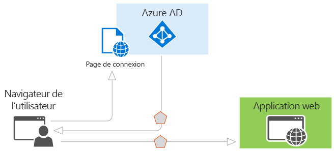
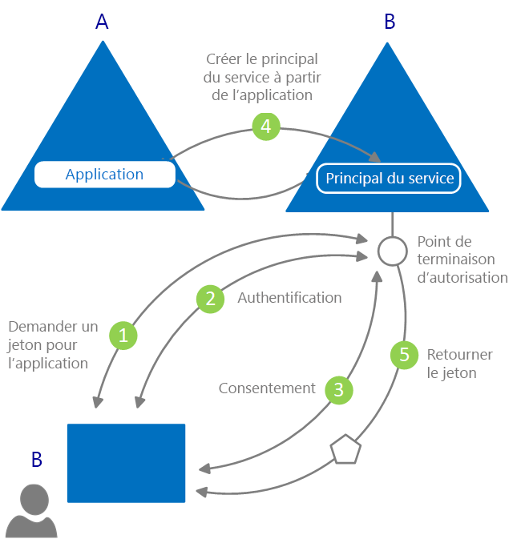

# Qu’est-ce que l’authentification ?

L’*authentification* correspond à l’action de demander des informations d’identification légitimes à une partie, fournissant la base de la création d’un principal de sécurité à des fins de contrôle de l’identité et de l’accès. En d’autres termes, c’est le processus visant à prouver que vous êtes bien qui vous prétendez être. On abrège parfois l’authentification de cette manière : AuthN.

L’*autorisation* correspond à l’action d’accorder à un principal de sécurité authentifié le droit de faire quelque chose. Elle détermine les données auxquelles vous pouvez accéder et ce que vous pouvez en faire. On abrège parfois l’autorisation de cette manière : AuthZ.

Azure Active Directory (Azure AD) simplifie l’authentification pour les développeurs d’application en fournissant l’identité en tant que service, avec la prise en charge des protocoles standard tels que OAuth 2.0 et OpenID Connect, ainsi que des bibliothèques Open Source pour différentes plateformes afin de vous permettre de commencer à coder rapidement.

Il existe deux cas d’utilisation principaux dans le modèle de programmation Azure AD :

* Pendant un flux d’octroi d’autorisation OAuth 2.0 : lorsque le propriétaire des ressources accorde l’autorisation à l’application cliente, permettant au client d’accéder aux ressources du propriétaire.
* Pendant l’accès aux ressources par le client : de la manière implémentée par le serveur de ressources, en utilisant les valeurs de revendication présentes dans le jeton d’accès pour prendre des décisions sur le contrôle d’accès.

## Principes de base de l’authentification dans Azure Active Directory

Prenons un scénario très élémentaire, dans lequel une identité est requise : un utilisateur doit s’authentifier auprès d’une application web dans un navigateur web. Le diagramme qui suit illustre ce scénario :

Voici ce que vous devez savoir sur les divers composants du diagramme :

* Azure AD est le fournisseur d'identité. Le fournisseur d’identité est responsable de la vérification de l’identité des utilisateurs et applications de l’annuaire d’une organisation et de l’émission des jetons de sécurité après que ces utilisateurs et applications sont correctement authentifiés.
* Une application qui souhaite externaliser l’authentification pour la confier à Azure AD doit être inscrite dans Azure AD. Azure AD enregistre et identifie de façon unique l’application dans le répertoire.
* Les développeurs peuvent utiliser les bibliothèques d’authentification open source d’Azure AD pour simplifier l’authentification en gérant les détails du protocole pour vous. Pour plus d’informations, consultez les articles sur les [bibliothèques d’authentification v2.0](reference-v2-libraries.md) et les [bibliothèques d’authentification v1.0](active-directory-authentication-libraries.md) Azure AD.
* Une fois qu’un utilisateur a été authentifié, l’application doit valider son jeton de sécurité pour s’assurer que l’authentification a réussi. Des guides de démarrage rapide, des didacticiels et des exemples de code dans plusieurs langages et infrastructures sont disponibles afin d’illustrer le comportement de l’application.
  * Pour générer une application rapidement et ajouter des fonctionnalités telles que l’obtention de jetons, l’actualisation de jetons, la connexion d’un utilisateur et l’affichage des informations utilisateur (entre autres), consultez les **guides de démarrage rapide** de la documentation.
  * Pour obtenir des procédures détaillées, basées sur des scénarios et appliquées aux principales tâches de développement de l’authentification, telles que l’obtention de jetons d’accès et leur utilisation dans les appels à l’API Microsoft Graph ou à d’autres API, l’implémentation de la connexion Microsoft avec une application web traditionnelle basée sur navigateur à l’aide d’OpenID Connect, et bien d’autres, consultez les **didacticiels** de la documentation.
  * Pour télécharger des exemples de code, accédez à [GitHub](https://github.com/Azure-Samples?q=active-directory).
* Le flux de demandes et de réponses du processus d’authentification est déterminé par le protocole d’authentification que vous avez utilisé, par exemple OAuth 2.0, OpenID Connect, WS-Federation ou SAML 2.0. Pour en savoir plus sur les protocoles, consultez la section **Concepts > Protocoles** de la documentation.

Dans le scénario ci-dessus, vous pouvez classer les applications en fonction de ces deux rôles :

* Les applications qui ont besoin d’accéder aux ressources de façon sécurisée
* Les applications qui jouent elles-mêmes le rôle de ressource

Maintenant que vous avez une vue d’ensemble des principes fondamentaux, poursuivez votre lecture pour comprendre le modèle d’application et l’API relatifs à l’identité et le fonctionnement de l’approvisionnement dans Azure AD. Vous trouverez également des liens pour obtenir des informations détaillées sur les scénarios courants pris en charge par Azure AD.

## Modèle d'application

Azure AD représente les applications selon un modèle spécifique conçu pour remplir deux fonctions principales :

* **Identifier l’application conformément aux protocoles d’authentification pris en charge** : énumération de tous les identificateurs, des URL, des secrets et des informations connexes nécessaires au moment de l’authentification. Dans ce cas, Azure AD effectue les opérations suivantes :

    * Il contient toutes les données nécessaires lors de l’authentification au moment de l’exécution.
    * Il contient toutes les données permettant de déterminer les ressources susceptibles d’être requises par une application pour obtenir l’accès, et indique s’il faut donner suite à une requête donnée et auquel cas, dans quelles circonstances.
    * Il fournit l’infrastructure pour implémenter l’approvisionnement de l’application au sein du locataire du développeur et de n’importe quel autre locataire Azure AD.

* **Gérer le consentement de l’utilisateur au moment de la demande de jeton et faciliter l’approvisionnement dynamique des applications entre les locataires**. Dans ce cas Azure AD effectue les opérations suivantes :

    * Il permet aux utilisateurs et administrateurs d’accorder ou de refuser dynamiquement le consentement lorsque l’application souhaite accéder aux ressources en leur nom.
    * Il permet aux administrateurs d’avoir la décision finale sur les applications qu’ils sont autorisées à fonctionner, les utilisateurs qui peuvent utiliser des applications spécifiques et la manière dont les ressources de répertoire sont consultées.

Dans Azure AD, un **objet d’application** décrit une application en tant qu’entité abstraite. Les développeurs travaillent avec des applications. Au moment du déploiement, Azure AD utilise un objet d’application donné en tant que plan pour créer un **principal de service**. Ce dernier représente une instance concrète d’une application dans un répertoire ou un locataire. C’est le principal de service qui définit les actions réelles d’une application dans un répertoire cible spécifique, les utilisateurs qui peuvent s’en servir, les ressources auxquelles elle a accès, etc. Azure AD crée un principal de service à partir d’un objet d’application via le **consentement**.

Le diagramme suivant illustre un flux d’approvisionnement Azure AD simplifié piloté par consentement.  Dans celui-ci, se trouvent deux locataires (A et B), le locataire A possédant l’application, et le locataire B instanciant l’application via un principal de service.  

Dans ce flux d’approvisionnement :

|   |   |
|---|---|
| 1 | Un utilisateur issu du locataire B tente de se connecter avec l’application |
| 2 | Les informations d’identification de l’utilisateur sont acquises et vérifiées |
| 3 | L’utilisateur est invité à donner son consentement pour que l’application accède au locataire B |
| 4 | Azure AD utilise l’objet d’application dans A en tant que blueprint pour créer un principal de service dans le locataire B |
| 5. | L’utilisateur reçoit le jeton demandé |
|   |   |

Vous pouvez répéter ce processus autant de fois que vous le souhaitez pour les autres locataires (C, D, etc.). Le locataire A conserve le blueprint pour l’application (objet d’application). Les utilisateurs et les administrateurs de tous les autres locataires où l’application a obtenu le consentement gardent le contrôle sur les actions de l’application grâce à l’objet du principal de service correspondant dans chaque locataire. Pour en savoir plus, consultez l’article sur les [objets d’application et de principal de service dans Azure AD)](app-objects-and-service-principals.md).

## Revendications dans les jetons de sécurité Azure AD

Les jetons de sécurité (jetons d’accès et d’ID) émis par Azure AD contiennent des revendications, ou assertions d’informations, sur le sujet qui a été authentifié. Les applications peuvent utiliser des revendications pour diverses tâches, notamment pour les actions suivantes :

* Valider le jeton
* Identifier le locataire du répertoire du sujet
* Afficher les informations utilisateur
* Déterminer l’autorisation du sujet

Les revendications présentes dans un jeton de sécurité dépendent du type de jeton, du type d’informations d’identification utilisées pour authentifier l’utilisateur et de la configuration de l’application.

Une brève description de chaque type de revendication émise par Azure AD est fournie dans le tableau ci-dessous. Pour obtenir des informations plus détaillées, consultez la documentation sur les [jetons d’accès](access-tokens.md) et les [jetons d’ID](id-tokens.md) émis par Azure AD.

| Revendication | Description |
| --- | --- |
| ID de l'application | Identifie l’application qui utilise le jeton. |
| Audience | Identifie la ressource de destination du jeton. |
| Référence de classe du contexte d’authentification de l’application | Indique comment le client a été authentifié (client public par opposition à client confidentiel). |
| Moment d’authentification | Enregistre la date et l’heure de l’authentification. |
| Méthode d’authentification | Indique comment le sujet du jeton a été authentifié (mot de passe, certificat, etc.). |
| Prénom | Fournit le prénom de l’utilisateur tel qu’il est défini dans Azure AD. |
| Groupes | Contient les ID d’objets des groupes Azure AD dont l’utilisateur est membre. |
| Fournisseur d’identité | Enregistre le fournisseur d’identité qui a authentifié le sujet du jeton. |
| Émis à | Enregistre l’heure à laquelle le jeton a été émis, souvent utilisée pour l’actualisation du jeton. |
| Émetteur | Identifie le service d’émission de jeton de sécurité qui a émis le jeton, ainsi que le client Azure AD. |
| Nom | Fournit le nom de l’utilisateur tel qu’il est défini dans Azure AD. |
| Nom | Fournit une valeur contrôlable de visu qui identifie le sujet du jeton. |
| ID objet | Contient un identificateur unique non modifiable du sujet dans Azure AD. |
| contrôleur | Contient les noms conviviaux des rôles d’application Azure AD qui ont été affectés à l’utilisateur. |
| Étendue | Indique les autorisations accordées à l’application cliente. |
| Objet | Indique le principal sur lequel portent les assertions d’informations du jeton. |
| ID client | Contient un identificateur unique non modifiable du client de l’annuaire qui a émis le jeton. |
| Durée de vie du jeton | Définit l’intervalle de temps pendant lequel un jeton est valide. |
| Nom d’utilisateur principal | Contient le nom d’utilisateur principal du sujet. |
| Version | Contient le numéro de version du jeton. |

## Étapes suivantes

* En savoir plus sur les [types d’applications et scénarios pris en charge dans Azure Active Directory](app-types.md)
