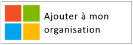
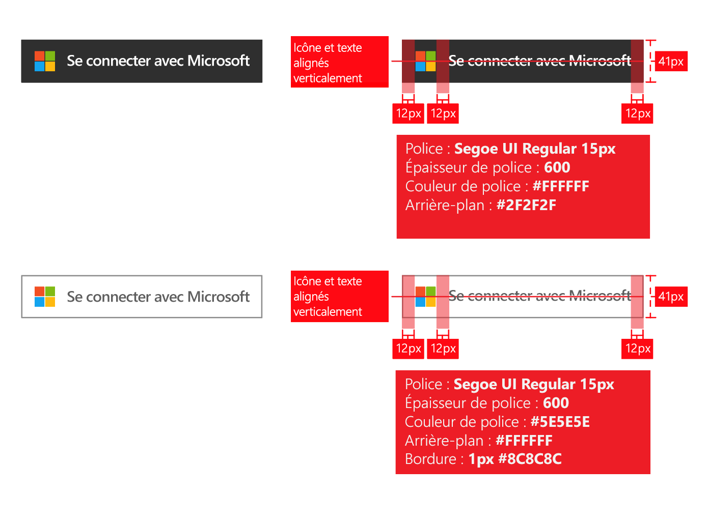
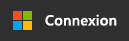
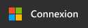
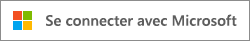
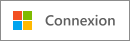

# Directives de personnalisation des applications

Lorsque vous développez des applications avec la plateforme d’identité Microsoft, vous devez orienter vos clients quand ils souhaitent utiliser leur compte professionnel ou scolaire (géré dans Azure AD) ou leur compte personnel pour s’inscrire et se connecter à votre application.

En lisant cet article, vous pourrez :

- En savoir plus sur les deux types de compte utilisateur gérés par Microsoft et sur la façon de faire référence aux comptes Azure AD dans votre application
- Découvrir ce que vous devez faire pour ajouter le logo Microsoft en vue de son utilisation dans votre application
- Télécharger les images **Se connecter** ou **Se connecter avec Microsoft** officielles en vue de leur utilisation dans votre application
- En savoir plus sur les choses à faire et à éviter en matière de personnalisation et de navigation

## Comptes personnels et comptes professionnels/scolaires de Microsoft

Microsoft gère deux types de compte d’utilisateur :

- **Comptes personnels** (anciennement Windows Live ID). Ces comptes représentent la relation entre des utilisateurs *individuels* et Microsoft et sont utilisés pour accéder aux services et appareils de Microsoft destinés au grand public. Ces comptes sont prévus pour un usage personnel.
- **Comptes professionnels ou scolaires.** Ces comptes sont gérés par Microsoft pour le compte d’organisations qui utilisent Azure Active Directory. Ces comptes sont utilisés pour se connecter à Microsoft 365 et d'autres services métier de Microsoft.

Les comptes professionnels ou scolaires Microsoft sont généralement affectés à des utilisateurs finaux (employés, étudiants, fonctionnaires) par leurs organisations (entreprise, école, administration). Ces comptes sont régis directement dans le cloud (dans la plateforme Azure AD) ou synchronisés avec Azure AD à partir d’un annuaire local tel que Windows Server Active Directory. Microsoft est le *responsable* des comptes professionnels ou scolaires, mais ces comptes sont détenus et contrôlés par l’organisation.

## Faire référence aux comptes Azure AD dans votre application

Microsoft n’expose pas les utilisateurs finaux aux noms de marque Azure ou Active Directory et il doit en être de même pour vous.

- Une fois que les utilisateurs sont connectés, utilisez le nom et le logo de l’organisation autant que possible. Cela est préférable à l’utilisation de termes génériques tels que « votre organisation ».
- Quand les utilisateurs ne sont pas connectés, vous devez faire référence à leurs comptes en parlant de « comptes professionnels ou scolaires » et utiliser le logo Microsoft pour indiquer que ces comptes sont gérés par Microsoft. N’utilisez pas de termes tels que « compte d’entreprise » et « compte commercial », car ils embrouillent les utilisateurs.

## Pictogramme de compte d’utilisateur

Dans une version antérieure de ces directives, nous recommandions d’utiliser un pictogramme de « badge bleu ». Suite aux commentaires des utilisateurs et des développeurs, nous recommandons désormais d’utiliser le logo Microsoft. Le logo Microsoft permet aux utilisateurs de comprendre qu'ils peuvent réutiliser le compte dont ils se servent avec Microsoft 365 ou d'autres services métier Microsoft pour se connecter à votre application.

## Inscription et connexion avec Azure AD

Votre application peut présenter des chemins distincts pour l’inscription et la connexion, et les sections suivantes fournissent des conseils visuels pour les deux scénarios.

**Si votre application prend en charge l’inscription des utilisateurs finaux (par exemple, pour les modèles d’essai gratuit ou freemium)**  : vous pouvez afficher un bouton de **connexion** qui permet aux utilisateurs d’accéder à votre application à l’aide de leur compte professionnel ou personnel. Azure AD affiche une invite de consentement la première fois que les utilisateurs accèdent à votre application.

**Si votre application nécessite des autorisations auxquelles seuls les administrateurs peuvent consentir ou si votre application nécessite une licence d’entreprise** : séparez l’acquisition administrateur de la connexion utilisateur. Le **bouton « obtenir cette application »** redirige les administrateurs vers la connexion, après quoi ils sont invités à donner leur consentement pour le compte des utilisateurs de leur organisation, ce qui a également pour avantage de supprimer l’envoi d’invites de consentement sur votre application.

## Aide visuelle pour l’acquisition de l’application

Le lien « obtenir l’application » doit rediriger l’utilisateur vers la page d’octroi d’accès d’Azure AD, afin de permettre à l’administrateur d’une organisation d’autoriser votre application à accéder aux données de son organisation hébergées par Microsoft. Pour plus d'informations sur la demande d'accès, consultez l'article [Intégration d'applications dans Azure Active Directory](./quickstart-register-app.md) .

Une fois que les administrateurs ont donné leur consentement à votre application, ils peuvent l'ajouter au lanceur d'applications Microsoft 365 de leurs utilisateurs (accessible à partir du menu gaufre et de [https://portal.office.com/myapps](https://portal.office.com/myapps)). Pour faire la promotion de cette fonctionnalité, vous pouvez utiliser des phrases telles que « Ajouter cette application à votre organisation » et afficher un bouton comme dans l’exemple suivant :

Toutefois, nous vous recommandons de fournir un texte explicatif plutôt que de vous contenter des boutons. Par exemple :

> *Si vous utilisez déjà Microsoft 365 ou un autre service métier de Microsoft, vous pouvez accorder à <nom_de_votre_application> l'accès aux données de votre organisation. Cela permet à vos utilisateurs d’accéder à <nom_de_votre_application> à l’aide de leur compte professionnel existant.*

Pour télécharger le logo Microsoft officiel afin de l’utiliser dans votre application, cliquez avec le bouton droit de la souris sur celui que vous souhaitez utiliser et enregistrez-le sur votre ordinateur.

| Asset                                | Format PNG | Format SVG |
| ------------------------------------ | ---------- | ---------- |
| Logo Microsoft  |  |  |

## Aide visuelle pour la connexion

Votre application doit afficher un bouton de connexion qui redirige les utilisateurs vers le point de terminaison de connexion correspondant au protocole que vous utilisez pour l’intégration à Azure AD. La section suivante fournit des détails sur l’aspect recommandé pour ce bouton.

### Pictogramme et « Se connecter avec Microsoft »

C’est l’association du logo Microsoft et des termes « Se connecter avec Microsoft » qui permet de distinguer Azure AD des autres fournisseurs d’identité que votre application peut prendre en charge. Si vous ne disposez pas d’espace suffisant pour « Se connecter avec Microsoft », vous pouvez utiliser l’abréviation « Se connecter ». Vous pouvez utiliser un modèle de couleurs claires ou sombres pour les boutons.

Le schéma suivant illustre les lignes rouges recommandées par Microsoft lorsque vous utilisez les éléments multimédias avec votre application. Les lignes rouges s’appliquent au bouton « Se connecter avec Microsoft » ou à sa version abrégée « Se connecter ».

Pour télécharger les images Microsoft officielles afin de les utiliser dans votre application, cliquez avec le bouton droit de la souris sur celle que vous souhaitez utiliser et enregistrez-la sur votre ordinateur.

| Asset                                | Format PNG | Format SVG |
| ------------------------------------ | ---------- | ---------- |
| Se connecter avec Microsoft (thème sombre)  |  |  |
| Se connecter avec Microsoft (thème clair) |  |  |
| Se connecter (thème sombre)                 |  |  |
| Se connecter (thème clair)                |  |  |

## Choses à faire et à éviter en matière de personnalisation

**UTILISEZ** « compte professionnel ou scolaire » dans la combinaison avec le bouton « Se connecter avec Microsoft » pour fournir une explication supplémentaire afin d’aider les utilisateurs finaux à déterminer s’ils peuvent l’utiliser. **N’UTILISEZ PAS** de termes tels que « compte d’entreprise » ou « compte commercial ».

**N'UTILISEZ PAS** « ID Microsoft 365 » ou « ID Azure ». Microsoft 365 est également le nom d'une offre grand public de Microsoft qui n'utilise pas Azure AD pour l'authentification.

**N’UTILISEZ PAS** le logo Microsoft.

**N’UTILISEZ PAS** les utilisateurs finaux à la marque Azure ou Active Directory. Il est toutefois tout à fait concevable d’utiliser ces termes avec les développeurs, les professionnels de l’informatique et les administrateurs.

## Choses à faire et à éviter pour la navigation

**FOURNISSEZ** aux utilisateurs un moyen de se déconnecter et de passer à un autre compte d’utilisateur. Bien que la plupart des gens aient un seul compte personnel Microsoft/Facebook/Google/Twitter, ils sont souvent associés à plus d’une organisation. La prise en charge de plusieurs utilisateurs connectés sera bientôt offerte.