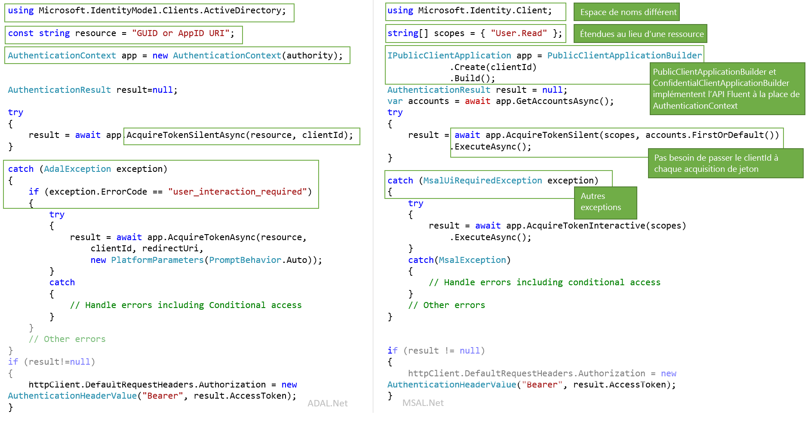

# <a name="migrating-applications-to-msalnet"></a>Migration d’applications vers MSAL.NET

Microsoft Authentication Library pour .NET (MSAL.NET) et Azure AD Authentication Library pour .NET (ADAL.NET) sont tous deux utilisés pour authentifier des entités Azure AD et demander des jetons auprès d’Azure AD. Jusqu’à présent, la plupart des développeurs utilisent la plateforme Azure AD pour développeurs (v1.0) afin d’authentifier les identités Azure AD (comptes professionnels et scolaires) en demandant des jetons avec la Bibliothèque d’authentification Active Directory (ADAL). Grâce à MSAL :

- vous pouvez authentifier un ensemble plus large d'identités Microsoft (identités Azure AD et comptes Microsoft, comptes de réseaux sociaux et locaux par le biais d'Azure AD B2C) via le point de terminaison de la plateforme d'identités Microsoft ;
- vos utilisateurs bénéficieront de la meilleure expérience d'authentification unique ;
- votre application peut activer le consentement incrémentiel, et l’accès conditionnel est plus facile à prendre en charge ;
- vous bénéficiez de l'innovation.

**MSAL.NET est désormais la bibliothèque d'authentification recommandée avec la plateforme d'identités Microsoft**. Aucune nouvelle fonctionnalité ne sera implémentée sur ADAL.NET. Les efforts se focalisent sur l'amélioration de MSAL.

Cet article décrit les différences entre la Bibliothèque d'authentification Microsoft pour .NET (MSAL.NET) et la Bibliothèque d'authentification Azure AD pour .NET (ADAL.NET). Il vous aide également à migrer vers MSAL.

## <a name="differences-between-adal-and-msal-apps"></a>Différences entre les applications ADAL et MSAL

Dans la plupart des cas, vous avez besoin d’utiliser MSAL.NET et le point de terminaison de la plateforme d’identités Microsoft, à savoir la dernière génération de bibliothèques d’authentification de Microsoft. En utilisant MSAL.NET, vous acquérez des jetons pour la connexion des utilisateurs à votre application avec Azure AD (comptes professionnels et scolaires), des comptes (personnels) Microsoft (MSA) ou Azure AD B2C.

Si vous connaissez déjà le point de terminaison Azure AD pour développeurs (v1.0) (et ADAL.NET), envisagez de lire l’article sur les [différences du point de terminaison de la plateforme d’identités Microsoft (v2.0)](../azuread-dev/azure-ad-endpoint-comparison.md).

En revanche, vous devez quand même utiliser ADAL.NET si votre application a besoin de connecter les utilisateurs avec des versions antérieures des [services de fédération Active Directory (AD FS)](/windows-server/identity/active-directory-federation-services). Pour plus d'informations, consultez le [support ADFS](https://aka.ms/msal-net-adfs-support).

L’image suivante résume certaines des différences entre le  ADAL.NET et MSAL.NET

### <a name="nuget-packages-and-namespaces"></a>Espaces de noms et packages NuGet

ADAL.NET se consomme à partir du package NuGet [Microsoft.IdentityModel.Clients.ActiveDirectory](https://www.nuget.org/packages/Microsoft.IdentityModel.Clients.ActiveDirectory). L’espace de noms à utiliser est `Microsoft.IdentityModel.Clients.ActiveDirectory`.

Pour utiliser MSAL.NET, vous devez ajouter le package NuGet [Microsoft.Identity.Client](https://www.nuget.org/packages/Microsoft.Identity.Client) et utiliser l’espace de noms `Microsoft.Identity.Client`.

### <a name="scopes-not-resources"></a>Étendues au lieu de ressources

ADAL.NET acquiert des jetons pour les *ressources*, alors que MSAL.NET en acquiert pour les *étendues*. Plusieurs remplacements AcquireToken MSAL.NET exigent un paramètre appelé scopes(`IEnumerable<string> scopes`). Ce paramètre est une simple liste de chaînes qui déclarent les autorisations souhaitées et les ressources demandées. Les [étendues de Microsoft Graph](/graph/permissions-reference) figurent parmi les plus connues.

Il est également possible dans MSAL.NET d’accéder aux ressources v1.0. Consultez plus d’informations dans [Étendues pour une application v1.0](#scopes-for-a-web-api-accepting-v10-tokens).

### <a name="core-classes"></a>Classes principales

- ADAL.NET utilise [AuthenticationContext](https://github.com/AzureAD/azure-activedirectory-library-for-dotnet/wiki/AuthenticationContext:-the-connection-to-Azure-AD) comme représentation de votre connexion auprès du service d’émission de jeton de sécurité (STS) ou du serveur d’autorisation, par le biais d’une autorité. À l’opposé, MSAL.NET est conçue autour des [applications clientes](https://github.com/AzureAD/microsoft-authentication-library-for-dotnet/wiki/Client-Applications). La bibliothèque fournit deux classes distinctes : `PublicClientApplication` et `ConfidentialClientApplication`

- Acquisition de jetons : ADAL.NET et MSAL.NET ont les mêmes appels d’authentification (`AcquireTokenAsync` et `AcquireTokenSilentAsync` pour ADAL.NET, `AcquireTokenInteractive` et `AcquireTokenSilent` dans MSAL.NET), mais avec des paramètres obligatoires différents. L’une des différences vient du fait que, dans MSAL.NET, vous n’avez plus besoin de passer la valeur `ClientID` de votre application dans chaque appel AcquireTokenXX. En effet, la valeur `ClientID` est définie une seule fois lors de la génération de `IPublicClientApplication` ou `IConfidentialClientApplication`.

### <a name="iaccount-not-iuser"></a>IAccount au lieu de IUser

ADAL.NET manipulait des utilisateurs. Cependant, un utilisateur correspond à un être humain ou à un agent logiciel, mais il peut posséder/détenir/avoir la responsabilité d’un ou plusieurs comptes dans le système d’identités Microsoft (plusieurs comptes Azure AD, Azure AD B2C, des comptes personnels Microsoft).

MSAL.NET 2.x définit maintenant le concept de compte (par le biais de l’interface IAccount). Ce changement cassant fournit la bonne sémantique : le fait que le même utilisateur puisse avoir plusieurs comptes, dans des annuaires Azure AD différents. De plus, MSAL.NET fournit de meilleures informations dans les scénarios d’invité, car des informations de compte d’accueil sont fournies.

Pour plus d’informations sur les différences entre IUser et IAccount, consultez [MSAL.NET 2.x](https://aka.ms/msal-net-2-released).

### <a name="exceptions"></a>Exceptions

#### <a name="interaction-required-exceptions"></a>Exceptions d’interaction requise

MSAL.NET a des exceptions plus explicites. Par exemple, quand une authentification silencieuse échoue dans ADAL, la procédure consiste à intercepter l’exception et à rechercher le code d’erreur `user_interaction_required` :

```csharp
catch(AdalException exception)
{
 if (exception.ErrorCode == "user_interaction_required")
 {
  try
  {“try to authenticate interactively”}}
 }
}
```

Consultez plus d’informations dans la section sur [le modèle recommandé pour acquérir un jeton](https://github.com/AzureAD/azure-activedirectory-library-for-dotnet/wiki/AcquireTokenSilentAsync-using-a-cached-token#recommended-pattern-to-acquire-a-token) avec ADAL.NET.

Avec MSAL.NET, vous interceptez `MsalUiRequiredException` comme décrit dans [AcquireTokenSilent](https://github.com/AzureAD/microsoft-authentication-library-for-dotnet/wiki/AcquireTokenSilentAsync-using-a-cached-token).

```csharp
catch(MsalUiRequiredException exception)
{
 try {“try to authenticate interactively”}
}
```

#### <a name="handling-claim-challenge-exceptions"></a>Gestion des exceptions de demande de revendication

Dans ADAL.NET, les exceptions de demande de revendication sont gérées de la manière suivante :

- `AdalClaimChallengeException` est une exception (dérivant de `AdalServiceException`) levée par le service si une ressource a besoin de davantage de revendications de la part de l’utilisateur (par exemple, une authentification à 2 facteurs). Le membre `Claims` contient un fragment JSON avec les revendications attendues.
- Mais quand même dans ADAL.NET, l’application cliente publique qui reçoit cette exception a besoin d’appeler le remplacement de `AcquireTokenInteractive` qui a un paramètre de revendication. Ce remplacement de `AcquireTokenInteractive` n’essaie même pas d’atteindre le cache, car c’est inutile. En effet, le jeton situé dans le cache n’a pas les bonnes revendications (sinon, aucune `AdalClaimChallengeException` n’aurait été levée). Ainsi, il n’est pas nécessaire d’examiner le cache. Notez que `ClaimChallengeException` peut être reçu dans une API web qui fait OBO, tandis que `AcquireTokenInteractive` doit être appelé dans une application cliente publique qui appelle cette API web.
- Pour plus d’informations, notamment pour obtenir des exemples, consultez Gestion de [AdalClaimChallengeException](https://github.com/AzureAD/azure-activedirectory-library-for-dotnet/wiki/Exceptions-in-ADAL.NET#handling-adalclaimchallengeexception).

Dans MSAL.NET, les exceptions de demande de revendication sont gérées de la manière suivante :

- Les `Claims` font surface dans `MsalServiceException`.
- Il existe une méthode `.WithClaim(claims)` qui peut s’appliquer au générateur `AcquireTokenInteractive`.

### <a name="supported-grants"></a>Octrois pris en charge

Tous les octrois ne sont pas encore pris en charge dans MSAL.NET et le point de terminaison v2.0. Voici un résumé comparatif des octrois pris en charge par ADAL.NET et MSAL.NET.

#### <a name="public-client-applications"></a>Applications clientes publiques

Voici les octrois pris en charge ADAL.NET et MSAL.NET pour les applications de bureau et mobiles.

Accorder | ADAL.NET | MSAL.NET
----- |----- | -----
Interactive | [Authentification interactive](https://github.com/AzureAD/azure-activedirectory-library-for-dotnet/wiki/Acquiring-tokens-interactively---Public-client-application-flows) | [Acquisition des jetons de manière interactive dans MSAL.NET](https://github.com/AzureAD/microsoft-authentication-library-for-dotnet/wiki/Acquiring-tokens-interactively)
Authentification Windows intégrée | [Authentification intégrée sur Windows (Kerberos)](https://github.com/AzureAD/azure-activedirectory-library-for-dotnet/wiki/AcquireTokenSilentAsync-using-Integrated-authentication-on-Windows-(Kerberos)) | [Authentification Windows intégrée](msal-authentication-flows.md#integrated-windows-authentication)
Nom d’utilisateur / mot de passe | [Acquisition des jetons avec un nom d’utilisateur et un mot de passe](https://github.com/AzureAD/azure-activedirectory-library-for-dotnet/wiki/Acquiring-tokens-with-username-and-password)| [Authentification par nom d’utilisateur et mot de passe](msal-authentication-flows.md#usernamepassword)
Flux de code d’appareil | [Profil d’appareil pour les appareils sans navigateurs web](https://github.com/AzureAD/azure-activedirectory-library-for-dotnet/wiki/Device-profile-for-devices-without-web-browsers) | [Flux de code d’appareil](msal-authentication-flows.md#device-code)

#### <a name="confidential-client-applications"></a>Applications clientes confidentielles

Voici les octrois pris en charge dans ADAL.NET et MSAL.NET pour les applications web, les API web et les applications de démon :

Type d’application | Accorder | ADAL.NET | MSAL.NET
----- | ----- | ----- | -----
Application web, API web, démon | Informations d’identification du client | [Flux d’informations d’identification du client dans ADAL.NET](https://github.com/AzureAD/azure-activedirectory-library-for-dotnet/wiki/Client-credential-flows) | [Flux d’informations d’identification du client dans MSAL.NET](msal-authentication-flows.md#client-credentials)
API Web | OBO (On-Behalf-Of) | [Appels de service à service pour le compte de l’utilisateur avec ADAL.NET](https://github.com/AzureAD/azure-activedirectory-library-for-dotnet/wiki/Service-to-service-calls-on-behalf-of-the-user) | [OBO dans MSAL.NET](msal-authentication-flows.md#on-behalf-of)
Application web | Code d’authentification | [Acquisition des jetons avec des codes d’autorisation sur les applications web avec ADAL.NET](https://github.com/AzureAD/azure-activedirectory-library-for-dotnet/wiki/Acquiring-tokens-with-authorization-codes-on-web-apps) | [Acquisition des jetons avec des codes d’autorisation sur les applications web avec MSAL.NET](msal-authentication-flows.md#authorization-code)

### <a name="cache-persistence"></a>Persistance du cache

ADAL.NET vous permet d’étendre la classe `TokenCache` pour implémenter la fonctionnalité de persistance souhaitée sur les plateformes sans stockage sécurisé (.NET Framework et .NET Core) en utilisant les méthodes `BeforeAccess` et `BeforeWrite`. Pour plus d’informations, consultez [Sérialisation du cache de jetons dans ADAL.NET](https://github.com/AzureAD/azure-activedirectory-library-for-dotnet/wiki/Token-cache-serialization).

MSAL.NET transforme le cache de jetons en classe sealed, en supprimant la possibilité de l’étendre. Ainsi, votre implémentation de la persistance du cache de jetons doit prendre la forme d’une classe d’assistance qui interagit avec le cache de jetons sealed. Cette interaction est décrite dans [Sérialisation du cache de jetons dans MSAL.NET](https://github.com/AzureAD/microsoft-authentication-library-for-dotnet/wiki/token-cache-serialization).

## <a name="signification-of-the-common-authority"></a>Signification de l’autorité commune

Dans v1.0, si vous utilisez l’autorité `https://login.microsoftonline.com/common`, vous autorisez les utilisateurs à se connecter à n’importe quel compte AAD (pour n’importe quelle organisation). Consultez [Validation de l’autorité dans ADAL.NET](https://github.com/AzureAD/azure-activedirectory-library-for-dotnet/wiki/AuthenticationContext:-the-connection-to-Azure-AD#authority-validation).

Si vous utilisez l’autorité `https://login.microsoftonline.com/common` dans v2.0, vous autorisez les utilisateurs à se connecter à n’importe quelle organisation AAD ou à un compte personnel Microsoft (MSA). Dans MSAL.NET, si vous voulez limiter la connexion à un compte AAD (même comportement qu’avec ADAL.NET), vous devez utiliser `https://login.microsoftonline.com/organizations`. Pour plus d’informations, consultez le paramètre `authority` dans l’[application cliente publique](https://github.com/AzureAD/microsoft-authentication-library-for-dotnet/wiki/Client-Applications#publicclientapplication).

## <a name="v10-and-v20-tokens"></a>Jetons v1.0 et v2.0

Il existe deux versions des jetons :
- Jetons v1.0
- Jetons v2.0

Le point de terminaison v1.0 (utilisé par ADAL) émet uniquement des jetons v1.0.

En revanche, le point de terminaison v2.0 (utilisé par MSAL) émet la version du jeton que l’API web accepte. Une propriété du manifeste de l’application de l’API web permet aux développeurs de choisir quelle version du jeton est acceptée. Consultez `accessTokenAcceptedVersion` dans la documentation de référence du [manifeste de l’application](reference-app-manifest.md).

Pour plus d’informations sur les jetons v1.0 et v2.0, consultez [Jetons d’accès Azure Active Directory](access-tokens.md).

## <a name="scopes-for-a-web-api-accepting-v10-tokens"></a>Étendues pour une API web acceptant des jetons v1.0

Les autorisations OAuth2 sont des étendues d’autorisation qu’une application (ressource) de l’API web v1.0 expose aux applications clientes. Ces étendues d’autorisation peuvent être accordées aux applications clientes durant le consentement. Consultez la section sur oauth2Permissions dans le [manifeste de l’application Azure Active Directory](./reference-app-manifest.md).

### <a name="scopes-to-request-access-to-specific-oauth2-permissions-of-a-v10-application"></a>Étendues pour demander l’accès à des autorisations OAuth2 spécifiques d’une application v1.0

Pour acquérir des jetons pour une application acceptant les jetons v1.0 (par exemple, l’API Microsoft Graph, disponible à l’adresse https://graph.microsoft.com) ), vous devez créer des `scopes` en concaténant un identificateur de ressource de votre choix avec une autorisation OAuth2 souhaitée pour cette ressource.

Par exemple, pour accéder au nom de l’utilisateur à une API web v1.0 dont l’URI de l’ID d’application est `ResourceId`, vous devez utiliser :

```csharp
var scopes = new [] {  ResourceId+"/user_impersonation"};
```

Pour lire et écrire avec MSAL.NET Azure Active Directory à l’aide de l’API Microsoft Graph (https://graph.microsoft.com/) ), vous devez créer la liste des étendues, comme dans l’extrait de code suivant :

```csharp
string ResourceId = "https://graph.microsoft.com/"; 
string[] scopes = { ResourceId + "Directory.Read", ResourceId + "Directory.Write" }
```

#### <a name="warning-should-you-have-one-or-two-slashes-in-the-scope-corresponding-to-a-v10-web-api"></a>Avertissement : Une ou deux barres obliques dans l’étendue correspondant à une API web v1.0 ?

Si vous voulez écrire l’étendue correspondant à l’API Azure Resource Manager (https://management.core.windows.net/) ), vous devez demander l’étendue suivante (notez les deux barres obliques) :

```csharp
var scopes = new[] {"https://management.core.windows.net//user_impersonation"};
var result = await app.AcquireTokenInteractive(scopes).ExecuteAsync();

// then call the API: https://management.azure.com/subscriptions?api-version=2016-09-01
```

En effet, l’API Resource Manager attend une barre oblique dans sa revendication d’audience (`aud`) et il y a une barre oblique qui sépare le nom de l’API de l’étendue.

La logique utilisée par Azure AD est la suivante :
- Pour le point de terminaison ADAL (v1.0) avec jeton d’accès v1.0 (le seul possible), aud=resource
- Pour le point de terminaison MSAL (v2.0) qui demande un jeton d’accès pour une ressource qui accepte des jetons v2.0, aud=resource.AppId
- Pour le point de terminaison MSAL (v2.0) qui demande un jeton d’accès pour une ressource qui accepte un jeton d’accès v1.0 (ce qui correspond au cas ci-dessus), Azure AD analyse l’audience souhaitée d’après l’étendue demandée en prenant tout ce qui précède la dernière barre oblique et en l’utilisant comme identificateur de la ressource. Par conséquent, si https :\//database.windows.net attend une audience de "https://database.windows.net/ ", vous devrez demander une étendue de https :\/ /database.windows.net//.default. Consultez également le problème n° [747](https://github.com/AzureAD/microsoft-authentication-library-for-dotnet/issues/747) : La barre oblique de fin est omise dans l’URL de la ressource, ce qui a entraîné un échec d’authentification SQK n° 747


### <a name="scopes-to-request-access-to-all-the-permissions-of-a-v10-application"></a>Étendues pour demander l’accès à toutes les autorisations d’une application v1.0

Par exemple, si vous voulez acquérir un jeton pour toutes les étendues statiques d’une application v1.0, vous devez utiliser :

```csharp
ResourceId = "someAppIDURI";
var scopes = new [] {  ResourceId+"/.default"};
```

### <a name="scopes-to-request-in-the-case-of-client-credential-flow--daemon-app"></a>Étendues à demander en cas de flux d’informations d’identification du client/application de démon

En cas de flux d’informations d’identification du client, l’étendue à passer est également `/.default`. Cette étendue indique à Azure AD toutes les autorisations au niveau de l'application que l'administrateur a acceptées dans l'inscription de l'application.

## <a name="adal-to-msal-migration"></a>Migration ADAL vers MSAL

Dans ADAL.NET v2. X, les jetons d’actualisation ont été exposés, ce qui vous permet de développer des solutions autour de l’utilisation de ces jetons en les mettant en cache et en utilisant les méthodes `AcquireTokenByRefreshToken` fournies par ADAL 2.x.
Certaines de ces solutions ont été utilisées dans des scénarios comme :
* Services durables qui exécutent des actions, notamment l’actualisation des tableaux de bord pour le compte des utilisateurs alors que ces utilisateurs ne sont plus connectés.
* Scénarios WebFarm pour permettre au client d’apporter le RT au service web (la mise en cache est effectuée côté client, le cookie est chiffré, et non côté serveur).

Pour des raisons de sécurité, MSAL.NET n'expose pas les jetons d'actualisation : MSAL gère l'actualisation des jetons pour vous.

Heureusement, MSAL.NET dispose maintenant d'une API qui vous permet de migrer vos jetons d'actualisation précédents (acquis avec ADAL) dans `IConfidentialClientApplication` :

```csharp
/// <summary>
/// Acquires an access token from an existing refresh token and stores it and the refresh token into
/// the application user token cache, where it will be available for further AcquireTokenSilent calls.
/// This method can be used in migration to MSAL from ADAL v2 and in various integration
/// scenarios where you have a RefreshToken available.
/// (see https://aka.ms/msal-net-migration-adal2-msal2)
/// </summary>
/// <param name="scopes">Scope to request from the token endpoint.
/// Setting this to null or empty will request an access token, refresh token and ID token with default scopes</param>
/// <param name="refreshToken">The refresh token from ADAL 2.x</param>
IByRefreshToken.AcquireTokenByRefreshToken(IEnumerable<string> scopes, string refreshToken);
```

Avec cette méthode, vous pouvez fournir le jeton d’actualisation utilisé précédemment, ainsi que toutes les étendues (ressources) souhaitées. Le jeton d’actualisation est échangé avec un nouveau jeton et mis en cache dans votre application.

Étant donné que cette méthode est destinée aux scénarios inhabituels, elle n’est pas facilement accessible avec `IConfidentialClientApplication` sans être d’abord castée vers `IByRefreshToken`.

Cet extrait de code montre du code de migration dans une application cliente confidentielle. `GetCachedRefreshTokenForSignedInUser` récupère le jeton d’actualisation stocké par une version précédente de l’application qui exploitait ADAL 2.x. `GetTokenCacheForSignedInUser` désérialise un cache pour l’utilisateur connecté (puisque les applications clientes confidentielles doivent avoir un seul cache par utilisateur).

```csharp
TokenCache userCache = GetTokenCacheForSignedInUser();
string rt = GetCachedRefreshTokenForSignedInUser();

IConfidentialClientApplication app;
app = ConfidentialClientApplicationBuilder.Create(clientId)
 .WithAuthority(Authority)
 .WithRedirectUri(RedirectUri)
 .WithClientSecret(ClientSecret)
 .Build();
IByRefreshToken appRt = app as IByRefreshToken;

AuthenticationResult result = await appRt.AcquireTokenByRefreshToken(null, rt)
                                         .ExecuteAsync()
                                         .ConfigureAwait(false);
```

Vous voyez un jeton d’accès et un jeton d’ID retournés dans votre AuthenticationResult alors que votre nouveau jeton d’actualisation est stocké dans le cache.

Vous pouvez également utiliser cette méthode pour divers scénarios d’intégration dans lesquels vous avez un jeton d’actualisation disponible.

## <a name="next-steps"></a>Étapes suivantes

Vous trouverez plus d’informations sur les étendues dans [Étendues, autorisations et consentement dans le point de terminaison de la plateforme d’identités Microsoft](v2-permissions-and-consent.md).
