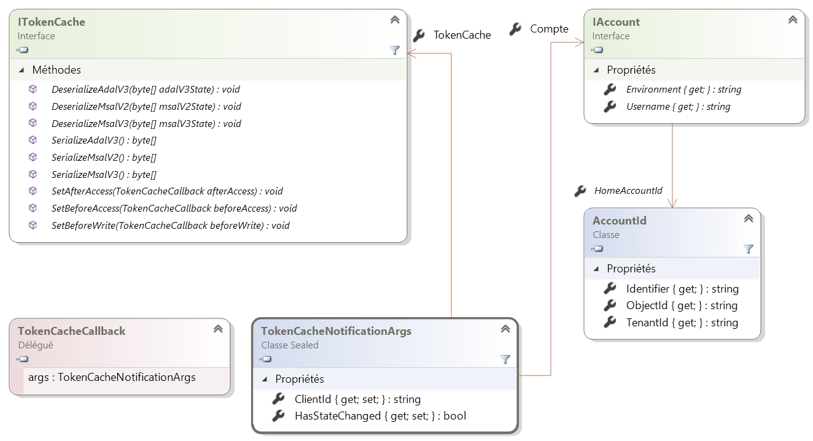
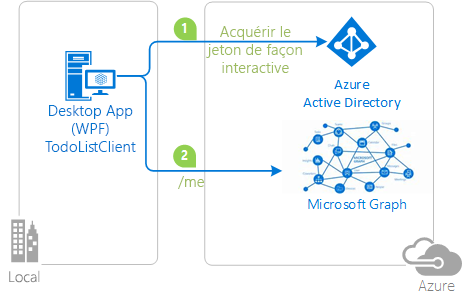

# <a name="token-cache-serialization-in-msalnet"></a>Sérialisation du cache de jetons dans MSAL.NET
Une fois qu’un [jeton est acquis](msal-acquire-cache-tokens.md), il est mis en cache par la bibliothèque d’authentification Microsoft (MSAL).  Le code de l’application doit d’abord essayer d’obtenir un jeton à partir du cache, avant de l’acquérir par une autre méthode.  Cet article décrit la sérialisation par défaut et personnalisée du cache de jetons dans MSAL.NET.

Cet article s’applique à MSAL.NET 3.x. Pour MSAL.NET 2.x, consultez [Sérialisation du cache de jetons dans MSAL.NET 2.x](https://github.com/AzureAD/microsoft-authentication-library-for-dotnet/wiki/Token-cache-serialization-2x).

## <a name="default-serialization-for-mobile-platforms"></a>Sérialisation par défaut pour les plateformes mobiles

Dans MSAL.NET, un cache de jetons en mémoire est fourni par défaut. La sérialisation est fournie par défaut pour les plateformes où un stockage sécurisé est disponible pour un utilisateur dans le cadre de la plateforme. C’est le cas pour la plateforme Windows universelle (UWP), Xamarin.iOS et Xamarin.Android.

> [!Note]
> Quand vous migrez un projet Xamarin.Android de MSAL.NET 1.x vers MSAL.NET 3.x, envisagez d’ajouter `android:allowBackup="false"` à votre projet pour éviter le retour d’anciens jetons mis en cache quand des déploiements de Visual Studio déclenchent une restauration du stockage local. Consultez le [problème n° 659](https://github.com/AzureAD/microsoft-authentication-library-for-dotnet/issues/659#issuecomment-436181938).

## <a name="custom-serialization-for-windows-desktop-apps-and-web-appsweb-apis"></a>Sérialisation personnalisée pour les applications de bureau Windows et les applications/API web

N’oubliez pas que la sérialisation personnalisée n’est pas disponible sur les plateformes mobiles (UWP, Xamarin.iOS et Xamarin.Android). MSAL définit déjà un mécanisme de sérialisation sécurisé et performant pour ces plateformes. Les applications .NET Desktop et .NET Core, en revanche, ont des architectures diverses et MSAL ne peut pas implémenter un mécanisme de sérialisation universel. Par exemple, les sites web peuvent choisir de stocker les jetons dans un cache Redis tandis que les applications de bureau les stockent dans un fichier chiffré. Ainsi, la sérialisation n’est pas fournie prête à l’emploi. Pour obtenir une application de cache de jetons .NET Desktop ou .NET Core persistante, personnalisez la sérialisation.

Les classes et interfaces suivantes sont utilisées dans la sérialisation du cache de jetons :

- `ITokenCache`, qui définit des événements pour s’abonner à des demandes de sérialisation du cache de jetons, ainsi que des méthodes pour sérialiser ou désérialiser le cache dans différents formats (ADAL v3.0, MSAL 2.x et MSAL 3.x = ADAL v5.0).
- `TokenCacheCallback` est un rappel transmis aux événements pour que vous puissiez gérer la sérialisation. Ceux-ci sont appelés avec des arguments de type `TokenCacheNotificationArgs`.
- `TokenCacheNotificationArgs` fournit uniquement la valeur `ClientId` de l’application et une référence à l’utilisateur pour lequel le jeton est disponible.

  

> [!IMPORTANT]
> MSAL.NET crée les caches de jetons automatiquement et vous fournit le cache `IToken` quand vous appelez les propriétés `UserTokenCache` et `AppTokenCache` d’une application. Vous n’êtes pas censé implémenter l’interface vous-même. Votre responsabilité, lorsque vous implémentez une sérialisation du cache de jetons personnalisée, consiste à :
> - Réagir aux « événements » `BeforeAccess` et `AfterAccess` (ou à leurs versions Async). Le délégué `BeforeAccess` se charge de désérialiser le cache, tandis que le délégué `AfterAccess` est responsable de la sérialisation du cache.
> - Une partie de ces événements stockent ou chargent des objets blob, lesquels sont transmis par le biais de l’argument de l’événement au stockage voulu.

Les stratégies diffèrent selon que vous écrivez une sérialisation du cache de jetons pour une [application cliente publique](msal-client-applications.md) (bureau) ou une [application cliente confidentielle](msal-client-applications.md) (application/API web, application de démon).

### <a name="token-cache-for-a-public-client"></a>Cache de jetons pour un client public

Depuis MSAL.NET v2.x, vous avez plusieurs possibilités pour sérialiser le cache de jetons d’un client public. Vous pouvez sérialiser le cache uniquement au format MSAL.NET (le cache au format unifié est commun à MSAL et aux plateformes).  Vous pouvez également prendre en charge la sérialisation du cache de jetons [héritée](https://github.com/AzureAD/azure-activedirectory-library-for-dotnet/wiki/Token-cache-serialization) d’ADAL V3.

La personnalisation de la sérialisation du cache de jetons pour partager l’état de l’authentification unique entre ADAL.NET 3.x, ADAL.NET 5.x et MSAL.NET est expliquée dans une partie de l’exemple suivant : [active-directory-dotnet-v1-to-v2](https://github.com/Azure-Samples/active-directory-dotnet-v1-to-v2).

> [!Note]
> Le format du cache de jetons MSAL.NET 1.1.4-preview n’est plus pris en charge dans MSAL 2.x. Si vous avez des applications qui exploitent MSAL.NET 1.x, vos utilisateurs devront se reconnecter. Sinon, la migration à partir d’ADAL 4.x (et 3.x) est prise en charge.

#### <a name="simple-token-cache-serialization-msal-only"></a>Sérialisation simple du cache de jetons (MSAL.NET uniquement)

Voici un exemple d’implémentation naïve de la sérialisation personnalisée d’un cache de jetons pour des applications de bureau. Ici, le cache de jetons utilisateur est un fichier situé dans le même dossier que l’application.

Une fois que vous avez généré l’application, vous activez la sérialisation en appelant la méthode `TokenCacheHelper.EnableSerialization()` et en passant l’application `UserTokenCache`.

```csharp
app = PublicClientApplicationBuilder.Create(ClientId)
    .Build();
TokenCacheHelper.EnableSerialization(app.UserTokenCache);
```

La classe d’assistance `TokenCacheHelper` est définie en tant que :

```csharp
static class TokenCacheHelper
 {
  public static void EnableSerialization(ITokenCache tokenCache)
  {
   tokenCache.SetBeforeAccess(BeforeAccessNotification);
   tokenCache.SetAfterAccess(AfterAccessNotification);
  }

  /// <summary>
  /// Path to the token cache. Note that this could be something different for instance for MSIX applications:
  /// private static readonly string CacheFilePath =
  /// $"{Environment.GetFolderPath(Environment.SpecialFolder.LocalApplicationData)}\{AppName}\msalcache.bin";
  /// </summary>
  public static readonly string CacheFilePath = System.Reflection.Assembly.GetExecutingAssembly().Location + ".msalcache.bin3";

  private static readonly object FileLock = new object();


  private static void BeforeAccessNotification(TokenCacheNotificationArgs args)
  {
   lock (FileLock)
   {
    args.TokenCache.DeserializeMsalV3(File.Exists(CacheFilePath)
            ? ProtectedData.Unprotect(File.ReadAllBytes(CacheFilePath),
                                      null,
                                      DataProtectionScope.CurrentUser)
            : null);
   }
  }

  private static void AfterAccessNotification(TokenCacheNotificationArgs args)
  {
   // if the access operation resulted in a cache update
   if (args.HasStateChanged)
   {
    lock (FileLock)
    {
     // reflect changesgs in the persistent store
     File.WriteAllBytes(CacheFilePath,
                         ProtectedData.Protect(args.TokenCache.SerializeMsalV3(),
                                                 null,
                                                 DataProtectionScope.CurrentUser)
                         );
    }
   }
  }
 }
```

Un sérialiseur basé sur un fichier de cache de jeton de qualité produit, pour des applications clientes publiques et des applications de bureau s’exécutant sur Windows, Mac et Linux, est disponible depuis la bibliothèque open source [Microsoft.Identity.Client.Extensions.Msal](https://github.com/AzureAD/microsoft-authentication-extensions-for-dotnet/tree/master/src/Microsoft.Identity.Client.Extensions.Msal). Vous pouvez l’inclure dans vos applications à partir du package NuGet suivant : [Microsoft.Identity.Client.Extensions.Msal](https://www.nuget.org/packages/Microsoft.Identity.Client.Extensions.Msal/).

#### <a name="dual-token-cache-serialization-msal-unified-cache-and-adal-v3"></a>Sérialisation d’un cache de jetons double (cache unifié MSAL et ADAL v3)

Si vous voulez implémenter une sérialisation du cache de jetons au format de cache unifié (commun à ADAL.NET 4.x, MSAL.NET 2.x et d’autres versions de MSAL de même génération ou antérieures sur la même plateforme), examinez le code suivant :

```csharp
string appLocation = Path.GetDirectoryName(Assembly.GetEntryAssembly().Location;
string cacheFolder = Path.GetFullPath(appLocation) + @"..\..\..\..");
string adalV3cacheFileName = Path.Combine(cacheFolder, "cacheAdalV3.bin");
string unifiedCacheFileName = Path.Combine(cacheFolder, "unifiedCache.bin");

IPublicClientApplication app;
app = PublicClientApplicationBuilder.Create(clientId)
                                    .Build();
FilesBasedTokenCacheHelper.EnableSerialization(app.UserTokenCache,
                                               unifiedCacheFileName,
                                               adalV3cacheFileName);

```

Cette fois, la classe d’assistance est définie en tant que :

```csharp
using System;
using System.IO;
using System.Security.Cryptography;
using Microsoft.Identity.Client;

namespace CommonCacheMsalV3
{
 /// <summary>
 /// Simple persistent cache implementation of the dual cache serialization (ADAL V3 legacy
 /// and unified cache format) for a desktop applications (from MSAL 2.x)
 /// </summary>
 static class FilesBasedTokenCacheHelper
 {
  /// <summary>
  /// Enables the serialization of the token cache
  /// </summary>
  /// <param name="adalV3CacheFileName">File name where the cache is serialized with the
  /// ADAL V3 token cache format. Can
  /// be <c>null</c> if you don't want to implement the legacy ADAL V3 token cache
  /// serialization in your MSAL 2.x+ application</param>
  /// <param name="unifiedCacheFileName">File name where the cache is serialized
  /// with the Unified cache format, common to
  /// ADAL V4 and MSAL V2 and above, and also across ADAL/MSAL on the same platform.
  ///  Should not be <c>null</c></param>
  /// <returns></returns>
  public static void EnableSerialization(ITokenCache tokenCache, string unifiedCacheFileName, string adalV3CacheFileName)
  {
   UnifiedCacheFileName = unifiedCacheFileName;
   AdalV3CacheFileName = adalV3CacheFileName;

   tokenCache.SetBeforeAccess(BeforeAccessNotification);
   tokenCache.SetAfterAccess(AfterAccessNotification);
  }

  /// <summary>
  /// File path where the token cache is serialized with the unified cache format
  /// (ADAL.NET V4, MSAL.NET V3)
  /// </summary>
  public static string UnifiedCacheFileName { get; private set; }

  /// <summary>
  /// File path where the token cache is serialized with the legacy ADAL V3 format
  /// </summary>
  public static string AdalV3CacheFileName { get; private set; }

  private static readonly object FileLock = new object();

  public static void BeforeAccessNotification(TokenCacheNotificationArgs args)
  {
   lock (FileLock)
   {
    args.TokenCache.DeserializeAdalV3(ReadFromFileIfExists(AdalV3CacheFileName));
    try
    {
     args.TokenCache.DeserializeMsalV3(ReadFromFileIfExists(UnifiedCacheFileName));
    }
    catch(Exception ex)
    {
     // Compatibility with the MSAL v2 cache if you used one
     args.TokenCache.DeserializeMsalV2(ReadFromFileIfExists(UnifiedCacheFileName));
    }
   }
  }

  public static void AfterAccessNotification(TokenCacheNotificationArgs args)
  {
   // if the access operation resulted in a cache update
   if (args.HasStateChanged)
   {
    lock (FileLock)
    {
     WriteToFileIfNotNull(UnifiedCacheFileName, args.TokenCache.SerializeMsalV3());
     if (!string.IsNullOrWhiteSpace(AdalV3CacheFileName))
     {
      WriteToFileIfNotNull(AdalV3CacheFileName, args.TokenCache.SerializeAdalV3());
     }
    }
   }
  }

  /// <summary>
  /// Read the content of a file if it exists
  /// </summary>
  /// <param name="path">File path</param>
  /// <returns>Content of the file (in bytes)</returns>
  private static byte[] ReadFromFileIfExists(string path)
  {
   byte[] protectedBytes = (!string.IsNullOrEmpty(path) && File.Exists(path))
       ? File.ReadAllBytes(path) : null;
   byte[] unprotectedBytes = encrypt ?
       ((protectedBytes != null) ? ProtectedData.Unprotect(protectedBytes, null, DataProtectionScope.CurrentUser) : null)
       : protectedBytes;
   return unprotectedBytes;
  }

  /// <summary>
  /// Writes a blob of bytes to a file. If the blob is <c>null</c>, deletes the file
  /// </summary>
  /// <param name="path">path to the file to write</param>
  /// <param name="blob">Blob of bytes to write</param>
  private static void WriteToFileIfNotNull(string path, byte[] blob)
  {
   if (blob != null)
   {
    byte[] protectedBytes = encrypt
      ? ProtectedData.Protect(blob, null, DataProtectionScope.CurrentUser)
      : blob;
    File.WriteAllBytes(path, protectedBytes);
   }
   else
   {
    File.Delete(path);
   }
  }

  // Change if you want to test with an un-encrypted blob (this is a json format)
  private static bool encrypt = true;
 }
}
```

### <a name="token-cache-for-a-web-app-confidential-client-application"></a>Cache de jetons pour une application web (application cliente confidentielle)

Dans les applications ou API web, le cache peut exploiter la session, un cache Redis ou une base de données. Conservez un cache de jeton par compte dans les applications web et les API web. 

Pour les applications web, le cache de jeton doit être indexé par ID de compte.

Pour les API web, le compte doit être indexé avec le hachage du jeton utilisé pour appeler l’API.

MSAL.NET fournit la sérialisation personnalisée du cache de jeton dans les sous-plateformes .NET Framework et .NET Core. Les événements sont déclenchés lors de l’accès au cache, les applications peuvent choisir de sérialiser ou de désérialiser le cache. Sur les applications clientes confidentielles qui gèrent les utilisateurs (applications web connectant les utilisateurs et appellent des API web, et API web appelant des API Web en aval), il peut y avoir de nombreux utilisateurs et ceux-ci utilisateurs sont traités en parallèle. Pour des raisons de sécurité et de performances, nous vous recommandons de sérialiser un cache par utilisateur. Les événements de sérialisation calculent une clé de cache en fonction de l’identité de l’utilisateur traité et sérialisent/désérialisent un cache de jeton pour cet utilisateur.

La bibliothèque [Microsoft.Identity.Web](https://github.com/AzureAD/microsoft-identity-web) fournit un package NuGet en préversion [Microsoft.Identity.Web](https://www.nuget.org/packages/Microsoft.Identity.Web) contenant la sérialisation du cache de jetons :

| Méthode d’extension | Espace de noms secondaire Microsoft.Identity.Web | Description  |
| ---------------- | --------- | ------------ |
| `AddInMemoryTokenCaches` | `TokenCacheProviders.InMemory` | Sérialisation de cache de jeton en mémoire. Cette implémentation est idéale pour les tests. Elle est également adaptée aux applications de production, mais sachez que le cache de jeton est perdu lorsque l’application web est redémarrée. `AddInMemoryTokenCaches` prend un paramètre facultatif de type `MsalMemoryTokenCacheOptions` qui vous permet de spécifier la durée après laquelle l’entrée de cache expire, sauf si elle est utilisée.
| `AddSessionTokenCaches` | `TokenCacheProviders.Session` | Le cache de jeton est lié à la session utilisateur. Cette option n’est pas idéale si le jeton d’ID contient de nombreuses revendications dans la mesure où le cookie devient trop volumineux.
| `AddDistributedTokenCaches` | `TokenCacheProviders.Distributed` | Le cache de jeton est un adaptateur par rapport à l’implémentation `IDistributedCache` ASP.NET Core, ce qui vous permet donc de choisir entre un cache de mémoire distribuée, un cache Redis, un cache Ncache distribué ou un cache SQL Server. Pour plus d’informations sur les implémentations `IDistributedCache`, consultez https://docs.microsoft.com/aspnet/core/performance/caching/distributed#distributed-memory-cache.

Voici un exemple d’utilisation du cache en mémoire dans la méthode [ConfigureServices](/dotnet/api/microsoft.aspnetcore.hosting.startupbase.configureservices) de la classe [Start-up](/aspnet/core/fundamentals/startup) dans une application ASP.NET Core :

```C#
// or use a distributed Token Cache by adding
    services.AddSignIn(Configuration);
    services.AddWebAppCallsProtectedWebApi(Configuration, new string[] { scopesToRequest })
            .AddInMemoryTokenCaches();
```

Exemples de caches distribués possibles :

```C#
// or use a distributed Token Cache by adding
    services.AddSignIn(Configuration);
    services.AddWebAppCallsProtectedWebApi(Configuration, new string[] { scopesToRequest })
            .AddDistributedTokenCaches();

// and then choose your implementation

// For instance the distributed in memory cache (not cleared when you stop the app)
services.AddDistributedMemoryCache()

// Or a Redis cache
services.AddStackExchangeRedisCache(options =>
{
 options.Configuration = "localhost";
 options.InstanceName = "SampleInstance";
});

// Or even a SQL Server token cache
services.AddDistributedSqlServerCache(options =>
{
 options.ConnectionString = _config["DistCache_ConnectionString"];
 options.SchemaName = "dbo";
 options.TableName = "TestCache";
});
```

Leur utilisation est présentée dans le tutoriel [Application web ASP.NET Core](/aspnet/core/tutorials/first-mvc-app/) au cours de la phase [2-2 Cache de jeton](https://github.com/Azure-Samples/active-directory-aspnetcore-webapp-openidconnect-v2/tree/master/2-WebApp-graph-user/2-2-TokenCache).

## <a name="next-steps"></a>Étapes suivantes

Les exemples suivants illustrent la sérialisation du cache de jetons.

| Exemple | Plateforme | Description|
| ------ | -------- | ----------- |
|[active-directory-dotnet-desktop-msgraph-v2](https://github.com/azure-samples/active-directory-dotnet-desktop-msgraph-v2) | Bureau (WPF) | Application Windows Desktop .NET (WPF) appelant l’API Microsoft Graph. |
|[active-directory-dotnet-v1-to-v2](https://github.com/Azure-Samples/active-directory-dotnet-v1-to-v2) | Bureau (Console) | Ensemble de solutions Visual Studio illustrant la migration d’applications Azure AD v1.0 (à l’aide d’ADAL.NET) vers des applications de plateforme d’identité Microsoft (à l’aide de MSAL.NET). En particulier, consultez [la migration du cache de jetons](https://github.com/Azure-Samples/active-directory-dotnet-v1-to-v2/blob/master/TokenCacheMigration/README.md)|
