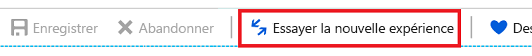
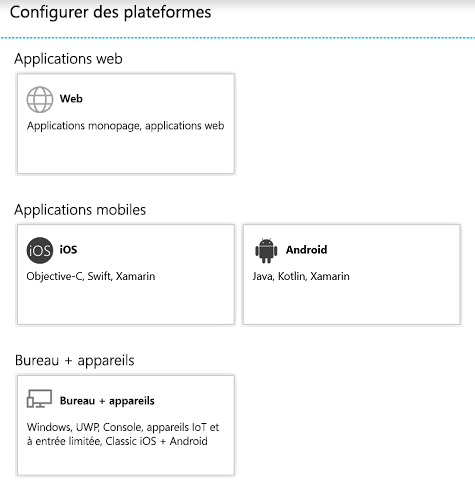

# Démarrage rapide : Configurer une application cliente pour accéder à une API web

Dans ce guide de démarrage rapide, vous allez ajouter des URI de redirection, des informations d’identification ou des autorisations afin d’accéder aux API web pour votre application. Une application cliente web ou confidentielle doit établir des informations d’identification sécurisées afin de pouvoir participer à un flux d’octroi d’autorisations qui nécessite une authentification. La méthode d’authentification par défaut prise en charge par le portail Azure est l’ID Client + la clé secrète. L’application obtient un jeton d’accès au cours de ce processus.

Avant qu’un client puisse accéder à une API web exposée par une application de ressources, telle que l’API Microsoft Graph, le framework de consentement permet au client d’obtenir les autorisations nécessaires demandées. Par défaut, toutes les applications peuvent demander des autorisations à partir de l’API Microsoft Graph.

## Prérequis

* Compte Azure avec un abonnement actif. [Créez un compte gratuitement](https://azure.microsoft.com/free/?WT.mc_id=A261C142F).
* Exécution du [Démarrage rapide : Configurer une application pour exposer une API web](quickstart-configure-app-expose-web-apis.md).

## Connectez-vous au portail Azure puis sélectionnez l’application

1. Connectez-vous au [portail Azure](https://portal.azure.com) avec un compte professionnel ou scolaire ou avec un compte personnel Microsoft.
1. Si votre compte vous permet d’accéder à plusieurs locataires, sélectionnez-le dans le coin supérieur droit. Définissez votre session de portail sur le locataire Azure AD de votre choix.
1. Recherchez et sélectionnez **Azure Active Directory**. Sous **Gérer**, sélectionnez **Inscriptions des applications**.
1. Recherchez et sélectionnez l’application que vous souhaitez configurer. Une fois l’application sélectionnée, vous pourrez voir sa **Vue d’ensemble** ou sa page d’inscription principale.

Appliquez les procédures suivantes pour configurer votre application afin d’accéder aux API web.

## Ajouter des URI de redirection à votre application

Vous pouvez ajouter des URI de redirection personnalisés et des URI de redirection suggérés à votre application. Pour ajouter un URI de redirection personnalisé pour des applications web et clientes publiques :

1. Dans la page **Vue d’ensemble** de l’application, sélectionnez **Authentification**.
1. Recherchez **URI de redirection**. Vous devrez peut-être sélectionner **Revenir à l’ancienne expérience**.
1. Sélectionnez le type d’application que vous créez : **Web** ou **Client public/natif (mobile bureau)** .
1. Entrez l’URI de redirection de votre application.

   * Pour les applications web, indiquez l’URL de base de votre application. Par exemple, `http://localhost:31544` peut être l’URL pour une application web en cours d’exécution sur votre ordinateur local. Les utilisateurs peuvent utiliser cette URL pour se connecter à une application web cliente.
   * Pour les applications publiques, indiquez l’URI utilisé par Azure AD pour retourner les réponses de jeton. Saisissez une valeur spécifique à votre application, par exemple `https://MyFirstApp`.
1. Sélectionnez **Enregistrer**.

Pour choisir parmi les URI de redirection suggérés pour les clients publics, effectuez les étapes suivantes :

1. Dans la page **Vue d’ensemble** de l’application, sélectionnez **Authentification**.
1. Recherchez **URI de redirection suggérées pour les clients publics (mobile, ordinateur de bureau)** . Vous devrez peut-être sélectionner **Revenir à l’ancienne expérience**.
1. Sélectionnez un ou plusieurs URI de redirection pour votre application. Vous pouvez également entrer un URI de redirection personnalisé. Si vous n’êtes pas sûr de ce qu’il faut utiliser, consultez la documentation de la bibliothèque.
1. Sélectionnez **Enregistrer**.

Certaines restrictions s’appliquent aux URI de redirection. Pour plus d’informations, consultez [Limitations et restrictions des URL de réponse/URI de redirection](./reply-url.md).

> [!NOTE]
> Essayez la nouvelle expérience des paramètres d’**authentification** vous permettant de configurer les paramètres de votre application en fonction de la plateforme ou du périphérique que vous souhaitez cibler.
>
> Pour afficher cette vue, sélectionnez **Essayer la nouvelle expérience** dans la page **Authentification**.
>
> 
>
> Vous accédez alors à la [nouvelle page **Configurations de plateforme**](#configure-platform-settings-for-your-application).

### Configurer les paramètres avancés pour votre application

Selon l’application que vous enregistrez, vous devrez peut-être configurer des paramètres supplémentaires, tels que :

* **URL de déconnexion**.
* Pour les applications à page unique, vous pouvez activer **Octroi implicite** et sélectionner les jetons que vous souhaitez que le point de terminaison d’autorisation émette.
* Pour les applications de bureau qui acquièrent des jetons avec l’authentification Windows intégrée, le flux de code d’appareil ou le nom d’utilisateur/mot de passe dans la section **Type de client par défaut**, affectez la valeur **Oui** à **Considérer l’application comme un client public**.
* Pour que les applications héritées qui utilisaient le kit de développement logiciel (SDK) Live puissent s’intégrer au service de compte Microsoft, configurez **Support du Kit SDK Live**. Les nouvelles applications n’ont pas besoin de ce paramètre.
* **Type de client par défaut**.
* **Types de comptes pris en charge**.

### Modifier les types de comptes pris en charge

Les **types de comptes pris en charge** spécifient qui peut utiliser l’application ou accéder à l’API.

Si vous avez configuré les types de comptes pris en charge lors de l’inscription de l’application, vous pouvez uniquement modifier ce paramètre à l’aide de l’éditeur de manifeste de l’application dans les cas suivants :

* Vous modifiez les types de comptes de **AzureADMyOrg** ou **AzureADMultipleOrgs** à **AzureADandPersonalMicrosoftAccount**, ou inversement, ou
* Vous modifiez les types de comptes de **AzureADMyOrg** à **AzureADMultipleOrgs**, ou inversement.

Pour modifier les types de comptes pris en charge pour une inscription d’application existante, mettez à jour la clé `signInAudience`. Pour plus d’informations, consultez [Configurer le manifeste de l’application](reference-app-manifest.md#configure-the-app-manifest).

## Configurer les paramètres de plateforme pour votre application

Pour configurer les paramètres de l’application en fonction de la plateforme ou du périphérique ciblé :

1. Dans la page **Configurations de plateforme**, sélectionnez **Ajouter une plateforme**, puis choisissez l’une des options disponibles.

   

1. Entrez les informations sur les paramètres en fonction de la plateforme que vous avez sélectionnée.

   | Plateforme                | Paramètres de configuration            |
   |-------------------------|-----------------------------------|
   | **Web**              | Entrez l’**URI de redirection** de votre application. |
   | **iOS / macOS**              | Entrez l’**ID de bundle** de l’application, que vous trouverez dans Xcode dans Info.plist ou Paramètres de build. L’ajout de l’ID d’offre groupée crée automatiquement un URI de redirection pour l’application. |
   | **Android**          | Indiquez le **Nom du package** de l’application, que vous trouverez dans le fichier AndroidManifest.xml. Générez et entrez le **Hachage de la signature**. L’ajout du code de hachage de la signature crée automatiquement un URI de redirection pour l’application.  |
   | **Applications de bureau et mobiles**  | facultatif. Sélectionnez l’un des **URI de redirection suggérés** si vous créez des applications pour des ordinateurs de bureau et des appareils. facultatif. Entrez un **URI de redirection personnalisé**, qui sert d’emplacement vers lequel Azure AD redirige les utilisateurs en réponse aux demandes d’authentification. Par exemple, pour les applications .NET Core pour lesquelles vous souhaitez une interaction, utilisez `http://localhost`. |

   > [!NOTE]
   > Sur Active Directory Federation Services (AD FS) et Azure AD B2C, vous devez également spécifier un numéro de port.  Par exemple : `http://localhost:1234`.

   > [!IMPORTANT]
   > Pour les applications mobiles qui n’utilisent pas la dernière bibliothèque MSAL (Microsoft Authentication Library) ou un répartiteur, vous devez configurer les URI de redirection pour ces applications dans **Bureau + appareils**.

Selon la plateforme que vous avez choisie, vous pouvez configurer des paramètres supplémentaires. Pour les applications **Web**, vous pouvez :

* Ajouter d’autres URI de redirection
* Configurer **Octroi implicite** pour sélectionner les jetons que vous souhaitez publier par le point de terminaison d’autorisation :

  * Pour les applications à page unique, sélectionnez **Jetons d’accès** et **Jetons d’ID**
  * Pour les applications Web, sélectionnez **Jetons d’ID**

## Ajouter des informations d’identification à votre application web

Pour ajouter des informations d’identification à votre application web, ajoutez un certificat ou créez une clé secrète client. Pour ajouter un certificat :

1. Dans la page **Vue d’ensemble** de l’application, sélectionnez la section **Certificats et secrets**.
1. Sélectionnez **Charger un certificat**.
1. Sélectionnez le fichier que vous voulez charger. Il doit s’agir d’un fichier de type .cer, .pem ou .crt.
1. Sélectionnez **Ajouter**.

Pour ajouter une clé secrète client

1. Dans la page **Vue d’ensemble** de l’application, sélectionnez la section **Certificats et secrets**.
1. Sélectionnez **Nouveau secret client**.
1. Ajoutez une description pour votre clé secrète client.
1. Sélectionnez une durée.
1. Sélectionnez **Ajouter**.

> [!NOTE]
> Après avoir enregistré les modifications de configuration, la colonne située le plus à droite contient la valeur de la clé secrète client. **Veillez à copier la valeur** pour l’utiliser dans le code de votre application cliente, car elle ne sera plus accessible dès que vous aurez quitté cette page.

## Ajouter des autorisations pour accéder aux API web

L’autorisation [Activer la connexion et lire le profil utilisateur](https://developer.microsoft.com/graph/docs/concepts/permissions_reference#user-permissions) de l’API Graph est sélectionnée par défaut. Vous pouvez choisir parmi [deux types d’autorisations](developer-glossary.md#permissions) pour chaque API web :

* **Autorisations de l’application**. Votre application cliente doit accéder à l’API web directement en tant que telle, sans contexte utilisateur. Ce type d’autorisation nécessite le consentement de l’administrateur. Cette autorisation n’est pas disponible pour les applications clientes de bureau et mobiles.
* **Autorisations déléguées**. votre application cliente doit accéder à l’API web en tant qu’utilisateur connecté, mais avec un accès limité par l’autorisation sélectionnée. Ce type d'autorisation peut être accordé par un utilisateur, à moins que l'autorisation nécessite le consentement de l'administrateur.

  > [!NOTE]
  > L’ajout d’une autorisation déléguée à une application n’accorde pas automatiquement un consentement aux utilisateurs du client. Les utilisateurs doivent donner manuellement leur consentement pour les autorisations déléguées ajoutées lors de l’exécution, à moins que l’administrateur ne donne son consentement au nom de tous les utilisateurs.

Pour ajouter des autorisations d’accéder aux API de ressources à partir de votre client

1. Dans la page **Vue d’ensemble** de l’application, sélectionnez **API autorisées**.
1. Sous **Autorisations configurées**, sélectionnez **Ajouter une autorisation**.
1. Par défaut, la vue vous permet de faire votre choix parmi des **API Microsoft**. Sélectionnez la section d’API qui vous intéresse :

    * **API Microsoft**. Vous permet de sélectionner les autorisations pour des API Microsoft telles que Microsoft Graph.
    * **API utilisées par mon organisation**. Vous permet de sélectionner les autorisations pour les API exposées par votre organisation, ou des API que votre organisation a intégrées.
    * **Mes API**. Vous permet de sélectionner les autorisations pour les API que vous exposez.

1. Une fois que vous avez sélectionné les API, vous accédez à la page **Demander des autorisations d’API**. Si l’API expose à la fois des autorisations déléguées et des autorisations d’applications, sélectionnez le type d’autorisation nécessaire pour votre application.
1. Lorsque vous avez terminé, sélectionnez **Ajouter des autorisations**.

Vous revenez à la page **API autorisées**. Les autorisations ont été enregistrées et ajoutées à la table.

## Compréhension des autorisations d'API et de l’interface utilisateur du consentement administrateur

### Autorisations configurées

Cette section présente les autorisations qui ont été configurées explicitement sur l’objet d’application. Ces autorisations font partie de la liste d’accès aux ressources requises de l’application. Vous pouvez ajouter ou supprimer des autorisations de cet tableau. En tant qu’administrateur, vous pouvez également accorder ou révoquer le consentement d’administrateur pour un ensemble d’autorisations d’API ou d’autorisations individuelles.

### Autres autorisations accordées

Si votre application est inscrite dans un locataire, vous pouvez voir une section supplémentaire intitulée **Autres autorisations accordées pour le locataire**. Cette section présente les autorisations accordées pour le locataire qui n’ont pas été explicitement configurées sur l’objet d’application. Ces autorisations ont été demandées et accordées dynamiquement. Cette section s’affiche uniquement s’il existe au moins une autorisation qui s’applique.

Vous pouvez ajouter un ensemble d’autorisations d’API ou des autorisations individuelles qui s’affichent dans cette section à la section **Autorisations configurées**. En tant qu’administrateur, vous pouvez également révoquer le consentement de l’administrateur pour des API ou des autorisations individuelles dans cette section.

### Bouton de consentement administrateur

Si votre application est inscrite dans un locataire, un bouton **Accorder le consentement administrateur pour le locataire** est visible. Il est désactivé si vous n’êtes pas administrateur ou si aucune autorisation n’a été configurée pour l’application.
Ce bouton permet à un administrateur d’accorder le consentement administrateur aux autorisations configurées pour l’application. En cliquant sur le bouton de consentement administrateur, vous lancez une nouvelle fenêtre avec une invite de consentement qui affiche toutes les autorisations configurées.

> [!NOTE]
> Il y a un délai entre les autorisations configurées pour l’application et celles figurant sur l’invite de consentement. Si vous ne voyez pas toutes les autorisations configurées dans l’invite de consentement, fermez-l’invite et relancez-la.

Si vous disposez d’autorisations qui ont été accordées mais non configurées, le bouton de consentement de l’administrateur vous invite à gérer ces autorisations. Vous pouvez les ajouter aux autorisations configurées ou vous pouvez les supprimer.

L’invite de consentement donne la possibilité d’**accepter** ou d’**annuler**. Sélectionnez **Accepter** pour accorder le consentement de l’administrateur. Si vous sélectionnez **Annuler**, le consentement de l’administrateur n’est pas accordé. Un message d’erreur indique que le consentement a été refusé.

> [!NOTE]
> Il y a un délai entre l’octroi du consentement administrateur par la sélection du bouton **Accepter** à l’invite de consentement et le moment où l’état du consentement administrateur est reflété dans le portail.

## Étapes suivantes

Passez au démarrage rapide suivant de la série pour savoir comment configurer les types de compte pouvant accéder à votre application. Par exemple, vous souhaiterez peut-être limiter l’accès aux seuls utilisateurs de votre organisation (locataire unique) ou autoriser les utilisateurs d’autres locataires Azure AD (multilocataire) et ceux avec des comptes personnels Microsoft (MSA).

> [!div class="nextstepaction"]
> [Modifier les comptes pris en charge par une application](quickstart-modify-supported-accounts.md)