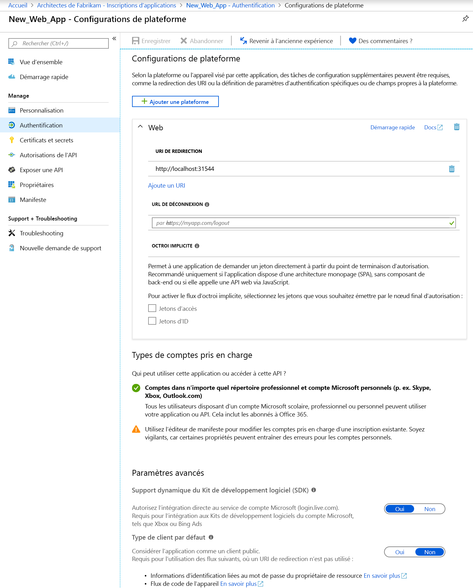

# Démarrage rapide : Configurer une application cliente pour accéder aux API web

Une application cliente web/confidentielle doit établir des informations d’identification sécurisées afin de pouvoir participer à un flux d’octroi d’autorisations qui requiert une authentification. La méthode d’authentification par défaut prise en charge par le portail Azure est l’ID Client + la clé secrète.

En outre, avant qu’un client puisse accéder à une API web exposée par une application de ressources (comme l’API Microsoft Graph), l’infrastructure de consentement permet au client d’obtenir l’autorisation nécessaire en fonction des autorisations demandées. Par défaut, toutes les applications peuvent choisir des autorisations à partir de l’API Microsoft Graph. [L’autorisation « Connexion et lecture du profil utilisateur » de API Graph](https://developer.microsoft.com/graph/docs/concepts/permissions_reference#user-permissions) est sélectionnée par défaut. Vous pouvez choisir à partir de [deux types d’autorisations](developer-glossary.md#permissions) pour chaque API web souhaitée :

* **Permissions d’application** : votre application cliente doit accéder à l’API web directement en tant que telle (aucun contexte utilisateur). Ce type d’autorisation requiert le consentement de l’administrateur et n’est également pas disponible pour les applications clientes publiques (bureau et mobiles).
* **Permissions déléguées** : votre application cliente doit accéder à l’API web en tant qu’utilisateur connecté, mais avec un accès limité par l’autorisation sélectionnée. Ce type d'autorisation peut être accordé par un utilisateur, à moins que l'autorisation nécessite le consentement de l'administrateur.

  > [!NOTE]
  > L’ajout d’une autorisation déléguée à une application n’accorde pas automatiquement un consentement aux utilisateurs du client. Les utilisateurs doivent donner manuellement leur consentement pour les autorisations déléguées ajoutées lors de l’exécution, à moins que l’administrateur ne donne son consentement au nom de tous les utilisateurs.

Dans ce guide de démarrage rapide, nous allons vous montrer comment configurer votre application pour :

* [Ajouter des URI de redirection à votre application](#add-redirect-uris-to-your-application)
* [Configurer les paramètres avancés pour votre application](#configure-advanced-settings-for-your-application)
* [Modifier les types de comptes pris en charge](#modify-supported-account-types)
* [Ajouter des informations d’identification à votre application web](#add-credentials-to-your-web-application)
* [Ajouter des autorisations pour accéder aux API web](#add-permissions-to-access-web-apis)

## Prérequis

Pour commencer, assurez-vous de remplir ces conditions préalables :

* Découvrez les [autorisations et consentement](v2-permissions-and-consent.md) pris en charge qu’il est important de comprendre lors de la création d’applications devant être utilisées par d’autres utilisateurs ou applications.
* Disposez d’un locataire auprès duquel des applications sont inscrites.
  * Si vous n’avez pas d’applications inscrites, [découvrez comment inscrire des applications à l’aide de la plateforme d’identité Microsoft](quickstart-register-app.md).

## Connectez-vous au portail Azure puis sélectionnez l’application

Avant de pouvoir configurer l’application, procédez comme suit :

1. Connectez-vous au [portail Azure](https://portal.azure.com) avec un compte professionnel ou scolaire ou avec un compte personnel Microsoft.
1. Si votre compte vous propose un accès à plusieurs locataires, sélectionnez votre compte en haut à droite et définissez votre session de portail sur le locataire Azure AD souhaité.
1. Recherchez et sélectionnez **Azure Active Directory**. 
1. Dans le volet gauche, sélectionnez **Inscriptions d’applications**.
1. Recherchez et sélectionnez l’application que vous souhaitez configurer. Une fois l’application sélectionnée, vous pourrez voir sa **présentation** ou sa page d’inscription principale.
1. Suivez les étapes pour configurer votre application pour accéder aux API web :
    * [Ajouter des URI de redirection à votre application](#add-redirect-uris-to-your-application)
    * [Configurer les paramètres avancés pour votre application](#configure-advanced-settings-for-your-application)
    * [Modifier les types de comptes pris en charge](#modify-supported-account-types)
    * [Ajouter des informations d’identification à votre application web](#add-credentials-to-your-web-application)
    * [Ajouter des autorisations pour accéder aux API web](#add-permissions-to-access-web-apis)

## Ajouter des URI de redirection à votre application

Pour ajouter un URI de redirection à votre application :

1. Sélectionnez la section **Authentification** sur la page de **présentation** de l’application.
1. Pour ajouter un URI de redirection personnalisé pour des applications web et client public, procédez comme suit :
   1. Recherchez la section **URI de redirection**.
   1. Sélectionnez le type d’application que vous créez : **Web** ou **Client public (mobile et bureau)** .
   1. Entrez l’URI de redirection de votre application.
      * Pour les applications web, indiquez l’URL de base de votre application. Par exemple, `http://localhost:31544` peut être l’URL pour une application web en cours d’exécution sur votre ordinateur local. Les utilisateurs peuvent utiliser cette URL pour se connecter à une application web cliente.
      * Pour les applications publiques, indiquez l’URI utilisé par Azure AD pour retourner les réponses de jeton. Saisissez une valeur spécifique à votre application, par exemple `https://MyFirstApp`.

1. Pour choisir parmi les URI de redirection suggérés pour les clients publics (mobile, bureau), procédez comme suit :
    1. Recherchez la section des **URI de redirection suggérés pour les clients publics (mobile, bureau)** .
    1. Sélectionnez le ou les URI de redirection approprié(s) pour votre application en cochant les cases correspondantes. Vous pouvez également entrer un URI de redirection personnalisé. Si vous n’êtes pas sûr de ce qu’il faut utiliser, consultez la documentation de la bibliothèque.

Certaines restrictions s’appliquent aux URI de redirection. Apprenez-en davantage sur les [restrictions et limitations des URI de redirection](https://docs.microsoft.com/azure/active-directory/develop/reply-url).
> [!NOTE]
> Essayez la nouvelle expérience des paramètres d’**authentification** vous permettant de configurer les paramètres de votre application en fonction de la plateforme ou du périphérique que vous souhaitez cibler.
>
> Pour afficher cette vue, sélectionnez **Essayer la nouvelle expérience** dans l’affichage de la page **Authentification** par défaut.
>
> 
>
> Vous accédez alors à la [nouvelle page **Configurations de plateforme**](#configure-platform-settings-for-your-application).

### Configurer les paramètres avancés pour votre application

Selon l’application que vous enregistrez, vous devrez peut-être configurer des paramètres supplémentaires, tels que :

* **URL de déconnexion**
* Pour les applications à page unique, vous pouvez activer **Octroi implicite** et sélectionner les jetons que vous souhaitez que le point de terminaison d’autorisation émette.
* Pour les applications de bureau qui acquièrent des jetons avec l’authentification Windows intégrée, le flux de code d’appareil ou le nom d'utilisateur/mot de passe dans la section **Type de client par défaut**, configurez le paramètre **Traiter l’application comme un client public** sur **Oui**.
* Pour que les applications héritées qui utilisaient le kit de développement logiciel (SDK) Live puissent s’intégrer au service de compte Microsoft, configurez **Support du Kit SDK Live**. Les nouvelles applications n’ont pas besoin de ce paramètre.
* **Type de client par défaut**

### Modifier les types de comptes pris en charge

Les **types de comptes pris en charge** spécifient qui peut utiliser l’application ou accéder à l’API.

Une fois que vous avez [configuré les types de comptes pris en charge](quickstart-register-app.md) lors de l’inscription initiale de l’application, vous pouvez uniquement modifier ce paramètre à l’aide de l’éditeur de manifeste de l’application dans les cas suivants :

* Vous modifiez les types de comptes de **AzureADMyOrg** ou **AzureADMultipleOrgs** à **AzureADandPersonalMicrosoftAccount**, ou inversement.
* Vous modifiez les types de comptes de **AzureADMyOrg** à **AzureADMultipleOrgs**, ou inversement.

Pour modifier les types de comptes pris en charge pour une inscription d’application existante :

* Consultez [Configurer le manifeste de l’application](reference-app-manifest.md) et mettez à jour la clé `signInAudience`.

## Configurer les paramètres de plateforme pour votre application

Pour configurer les paramètres de l’application en fonction de la plateforme ou du périphérique ciblé :

1. Dans la page **Configurations de plateforme**, sélectionnez **Ajouter une plateforme**, puis choisissez l’une des options disponibles.

   

1. Entrez les informations sur les paramètres en fonction de la plateforme que vous avez sélectionnée.

   | Plateforme                | Choices              | Paramètres de configuration            |
   |-------------------------|----------------------|-----------------------------------|
   | **Applications web**    | **Web**              | Entrez l’**URI de redirection** de votre application. |
   | **Applications mobiles** | **iOS**              | Entrez l’**ID d’offre groupée** de l’application, que vous pouvez trouver dans Xcode dans Info.plist ou Paramètres de build. L’ajout de l’ID d’offre groupée crée automatiquement un URI de redirection pour l’application. |
   |                         | **Android**          | * Indiquez le **nom du package** de l’application, que vous trouverez dans le fichier AndroidManifest.xml. * Générez et entrez le **code de hachage de la signature**. L’ajout du code de hachage de la signature crée automatiquement un URI de redirection pour l’application.  |
   | **Bureau + appareils**   | **Bureau + appareils** | * Facultatif. Sélectionnez l’un des **URI de redirection suggérés** si vous créez des applications pour des ordinateurs de bureau et des appareils. * Facultatif. Entrez un **URI de redirection personnalisé**, qui sert d’emplacement vers lequel Azure AD redirige les utilisateurs en réponse aux demandes d’authentification. Par exemple, pour les applications .NET Core pour lesquelles vous souhaitez une interaction, utilisez `https://localhost`. |

   > [!IMPORTANT]
   > Pour les applications mobiles qui n’utilisent pas la dernière bibliothèque MSAL ou un répartiteur, vous devez configurer les URI de redirection pour ces applications dans **Bureau + appareils**.

1. Selon la plateforme que vous avez choisie, vous pouvez configurer des paramètres supplémentaires. Pour les applications **Web**, vous pouvez :
    * Ajouter d’autres URI de redirection
    * Configurer **Octroi implicite** pour sélectionner les jetons que vous souhaitez publier par le point de terminaison d’autorisation :
        * Pour les applications à page unique, sélectionnez **Jetons d’accès** et **Jetons d’ID**
        * Pour les applications Web, sélectionnez **Jetons d’ID**

## Ajouter des informations d’identification à votre application web

Pour ajouter des informations d’identification à votre application web :

1. Sélectionnez la section **Certificats et secrets** sur la page de **présentation** de l’application.

1. Pour ajouter un certificat, procédez comme suit :

    1. Sélectionnez **Charger un certificat**.
    1. Sélectionnez le fichier que vous voulez charger. Il doit s’agir d’un fichier de type .cer, .pem ou .crt.
    1. Sélectionnez **Ajouter**.

1. Pour ajouter une clé secrète client, procédez comme suit :

    1. Sélectionnez **Nouveau secret client**.
    1. Ajoutez une description pour votre clé secrète client.
    1. Sélectionnez une durée.
    1. Sélectionnez **Ajouter**.

> [!NOTE]
> Après avoir enregistré les modifications de configuration, la colonne située le plus à droite contient la valeur de la clé secrète client. **Veillez à copier la valeur** pour l’utiliser dans le code de votre application cliente, car elle ne sera plus accessible dès que vous aurez quitté cette page.

## Ajouter des autorisations pour accéder aux API web

Pour ajouter des autorisations d’accéder aux API de ressources à partir de votre client :

1. Sélectionner la section **Autorisations API** sur la **page de présentation** de l’application.
1. Sous la section **Autorisations configurées**, sélectionnez le bouton **Ajouter une autorisation**.
1. Par défaut, la vue vous permet de faire votre choix parmi des **API Microsoft**. Sélectionnez la section d’API qui vous intéresse :
    * **API Microsoft** : vous permet de sélectionner les autorisations pour des API Microsoft telles que Microsoft Graph.
    * **API utilisées par mon organisation** : vous permet de sélectionner les autorisations pour les API qui ont été exposées par votre organisation, ou des API que votre organisation a intégrées.
    * **Mes API** : vous permet de sélectionner les autorisations pour les API que vous avez exposées.
1. Une fois que vous avez sélectionné les API, vous accédez à la page **Demander des autorisations d’API**. Si l’API expose à la fois des autorisations déléguées et des autorisations d’applications, sélectionnez le type d’autorisation nécessaire pour votre application.
1. Lorsque vous avez terminé, sélectionnez **Ajouter des autorisations**. Vous revenez alors à la page **Autorisations d’API**, dans laquelle les autorisations ont été enregistrées et ajoutées à la table.

## Compréhension des autorisations d'API et de l’interface utilisateur du consentement administrateur

### Autorisations configurées

Cette section présente les autorisations qui ont été configurées explicitement sur l’objet d’application (les autorisations qui font partie de la liste d’accès aux ressources requises de l’application). Vous pouvez ajouter ou supprimer des autorisations de cet tableau. En tant qu’administrateur, vous pouvez également accorder/révoquer le consentement d’administrateur pour un ensemble d’autorisations d’API ou d’autorisations individuelles dans cette section.

### Autres autorisations accordées

Si votre application est inscrite dans un locataire, vous pouvez voir une section supplémentaire intitulée **Autres autorisations accordées pour le locataire**. Cette section présente les autorisations qui ont été accordées pour le locataire, mais qui n’ont pas été explicitement configurées sur l’objet d’application (par exemple, les autorisations qui ont été demandées et convenues dynamiquement). Cette section s’affiche uniquement s’il existe au moins une autorisation qui s’applique.

Vous pouvez ajouter un ensemble d’autorisations d’API ou des autorisations individuelles qui s’affichent dans cette section à la section **Autorisations configurées**. En tant qu’administrateur, vous pouvez également révoquer le consentement de l’administrateur pour des API ou des autorisations individuelles dans cette section.

### Bouton de consentement administrateur

Si votre application est inscrite dans un locataire, vous verrez un bouton **Accorder le consentement administrateur pour le locataire**. Elle sera désactivée si vous n’êtes pas administrateur ou si aucune autorisation n’a été configurée pour l’application.
Ce bouton permet à un administrateur d’accorder facilement le consentement administrateur aux autorisations configurées pour l’application. En cliquant sur le bouton de consentement administrateur, vous lancez une nouvelle fenêtre avec une invite de consentement qui affiche toutes les autorisations configurées.

> [!NOTE]
> Il y a un délai entre les autorisations configurées pour l’application et celles figurant sur l’invite de consentement. Si vous ne voyez pas toutes les autorisations configurées dans l’invite de consentement, fermez-l’invite et relancez-la.

Si vous disposez d’autorisations qui ont été accordées mais non configurées, lorsque vous cliquez sur le bouton de consentement administrateur, vous êtes invité à décider comment gérer ces autorisations. Vous pouvez les ajouter aux autorisations configurées ou vous pouvez les supprimer.

L’invite de consentement donne la possibilité d’**accepter** ou d’**annuler**. Si vous sélectionnez **Accepter**, le consentement administrateur est accordé. Si vous sélectionnez **Annuler**, le consentement administrateur n’est pas accordé et une erreur s’affiche indiquant que le consentement a été refusé.

> [!NOTE]
> Il y a un délai entre l’octroi du consentement administrateur (sélection d’**Accepter** sur l’invite de consentement) et l’état du consentement administrateur à être reflété dans l’interface utilisateur.

## Étapes suivantes

Découvrez les autres démarrages rapides relatifs à la gestion des applications pour les applications :

* [Inscrire une application à l’aide de la plateforme d’identités Microsoft](quickstart-register-app.md)
* [Configurer une application pour exposer les API web](quickstart-configure-app-expose-web-apis.md)
* [Modifier les comptes pris en charge par une application](quickstart-modify-supported-accounts.md)
* [Supprimer une application inscrite à l’aide de la plateforme d’identité Microsoft](quickstart-remove-app.md)

Pour en savoir plus sur les deux objets Azure AD représentant une application inscrite et la relation entre ces objets, consultez [Objets application et principal du service dans Azure Active Directory (Azure AD)](app-objects-and-service-principals.md).

Pour en savoir plus sur les directives de personnalisation que vous devez suivre lors du développement d’applications avec Azure Active Directory, consultez [Directives de personnalisation des applications](howto-add-branding-in-azure-ad-apps.md).
