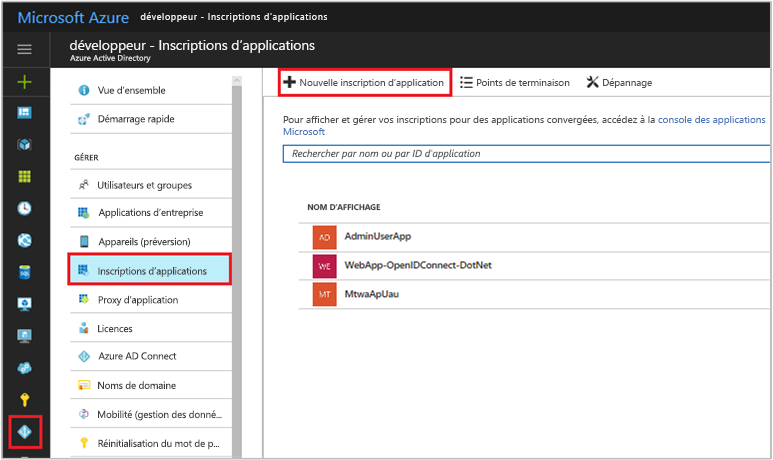
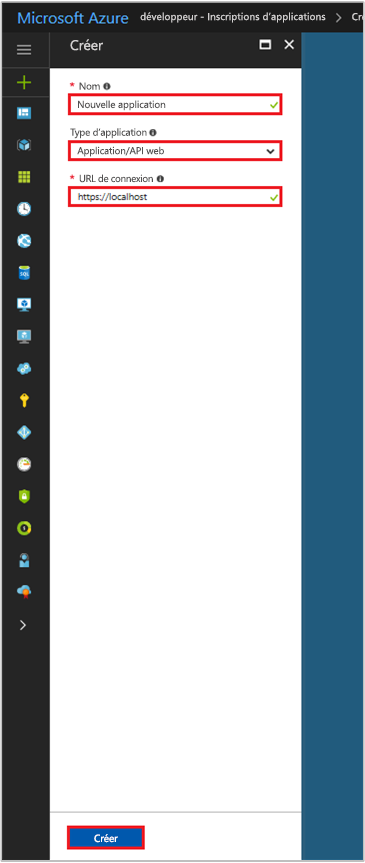

# Démarrage rapide : Inscrire une application auprès du point de terminaison Azure Active Directory v1.0

[!INCLUDE [active-directory-develop-applies-v1](../../../includes/active-directory-develop-applies-v1.md)]

Les développeurs et les fournisseurs de logiciels en tant que service (SaaS) peuvent développer des services cloud commerciaux ou des applications métier qui peuvent être intégrés à Azure Active Directory (Azure AD) pour fournir un processus de connexion et d’autorisation sécurisé à leurs services. Pour intégrer une application ou un service à Azure AD, le développeur doit d’abord enregistrer l’application auprès de Azure AD.

Toute application qui souhaite utiliser les fonctionnalités d’Azure AD doit d’abord être enregistrée dans un locataire Azure AD. Le processus d'enregistrement implique de fournir à Azure AD des informations sur votre application, notamment l'URL où elle est située, l'URL à laquelle envoyer une réponse après avoir authentifié un utilisateur, l'URI qui identifie l'application, et ainsi de suite.

Ce guide de démarrage rapide vous montre comment ajouter et inscrire une application dans Azure AD à l’aide de l’expérience **Inscriptions d’applications** dans le portail Azure.

> [!NOTE]
> Inscription d’une nouvelle application ? Essayez la nouvelle expérience **Inscriptions d’applications (préversion)** dans le portail Azure. Consultez [Inscrire une application (préversion)](quickstart-register-app.md) pour commencer.

## Prérequis

Pour commencer, assurez-vous d’avoir un locataire Azure AD auprès duquel inscrire vos applications. Si vous ne disposez pas encore d’un client, [découvrez comment en obtenir un](quickstart-create-new-tenant.md).

## Inscrire une nouvelle application à l’aide du Portail Azure

1. Connectez-vous au [Portail Azure](https://portal.azure.com).
1. Si votre compte vous propose plusieurs accès, sélectionnez votre compte en haut à droite et définissez votre session de portail sur le locataire Azure AD souhaité.
1. Sélectionnez le service **Azure Active Directory** dans le volet de navigation gauche.
1. Sélectionnez **Inscriptions des applications**, puis **Nouvelle inscription d’application**.

    

1. Lorsque la page **Créer** s’affiche, saisissez les informations d’inscription de votre application : 

    - **Nom :** saisissez un nom d’application explicite
    - **Type d’application :**
      - Sélectionnez **Native** pour les [applications clientes](developer-glossary.md#client-application) installées localement sur un appareil. Ce paramètre est utilisé pour les [clients natifs](developer-glossary.md#native-client) publics OAuth.
      - Sélectionnez **Application Web / API** pour les [applications clientes](developer-glossary.md#client-application) et les [ressources/applications API](developer-glossary.md#resource-server) installées sur un serveur sécurisé. Ce paramètre est utilisé pour les [clients web](developer-glossary.md#web-client) confidentiels OAuth et les [clients basés sur un agent utilisateur](developer-glossary.md#user-agent-based-client) publics. La même application peut également exposer un client et une ressource/API.
    - **URL de connexion** : pour les applications de type « Application web / API », indiquez l’URL de base de votre application. Par exemple, `http://localhost:31544` peut être l’URL pour une application web en cours d’exécution sur votre ordinateur local. Les utilisateurs peuvent utiliser cette URL pour se connecter à une application web cliente. 
    - **URI de redirection :** pour les applications « natives », indiquez un URI de redirection utilisé par Azure AD pour retourner les réponses de jeton. Saisissez une valeur spécifique à votre application, par exemple `http://MyFirstAADApp`

      

    Si vous souhaitez des exemples spécifiques pour les applications web ou natives, consultez les **démarrages rapides** dans notre documentation.

1. Quand vous avez terminé, sélectionnez **Créer**.

    Azure AD assigne un ID d’application unique à votre application, et vous êtes redirigé vers la page d’enregistrement principale de votre application. Selon que votre application est une application native ou web, différentes options sont disponibles afin d’ajouter des fonctionnalités supplémentaires à votre application.

      > [!NOTE]
      > Par défaut, une application web nouvellement inscrite est configurée pour autoriser **uniquement** les utilisateurs du même locataire à se connecter à votre application.

## Étapes suivantes

- Consultez [Fonctionnement du consentement d’application](consent-framework.md) pour une présentation du consentement.
- Pour activer des fonctionnalités de configuration supplémentaires dans l’inscription de votre application (par exemple, informations d’identification, autorisations, activation de la connexion pour les utilisateurs à partir d’autres locataires), consultez [Quickstart: Update an application in Azure Active Directory](quickstart-v1-update-azure-ad-app.md) (Démarrage rapide : Mettre à jour une application dans Azure AD).
- Pour en savoir plus sur les deux objets Azure AD représentant une application inscrite et la relation entre ces objets, consultez [Objets application et principal du service dans Azure Active Directory (Azure AD)](app-objects-and-service-principals.md).
- Pour en savoir plus sur les directives de personnalisation que vous devez suivre lors du développement d’applications avec Azure Active Directory, consultez [Directives de personnalisation des applications](howto-add-branding-in-azure-ad-apps.md).
