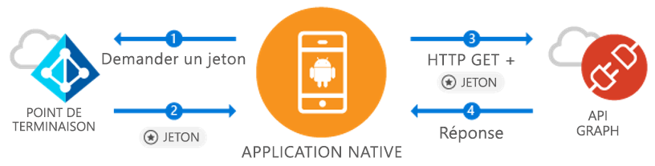

# <a name="quickstart-sign-in-users-and-call-the-microsoft-graph-api-from-an-android-app"></a>Démarrage rapide : Connecter des utilisateurs et appeler l’API Microsoft Graph à partir d’une application Android

[!INCLUDE [active-directory-develop-applies-v1-adal](../../../includes/active-directory-develop-applies-v1-adal.md)]

Si vous développez une application Android, Microsoft simplifie et facilite la connexion d’utilisateurs Azure Active Directory (Azure AD). Azure AD permet à votre application d’accéder à des données utilisateur via Microsoft Graph ou votre propre API web protégée.

La bibliothèque Android ADAL (Azure AD Authentication Library) permet à votre application de commencer à utiliser [Microsoft Azure Cloud](https://cloud.microsoft.com) et [l’API Microsoft Graph](https://developer.microsoft.com/graph) en prenant en charge des [comptes Microsoft Azure Active Directory](https://azure.microsoft.com/services/active-directory/) dans le respect des normes OAuth 2.0 et OpenID Connect.

Dans ce guide de démarrage rapide, vous apprenez à :

* Obtenir un jeton pour Microsoft Graph
* Actualiser un jeton
* Appeler Microsoft Graph
* Déconnecter l’utilisateur

## <a name="prerequisites"></a>Prérequis

Pour commencer, vous avez besoin d’un client Azure AD dans lequel vous pouvez créer des utilisateurs et inscrire une application. Si vous ne disposez pas encore d’un client, [découvrez comment en obtenir un](quickstart-create-new-tenant.md).

## <a name="scenario-sign-in-users-and-call-the-microsoft-graph"></a>Scénario : connecter des utilisateurs et appeler Microsoft Graph



Vous pouvez utiliser cette application pour tous les comptes Azure AD. Elle prend en charge les scénarios avec un ou plusieurs locataires (présentés dans les étapes). Ce guide vous montre comment créer des applications à connecter à des utilisateurs professionnels, et accéder à leurs données Azure +O365 via Microsoft Graph. Pendant le flux d’authentification, les utilisateurs finaux sont invités à se connecter et à accepter les autorisations de l’application. Dans certains cas, ils peuvent demander à un administrateur d’accepter les conditions d’utilisation de l’application. L’essentiel de la logique dans cet exemple montre comment authentifier un utilisateur final et établir un appel de base à Microsoft Graph.

## <a name="sample-code"></a>Exemple de code

L’exemple complet de code est disponible [sur GitHub](https://github.com/Azure-Samples/active-directory-android).

```Java
// Initialize your app with MSAL
AuthenticationContext mAuthContext = new AuthenticationContext(
        MainActivity.this,
        AUTHORITY,
        false);


// Perform authentication requests
mAuthContext.acquireToken(
    getActivity(),
    RESOURCE_ID,
    CLIENT_ID,
    REDIRECT_URI,
    PromptBehavior.Auto,
    getAuthInteractiveCallback());

// ...

// Get tokens to call APIs like the Microsoft Graph
mAuthResult.getAccessToken()
```

## <a name="step-1-register-and-configure-your-app"></a>Étape 1 : Inscrire et configurer votre application

Vous devez disposer d’une application cliente native inscrite auprès de Microsoft via le [portail Azure](https://portal.azure.com).

1. Accès à l’inscription de l’application
    - Accédez au [portail Azure](https://aad.portal.azure.com).
    - Sélectionnez ***Azure Active Directory*** > ***Inscriptions des applications***.

2. Création de l'application
    - Sélectionnez **Nouvelle inscription d’application**.
    - Entrez un nom d’application dans le champ **Nom**.
    - Dans **Type d’application**, sélectionnez **Native**.
    - Dans **URI de redirection**, entrez `http://localhost`.

3. Configurer Microsoft Graph
    - Sélectionnez **Paramètres > Autorisations requises**.
    - Sélectionnez **Ajouter**, puis dans **Sélectionner une API**, sélectionnez ***Microsoft Graph***.
    - Sélectionnez l’autorisation **Activer la connexion et lire le profil utilisateur**, puis appuyez sur **Sélectionner** pour enregistrer.
        - Cette autorisation est mappée à l’étendue `User.Read`.
    - Facultatif : dans **Autorisations requises > Microsoft Azure Active Directory**, supprimez l’autorisation sélectionnée **Activer la connexion et lire le profil utilisateur**. Cela permet d’éviter que la page de consentement de l’utilisateur affiche deux fois l’autorisation.

4. Félicitations ! Votre application est correctement configurée. Dans la section suivante, vous aurez besoin de ce qui suit :
    - `Application ID`
    - `Redirect URI`

## <a name="step-2-get-the-sample-code"></a>Étape 2 : Obtention de l'exemple de code

1. Clonez le code
    ```
    git clone https://github.com/Azure-Samples/active-directory-android
    ```
2. Ouvrez l’exemple dans Android Studio.
    - Sélectionnez **Ouvrir un projet Android Studio**.

## <a name="step-3-configure-your-code"></a>Étape 3 : Configurer votre code

Vous pouvez trouver la configuration complète de cet exemple de code dans le fichier ***src/main/java/com/azuresamples/azuresampleapp/MainActivity.java***.

1. Remplacez la constante `CLIENT_ID` par `ApplicationID`.
2. Remplacez la constante `REDIRECT URI` par la valeur `Redirect URI` que vous avez configurée précédemment (`http://localhost`).

## <a name="step-4-run-the-sample"></a>Étape 4 : Exécution de l'exemple

1. Sélectionnez **Générer > Nettoyer le projet**.
2. Sélectionnez **Exécuter > Exécuter l’application**.
3. L’application devrait générer et afficher une interface utilisateur de base. Lorsque vous cliquez sur le bouton `Call Graph API`, vous êtes invité à vous connecter, puis l’API Microsoft Graph est appelée en mode silencieux avec le nouveau jeton.

## <a name="next-steps"></a>Étapes suivantes

1. Pour plus d’informations sur les mécanismes de la bibliothèque et la configuration de nouveaux scénarios et fonctionnalités, consultez le [Wiki ADAL pour Android](https://github.com/AzureAD/azure-activedirectory-library-for-android/wiki).
2. Dans les scénarios Natifs, l’application utilise un affichage web intégré qui ne nécessite pas de quitter l’application. La valeur `Redirect URI` peut être arbitraire.
3. Vous rencontrez des problèmes ou avez des demandes à formuler ? Vous pouvez signaler un problème ou publier sur Stack Overflow avec la balise `azure-active-directory`.

### <a name="cross-app-sso"></a>Authentification unique entre applications

Découvrez [comment activer l’authentification unique entre applications sur Android à l’aide de la bibliothèque ADAL](howto-v1-enable-sso-android.md).

### <a name="auth-telemetry"></a>Télémétrie d’authentification

La bibliothèque ADAL expose la télémétrie d’authentification pour aider les développeurs d’applications à comprendre comment leurs applications se comportent et à créer de meilleures expériences. Cela vous permet de capturer les succès de connexion, les utilisateurs actifs et quelques autres informations intéressantes. L’utilisation de la télémétrie d’authentification nécessite que les développeurs d’applications mettent en place un service de télémétrie pour agréger et stocker les événements.

Pour en savoir plus sur la télémétrie d’authentification, voir [Télémétrie d’authentification d’ADAL pour Android](https://github.com/AzureAD/azure-activedirectory-library-for-android/wiki/Telemetry).
