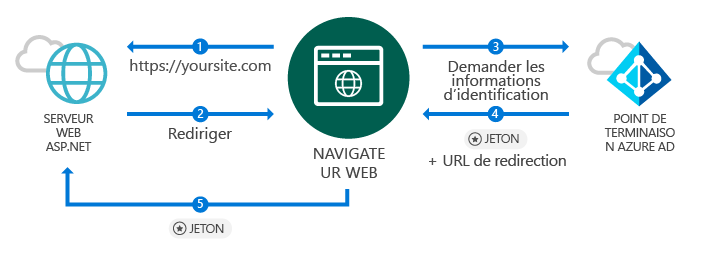
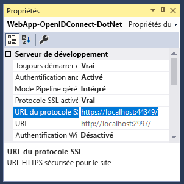
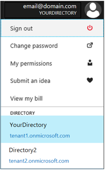
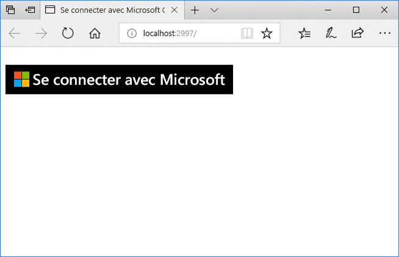

# <a name="quickstart-add-sign-in-with-microsoft-to-an-aspnet-web-app"></a>Démarrage rapide : Ajouter la connexion avec Microsoft à une application ASP.NET

[!INCLUDE [active-directory-develop-applies-v1](../../../includes/active-directory-develop-applies-v1.md)]

Dans ce démarrage rapide, vous allez apprendre comment implémenter la connexion avec Microsoft à l’aide d’une solution ASP.NET MVC avec une application basée sur un navigateur web traditionnel avec une norme OpenID Connect. Vous allez apprendre comment activer les connexions à partir de comptes professionnels et scolaires dans votre application ASP.NET.

À la fin de ce démarrage rapide, votre application acceptera les connexions des comptes professionnels et scolaires d’organisations disposant d’une intégration à Azure Active Directory (Azure AD).

> [!NOTE]
> Si vous devez activer les connexions pour les comptes personnels en plus des comptes professionnels et scolaires, vous pouvez utiliser le [point de terminaison v2.0](azure-ad-endpoint-comparison.md). Pour plus d’informations, consultez [ce didacticiel ASP.NET pour le point de terminaison v2.0](tutorial-v2-asp-webapp.md) ainsi que [cet article](active-directory-v2-limitations.md) expliquant les limitations actuelles du point de terminaison v2.0.

## <a name="prerequisites"></a>Prérequis

Pour commencer, assurez-vous de remplir ces conditions préalables :

* Visual Studio 2015 Update 3 ou Visual Studio 2017 installé. Ni l’un, ni l’autre ne sont installés sur votre ordinateur ? [Téléchargez gratuitement Visual Studio 2017](https://www.visualstudio.com/downloads/)

## <a name="scenario-sign-in-users-from-work-and-school-accounts-in-your-aspnet-app"></a>Scénario : Connecter des utilisateurs à partir de comptes professionnels et scolaires dans votre application ASP.NET



Dans ce scénario, un navigateur accède à un site web ASP.NET et demande à un utilisateur de s’authentifier à l’aide d’un bouton de connexion. Dans ce scénario, la majorité du travail pour afficher la page web se passe côté serveur.

Ce démarrage rapide guide de configuration montre comment connecter des utilisateurs à une application web ASP.NET à partir d’un modèle vide. Il comprend des étapes telles que l’ajout d’un bouton de connexion et de tous les contrôleurs et méthodes, et explique les concepts derrière ces tâches. Vous pouvez également créer un projet pour connecter des utilisateurs Azure AD (comptes professionnels et scolaires) en utilisant le [modèle web Visual Studio](https://docs.microsoft.com/aspnet/visual-studio/overview/2013/creating-web-projects-in-visual-studio#organizational-account-authentication-options) et en sélectionnant **Comptes professionnels** puis l’une des options de cloud. Cette option utilise un modèle plus riche, avec des contrôleurs, des méthodes et des vues supplémentaires.

## <a name="libraries"></a>Bibliothèques

Ce démarrage rapide utilise les packages suivants :

| Bibliothèque | Description |
|---|---|
| [Microsoft.Owin.Security.OpenIdConnect](https://www.nuget.org/packages/Microsoft.Owin.Security.OpenIdConnect/) | Intergiciel qui permet à une application d’utiliser OpenIDConnect pour l’authentification. |
| [Microsoft.Owin.Security.Cookies](https://www.nuget.org/packages/Microsoft.Owin.Security.Cookies) |Intergiciel qui permet à une application de maintenir la session utilisateur à l’aide de cookies. |
| [Microsoft.Owin.Host.SystemWeb](https://www.nuget.org/packages/Microsoft.Owin.Host.SystemWeb) | Permet aux applications basées sur OWIN de s’exécuter sur IIS à l’aide du pipeline de requête ASP.NET. |
|  |  |

## <a name="step-1-set-up-your-project"></a>Étape 1 : Configuration de votre projet

Ces étapes montrent comment installer et configurer le pipeline d’authentification via l’intergiciel OWIN sur un projet ASP.NET à l’aide d’OpenID Connect.

Pour télécharger le projet Visual Studio de cet exemple à la place, suivez ces étapes :
1. [Télécharger le projet sur GitHub](https://github.com/AzureADQuickStarts/WebApp-OpenIdConnect-DotNet/archive/GuidedSetup.zip).
1. Passez à [l’étape Configuration](#configure-your-webconfig-and-register-an-application) pour configurer l’exemple de code avant son exécution.

## <a name="step-2-create-your-aspnet-project"></a>Étape 2 : Créer votre projet ASP.NET

1. Dans Visual Studio, accédez à **Fichier -> Nouveau > Projet**.
2. Sous **Visual C#\Web**, sélectionnez **Application web ASP.NET (.NET Framework)**.
3. Donnez un nom à votre application et sélectionnez **OK**.
4. Sélectionnez **Vide** et cochez la case pour ajouter des références **MVC**.

## <a name="step-3-add-authentication-components"></a>Étape 3 : Ajouter les composants d’authentification

1. Dans Visual Studio, accédez à **Outils > Gestionnaire de package NuGet > Console du gestionnaire de package**.
2. Ajoutez **les packages NuGet de l’intergiciel OWIN** en saisissant la commande suivante dans la fenêtre Console du gestionnaire de package :

    ```powershell
    Install-Package Microsoft.Owin.Security.OpenIdConnect
    Install-Package Microsoft.Owin.Security.Cookies
    Install-Package Microsoft.Owin.Host.SystemWeb
    ```

<!--start-collapse-->
> ### <a name="about-these-packages"></a>À propos de ces packages
>Les bibliothèques ci-dessus activent l’authentification unique à l’aide d’OpenID Connect via l’authentification basée sur les cookies. Une fois que l’authentification est terminée et que le jeton qui représente l’utilisateur est envoyé à votre application, l’intergiciel OWIN crée un cookie de session. Le navigateur utilise ensuite ce cookie pour les requêtes ultérieures afin que l’utilisateur n’ait pas besoin de se réauthentifier, et aucune vérification complémentaire n’est nécessaire.
<!--end-collapse-->

## <a name="step-4-configure-the-authentication-pipeline"></a>Étape 4 : Configurer le pipeline d’authentification

Suivez ces étapes pour créer une *classe de démarrage* d’intergiciel OWIN pour configurer l’authentification OpenID Connect. Cette classe est exécutée automatiquement.

> [!TIP]
> Si votre projet n’a pas de fichier `Startup.cs` dans le dossier racine :<br/>
> 1. Faites un clic droit sur le dossier racine du projet : > **Ajouter > Nouvel élément... > Classe de démarrage OWIN**<br/>
> 2. Nommez-le `Startup.cs`.<br/>
>
>> Assurez-vous que la classe sélectionnée est une classe de démarrage OWIN et non une classe C# standard. Pour le savoir, vérifiez que `[assembly: OwinStartup(typeof({NameSpace}.Startup))]` s’affiche au-dessus de l’espace de noms.

Pour créer une *classe de démarrage* d’intergiciel OWIN :

1. Ajoutez les espaces de noms *OWIN* et *Microsoft.IdentityModel* à `Startup.cs` :

    [!code-csharp[main](../../../WebApp-OpenIDConnect-DotNet/WebApp-OpenIDConnect-DotNet/Startup.cs?name=AddedNameSpaces "Startup.cs")]

2. Remplacez la classe de démarrage par le code suivant :

    [!code-csharp[main](../../../WebApp-OpenIDConnect-DotNet/WebApp-OpenIDConnect-DotNet/Startup.cs?name=Startup "Startup.cs")]

<!--start-collapse-->
> [!NOTE]
> Les paramètres que vous fournissez dans *OpenIDConnectAuthenticationOptions* serviront de coordonnées pour que l’application puisse communiquer avec Azure AD. Vous devez également configurer l’authentification des cookies comme indiqué dans le code précédent, car l’intergiciel OpenID Connect utilise des cookies. La valeur *ValidateIssuer* indique à OpenID Connect de ne pas restreindre l’accès à une organisation spécifique.
<!--end-collapse-->

<!--end-setup-->

<!--start-use-->

## <a name="step-5-add-a-controller-to-handle-sign-in-and-sign-out-requests"></a>Étape 5 : Ajouter un contrôleur pour gérer les demandes de connexion et de déconnexion

Créez un contrôleur pour exposer les méthodes de connexion et de déconnexion.

1.  Cliquez avec le bouton droit sur le dossier **Contrôleurs** et sélectionnez **Ajouter > Contrôleur**
2.  Sélectionnez **Contrôleur MVC (version .NET) – vide**.
3.  Sélectionnez **Ajouter**.
4.  Nommez-le `HomeController` et sélectionnez **Ajouter**.
5.  Ajoutez les espaces de noms **OWIN** à la classe :

    [!code-csharp[main](../../../WebApp-OpenIDConnect-DotNet/WebApp-OpenIDConnect-DotNet/Controllers/HomeController.cs?name=AddedNameSpaces "HomeController.cs")]

6. Ajoutez les méthodes suivantes pour gérer la connexion à votre contrôleur et la déconnexion de celui-ci en lançant une demande d’authentification par le biais du code :

    [!code-csharp[main](../../../WebApp-OpenIDConnect-DotNet/WebApp-OpenIDConnect-DotNet/Controllers/HomeController.cs?name=SigInAndSignOut "HomeController.cs")]

## <a name="step-6-create-the-apps-home-page-to-sign-in-users-via-a-sign-in-button"></a>Étape 6 : Créer la page d’accueil de l’application pour connecter des utilisateurs via un bouton de connexion

Dans Visual Studio, créez une vue pour ajouter le bouton de connexion et afficher les informations de l’utilisateur après l’authentification :

1. Faites un clic droit sur le dossier **Vues\Accueil** et sélectionnez **Ajouter une vue**.
1. Nommez-la **Index**.
1. Ajoutez le code HTML suivant, qui inclut le bouton de connexion, au fichier :

    [!code-html[main](../../../WebApp-OpenIDConnect-DotNet/WebApp-OpenIDConnect-DotNet/Views/Home/Index.cshtml "Index.cshtml")]

<!--start-collapse--> Cette page ajoute un bouton de connexion au format SVG avec un arrière-plan noir :<br/><br/> Pour d’autres boutons de connexion, accédez à [Directives de personnalisation des applications](howto-add-branding-in-azure-ad-apps.md).
<!--end-collapse-->

## <a name="step-7-display-users-claims-by-adding-a-controller"></a>Étape 7 : Afficher les revendications de l’utilisateur en ajoutant un contrôleur

Ce contrôleur démontre les utilisations de l’attribut `[Authorize]` pour protéger un contrôleur. Cet attribut limite l’accès au contrôleur en autorisant uniquement les utilisateurs authentifiés. Le code suivant tire parti de l’attribut pour afficher les revendications de l’utilisateur qui ont été récupérées dans le cadre de la connexion.

1. Cliquez avec le bouton droit sur le dossier **Contrôleurs** puis sélectionnez **Ajouter > Contrôleur**.
1. Sélectionnez **Contrôleur MVC {version} – vide**.
1. Sélectionnez **Ajouter**.
1. Nommez-le **ClaimsController**.
1. Remplacez le code de votre classe de contrôleur par le code suivant afin d’ajouter l’attribut `[Authorize]` à la classe :

    [!code-csharp[main](../../../WebApp-OpenIDConnect-DotNet/WebApp-OpenIDConnect-DotNet/Controllers/ClaimsController.cs?name=ClaimsController "ClaimsController.cs")]

<!--start-collapse-->
> [!NOTE]
> En raison de l’utilisation de l’attribut `[Authorize]`, toutes les méthodes de ce contrôleur peuvent uniquement être exécutées si l’utilisateur est authentifié. Si l’utilisateur n’est pas authentifié et tente d’accéder au contrôleur, OWIN initialise une demande d’authentification et oblige l’utilisateur à s’authentifier. Le code ci-dessus examine la collection de revendications de l’utilisateur pour les attributs spécifiques inclus dans le jeton de l’utilisateur. Ces attributs incluent le nom complet et le nom d’utilisateur de l’utilisateur, ainsi que le sujet d’identificateur d’utilisateur global. Il contient également le *ID client*, qui représente l’identifiant de l’organisation de l’utilisateur.
<!--end-collapse-->

## <a name="step-8-create-a-view-to-display-the-users-claims"></a>Étape 8 : Créer une vue pour afficher les revendications de l’utilisateur

Dans Visual Studio, créez une vue pour afficher les revendications de l’utilisateur dans une page web :

1. Faites un clic droit sur le dossier **Vues\Revendications** et sélectionnez **Ajouter une vue**.
1. Nommez-la **Index**.
1. Ajoutez le code HTML suivant au fichier :

    [!code-html[main](../../../WebApp-OpenIDConnect-DotNet/WebApp-OpenIDConnect-DotNet/Views/Claims/Index.cshtml "Index.cshtml")]

<!--end-use-->

<!--start-configure-->

## <a name="step-9-configure-your-webconfig-and-register-an-application"></a>Étape 9 : Configurer votre fichier *web.config* et inscrire une application

1. Dans Visual Studio, ajoutez le code suivant au fichier `web.config` (situé dans le dossier racine), sous la section `configuration\appSettings` :

    ```xml
    <add key="ClientId" value="Enter_the_Application_Id_here" />
    <add key="RedirectUrl" value="Enter_the_Redirect_Url_here" />
    <add key="Tenant" value="common" />
    <add key="Authority" value="https://login.microsoftonline.com/{0}" />
    ```
2. Dans l’Explorateur de solutions, sélectionnez le projet et examinez la fenêtre <i>Propriétés</i> (si vous ne voyez pas une fenêtre de propriétés, appuyez sur F4).
3. Définissez l’option SSL activé sur <code>True</code>
4. Copiez l’URL SSL du projet dans le Presse-papiers :<br/><br/><br />
5. Dans <code>web.config</code>, remplacez <code>Enter_the_Redirect_URL_here</code> par l’URL SSL de votre projet.

### <a name="register-your-application-in-the-azure-portal-then-add-its-information-to-webconfig"></a>Inscrire votre application dans le portail Azure, puis ajouter ses informations à *web.config*

1. Accédez au [portail Microsoft Azure - Inscriptions des applications](https://portal.azure.com/#blade/Microsoft_AAD_IAM/ActiveDirectoryMenuBlade/RegisteredApps) pour inscrire une application.
2. Sélectionnez **Nouvelle inscription d’application**.
3. Entrez un nom pour votre application.
4. Collez le projet Visual Studio *URL SSL* dans **URL de connexion**. Cette URL est aussi ajoutée automatiquement à la liste des URL de réponse pour l’application que vous inscrivez.
5. Sélectionnez **Créer** pour inscrire l’application. Cette action vous ramène à la liste des applications.
6. À présent, recherchez ou sélectionnez l’application que vous venez de créer pour ouvrir ses propriétés.
7. Copiez le GUID sous **ID d’application** dans le presse-papiers.
8. Revenez à Visual Studio et, dans `web.config`, remplacez `Enter_the_Application_Id_here` par l’ID de l’application que vous venez d’inscrire.

> [!TIP]
> Si votre compte est configuré pour l’accès à plusieurs répertoires, vérifiez que vous avez sélectionné le répertoire correspondant à l’organisation pour laquelle vous souhaitez inscrire l’application en cliquant sur le nom de votre compte en haut à droite du portail Azure, puis en vérifiant le répertoire sélectionné comme indiqué :<br/>

## <a name="step-10-configure-sign-in-options"></a>Étape 10 : Configurer les options de connexion

Vous pouvez configurer votre application pour autoriser uniquement la connexion des utilisateurs qui appartiennent à l’instance Azure AD d’une organisation, ou accepter les connexions des utilisateurs qui appartiennent à n’importe quelle organisation. Suivez les instructions de l’une des options suivantes :

### <a name="configure-your-application-to-allow-sign-ins-of-work-and-school-accounts-from-any-company-or-organization-multi-tenant"></a>Configurer votre application pour autoriser les connexions des comptes professionnels et scolaires à partir de toute entreprise ou organisation (application mutualisée)

Suivez ces étapes si vous souhaitez accepter les connexions des comptes professionnels et scolaires de toute entreprise ou organisation disposant d’une intégration à Azure AD. Il s’agit d’un scénario courant pour les *applications SaaS* :

1. Revenez au [portail Microsoft Azure - Inscriptions des applications](https://portal.azure.com/#blade/Microsoft_AAD_IAM/ActiveDirectoryMenuBlade/RegisteredApps) et recherchez l’application que vous venez d’inscrire.
2. Sous **Tous les paramètres**, sélectionnez **Propriétés**.
3. Réglez la propriété **Mutualisé** sur **Oui**, puis sélectionnez **Enregistrer**.

Pour plus d’informations sur ce paramètre et le concept d’application mutualisée, consultez [Vue d’ensemble de l’architecture mutualisée](howto-convert-app-to-be-multi-tenant.md).

### <a name="restrict-users-from-only-one-organizations-active-directory-instance-to-sign-in-to-your-application-single-tenant"></a>Limiter la connexion à votre application aux utilisateurs de l’instance Active Directory d’une seule organisation (un seul locataire)

Cette option est un scénario courant pour les applications métier.

Si vous souhaitez que votre application accepte les connexions uniquement à partir des comptes qui appartiennent à une instance Azure AD spécifique (y compris les *comptes invités* de cette instance), suivez les étapes suivantes :

1. Remplacez le paramètre `Tenant` dans *web.config* de `Common` par le nom de locataire de l’organisation, par exemple *contoso.onmicrosoft.com*.
1. Affectez la valeur `true` à l’argument `ValidateIssuer` dans votre [*classe de démarrage OWIN*](#configure-the-authentication-pipeline).

Pour autoriser les utilisateurs à partir d’une liste d’organisations spécifiques, procédez comme suit :

1. Définissez `ValidateIssuer` sur True.
1. Utilisez le paramètre `ValidIssuers` pour spécifier une liste d’organisations.

Une autre option consiste à implémenter une méthode personnalisée pour valider les émetteurs à l’aide du paramètre *IssuerValidator*. Pour plus d’informations sur `TokenValidationParameters`, consultez [cet article MSDN](https://msdn.microsoft.com/library/system.identitymodel.tokens.tokenvalidationparameters.aspx "Article MSDN sur la propriété TokenValidationParameters").

<!--end-configure-->

<!--start-configure-arp-->
<!--
## Configure your ASP.NET Web App with the application's registration information

In this step, you will configure your project to use SSL, and then use the SSL URL to configure your application’s registration information. After this, add the application’ registration information to your solution via *web.config*.

1.  In Solution Explorer, select the project and look at the `Properties` window (if you don’t see a Properties window, press F4)
2.  Change `SSL Enabled` to `True`
3.  Copy the value from `SSL URL` above and paste it in the `Redirect URL` field on the top of this page, then click *Update*:<br/><br/><br />
4.  Add the following in `web.config` file located in root’s folder, under section `configuration\appSettings`:

```xml
<add key="ClientId" value="[Enter the application Id here]" />
<add key="RedirectUri" value="[Enter the Redirect URL here]" />
<add key="Tenant" value="common" />
<add key="Authority" value="https://login.microsoftonline.com/{0}" /> 
```
-->
<!--end-configure-arp-->
<!--start-test-->

## <a name="step-11-test-your-code"></a>Étape 11 : Test de votre code

1. Appuyez sur **F5** pour exécuter votre projet dans Visual Studio. Le navigateur s’ouvre et vous redirige vers `http://localhost:{port}`, où vous pouvez voir le bouton **Se connecter avec Microsoft**.
1. Sélectionnez le bouton pour vous connecter.

### <a name="sign-in"></a>Se connecter

Quand vous êtes prêt à tester, utilisez un compte professionnel (Azure AD) pour vous connecter.




#### <a name="expected-results"></a>Résultats attendus

Après la connexion, l’utilisateur est redirigé vers la page d’accueil de votre site web, qui est l’URL HTTPS spécifiée dans les informations d’inscription de votre application sur le portail d’inscription des applications de Microsoft. Cette page affiche désormais *Bonjour {utilisateur}*, ainsi qu’un lien de déconnexion et un lien pour afficher les revendications de l’utilisateur, qui est un lien vers le contrôleur d’autorisation créé précédemment.

### <a name="see-users-claims"></a>Afficher les revendications de l’utilisateur

Sélectionnez le lien hypertexte pour afficher les revendications de l’utilisateur. Cette action vous permet d’accéder au contrôleur et à la vue qui est uniquement disponible pour les utilisateurs authentifiés.

#### <a name="expected-results"></a>Résultats attendus

 Vous devez voir une table contenant les propriétés de base de l’utilisateur connecté :

| Propriété | Valeur | Description |
|---|---|---|
| NOM | {Nom complet de l’utilisateur} | Prénom et nom de l’utilisateur. |
| Nom d’utilisateur | <span>user@domain.com</span> | Nom d’utilisateur employé pour identifier l’utilisateur connecté. |
| Objet| {Objet} |Une chaîne pour identifier de façon unique l’ouverture de session utilisateur sur le web. |
| ID client | {Guid} | *GUID* qui représente de manière unique l’organisation Azure AD de l’utilisateur |

En outre, vous verrez une table contenant toutes les revendications de l’utilisateur incluses dans la demande d’authentification. Pour obtenir la liste de toutes les revendications dans un jeton d’ID et des informations complémentaires, consultez cet [Liste des revendications dans un jeton d’ID](https://docs.microsoft.com/azure/active-directory/develop/active-directory-token-and-claims).

### <a name="optional-access-a-method-that-has-an-authorize-attribute"></a>(Facultatif) Accéder à une méthode disposant d’un attribut *[Authorize]*

Lors de cette étape, vous testez l’accès au contrôleur de revendications en tant qu’utilisateur anonyme :<br/>
Sélectionnez le lien de déconnexion de l’utilisateur et terminez le processus de déconnexion.<br/>
À présent, dans votre navigateur, tapez http://localhost:{port}/claims pour accéder à votre contrôleur qui est protégé par l’attribut `[Authorize]`

#### <a name="expected-results"></a>Résultats attendus

Vous devriez recevoir l’invite vous demandant de vous authentifier pour afficher la vue.

## <a name="additional-information"></a>Informations supplémentaires

<!--start-collapse-->
### <a name="protect-your-entire-web-site"></a>Protéger l’ensemble de votre site web

Pour protéger l’ensemble de votre site web, ajoutez `AuthorizeAttribute` à `GlobalFilters` dans la méthode `Global.asax` `Application_Start` :

```csharp
GlobalFilters.Filters.Add(new AuthorizeAttribute());
```
<!--end-collapse-->

<div></div>
<br/>

<!--end-test-->

## <a name="next-steps"></a>Étapes suivantes

Vous pouvez à présent aborder d’autres scénarios.

> [!div class="nextstepaction"]
> [Didacticiel ASP.NET](https://docs.microsoft.com/azure/active-directory/develop/tutorial-v2-asp-webapp)
