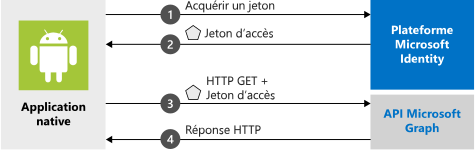

# <a name="quickstart-sign-in-users-and-call-the-microsoft-graph-api-from-an-android-app"></a>Démarrage rapide : Connecter des utilisateurs et appeler l’API Microsoft Graph à partir d’une application Android

[!INCLUDE [active-directory-develop-applies-v2-msal](../../../includes/active-directory-develop-applies-v2-msal.md)]

Ce démarrage rapide contient un exemple de code qui montre comment une application Android peut connecter des comptes personnels ou professionnels et scolaires, obtenir un jeton d’accès et appeler l’API Microsoft Graph.



> [!NOTE]
> **Composants requis**
> * Android Studio 
> * Le logiciel Android 16+ est requis 


> [!div renderon="docs"]
> ## <a name="register-and-download-your-quickstart-app"></a>Inscrire et télécharger votre application de démarrage rapide
> Vous disposez de deux options pour démarrer votre application de démarrage rapide :
> * [Express] [Option 1 : Inscrire et configurer automatiquement votre application, puis télécharger votre exemple de code](#option-1-register-and-auto-configure-your-app-and-then-download-your-code-sample)
> * [Manuel] [Option 2 : Inscrire et configurer manuellement vos application et exemple de code](#option-2-register-and-manually-configure-your-application-and-code-sample)
>
> ### <a name="option-1-register-and-auto-configure-your-app-and-then-download-your-code-sample"></a>Option 1 : Inscrire et configurer automatiquement votre application, puis télécharger votre exemple de code
> #### <a name="step-1-register-your-application"></a>Étape 1 : Inscrivez votre application
> Pour inscrire votre application :
> 1. Accédez au nouveau volet [Portail Azure - Inscriptions des applications](https://portal.azure.com/#blade/Microsoft_AAD_RegisteredApps/applicationsListBlade/quickStartType/AndroidQuickstartPage/sourceType/docs).
> 1. Entrez un nom pour votre application, puis sélectionnez **Inscrire**.
> 1. Suivez les instructions pour télécharger et configurer automatiquement votre nouvelle application en un seul clic.
>
> ### <a name="option-2-register-and-manually-configure-your-application-and-code-sample"></a>Option 2 : Inscrire et configurer manuellement vos application et exemple de code
>
> #### <a name="step-1-register-your-application"></a>Étape 1 : Inscrivez votre application
> Pour inscrire votre application et ajouter manuellement les informations d’inscription de l’application à votre solution, procédez comme suit :
>
> 1. Accédez à la page [Inscriptions des applications](https://aka.ms/MobileAppReg) de la plateforme d’identité Microsoft pour les développeurs.
> 1. Sélectionnez **Nouvelle inscription**.
> 1. Lorsque la page **Inscrire une application** s’affiche, saisissez les informations d’inscription de votre application :
>      - Dans la section **Nom**, saisissez un nom d’application cohérent qui s’affichera pour les utilisateurs de l’application, par exemple `AndroidQuickstart`.
>      - Vous pouvez ignorer les autres configurations de cette page. 
>      - Appuyez sur le bouton `Register`.
> 1. Cliquez sur la nouvelle application et accédez à `Authentication` > `Add Platform` > `Android`.    
>      - Saisissez le nom du package à partir de votre projet Android Studio. 
>      - Générez un hachage de signature. Pour savoir comment faire, consultez le portail.
> 1. Appuyez sur `Configure` et enregistrez le document JSON de ***configuration de MSAL*** pour une utilisation ultérieure. 

> [!div renderon="portal" class="sxs-lookup"]
> #### <a name="step-1-configure-your-application"></a>Étape 1 : Configuration de votre application
> Pour que l’exemple de code de ce démarrage rapide fonctionne, vous devez ajouter un URI de redirection compatible avec le courtier d’authentification. 
> > [!div renderon="portal" id="makechanges" class="nextstepaction"]
> > [Apporter cette modification pour moi]()
>
> > [!div id="appconfigured" class="alert alert-info"]
> >  Votre application est configurée avec ces attributs

#### <a name="step-2-download-the-project"></a>Étape 2 : Téléchargez le projet

* [Télécharger l’exemple de code](https://github.com/Azure-Samples/active-directory-android-native-v2/archive/master.zip)

#### <a name="step-3-configure-your-project"></a>Étape 3 : Configurer votre projet

> [!div renderon="docs"]
> Si vous avez sélectionné l’option 1 ci-dessus, vous pouvez ignorer ces étapes. 

> [!div renderon="portal" class="sxs-lookup"]
> 1. Extrayez et ouvrez le projet dans Android Studio.
> 1. Dans **app** > **src** > **main** > **res** > **raw**, ouvrez **auth_config.json**.
> 1. Modifiez le fichier **auth_config.json** et remplacez-le par le document JSON du portail Microsoft Azure. Si vous préférez effectuer manuellement les modifications, procédez comme suit :
>    ```javascript
>    {
>       "client_id" : "Enter_the_Application_Id_Here",
>       "authorization_user_agent" : "DEFAULT",
>       "redirect_uri" : "Enter_the_Redirect_Uri_Here",
>       "authorities" : [
>          {
>             "type": "AAD",
>             "audience": {
>                "type": "Enter_the_Audience_Info_Here",
>                "tenant_id": "Enter_the_Tenant_Info_Here"
>             }
>          }
>       ]
>    }
> 1. Inside **app** > **manifests**, open  **AndroidManifest.xml**.
> 1. Paste the following activity to the **manifest\application** node: 
>    ```xml
>    <!--Intent filter to catch Microsoft's callback after Sign In-->
>    <activity
>        android:name="com.microsoft.identity.client.BrowserTabActivity">
>        <intent-filter>
>            <action android:name="android.intent.action.VIEW" />
>            <category android:name="android.intent.category.DEFAULT" />
>            <category android:name="android.intent.category.BROWSABLE" />
>            <data android:scheme="msauth"
>                android:host="Enter_the_Package_Name"
>                android:path="/Enter_the_Signature_Hash" />
>        </intent-filter>
>    </activity>
>    ```
> > 1. Exécutez l’application. 

> [!div renderon="docs"]
> 1. Extrayez et ouvrez le projet dans Android Studio.
> 1. Dans **app** > **res** > **raw**, ouvrez **auth_config.json**.
> 1. Modifiez le fichier **auth_config.json** et remplacez-le par le document JSON du portail Microsoft Azure. Si vous préférez effectuer manuellement ces modifications, procédez comme suit :
>    ```javascript
>    "client_id" : "ENTER_YOUR_APPLICATION_ID",
>    "redirect_uri": "ENTER_YOUR_REDIRECT_URI", 
>     ```
> 1. Dans **app** > **manifests**, ouvrez a**AndroidManifest.xml**.
> 1. Ajoutez l’activité suivante au nœud **manifest\application**. Cet extrait de code inscrit une activité **BrowserTabActivity** pour autoriser le système d’exploitation à reprendre l’exécution de votre application une fois l’authentification effectuée :
>    ```xml
>    <!--Intent filter to catch Microsoft's callback after Sign In-->
>    <activity
>        android:name="com.microsoft.identity.client.BrowserTabActivity">
>        <intent-filter>
>            <action android:name="android.intent.action.VIEW" />
>            <category android:name="android.intent.category.DEFAULT" />
>            <category android:name="android.intent.category.BROWSABLE" />
>            <data android:scheme="msauth"
>                android:host="Enter_the_Package_Name"
>                android:path="/Enter_the_Decoded_Signature_Hash" />
>        </intent-filter>
>    </activity>
>    ```
> 1. Remplacez `Enter_the_Package_Name` et `Enter_the_Signature_Hash` par les valeurs que vous avez enregistrées dans le portail Microsoft Azure. 
> 1. Exécutez l’application. 

## <a name="more-information"></a>Informations complémentaires

Lisez les sections suivantes pour plus d’informations sur ce démarrage rapide.

### <a name="getting-msal"></a>Obtention de MSAL

MSAL ([com.microsoft.identity.client](https://javadoc.io/doc/com.microsoft.identity.client/msal)) est la bibliothèque utilisée pour connecter les utilisateurs et demander des jetons permettant d’accéder à une API protégée par la plateforme d’identités Microsoft. Vous pouvez utiliser Gradle 3.0 et plus pour l’installer, en ajoutant le code suivant dans **Scripts Gradle** > **build.gradle (Module : app)** , sous **Dépendances** :

```gradle  
implementation 'com.android.volley:volley:1.1.1'
implementation 'com.microsoft.identity.client:msal:0.3.+'
```

### <a name="msal-initialization"></a>Initialisation MSAL

Vous pouvez ajouter la référence de MSAL en ajoutant le code suivant :

```java
import com.microsoft.identity.client.*;
```

Ensuite, initialisez MSAL à l’aide du code suivant :

```java
    sampleApp = new PublicClientApplication(
        this.getApplicationContext(),
        R.raw.auth_config);
```

> |Où : ||
> |---------|---------|
> |`R.raw.auth_config` | Ce fichier contient les configurations pour votre application, y compris l’ID de votre application et du client, les utilisateurs connectés, l’URI de redirection et plusieurs autres options de personnalisation. |

### <a name="requesting-tokens"></a>Demande de jetons

MSAL utilise deux méthodes pour acquérir des jetons : `acquireToken` et `acquireTokenSilentAsync`

#### <a name="acquiretoken-getting-a-token-interactively"></a>acquireToken : Obtenir un jeton de manière interactive

Certaines situations nécessitent l’interaction des utilisateurs avec la plateforme d’identité Microsoft. Dans ce cas, l’utilisateur final peut être amené à sélectionner son compte, saisir ses informations d’identification ou accepter les autorisations que votre application a demandées. Par exemple, 

* La première connexion des utilisateurs à l’application
* Si un utilisateur réinitialise son mot de passe, il devra saisir ses informations d’identification 
* Si le consentement est révoqué 
* Si votre application requiert un consentement explicite 
* Lorsque votre application demande l’accès à une ressource pour la première fois
* Lorsque l’authentification multifacteur ou d’autres stratégies d’accès conditionnel sont requises

```java
sampleApp.acquireToken(this, SCOPES, getAuthInteractiveCallback());
```

> |Où :||
> |---------|---------|
> | `SCOPES` | Contient les étendues demandées (c’est-à-dire `{ "user.read" }` pour Microsoft Graph ou `{ "<Application ID URL>/scope" }` pour les API web personnalisées (par exemple, `api://<Application ID>/access_as_user`)) |
> | `getAuthInteractiveCallback` | Rappel exécuté lorsque le contrôle est renvoyé à l’application après l’authentification |

#### <a name="acquiretokensilent-getting-a-user-token-silently"></a>acquireTokenSilent : Obtention d’un jeton d’utilisateur en mode silencieux

Les applications ne doivent pas demander aux utilisateurs de se connecter chaque fois qu’elles ont besoin d’un jeton. Si l’utilisateur est déjà connecté, cette méthode permet aux applications demander des jetons en mode silencieux.

```java
    sampleApp.getAccounts(new PublicClientApplication.AccountsLoadedCallback() {
        @Override
        public void onAccountsLoaded(final List<IAccount> accounts) {

            if (!accounts.isEmpty()) {
                sampleApp.acquireTokenSilentAsync(SCOPES, accounts.get(0), getAuthSilentCallback());
            } else {
                /* No accounts */
            }
        }
    });
```

> |Où :||
> |---------|---------|
> | `SCOPES` | Contient les étendues demandées (c’est-à-dire `{ "user.read" }` pour Microsoft Graph ou `{ "<Application ID URL>/scope" }` pour les API web personnalisées (par exemple, `api://<Application ID>/access_as_user`)) |
> | `getAccounts(...)` | Contient le compte pour lequel vous tentez d’obtenir des jetons en mode silencieux |
> | `getAuthSilentCallback()` | Rappel exécuté lorsque le contrôle est renvoyé à l’application après l’authentification |

## <a name="next-steps"></a>Étapes suivantes

### <a name="learn-the-steps-to-create-the-application-used-in-this-quickstart"></a>Découvrez les étapes permettant de créer l’application utilisée dans ce démarrage rapide

Essayez le didacticiel Android pour apprendre à créer, étape par étape, des applications et des fonctionnalités, et pour obtenir une explication complète de ce démarrage rapide.

> [!div class="nextstepaction"]
> [Didacticiel d’appel de l’API Graph Android](https://docs.microsoft.com/azure/active-directory/develop/guidedsetups/active-directory-android)

### <a name="msal-for-android-library-wiki"></a>Wiki de la bibliothèque MSAL pour Android

En savoir plus sur la bibliothèque MSAL pour Android :

> [!div class="nextstepaction"]
> [Wiki de la bibliothèque MSAL pour Android](https://github.com/AzureAD/microsoft-authentication-library-for-android/wiki)

[!INCLUDE [Help and support](../../../includes/active-directory-develop-help-support-include.md)]
