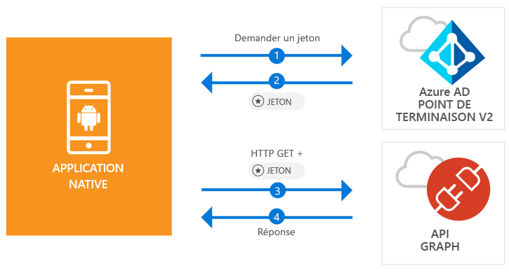

# <a name="quickstart-sign-in-users-and-call-the-microsoft-graph-api-from-an-android-app"></a>Démarrage rapide : Connecter des utilisateurs et appeler l’API Microsoft Graph à partir d’une application Android

[!INCLUDE [active-directory-develop-applies-v2-msal](../../../includes/active-directory-develop-applies-v2-msal.md)]

Ce démarrage rapide contient un exemple de code qui montre comment une application Android peut connecter des comptes personnels ou professionnels et scolaires, obtenir un jeton d’accès et appeler l’API Microsoft Graph.



> [!NOTE]
> **Composants requis**
> * Android Studio 3 ou version ultérieure
> * Android SDK 21 ou version ultérieure est requis (Kit de développement logiciel (SDK) 27 recommandé)

> [!div renderon="docs"]
> ## <a name="register-and-download"></a>Inscrire et télécharger
> ### <a name="register-and-configure-your-application-and-code-sample"></a>Inscrire et configurer votre application et exemple de code
> #### <a name="step-1-register-your-application"></a>Étape 1 : Inscrivez votre application
> Pour inscrire votre application et ajouter les informations d’inscription de l’application à votre solution, procédez comme suit :
> 1. Accédez au [portail d’inscription des applications de Microsoft](https://apps.dev.microsoft.com/portal/register-app) pour inscrire une application.
> 1. Dans la zone **Nom de l’application**, attribuez un nom à votre application.
> 1. Vérifiez que la case **Guided Setup** (Installation guidée) est décochée et sélectionnez **Créer**.
> 1. Sélectionnez **Ajouter une plateforme**, puis **Application native**, et cliquez sur **Enregistrer**.

> [!div renderon="portal" class="sxs-lookup"]
> #### <a name="step-1-configure-your-application"></a>Étape 1 : Configuration de votre application
> Pour que l’exemple de code de ce démarrage rapide fonctionne, vous devez ajouter une URL de réponse telle que **msal{AppId}://auth** (où {AppId} correspond à l’ID de votre application).
> > [!div renderon="portal" id="makechanges" class="nextstepaction"]
> > [Apporter cette modification pour moi]()
>
> > [!div id="appconfigured" class="alert alert-info"]
> >  Votre application est configurée avec ces attributs

#### <a name="step-2-download-the-project"></a>Étape 2 : Téléchargez le projet

* [Télécharger le projet Android Studio](https://github.com/Azure-Samples/active-directory-android-native-v2/archive/master.zip)

#### <a name="step-3-configure-your-project"></a>Étape 3 : Configurer votre projet

1. Extrayez et ouvrez le projet dans Android Studio.
1. Sous **app** > **java** > **<i>{host}.{namespace}</i>**, ouvrez **MainActivity**.
1. Remplacez la ligne commençant par `final static String CLIENT_ID` par :

    > [!div renderon="portal" class="sxs-lookup"]
    > ```java
    > final static String CLIENT_ID = "ENTER_THE_APPLICATION_ID_HERE";
    > ```

    > [!div renderon="docs"]
    > ```java
    > final static String CLIENT_ID = "<ENTER_THE_APPLICATION_ID_HERE>";
    > ```

1. Ouvrez : **app** > **manifests** > **AndroidManifest.xml**.
1. Ajoutez l’activité suivante au nœud **manifest\application**. Cet extrait de code inscrit une activité **BrowserTabActivity** pour autoriser le système d’exploitation à reprendre l’exécution de votre application une fois l’authentification effectuée :

    > [!div renderon="docs"]
    > ```xml
    > <!--Intent filter to capture System Browser calling back to our app after Sign In-->
    > <activity
    >     android:name="com.microsoft.identity.client.BrowserTabActivity">
    >     <intent-filter>
    >         <action android:name="android.intent.action.VIEW" />
    >         <category android:name="android.intent.category.DEFAULT" />
    >         <category android:name="android.intent.category.BROWSABLE" />
    > 
    >         <!--Add in your scheme/host from registered redirect URI-->
    >         <!--By default, the scheme should be similar to 'msal[appId]' -->
    >         <data android:scheme="msal<ENTER_THE_APPLICATION_ID_HERE>"
    >             android:host="auth" />
    >     </intent-filter>
    > </activity>
    > ```

    > [!div renderon="portal" class="sxs-lookup"]
    > ```xml
    > <!--Intent filter to capture System Browser calling back to our app after Sign In-->
    > <activity
    >     android:name="com.microsoft.identity.client.BrowserTabActivity">
    >     <intent-filter>
    >         <action android:name="android.intent.action.VIEW" />
    >         <category android:name="android.intent.category.DEFAULT" />
    >         <category android:name="android.intent.category.BROWSABLE" />
    > 
    >         <!--Add in your scheme/host from registered redirect URI-->
    >         <!--By default, the scheme should be similar to 'msal[appId]' -->
    >         <data android:scheme="msalENTER_THE_APPLICATION_ID_HERE"
    >             android:host="auth" />
    >     </intent-filter>
    > </activity>
    > ```

> [!div renderon="docs"]
> <span>6.</span> Remplacez `<ENTER_THE_APPLICATION_ID_HERE>` par l’*ID d’application* de votre application. Si vous ne connaissez pas l’*ID d’application*, accédez à la page *Vue d’ensemble*.

## <a name="more-information"></a>Informations complémentaires

Lisez les sections suivantes pour plus d’informations sur ce démarrage rapide.

### <a name="msal"></a>MSAL

MSAL ([com.microsoft.identity.client](https://javadoc.io/doc/com.microsoft.identity.client/msal)) est la bibliothèque utilisée pour connecter des utilisateurs et demander des jetons permettant d’accéder à une API protégée par Microsoft Azure Active Directory (Azure AD). Vous pouvez utiliser Gradle pour l’installer en ajoutant le code suivant dans **Scripts Gradle** > **build.gradle (Module : app)** sous **Dépendances** :

```gradle  
implementation 'com.android.volley:volley:1.1.1'
implementation 'com.microsoft.identity.client:msal:0.1.+'
```

### <a name="msal-initialization"></a>Initialisation MSAL

Vous pouvez ajouter la référence de MSAL en ajoutant le code suivant :

```java
import com.microsoft.identity.client.*;
```

Ensuite, initialisez MSAL à l’aide du code suivant :

```java
sampleApp = new PublicClientApplication(
        this.getApplicationContext(),
        CLIENT_ID);
```

> |Où : ||
> |---------|---------|
> |`CLIENT_ID` | L’ID d’application de l’application inscrite dans *portal.azure.com* |

### <a name="requesting-tokens"></a>Demande de jetons

MSAL utilise deux méthodes pour acquérir des jetons : `acquireToken` et `acquireTokenSilentAsync`

#### <a name="getting-a-user-token-interactively"></a>Obtention d’un jeton d’utilisateur de manière interactive

Certaines situations exigent de forcer les utilisateurs à interagir avec le point de terminaison Azure AD v2.0 qui entraînent un changement de contexte sur le navigateur système pour valider les informations d’identification des utilisateurs ou pour le consentement. Voici quelques exemples :

* La première connexion des utilisateurs à l’application
* Quand les utilisateurs doivent de nouveau entrer leurs informations d’identification, car le mot de passe a expiré
* Lorsque votre application demande l’accès à une ressource pour laquelle l’utilisateur doit donner son consentement
* Lorsqu’une authentification à 2 facteurs est requise

```java
sampleApp.acquireToken(this, SCOPES, getAuthInteractiveCallback());
```

> |Où :||
> |---------|---------|
> | `SCOPES` | Contient les étendues demandées (c’est-à-dire `{ "user.read" }` pour Microsoft Graph ou `{ "<Application ID URL>/scope" }` pour les API web personnalisées (par exemple, `api://<Application ID>/access_as_user`)) |
> | `getAuthInteractiveCallback` | Rappel exécuté lorsque le contrôle est renvoyé à l’application après l’authentification |

#### <a name="getting-a-user-token-silently"></a>Obtention d’un jeton d’utilisateur en mode silencieux

Vous ne voulez pas obliger l’utilisateur à valider ses informations d’identification chaque fois qu’il doit accéder à une ressource. La plupart du temps, vous souhaitez que les acquisitions et renouvellements de jetons se fassent sans aucune interaction de l’utilisateur. Vous pouvez utiliser la méthode `AcquireTokenSilentAsync` pour obtenir des jetons pour accéder aux ressources protégées après la méthode `acquireToken` initiale :

```java
sampleApp.acquireToken(getActivity(), SCOPES, getAuthInteractiveCallback());
```

> |Où :||
> |---------|---------|
> | `SCOPES` | Contient les étendues demandées (c’est-à-dire `{ "user.read" }` pour Microsoft Graph ou `{ "<Application ID URL>/scope" }` pour les API web personnalisées (par exemple, `api://<Application ID>/access_as_user`)) |
> | `getAuthInteractiveCallback` | Rappel exécuté lorsque le contrôle est renvoyé à l’application après l’authentification |

## <a name="next-steps"></a>Étapes suivantes

### <a name="learn-the-steps-to-create-the-application-used-in-this-quickstart"></a>Découvrez les étapes permettant de créer l’application utilisée dans ce démarrage rapide

Essayez le didacticiel Android pour apprendre à créer, étape par étape, des applications et des fonctionnalités, et pour obtenir une explication complète de ce démarrage rapide.

> [!div class="nextstepaction"]
> [Didacticiel d’appel de l’API Graph Android](https://docs.microsoft.com/azure/active-directory/develop/guidedsetups/active-directory-android)

### <a name="msal-for-android-library-wiki"></a>Wiki de la bibliothèque MSAL pour Android

En savoir plus sur la bibliothèque MSAL pour Android :

> [!div class="nextstepaction"]
> [Wiki de la bibliothèque MSAL pour Android](https://github.com/AzureAD/microsoft-authentication-library-for-android/wiki)

[!INCLUDE [Help and support](../../../includes/active-directory-develop-help-support-include.md)]
