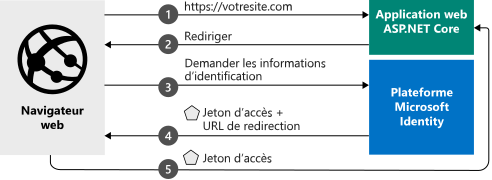

# <a name="quickstart-add-sign-in-with-microsoft-to-an-aspnet-core-web-app"></a>Démarrage rapide : Ajouter la connexion avec Microsoft à une application web ASP.NET Core

Dans ce guide de démarrage rapide, vous téléchargez et exécutez un exemple de code qui montre comment une application web ASP.NET Core peut connecter des utilisateurs à partir de n’importe quelle organisation Azure Active Directory (Azure AD).  

Consultez [Fonctionnement de l’exemple](#how-the-sample-works) pour obtenir une illustration.

> [!div renderon="docs"]
> ## <a name="prerequisites"></a>Prérequis
>
> * [Visual Studio 2019](https://visualstudio.microsoft.com/vs/) ou [Visual Studio Code](https://code.visualstudio.com/)
> * [SDK .NET Core 3.1+](https://dotnet.microsoft.com/download)
>
> ## <a name="register-and-download-your-quickstart-app"></a>Inscrire et télécharger votre application de démarrage rapide
> Vous disposez de deux options pour démarrer votre application de démarrage rapide :
> * [Express] [Option 1 : Inscrire et configurer automatiquement votre application, puis télécharger votre exemple de code](#option-1-register-and-auto-configure-your-app-and-then-download-your-code-sample)
> * [Manuel] [Option 2 : Inscrire et configurer manuellement vos application et exemple de code](#option-2-register-and-manually-configure-your-application-and-code-sample)
>
> ### <a name="option-1-register-and-auto-configure-your-app-and-then-download-your-code-sample"></a>Option 1 : Inscrire et configurer automatiquement votre application, puis télécharger votre exemple de code
>
> 1. Accédez à l’expérience de démarrage rapide <a href="https://aka.ms/aspnetcore2-1-aad-quickstart-v2/" target="_blank">Portail Azure - Inscriptions d’applications</a>.
> 1. Entrez un nom pour votre application, puis sélectionnez **Inscrire**.
> 1. Suivez les instructions pour télécharger et configurer automatiquement votre nouvelle application pour vous en un seul clic.
>
> ### <a name="option-2-register-and-manually-configure-your-application-and-code-sample"></a>Option n°2 : Inscrire et configurer manuellement vos application et exemple de code
>
> #### <a name="step-1-register-your-application"></a>Étape 1 : Inscrivez votre application
> Pour inscrire votre application et ajouter manuellement les informations d’inscription de l’application à votre solution, procédez comme suit :
>
> 1. Connectez-vous au <a href="https://portal.azure.com/" target="_blank">portail Azure</a>.
> 1. Si vous avez accès à plusieurs locataires, utilisez le filtre **Répertoire + abonnement** :::image type="icon" source="./media/common/portal-directory-subscription-filter.png" border="false"::: dans le menu du haut pour sélectionner le locataire dans lequel vous voulez inscrire une application.
> 1. Recherchez et sélectionnez **Azure Active Directory**.
> 1. Sous **Gérer**, sélectionnez **Inscriptions d’applications** > **Nouvelle inscription**.
> 1. Entrez un **nom** pour votre application (par exemple, `AspNetCore-Quickstart`). Les utilisateurs de votre application peuvent voir ce nom, et vous pouvez le changer ultérieurement.
> 1. Entrez l’**URI de redirection** `https://localhost:44321/`.
> 1. Sélectionnez **Inscription**.
> 1. Sous **Gérer**, sélectionnez **Authentification**.
> 1. Sous **URI de redirection**, sélectionnez **Ajouter un URI**, puis entrez `https://localhost:44321/signin-oidc`.
> 1. Entrez une **Front-channel logout URL** (URL de déconnexion de canal frontal) ayant la valeur `https://localhost:44321/signout-oidc`.
> 1. Sous **Implicit grant and hybrid flows** (Flux d’octroi implicite et flux hybride), sélectionnez **Jetons d’ID**.
> 1. Sélectionnez **Enregistrer**.

> [!div class="sxs-lookup" renderon="portal"]
> #### <a name="step-1-configure-your-application-in-the-azure-portal"></a>Étape 1 : Configurer votre application dans le portail Azure
> Pour que l’exemple de code de ce guide de démarrage rapide fonctionne, ajoutez l’**URI de redirection** `https://localhost:44321/` et `https://localhost:44321/signin-oidc` ainsi que `https://localhost:44321/signout-oidc` **l’URL de déconnexion de canal frontal** . Les jetons d’ID de requête sont émis par le point de terminaison d’autorisation.
> > [!div renderon="portal" id="makechanges" class="nextstepaction"]
> > [Apporter cette modification pour moi]()
>
> > [!div id="appconfigured" class="alert alert-info"]
> >  Votre application est configurée avec ces attributs.

#### <a name="step-2-download-your-aspnet-core-project"></a>Étape 2 : Télécharger votre projet ASP.NET Core

> [!div renderon="docs"]
> [Télécharger la solution ASP.NET Core](https://github.com/Azure-Samples/active-directory-aspnetcore-webapp-openidconnect-v2/archive/aspnetcore3-1.zip)

> [!div renderon="portal" class="sxs-lookup"]
> Exécutez le projet.

> [!div renderon="portal" class="sxs-lookup" id="autoupdate" class="nextstepaction"]
> [Téléchargez l’exemple de code](https://github.com/Azure-Samples/active-directory-aspnetcore-webapp-openidconnect-v2/archive/aspnetcore3-1.zip).

> [!div class="sxs-lookup" renderon="portal"]
> #### <a name="step-3-your-app-is-configured-and-ready-to-run"></a>Étape 3 : Votre application est configurée et prête à être exécutée
> Nous avons configuré votre projet avec les valeurs des propriétés de votre application et il est prêt à être exécuté.
> [!div class="sxs-lookup" renderon="portal"]
> > [!NOTE]
> > `Enter_the_Supported_Account_Info_Here`
> [!div renderon="docs"]
> #### <a name="step-3-configure-your-aspnet-core-project"></a>Étape 3 : Configurer votre projet ASP.NET Core
> 1. Extrayez l’archive .zip dans un dossier local proche de la racine de votre lecteur. Par exemple, dans *C:\Azure-Samples*.
> 1. Ouvrez la solution dans Visual Studio 2019.
> 1. Ouvrez le fichier *appsettings.json* pour modifier ce qui suit :
>
>    ```json
>    "ClientId": "Enter_the_Application_Id_here",
>    "TenantId": "common",
>    ```
>
>    - Remplacez `Enter_the_Application_Id_here` par l’**ID d’application (client)** de l’application que vous avez inscrite dans le portail Azure. Vous trouverez l’**ID d’application (client)** dans la page **Vue d’ensemble** de l’application.
>    - Remplacez `common` par l’un des éléments suivants :
>       - Si votre application prend en charge les **Comptes dans cet annuaire organisationnel uniquement**, remplacez cette valeur par l’**ID de l’annuaire (locataire)** (un GUID) ou par le **nom du locataire** (par exemple, `contoso.onmicrosoft.com`). L’**ID de l’annuaire (locataire)** se trouve dans la page **Vue d’ensemble** de l’application.
>       - Si votre application prend en charge **Comptes dans un annuaire organisationnel**, remplacez cette valeur par `organizations`
>       - Si votre application prend en charge **Tous les utilisateurs de compte Microsoft**, conservez la valeur `common`.
>
> Pour ce guide de démarrage rapide, ne modifiez pas les autres valeurs du fichier *appsettings.json*.
>
> #### <a name="step-4-build-and-run-the-application"></a>Étape 4 : Générer et exécuter l’application
>
> Générez puis exécutez l’application dans Visual Studio en sélectionnant le menu **Débogage** > **Démarrer le débogage**, ou en appuyant sur la touche `F5`.
>
> Vous êtes invité à entrer vos informations d’identification, puis à donner votre consentement pour les autorisations dont a besoin votre application. Sélectionnez **Accepter** dans l’invite de consentement.
>
> :::image type="content" source="media/quickstart-v2-aspnet-core-webapp/webapp-01-consent.png" alt-text="Boîte de dialogue de consentement montrant les autorisations que l’application demande à l’utilisateur":::
>
> Après avoir donné son consentement aux autorisations demandées, l’application indique que vous avez réussi à vous connecter avec vos informations d’identification Azure Active Directory.
>
> :::image type="content" source="media/quickstart-v2-aspnet-core-webapp/webapp-02-signed-in.png" alt-text="Navigateur web montrant l’application web en cours d’exécution et l’utilisateur connecté":::

## <a name="more-information"></a>Informations complémentaires

Cette section offre une vue d’ensemble du code requis pour connecter les utilisateurs. Cette vue d’ensemble peut être utile pour comprendre comment le code fonctionne, les principaux arguments et également si vous souhaitez ajouter une connexion à une application ASP.NET Core existante.

### <a name="how-the-sample-works"></a>Fonctionnement de l’exemple


### <a name="startup-class"></a>Classe de démarrage

Le middleware (intergiciel) *Microsoft.AspNetCore.Authentication* utilise une classe `Startup` qui s’exécute lors de l’initialisation du processus d’hébergement :

```csharp
  public void ConfigureServices(IServiceCollection services)
  {
      services.AddAuthentication(OpenIdConnectDefaults.AuthenticationScheme)
          .AddMicrosoftIdentityWebApp(Configuration.GetSection("AzureAd"));

      services.AddControllersWithViews(options =>
      {
          var policy = new AuthorizationPolicyBuilder()
              .RequireAuthenticatedUser()
              .Build();
          options.Filters.Add(new AuthorizeFilter(policy));
      });
      services.AddRazorPages()
          .AddMicrosoftIdentityUI();
  }
```

La méthode `AddAuthentication()` configure le service pour ajouter une authentification basée sur les cookies, qui est utilisée dans les scénarios de navigateur, et pour définir la demande d’authentification sur OpenID Connect.

La ligne contenant `.AddMicrosoftIdentityWebApp` ajoute à votre application l’authentification auprès de la plateforme d’identités Microsoft. Elle est ensuite configurée pour se connecter à l’aide de la plateforme d’identités Microsoft en fonction des informations contenues dans la section `AzureAD` du fichier de configuration *appsettings.json* :

| Clé *appsettings.json* | Description                                                                                                                                                          |
|------------------------|----------------------------------------------------------------------------------------------------------------------------------------------------------------------|
| `ClientId`             | **ID d’application (client)** de l’application inscrite dans le portail Azure.                                                                                       |
| `Instance`             | Point de terminaison du service d’émission de jeton de sécurité (STS) pour l’utilisateur à authentifier. Cette valeur est généralement `https://login.microsoftonline.com/`, ce qui indique le cloud public Azure. |
| `TenantId`             | Nom de votre locataire ou de son ID (GUID), ou *common* pour connecter les utilisateurs avec des comptes professionnels ou scolaires, ou des comptes personnels Microsoft.                             |

La méthode `Configure()` contient deux méthodes importantes, `app.UseAuthentication()` et `app.UseAuthorization()`, qui activent leurs fonctionnalités nommées : Également dans la méthode `Configure()`, vous devez inscrire les routes de Microsoft Identity Web avec au moins un appel à `endpoints.MapControllerRoute()` ou un appel à `endpoints.MapControllers()`.

```csharp
app.UseAuthentication();
app.UseAuthorization();

app.UseEndpoints(endpoints =>
{

    endpoints.MapControllerRoute(
        name: "default",
        pattern: "{controller=Home}/{action=Index}/{id?}");
    endpoints.MapRazorPages();
});

// endpoints.MapControllers(); // REQUIRED if MapControllerRoute() isn't called.
```

### <a name="protect-a-controller-or-a-controllers-method"></a>Protéger un contrôleur ou la méthode d’un contrôleur

Vous pouvez protéger un contrôleur ou les méthodes d’un contrôleur à l’aide de l’attribut `[Authorize]`. Cet attribut limite l’accès au contrôleur ou aux méthodes en autorisant uniquement les utilisateurs authentifiés, ce qui signifie que la demande d’authentification peut être démarrée pour accéder au contrôleur si l’utilisateur n’est pas authentifié.

[!INCLUDE [Help and support](../../../includes/active-directory-develop-help-support-include.md)]

## <a name="next-steps"></a>Étapes suivantes

Le dépôt GitHub qui contient ce tutoriel ASP.NET Core inclut des instructions et d’autres exemples de code qui vous montrent comment :

- Ajouter l’authentification à une nouvelle application web ASP.NET Core
- Appeler Microsoft Graph, d’autres API Microsoft ou vos propres API web
- Ajouter une autorisation
- Connecter des utilisateurs dans des clouds nationaux ou avec des identités sociales

> [!div class="nextstepaction"]
> [Tutoriels concernant les applications web ASP.NET Core sur GitHub](https://github.com/Azure-Samples/active-directory-aspnetcore-webapp-openidconnect-v2/)
