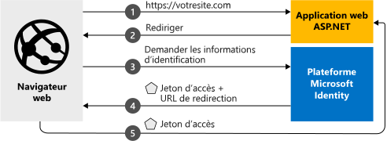

# <a name="quickstart-add-microsoft-identity-platform-sign-in-to-an-aspnet-web-app"></a>Démarrage rapide : Ajouter la connexion à la Plateforme d'identités Microsoft dans une application web ASP.NET

Dans ce guide de démarrage rapide, vous téléchargez et exécutez un exemple de code qui montre comment une application web ASP.NET peut connecter des utilisateurs à partir de n’importe quelle organisation Azure Active Directory (Azure AD). 

Consultez [Fonctionnement de l’exemple](#how-the-sample-works) pour obtenir une illustration.
> [!div renderon="docs"]
> ## <a name="prerequisites"></a>Prérequis
>
> * Compte Azure avec un abonnement actif. [Créez un compte gratuitement](https://azure.microsoft.com/free/?WT.mc_id=A261C142F).
> * [Visual Studio 2019](https://visualstudio.microsoft.com/vs/)
> * [.NET Framework 4.7.2+](https://dotnet.microsoft.com/download/visual-studio-sdks)
>
> ## <a name="register-and-download-your-quickstart-app"></a>Inscrire et télécharger votre application de démarrage rapide
> Vous disposez de deux options pour démarrer votre application de démarrage rapide :
> * [Express] [Option 1 : Inscrire et configurer automatiquement votre application, puis télécharger votre exemple de code](#option-1-register-and-auto-configure-your-app-and-then-download-your-code-sample)
> * [Manuel] [Option 2 : Inscrire et configurer manuellement vos application et exemple de code](#option-2-register-and-manually-configure-your-application-and-code-sample)
>
> ### <a name="option-1-register-and-auto-configure-your-app-and-then-download-your-code-sample"></a>Option 1 : Inscrire et configurer automatiquement votre application, puis télécharger votre exemple de code
>
> 1. Accédez à l’expérience de démarrage rapide <a href="https://portal.azure.com/#blade/Microsoft_AAD_RegisteredApps/applicationsListBlade/quickStartType/AspNetWebAppQuickstartPage/sourceType/docs" target="_blank">Portail Azure - Inscriptions d’applications<span class="docon docon-navigate-external x-hidden-focus"></span></a>.
> 1. Entrez un nom pour votre application, puis sélectionnez **Inscrire**.
> 1. Suivez les instructions pour télécharger et configurer automatiquement votre nouvelle application pour vous en un seul clic.
>
> ### <a name="option-2-register-and-manually-configure-your-application-and-code-sample"></a>Option n°2 : Inscrire et configurer manuellement vos application et exemple de code
>
> #### <a name="step-1-register-your-application"></a>Étape 1 : Inscrivez votre application
> Pour inscrire votre application et ajouter manuellement les informations d’inscription de l’application à votre solution, procédez comme suit :
>
> 1. Connectez-vous au <a href="https://portal.azure.com/" target="_blank">portail Azure<span class="docon docon-navigate-external x-hidden-focus"></span></a>.
> 1. Si vous avez accès à plusieurs locataires, utilisez le filtre **Répertoire + abonnement** :::image type="icon" source="./media/common/portal-directory-subscription-filter.png" border="false"::: dans le menu du haut pour sélectionner le locataire dans lequel vous voulez inscrire une application.
> 1. Recherchez et sélectionnez **Azure Active Directory**.
> 1. Sous **Gérer**, sélectionnez **Inscriptions d’applications** > **Nouvelle inscription**.
> 1. Entrez un **nom** pour votre application (par exemple, `ASPNET-Quickstart`). Les utilisateurs de votre application peuvent voir ce nom, et vous pouvez le changer ultérieurement.
> 1. Ajoutez `https://localhost:44368/` dans **URI de redirection**, puis sélectionnez **Inscrire**.
> 1. Sous **Gérer**, sélectionnez **Authentification**.
> 1. Dans la sous-section **Octroi implicite**, sélectionnez **Jetons d’ID**.
> 1. Sélectionnez **Enregistrer**.

> [!div class="sxs-lookup" renderon="portal"]
> #### <a name="step-1-configure-your-application-in-azure-portal"></a>Étape 1 : Configurer votre application dans le portail Azure
> Pour que l’exemple de code de ce démarrage rapide fonctionne, vous devez ajouter une URL de réponse telle que `https://localhost:44368/`.
> > [!div renderon="portal" id="makechanges" class="nextstepaction"]
> > [Apporter cette modification pour moi]()
>
> > [!div id="appconfigured" class="alert alert-info"]
> >  Votre application est configurée avec cet attribut.

#### <a name="step-2-download-your-project"></a>Étape 2 : Télécharger votre projet

> [!div renderon="docs"]
> [Télécharger la solution Visual Studio 2019](https://github.com/AzureADQuickStarts/AppModelv2-WebApp-OpenIDConnect-DotNet/archive/master.zip)

> [!div renderon="portal" class="sxs-lookup"]
> Exécutez le projet à l’aide de Visual Studio 2019.
> [!div renderon="portal" id="autoupdate" class="sxs-lookup nextstepaction"]
> [Téléchargez l’exemple de code](https://github.com/AzureADQuickStarts/AppModelv2-WebApp-OpenIDConnect-DotNet/archive/master.zip).

> [!div class="sxs-lookup" renderon="portal"]
> #### <a name="step-3-your-app-is-configured-and-ready-to-run"></a>Étape 3 : Votre application est configurée et prête à être exécutée
> Nous avons configuré votre projet avec les valeurs des propriétés de votre application.

> [!div renderon="docs"]
> #### <a name="step-3-run-your-visual-studio-project"></a>Étape 3 : Exécuter votre projet Visual Studio

1. Extrayez le fichier zip dans un dossier local proche du dossier racine (par exemple, **C:\Azure-Samples**)
1. Ouvrez la solution dans Visual Studio (AppModelv2-WebApp-OpenIDConnect-DotNet.sln)
1. Selon la version de Visual Studio, vous devrez peut-être cliquer avec le bouton droit sur le projet `AppModelv2-WebApp-OpenIDConnect-DotNet` et **Restaurer les packages NuGet**
1. Ouvrez la console du Gestionnaire de package (Affichage -> Autres fenêtres -> Console du Gestionnaire de package) et exécutez `Update-Package Microsoft.CodeDom.Providers.DotNetCompilerPlatform -r`

> [!div renderon="docs"]
> 5. Modifiez **Web.config** et remplacez les paramètres `ClientId` et `Tenant` par :
>    ```xml
>    <add key="ClientId" value="Enter_the_Application_Id_here" />
>    <add key="Tenant" value="Enter_the_Tenant_Info_Here" />
>    ```
>    Où :
> - `Enter_the_Application_Id_here` - est l’ID de l’application pour l’application que vous avez inscrite.
> - `Enter_the_Tenant_Info_Here` - correspond à l’une des options ci-dessous :
>   - Si votre application prend en charge **Mon organisation uniquement**, remplacez cette valeur par l’**ID de locataire** ou le **nom du locataire** (par exemple, contoso.onmicrosoft.com)
>   - Si votre application prend en charge **Comptes dans un annuaire organisationnel**, remplacez cette valeur par `organizations`
>   - Si votre application prend en charge **tous les utilisateurs de compte Microsoft**, remplacez cette valeur par `common`
>
> > [!TIP]
> > - Pour connaître les valeurs de l’*ID d’Application*, de l’*ID de l’annuaire (locataire)* , et des *Types de comptes pris en charge*, consultez la page **Vue d’ensemble**
> > - Vérifiez que la valeur `redirectUri` dans le fichier **Web.config** correspond à l’**URI de redirection** défini pour l’inscription d’application dans Azure AD. Dans le cas contraire, accédez au menu **Authentification** pour l’inscription d’application et mettez à jour l’**URI de redirection** pour qu’il corresponde à cette valeur.

> [!div class="sxs-lookup" renderon="portal"]
> > [!NOTE]
> > `Enter_the_Supported_Account_Info_Here`

## <a name="more-information"></a>Informations complémentaires

Cette section offre une vue d’ensemble du code requis pour connecter les utilisateurs. Cette vue d’ensemble peut être utile pour comprendre comment le code fonctionne, les principaux arguments et également si vous souhaitez ajouter une connexion à une application ASP.NET existante.

### <a name="how-the-sample-works"></a>Fonctionnement de l’exemple


### <a name="owin-middleware-nuget-packages"></a>Packages NuGet de l’intergiciel (middleware) OWIN

Vous pouvez configurer le pipeline d’authentification avec une authentification basée sur les cookies à l’aide d’OpenID Connect dans ASP.NET avec des packages du middleware OWIN. Vous pouvez installer ces packages en exécutant les commandes suivantes dans la **console du gestionnaire de package** de Visual Studio :

```powershell
Install-Package Microsoft.Owin.Security.OpenIdConnect
Install-Package Microsoft.Owin.Security.Cookies
Install-Package Microsoft.Owin.Host.SystemWeb
```

### <a name="owin-startup-class"></a>Classe de démarrage OWIN

L’intergiciel (middleware) OWIN utilise une *classe de démarrage* qui s’exécute lors de l’initialisation du processus d’hébergement. Dans ce guide de démarrage rapide, le fichier *startup.cs* se trouve dans le dossier racine. Le code suivant montre le paramètre utilisé par ce démarrage rapide :

```csharp
public void Configuration(IAppBuilder app)
{
    app.SetDefaultSignInAsAuthenticationType(CookieAuthenticationDefaults.AuthenticationType);

    app.UseCookieAuthentication(new CookieAuthenticationOptions());
    app.UseOpenIdConnectAuthentication(
        new OpenIdConnectAuthenticationOptions
        {
            // Sets the ClientId, authority, RedirectUri as obtained from web.config
            ClientId = clientId,
            Authority = authority,
            RedirectUri = redirectUri,
            // PostLogoutRedirectUri is the page that users will be redirected to after sign-out. In this case, it is using the home page
            PostLogoutRedirectUri = redirectUri,
            Scope = OpenIdConnectScope.OpenIdProfile,
            // ResponseType is set to request the id_token - which contains basic information about the signed-in user
            ResponseType = OpenIdConnectResponseType.IdToken,
            // ValidateIssuer set to false to allow personal and work accounts from any organization to sign in to your application
            // To only allow users from a single organizations, set ValidateIssuer to true and 'tenant' setting in web.config to the tenant name
            // To allow users from only a list of specific organizations, set ValidateIssuer to true and use ValidIssuers parameter
            TokenValidationParameters = new TokenValidationParameters()
            {
                ValidateIssuer = false // Simplification (see note below)
            },
            // OpenIdConnectAuthenticationNotifications configures OWIN to send notification of failed authentications to OnAuthenticationFailed method
            Notifications = new OpenIdConnectAuthenticationNotifications
            {
                AuthenticationFailed = OnAuthenticationFailed
            }
        }
    );
}
```

> |Where  | Description |
> |---------|---------|
> | `ClientId`     | ID d’application de l’application inscrite dans le portail Azure |
> | `Authority`    | Point de terminaison STS pour l’utilisateur à authentifier. Généralement `https://login.microsoftonline.com/{tenant}/v2.0` pour le cloud public, où {tenant} est le nom de votre client, votre ID de client ou *common* pour une référence au point de terminaison commun (utilisé pour les applications mutualisées). |
> | `RedirectUri`  | URL vers laquelle les utilisateurs sont dirigés après authentification auprès du point de terminaison de la plateforme d’identités Microsoft |
> | `PostLogoutRedirectUri`     | URL vers laquelle les utilisateurs sont envoyés après validation |
> | `Scope`     | Liste des étendues demandées, séparées par des espaces |
> | `ResponseType`     | Demande que la réponse d’authentification contienne un jeton d’ID |
> | `TokenValidationParameters`     | Liste de paramètres pour la validation du jeton. Dans ce cas, `ValidateIssuer` a la valeur `false` pour indiquer qu’il peut accepter des connexions à partir de tout type de compte : personnel, professionnel ou scolaire |
> | `Notifications`     | Liste de délégués qui peuvent être exécutés sur différents messages *OpenIdConnect* |


> [!NOTE]
> Le paramètre `ValidateIssuer = false` est une simplification destinée aux seules fins de ce guide de démarrage rapide. Dans une application réelle, vous auriez à valider l’émetteur.
> Pour savoir comment procéder, consultez les exemples.

### <a name="initiate-an-authentication-challenge"></a>Initier une demande d’authentification

Vous pouvez forcer un utilisateur à se connecter en effectuant une demande d’authentification dans votre contrôleur :

```csharp
public void SignIn()
{
    if (!Request.IsAuthenticated)
    {
        HttpContext.GetOwinContext().Authentication.Challenge(
            new AuthenticationProperties{ RedirectUri = "/" },
            OpenIdConnectAuthenticationDefaults.AuthenticationType);
    }
}
```

> [!TIP]
> La demande d’authentification à l’aide de la méthode ci-dessus est facultative et normalement utilisée lorsque vous souhaitez qu’une vue soit accessible à la fois pour les utilisateurs authentifiés et non authentifiés. Vous pouvez également protéger les contrôleurs à l’aide de la méthode décrite dans la section suivante.

### <a name="protect-a-controller-or-a-controllers-method"></a>Protéger un contrôleur ou la méthode d’un contrôleur

Vous pouvez protéger un contrôleur ou les actions d’un contrôleur à l’aide de l’attribut `[Authorize]`. Cet attribut limite l’accès au contrôleur ou aux actions en autorisant uniquement les utilisateurs authentifiés à accéder aux actions dans le contrôleur. Cela signifie que la demande d’authentification se produit automatiquement quand un utilisateur *non authentifié* tente d’accéder à l’une des actions ou au contrôleur décoré par l’attribut `[Authorize]`.

[!INCLUDE [Help and support](../../../includes/active-directory-develop-help-support-include.md)]

## <a name="next-steps"></a>Étapes suivantes

Essayez le didacticiel ASP.NET pour apprendre à créer, étape par étape, des applications et des fonctionnalités, et pour obtenir une explication complète de ce démarrage rapide.

> [!div class="nextstepaction"]
> [Ajouter une connexion à une application web ASP.NET](tutorial-v2-asp-webapp.md)
