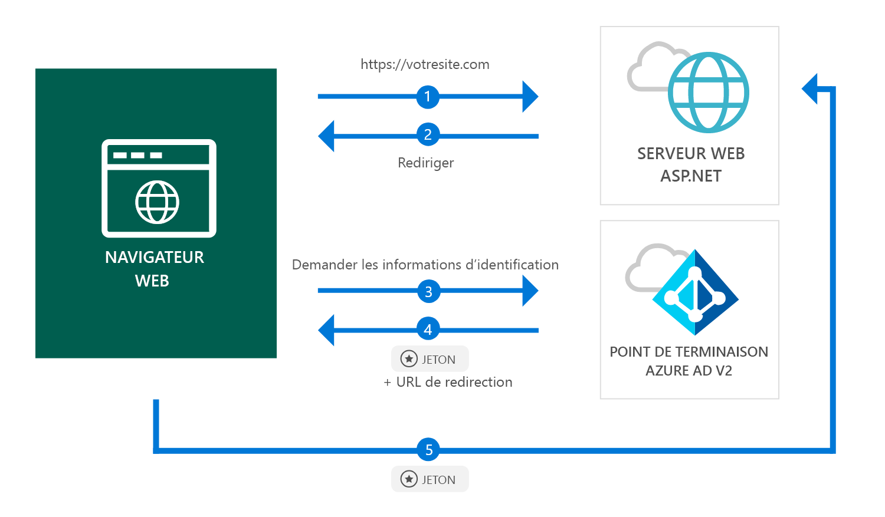

# <a name="quickstart-add-sign-in-with-microsoft-to-an-aspnet-web-app"></a>Démarrage rapide : Ajouter la connexion avec Microsoft à une application web ASP.NET

[!INCLUDE [active-directory-develop-applies-v2](../../../includes/active-directory-develop-applies-v2.md)]

Dans ce démarrage rapide, vous découvrirez comment une application web ASP.NET peut connecter des comptes personnels (hotmail.com, outlook.com, etc.) et des comptes professionnels et scolaires à partir de n’importe quelle instance d’Azure Active Directory (Azure AD).



> [!div renderon="docs"]
> ## <a name="register-your-application-and-download-your-quickstart-app"></a>Inscrire votre application et télécharger votre application de démarrage rapide
>
> ### <a name="register-and-configure-your-application-and-code-sample"></a>Inscrire et configurer votre application et votre exemple de code
> #### <a name="step-1-register-your-application"></a>Étape 1 : Inscrire votre application
> 
> 1. Accédez au [portail d’inscription des applications de Microsoft](https://apps.dev.microsoft.com/portal/register-app).
> 1. Entrez le nom de votre application. Vérifiez que la case de l’option **Assistant Installation** est décochée, puis cliquez sur **Créer**.
> 1. Cliquez sur `Add Platform`, puis sélectionnez `Web`.
> 1. Assurez-vous que la case **Autoriser un flux implicite** est *cochée*.
> 1. Dans **URL de redirection**, entrez `https://localhost:44368/`.
> 1. Faites défiler la page jusqu’en bas, puis cliquez sur **Enregistrer**.

> [!div class="sxs-lookup" renderon="portal"]
> #### <a name="step-1-configure-your-application-in-azure-portal"></a>Étape 1 : Configurer votre application dans le Portail Azure
> Pour que l’exemple de code de ce démarrage rapide fonctionne, vous devez ajouter une URL de réponse telle que `https://localhost:44368/`.
> > [!div renderon="portal" id="makechanges" class="nextstepaction"]
> > [Apporter cette modification pour moi]()
>
> > [!div id="appconfigured" class="alert alert-info"]
> >  Votre application est configurée avec cet attribut

#### <a name="step-2-download-your-project"></a>Étape 2 : téléchargez votre projet

[Télécharger la solution Visual Studio 2017](https://github.com/AzureADQuickStarts/AppModelv2-WebApp-OpenIDConnect-DotNet/archive/master.zip)

#### <a name="step-3-configure-your-visual-studio-project"></a>Étape 3 : configurer votre projet Visual Studio

1. Extrayez le fichier zip dans un dossier local proche du dossier racine (par exemple, **C:\Azure-Samples**)
1. Ouvrez la solution dans Visual Studio (AppModelv2-WebApp-OpenIDConnect-DotNet.sln)
1. Modifiez **Web.config** et remplacez `Enter_the_Application_Id_here` par l’ID de l’application que vous venez d’inscrire :

    ```xml
    <add key="ClientId" value="Enter_the_Application_Id_here" />
    ```
    
> [!div class="sxs-lookup" renderon="portal"]
> [!IMPORTANT]
> Si votre application est une *application à client unique* (ciblant les comptes de ce répertoire uniquement), dans votre fichier **Web.config**, recherchez la valeur de `Tenant` et remplacez `common` par votre **ID client** ou **nom de client** (par exemple, contoso.microsoft.com). Le nom du client est disponible dans la **page Vue d’ensemble**.

## <a name="more-information"></a>Plus d’informations

Cette section offre une vue d’ensemble du code requis pour connecter les utilisateurs. Cela peut être utile de comprendre comment le code fonctionne, les principaux d’arguments mais également si vous souhaitez ajouter une connexion à une application ASP.NET existante.

### <a name="owin-middleware-nuget-packages"></a>Packages NuGet de l’intergiciel (middleware) OWIN

Vous pouvez configurer le pipeline d’authentification avec une authentification basée sur les cookies à l’aide d’OpenID Connect dans ASP.NET avec des packages du middleware OWIN. Vous pouvez installer ces packages en exécutant les commandes suivantes dans la **console du gestionnaire de package** de Visual Studio :

```powershell
Install-Package Microsoft.Owin.Security.OpenIdConnect
Install-Package Microsoft.Owin.Security.Cookies
Install-Package Microsoft.Owin.Host.SystemWeb
```

### <a name="owin-startup-class"></a>Classe de démarrage OWIN

Le middleware OWIN utilise une *classe de démarrage* qui est exécutée lorsque le processus d’hébergement initialise (dans le cas de ce démarrage rapide, le fichier *startup.cs* situé dans le dossier racine). Le code suivant montre le paramètre utilisé par ce démarrage rapide :

```csharp
public void Configuration(IAppBuilder app)
{
    app.SetDefaultSignInAsAuthenticationType(CookieAuthenticationDefaults.AuthenticationType);

    app.UseCookieAuthentication(new CookieAuthenticationOptions());
    app.UseOpenIdConnectAuthentication(
        new OpenIdConnectAuthenticationOptions
        {
            // Sets the ClientId, authority, RedirectUri as obtained from web.config
            ClientId = clientId,
            Authority = authority,
            RedirectUri = redirectUri,
            // PostLogoutRedirectUri is the page that users will be redirected to after sign-out. In this case, it is using the home page
            PostLogoutRedirectUri = redirectUri,
            Scope = OpenIdConnectScope.OpenIdProfile,
            // ResponseType is set to request the id_token - which contains basic information about the signed-in user
            ResponseType = OpenIdConnectResponseType.IdToken,
            // ValidateIssuer set to false to allow personal and work accounts from any organization to sign in to your application
            // To only allow users from a single organizations, set ValidateIssuer to true and 'tenant' setting in web.config to the tenant name
            // To allow users from only a list of specific organizations, set ValidateIssuer to true and use ValidIssuers parameter 
            TokenValidationParameters = new TokenValidationParameters()
            {
                ValidateIssuer = false
            },
            // OpenIdConnectAuthenticationNotifications configures OWIN to send notification of failed authentications to OnAuthenticationFailed method
            Notifications = new OpenIdConnectAuthenticationNotifications
            {
                AuthenticationFailed = OnAuthenticationFailed
            }
        }
    );
}
```

> |Where  |  |
> |---------|---------|
> | `ClientId`     | ID d’application de l’application inscrite dans le portail Azure |
> | `Authority`    | Point de terminaison STS pour l’utilisateur à authentifier. Généralement https://login.microsoftonline.com/{tenant}/v2.0 pour le cloud public, où {tenant} est le nom de votre client, votre ID client ou *common* pour une référence à un point de terminaison commun (utilisé pour les applications mutualisées) |
> | `RedirectUri`  | URL vers laquelle les utilisateurs sont envoyés après authentification sur le point de terminaison Azure AD v2.0 |
> | `PostLogoutRedirectUri`     | URL vers laquelle les utilisateurs sont envoyés après validation |
> | `Scope`     | Liste des étendues demandées, séparées par des espaces |
> | `ResponseType`     | Demande que la réponse d’authentification contienne un jeton d’ID |
> | `TokenValidationParameters`     | Liste de paramètres pour la validation du jeton. Dans ce cas, `ValidateIssuer` a la valeur `false` pour indiquer qu’il peut accepter des connexions à partir de tout type de compte : personnel, professionnel ou scolaire |
> | `Notifications`     | Liste de délégués qui peuvent être exécutés sur différents messages *OpenIdConnect* |

### <a name="initiate-an-authentication-challenge"></a>Initier une demande d’authentification

Vous pouvez forcer un utilisateur à se connecter en effectuant une demande d’authentification dans votre contrôleur :

```csharp
public void SignIn()
{
    if (!Request.IsAuthenticated)
    {
        HttpContext.GetOwinContext().Authentication.Challenge(
            new AuthenticationProperties{ RedirectUri = "/" },
            OpenIdConnectAuthenticationDefaults.AuthenticationType);
    }
}
```

> [!TIP]
> La demande d’authentification à l’aide de la méthode ci-dessus est facultative et normalement utilisée lorsque vous souhaitez qu’une vue soit accessible à la fois pour les utilisateurs authentifiés et non authentifiés. Vous pouvez également protéger les contrôleurs à l’aide de la méthode décrite dans la section suivante.

### <a name="protect-a-controller-or-a-controllers-method"></a>Protéger un contrôleur ou la méthode d’un contrôleur

Vous pouvez protéger un contrôleur ou les actions d’un contrôleur à l’aide de l’attribut `[Authorize]`. Cet attribut limite l’accès au contrôleur ou aux actions en autorisant uniquement les utilisateurs authentifiés à accéder aux actions dans le contrôleur. Cela signifie que la demande d’authentification se produit automatiquement quand un utilisateur *non authentifié* tente d’accéder à l’une des actions ou au contrôleur décoré par l’attribut `[Authorize]`.

## <a name="next-steps"></a>Étapes suivantes

Essayez le didacticiel ASP.NET pour apprendre à créer, étape par étape, des applications et des fonctionnalités, et pour obtenir une explication complète de ce démarrage rapide.

### <a name="learn-the-steps-to-create-the-application-used-in-this-quickstart"></a>Découvrez les étapes permettant de créer l’application utilisée dans ce démarrage rapide

> [!div class="nextstepaction"]
> [Didacticiel de connexion](.\tutorial-v2-asp-webapp.md)

[!INCLUDE [Help and support](../../../includes/active-directory-develop-help-support-include.md)]