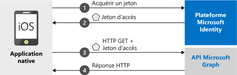

# <a name="quickstart-sign-in-users-and-call-the-microsoft-graph-api-from-an-ios-or-macos-app"></a>Démarrage rapide : Connecter des utilisateurs et appeler l’API Microsoft Graph à partir d’une application iOS ou macOS

Ce guide de démarrage rapide contient un exemple de code qui montre comment une application iOS ou macOS native peut utiliser la Plateforme d'identités Microsoft pour connecter des comptes personnels, scolaires et professionnels, obtenir un jeton d'accès et appeler l'API Microsoft Graph.

Ce guide de démarrage rapide s’applique aux applications iOS et macOS. Certaines étapes sont nécessaires uniquement pour les applications iOS. Ces étapes indiquent qu’elles sont uniquement destinées à iOS.



> [!NOTE]
> **Composants requis**
> * XCode 10+
> * iOS 10+ 
> * macOS 10.12+

> [!div renderon="docs"]
> ## <a name="register-and-download-your-quickstart-app"></a>Inscrire et télécharger votre application de démarrage rapide
> Vous disposez de deux options pour démarrer votre application de démarrage rapide :
> * [Express] [Option 1 : Inscrire et configurer automatiquement votre application, puis télécharger votre exemple de code](#option-1-register-and-auto-configure-your-app-and-then-download-the-code-sample)
> * [Manuel] [Option 2 : Inscrire et configurer manuellement vos application et exemple de code](#option-2-register-and-manually-configure-your-application-and-code-sample)
>
> ### <a name="option-1-register-and-auto-configure-your-app-and-then-download-the-code-sample"></a>Option 1 : Inscrire et configurer automatiquement votre application, puis télécharger l’exemple de code
> #### <a name="step-1-register-your-application"></a>Étape 1 : Inscrivez votre application
> Pour inscrire votre application :
> 1. Accédez au nouveau volet [Portail Azure - Inscriptions des applications](https://portal.azure.com/#blade/Microsoft_AAD_RegisteredApps/applicationsListBlade/quickStartType/IosQuickstartPage/sourceType/docs).
> 1. Entrez un nom pour votre application, puis sélectionnez **Inscrire**.
> 1. Suivez les instructions pour télécharger et configurer automatiquement votre nouvelle application en un seul clic.
>
> ### <a name="option-2-register-and-manually-configure-your-application-and-code-sample"></a>Option n°2 : Inscrire et configurer manuellement vos application et exemple de code
>
> #### <a name="step-1-register-your-application"></a>Étape 1 : Inscrivez votre application
> Pour inscrire votre application et ajouter manuellement les informations d’inscription de l’application à votre solution, procédez comme suit :
>
> 1. Accédez à la page [Inscriptions des applications](https://aka.ms/MobileAppReg) de la plateforme d’identité Microsoft pour les développeurs.
> 1. Sélectionnez **Nouvelle inscription**.
> 1. Lorsque la page **Inscrire une application** s’affiche, saisissez les informations d’inscription de votre application :
>      - Dans la section **Nom**, indiquez un nom d’application explicite qui sera présenté aux utilisateurs de l’application lorsqu’ils se connecteront ou accepteront celle-ci.
>      - Ignorez les autres configurations de cette page.
>      - Sélectionnez `Register`.
> 1. Dans la section **Gérer**, sélectionnez `Authentication` > `Add Platform` > `iOS`.
>      - Entrez l'***identificateur d'offre groupée*** de votre application. L’identificateur de bundle est simplement une chaîne unique qui identifie de façon particulière votre application, par exemple `com.<yourname>.identitysample.MSALMacOS`. Prenez note de la valeur que vous utilisez.
>      - Notez que la configuration iOS s’applique également aux applications macOS.
> 1. Sélectionnez `Configure` et enregistrez les détails de la ***Configuration MSAL*** pour une utilisation ultérieure dans ce guide de démarrage rapide.
> [!div renderon="portal" class="sxs-lookup"]
>
> #### <a name="step-1-configure-your-application"></a>Étape 1 : Configuration de votre application
> Pour que l'exemple de code de ce guide de démarrage rapide fonctionne, vous devez ajouter un URI de redirection compatible avec le répartiteur d'authentification.
> > [!div renderon="portal" id="makechanges" class="nextstepaction"]
> > [Apporter cette modification pour moi]()
>
> > [!div id="appconfigured" class="alert alert-info"]
> >  Votre application est configurée avec ces attributs

#### <a name="step-2-download-the-sample-project"></a>Étape 2 : Téléchargement de l’exemple de projet

- [Télécharger l’exemple de code pour iOS](https://github.com/Azure-Samples/active-directory-ios-swift-native-v2/archive/master.zip)
- [Télécharger l’exemple de code pour macOS](https://github.com/Azure-Samples/active-directory-macOS-swift-native-v2/archive/master.zip)

#### <a name="step-3-install-dependencies"></a>Étape 3 : Installer des dépendances

Dans une fenêtre de terminal, accédez au dossier à l’aide de l’exemple de code téléchargé et exécutez `pod install` pour installer la bibliothèque MSAL la plus récente.

#### <a name="step-4-configure-your-project"></a>Étape 4 : Configurer votre projet

> [!div renderon="docs"]
> Si vous avez sélectionné l’option 1 ci-dessus, vous pouvez ignorer ces étapes. 

> [!div renderon="portal" class="sxs-lookup"]
> 1. Extrayez le fichier zip et ouvrez le projet dans XCode.
> 1. Modifiez **ViewController.swift** et remplacez la ligne commençant par « let kClientID » par l’extrait de code suivant. N’oubliez pas de mettre à jour la valeur de `kClientID` avec l’ID client que vous avez enregistré lors de l’inscription de votre application dans le portail, plus haut dans le guide de démarrage rapide :
>    ```swift
>    let kClientID = "Enter_the_Application_Id_Here"
>    ```
> 1. Modifiez **ViewController.swift** et remplacez la ligne commençant par « let kAuthority » par l’extrait de code suivant :
>    ```swift
>    let kAuthority = "Enter_the_Authority_Endpoint_Host_HereEnter_the_Tenant_Info_Here"
>    ```
> 1. Modifiez **ViewController.swift** et remplacez la ligne commençant par « let kGraphEndpoint » par l’extrait de code suivant :
>    ```swift
>    let kGraphEndpoint = "Enter_the_MS_Graph_Endpoint_Host_Here"
>    ```
> 1. Ouvrez les paramètres du projet. Dans la section **Identité**, entrez l’**Identificateur de bundle** que vous avez indiqué dans le portail.
> 1. Pour iOS seulement, cliquez avec le bouton droit sur **Info.plist** et sélectionnez **Ouvrir en tant que** > **Code source**.
> 1. Pour iOS uniquement, sous le nœud racine du dictionnaire, remplacez `CFBundleURLSchemes` par l’***Identificateur de bundle*** que vous avez entré dans le portail.
>
>    ```xml
>    <key>CFBundleURLTypes</key>
>    <array>
>       <dict>
>          <key>CFBundleURLSchemes</key>
>          <array>
>             <string>msauth.Enter_the_Bundle_Id_Here</string>
>          </array>
>       </dict>
>    </array>
>    ```
> 1. Générez et exécutez l'application !
> [!div class="sxs-lookup" renderon="portal"]
> > [!NOTE]
> > Ce guide de démarrage rapide prend en charge Enter_the_Supported_Account_Info_Here.
> [!div renderon="docs"]
>
> 1. Extrayez le fichier zip et ouvrez le projet dans XCode.
> 1. Modifiez **ViewController.swift** et remplacez la ligne commençant par « let kClientID » par l’extrait de code suivant. N’oubliez pas de mettre à jour la valeur de `kClientID` avec l’ID client que vous avez enregistré lors de l’inscription de votre application dans le portail, plus haut dans ce guide de démarrage rapide :
>    ```swift
>    let kClientID = "Enter_the_Application_Id_Here"
>    ```
> 1. Si vous créez une application pour les [clouds nationaux Azure AD](https://docs.microsoft.com/graph/deployments#app-registration-and-token-service-root-endpoints), remplacez la ligne commençant par « let kGraphEndpoint » et « let kAuthority » par des points de terminaison corrects. Pour un accès global, utilisez les valeurs par défaut :
>     ```objective-c
>     let kGraphEndpoint = "https://graph.microsoft.com/"
>     let kAuthority = "https://login.microsoftonline.com/common"
>     ```
> 1. D’autres points de terminaison sont décrits [ici](https://docs.microsoft.com/graph/deployments#app-registration-and-token-service-root-endpoints). Par exemple, pour exécuter le guide de démarrage rapide avec Azure AD Allemagne, utilisez la commande suivante :
>     ```objective-c
>     let kGraphEndpoint = "https://graph.microsoft.de/"
>     let kAuthority = "https://login.microsoftonline.de/common"
>     ```
> 1. Ouvrez les paramètres du projet. Dans la section **Identité**, entrez l’**Identificateur de bundle** que vous avez indiqué dans le portail.
> 1. Pour iOS seulement, cliquez avec le bouton droit sur **Info.plist** et sélectionnez **Ouvrir en tant que** > **Code source**.
> 1. Pour iOS uniquement, sous le nœud racine du dictionnaire, remplacez `Enter_the_bundle_Id_Here` par l’***Identificateur de bundle*** que vous avez utilisé dans le portail.
>
>    ```xml
>    <key>CFBundleURLTypes</key>
>    <array>
>       <dict>
>          <key>CFBundleURLSchemes</key>
>          <array>
>             <string>msauth.Enter_the_Bundle_Id_Here</string>
>          </array>
>       </dict>
>    </array>
> 
>    ```
> 1. Générez et exécutez l'application ! 

## <a name="more-information"></a>Informations complémentaires

Parcourez ces sections pour en savoir plus sur ce démarrage rapide.

### <a name="get-msal"></a>Obtenir MSAL

MSAL ([MSAL.framework](https://github.com/AzureAD/microsoft-authentication-library-for-objc)) est la bibliothèque utilisée pour connecter les utilisateurs et demander des jetons permettant d'accéder à une API protégée par la plateforme d'identités Microsoft. Vous pouvez ajouter MSAL à votre application en suivant le processus ci-après :

```
$ vi Podfile

```
Ajoutez ce qui suit à ce podfile (avec la cible de votre projet) :

```
use_frameworks!

target 'MSALiOS' do
   pod 'MSAL'
end

```

Exécutez la commande d’installation de CocoaPods :

```pod install```

### <a name="initialize-msal"></a>Initialiser MSAL

Vous pouvez ajouter la référence de MSAL en ajoutant le code suivant :

```swift
import MSAL
```

Ensuite, initialisez MSAL à l’aide du code suivant :

```swift
let authority = try MSALAADAuthority(url: URL(string: kAuthority)!)
            
let msalConfiguration = MSALPublicClientApplicationConfig(clientId: kClientID, redirectUri: nil, authority: authority)
self.applicationContext = try MSALPublicClientApplication(configuration: msalConfiguration)
```

> |Où : ||
> |---------|---------|
> | `clientId` | L’ID d’application de l’application inscrite dans *portal.azure.com* |
> | `authority` | Point de terminaison de la plateforme d’identités Microsoft. Dans la plupart des cas, il s’agit de *https<span/>://login.microsoftonline.com/common* |
> | `redirectUri` | URI de redirection de l'application. Vous pouvez passer « nil » pour utiliser la valeur par défaut, ou votre URI de redirection personnalisé. |

### <a name="for-ios-only-additional-app-requirements"></a>Pour iOS uniquement, conditions supplémentaires pour les applications

Votre application doit également comporter ce qui suit dans la propriété `AppDelegate`. Cela permet au kit SDK MSAL de gérer la réponse des jetons à partir de l’application du répartiteur d’authentification, au moment de l’authentification.

 ```swift
 func application(_ app: UIApplication, open url: URL, options: [UIApplication.OpenURLOptionsKey : Any] = [:]) -> Bool {
        
        return MSALPublicClientApplication.handleMSALResponse(url, sourceApplication: options[UIApplication.OpenURLOptionsKey.sourceApplication] as? String)
    }

 ```

> [!NOTE]
> Sur iOS 13+, si vous adoptez `UISceneDelegate` au lieu de `UIApplicationDelegate`, placez ce code dans le rappel `scene:openURLContexts:` à la place (consultez la [documentation Apple](https://developer.apple.com/documentation/uikit/uiscenedelegate/3238059-scene?language=objc)).
> Si vous prenez en charge à la fois UISceneDelegate et UIApplicationDelegate pour assurer la compatibilité avec une version plus ancienne d’iOS, le rappel MSAL doit être placé aux deux endroits.

 ```swift
 func scene(_ scene: UIScene, openURLContexts URLContexts: Set<UIOpenURLContext>) {
        
        guard let urlContext = URLContexts.first else {
            return
        }
        
        let url = urlContext.url
        let sourceApp = urlContext.options.sourceApplication
        
        MSALPublicClientApplication.handleMSALResponse(url, sourceApplication: sourceApp)
    }
 ```

Enfin, votre application doit comporter une entrée `LSApplicationQueriesSchemes` dans la liste ***Info.plist*** en plus des `CFBundleURLTypes`. Ceci est inclus dans l'exemple fourni. 

   ```xml 
   <key>LSApplicationQueriesSchemes</key>
   <array>
      <string>msauthv2</string>
      <string>msauthv3</string>
   </array>
   ```

### <a name="sign-in-users--request-tokens"></a>Connexion des utilisateurs et demandes de jetons

MSAL utilise deux méthodes pour acquérir des jetons : `acquireToken` et `acquireTokenSilent`.

#### <a name="acquiretoken-get-a-token-interactively"></a>acquireToken : Obtenir un jeton de manière interactive

Certaines situations nécessitent l'interaction des utilisateurs avec la Plateforme d'identités Microsoft. Dans ce cas, l'utilisateur final peut être amené à sélectionner son compte, à saisir ses informations d'identification ou à accepter les autorisations relatives à votre application. Par exemple, 

* La première connexion des utilisateurs à l’application
* Si un utilisateur réinitialise son mot de passe, il doit entrer ses informations d’identification 
* Lorsque votre application demande l'accès à une ressource pour la première fois
* Lorsque l'authentification multifacteur ou d'autres stratégies d'accès conditionnel sont requises

```swift
let parameters = MSALInteractiveTokenParameters(scopes: kScopes, webviewParameters: self.webViewParamaters!)
self.applicationContext!.acquireToken(with: parameters) { (result, error) in /* Add your handling logic */}
```

> |Où :||
> |---------|---------|
> | `scopes` | Contient les étendues demandées (c'est-à-dire `[ "user.read" ]` pour Microsoft Graph ou `[ "<Application ID URL>/scope" ]` pour les API web personnalisées (`api://<Application ID>/access_as_user`) |

#### <a name="acquiretokensilent-get-an-access-token-silently"></a>acquireTokenSilent : Obtenir un jeton d’accès en mode silencieux

Les applications ne doivent pas demander aux utilisateurs de se connecter chaque fois qu'elles ont besoin d'un jeton. Si l'utilisateur est déjà connecté, cette méthode permet aux applications demander des jetons en mode silencieux. 

```swift
guard let account = try self.applicationContext!.allAccounts().first else { return }
        
let silentParams = MSALSilentTokenParameters(scopes: kScopes, account: account)
self.applicationContext!.acquireTokenSilent(with: silentParams) { (result, error) in /* Add your handling logic */}
```

> |Où : ||
> |---------|---------|
> | `scopes` | Contient les étendues demandées (c'est-à-dire `[ "user.read" ]` pour Microsoft Graph ou `[ "<Application ID URL>/scope" ]` pour les API web personnalisées (`api://<Application ID>/access_as_user`) |
> | `account` | Compte pour lequel un jeton est demandé. Ce guide de démarrage rapide concerne une application monocompte. Si vous souhaitez créer une application multicompte, vous devez définir une logique permettant d’identifier le compte à utiliser pour les demandes de jetons à l’aide de `applicationContext.account(forHomeAccountId: self.homeAccountId)`. |

## <a name="next-steps"></a>Étapes suivantes

Essayez le didacticiel iOS pour bénéficier d'un guide pas à pas complet sur la création d'applications ainsi que d'une description détaillée de ce guide de démarrage rapide.

### <a name="learn-how-to-create-the-application-used-in-this-quickstart"></a>Découvrir comment créer l’application utilisée dans ce guide de démarrage rapide

> [!div class="nextstepaction"]
> [Didacticiel iOS pour appeler l’API Graph](https://docs.microsoft.com/azure/active-directory/develop/guidedsetups/active-directory-ios)

[!INCLUDE [Help and support](../../../includes/active-directory-develop-help-support-include.md)]

Aidez-nous à améliorer la plateforme des identités Microsoft. Faites-nous part de votre avis en répondant à une petite enquête de deux questions.

> [!div class="nextstepaction"]
> [Enquête sur la plateforme des identités Microsoft](https://forms.office.com/Pages/ResponsePage.aspx?id=v4j5cvGGr0GRqy180BHbRyKrNDMV_xBIiPGgSvnbQZdUQjFIUUFGUE1SMEVFTkdaVU5YT0EyOEtJVi4u)
