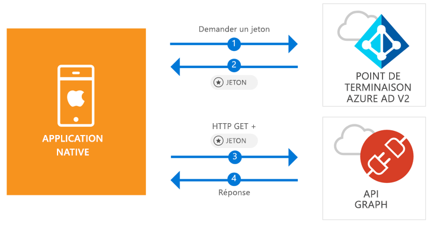

# <a name="quickstart-sign-in-users-and-call-the-microsoft-graph-api-from-an-ios-native-app"></a>Démarrage rapide : Connecter des utilisateurs et appeler l’API Microsoft Graph à partir d’une application native iOS

[!INCLUDE [active-directory-develop-applies-v2-msal](../../../includes/active-directory-develop-applies-v2-msal.md)]

Ce démarrage rapide contient un exemple de code qui montre comment une application iOS native peut connecter des comptes personnels, professionnels et scolaires, obtenir un jeton d’accès et appeler l’API Microsoft Graph.



> [!div renderon="docs"]
> ## <a name="register-and-download"></a>Inscrire et télécharger
> ### <a name="register-and-configure-your-application-and-code-sample"></a>Inscrire et configurer votre application et exemple de code
> #### <a name="step-1-register-your-application"></a>Étape 1 : Inscrivez votre application
> Pour inscrire votre application et ajouter les informations d’inscription de l’application à votre solution, procédez comme suit :
> 1. Accédez au [portail d’inscription des applications de Microsoft](https://apps.dev.microsoft.com/portal/register-app) pour inscrire une application.
> 1. Dans la zone **Nom de l’application**, attribuez un nom à votre application.
> 1. Vérifiez que la case **Guided Setup** (Installation guidée) est décochée et sélectionnez **Créer**.
> 1. Sélectionnez **Ajouter une plateforme**, puis **Application native**, et cliquez sur **Enregistrer**.

> [!div renderon="portal" class="sxs-lookup"]
> #### <a name="step-1-configure-your-application"></a>Étape 1 : Configuration de votre application
> Pour que l’exemple de code de ce démarrage rapide fonctionne, vous devez ajouter une URL de réponse telle que `msal<AppId>://auth` (où msal<AppId> correspond à l’ID d’application).
> > [!div renderon="portal" id="makechanges" class="nextstepaction"]
> > [Apporter cette modification pour moi]()
>
> > [!div id="appconfigured" class="alert alert-info"]
> >  Votre application est configurée avec cet attribut.

#### <a name="step-2-download-your-web-server-or-project"></a>Étape 2 : Télécharger votre projet ou serveur web

- [Télécharger le projet XCode](https://github.com/Azure-Samples/active-directory-ios-swift-native-v2/archive/master.zip)

#### <a name="step-3-configure-your-project"></a>Étape 3 : Configurer votre projet

1. Extrayez le fichier zip et ouvrez le projet dans XCode.
1. Modifiez **ViewController.swift** et remplacez la ligne commençant par « let kClientID » avec l’extrait de code suivant :

    > [!div renderon="portal" class="sxs-lookup"]
    > ```swift
    > let kClientID = "Enter_the_Application_Id_here"
    > ```

    > [!div renderon="docs"]
    > ```swift
    > let kClientID = "<ENTER_THE_APPLICATION_ID_HERE>"
    > ```   
1. Appuyez sur la touche CTRL et cliquez sur **Info.plist** (Info.plist) pour faire apparaître le menu contextuel, puis sélectionnez **Open As**(Ouvrir en tant que) > **Code Source**.
1. Sous le nœud racine dict, ajoutez le code suivant :

    > [!div renderon="portal" class="sxs-lookup"]
    > ```xml
    > <key>CFBundleURLTypes</key>
    > <array>
    >     <dict>
    >         <key>CFBundleTypeRole</key>
    >         <string>Editor</string>
    >         <key>CFBundleURLName</key>
    >         <string>$(PRODUCT_BUNDLE_IDENTIFIER)</string>
    >         <key>CFBundleURLSchemes</key>
    >         <array>
    >             <string>msalEnter_the_Application_Id_here</string>
    >         </array>
    >     </dict>
    > </array>
    > ```

    > [!div renderon="docs"]
    > ```xml
    > <key>CFBundleURLTypes</key>
    > <array>
    >     <dict>
    >         <key>CFBundleTypeRole</key>
    >         <string>Editor</string>
    >         <key>CFBundleURLName</key>
    >         <string>$(PRODUCT_BUNDLE_IDENTIFIER)</string>
    >         <key>CFBundleURLSchemes</key>
    >         <array>
    >             <string>msal<ENTER_THE_APPLICATION_ID_HERE></string>
    >         </array>
    >     </dict>
    > </array>
    > ```
    
> [!div renderon="docs"]
> <span>5.</span> Remplacez `<ENTER_THE_APPLICATION_ID_HERE>` par l’*ID d’application* de votre application. Si vous ne connaissez pas l’*ID d’application*, accédez à la page *Vue d’ensemble*.

## <a name="more-information"></a>Informations complémentaires

Parcourez ces sections pour en savoir plus sur ce démarrage rapide.

### <a name="msal"></a>MSAL

MSAL ([MSAL.framework](https://github.com/AzureAD/microsoft-authentication-library-for-objc)) est la bibliothèque utilisée pour connecter des utilisateurs et demander des jetons permettant d’accéder à une API protégée par Microsoft Azure Active Directory. Vous pouvez ajouter MSAL à votre application en suivant le processus ci-après :

```
$ vi Podfile
```
Ajoutez le code suivant à ce podfile :

```
 target 'QuickStart' do
   use_frameworks!
 pod 'MSAL'
 end
```

### <a name="msal-initialization"></a>Initialisation MSAL

Vous pouvez ajouter la référence de MSAL en ajoutant le code suivant :

```swift
import MSAL
```

Ensuite, initialisez MSAL à l’aide du code suivant :

```swift
let authority = MSALAuthority(url: URL(string: kAuthority)!)
self.applicationContext = try MSALPublicClientApplication(clientId: kClientID, authority: authority)
```

> |Où : ||
> |---------|---------|
> | `clientId` | L’ID d’application de l’application inscrite dans *portal.azure.com* |
> | `authority` | Le point de terminaison Azure AD v2.0. Dans la plupart des cas, il s’agit de *https<span/>://login.microsoftonline.com/common* |

### <a name="requesting-tokens"></a>Demande de jetons

MSAL utilise deux méthodes pour acquérir des jetons : `acquireToken` et `acquireTokenSilent`.

#### <a name="getting-an-access-token-interactively"></a>Obtention d’un jeton d’accès de manière interactive

Certaines situations exigent de forcer les utilisateurs à interagir avec le point de terminaison Azure Active Directory (Azure AD) v2.0, ce qui entraîne un changement de contexte sur le navigateur système pour valider les informations d’identification des utilisateurs ou pour le consentement. Voici quelques exemples :

* La première connexion des utilisateurs à l’application
* Quand les utilisateurs doivent de nouveau entrer leurs informations d’identification, car le mot de passe a expiré
* Lorsque votre application demande l’accès à une ressource pour laquelle l’utilisateur doit donner son consentement
* Lorsqu’une authentification à 2 facteurs est requise

```swift
applicationContext.acquireToken(forScopes: self.kScopes) { (result, error) in /* Add your handling logic */}
```

> |Où :||
> |---------|---------|
> | `forScopes` | Contient les étendues demandées (c’est-à-dire [ "user.read" ]` for Microsoft Graph or `[ "<Application ID URL>/scope" ]` for custom Web APIs (i.e. `api://<Application ID>/access_as_user`)) |

#### <a name="getting-an-access-token-silently"></a>Obtention d’un jeton d’accès en mode silencieux

Vous ne voulez pas obliger l’utilisateur à valider ses informations d’identification à chaque fois qu’il doit accéder à une ressource. La plupart du temps, vous souhaitez que les acquisitions et renouvellements de jetons se fassent sans aucune interaction de l’utilisateur. Vous pouvez utiliser la méthode `acquireTokenSilent` pour obtenir des jetons d’accès aux ressources protégées après la méthode `acquireToken` initiale :

```swift
applicationContext.acquireTokenSilent(forScopes: self.kScopes, account: applicationContext.allAccounts().first) { (result, error) in /* Add your handling logic */}
```

> |Où : ||
> |---------|---------|
> | `forScopes` | Contient les étendues demandées (c’est-à-dire `[ "user.read" ]` pour Microsoft Graph ou `[ "<Application ID URL>/scope" ]` pour les API web personnalisées (p. ex. `api://<Application ID>/access_as_user`)) |
> | `account` | Le compte à l’origine de la demande du jeton (MSAL prend en charge plusieurs comptes dans une seule application). Pour ce démarrage rapide, la valeur pointe vers le premier compte dans le cache (`applicationContext.allAccounts().first`). |

## <a name="next-steps"></a>Étapes suivantes

Essayez le didacticiel iOS pour apprendre à créer, étape par étape, des applications et des fonctionnalités, et qui fournit également une explication complète de ce démarrage rapide.

### <a name="learn-the-steps-to-create-the-application-used-in-this-quickstart"></a>Découvrez les étapes permettant de créer l’application utilisée dans ce démarrage rapide

> [!div class="nextstepaction"]
> [Didacticiel iOS pour appeler l’API Graph](https://docs.microsoft.com/azure/active-directory/develop/guidedsetups/active-directory-ios)

[!INCLUDE [Help and support](../../../includes/active-directory-develop-help-support-include.md)]
