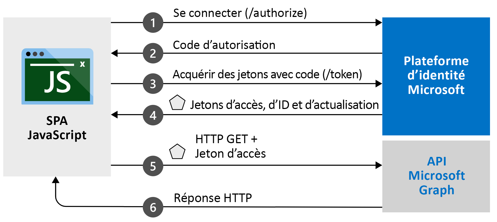

# <a name="quickstart-sign-in-and-get-an-access-token-in-an-angular-spa-using-the-auth-code-flow"></a>Démarrage rapide : Connecter et obtenir un jeton d’accès dans une application monopage (SPA) Angular à l’aide du flux du code d’authentification

Dans ce guide de démarrage rapide, vous téléchargez et exécutez un exemple de code qui montre comment une application monopage (SPA) Angular JavaScript peut connecter des utilisateurs et appeler Microsoft Graph en utilisant le flux du code d’autorisation. L’exemple de code montre comment obtenir un jeton d’accès pour appeler l’API Microsoft Graph ou n’importe quelle API web. 

Consultez [Fonctionnement de l’exemple](#how-the-sample-works) pour obtenir une illustration.

Ce guide de démarrage rapide utilise MSAL Angular v2 avec le flux du code d’autorisation. Pour obtenir un guide de démarrage rapide similaire qui utilise MSAL Angular 1.x avec le flux implicite, consultez [Démarrage rapide : Connexion d’utilisateurs dans des applications monopages JavaScript](./quickstart-v2-angular.md).

## <a name="prerequisites"></a>Prérequis

* Un abonnement Azure – [Créer un abonnement Azure gratuitement](https://azure.microsoft.com/free/?WT.mc_id=A261C142F)
* [Node.JS](https://nodejs.org/en/download/)
* [Visual Studio Code](https://code.visualstudio.com/download) ou un autre éditeur de code

> [!div renderon="docs"]
> ## <a name="register-and-download-your-quickstart-application"></a>Inscrire et télécharger votre application de démarrage rapide
> Pour démarrer votre application du guide de démarrage rapide, utilisez une des options suivantes.
>
> ### <a name="option-1-express-register-and-auto-configure-your-app-and-then-download-your-code-sample"></a>Option 1 (Express) : Inscrire et configurer automatiquement votre application, puis télécharger votre exemple de code
>
> 1. Accédez à l’expérience de démarrage rapide <a href="https://portal.azure.com/#blade/Microsoft_AAD_RegisteredApps/ApplicationsListBlade/quickStartType/JavascriptSpaQuickstartPage/sourceType/docs" target="_blank">Portail Azure - Inscriptions d’applications</a>.
> 1. Entrez un nom pour votre application.
> 1. Sous **Types de comptes pris en charge**, sélectionnez **Comptes dans un annuaire organisationnel et comptes personnels Microsoft**.
> 1. Sélectionnez **Inscription**.
> 1. Accédez au volet du démarrage rapide et suivez les instructions pour télécharger et configurer automatiquement votre nouvelle application.
>
> ### <a name="option-2-manual-register-and-manually-configure-your-application-and-code-sample"></a>Option 2 (manuelle) : Inscrire et configurer manuellement vos application et exemple de code
>
> #### <a name="step-1-register-your-application"></a>Étape 1 : Inscrivez votre application
>
> 1. Connectez-vous au <a href="https://portal.azure.com/" target="_blank">portail Azure</a>.
> 1. Si vous avez accès à plusieurs locataires, utilisez le filtre **Répertoire + abonnement** :::image type="icon" source="./media/common/portal-directory-subscription-filter.png" border="false"::: dans le menu du haut pour sélectionner le locataire dans lequel vous voulez inscrire une application.
> 1. Recherchez et sélectionnez **Azure Active Directory**.
> 1. Sous **Gérer**, sélectionnez **Inscriptions d’applications** > **Nouvelle inscription**.
> 1. Entrez un **nom** pour votre application. Les utilisateurs de votre application peuvent voir ce nom, et vous pouvez le changer ultérieurement.
> 1. Sous **Types de comptes pris en charge**, sélectionnez **Comptes dans un annuaire organisationnel et comptes personnels Microsoft**.
> 1. Sélectionnez **Inscription**. Dans la page **Vue d’ensemble**, notez la valeur de **ID d’application (client)** pour une utilisation ultérieure.
> 1. Sous **Gérer**, sélectionnez **Authentification**.
> 1. Sous **Configurations de plateformes**, sélectionnez **Ajouter une plateforme**. Dans le volet qui s’ouvre, sélectionnez **Application monopage**.
> 1. Définissez la valeur **URI de redirection** sur `http://localhost:4200/`. Il s’agit du port par défaut que NodeJS écoutera sur votre machine locale. Nous renverrons la réponse d’authentification à cet URI une fois que l’utilisateur aura été authentifié. 
> 1. Sélectionnez **Configurer** pour appliquer les modifications.
> 1. Sous **Configurations de plateforme**, développez **Application monopage**.
> 1. Vérifiez que sous **Types d’octroi** , votre URI de redirection est éligible pour le flux du code d’autorisation avec PKCE.

> [!div class="sxs-lookup" renderon="portal"]
> #### <a name="step-1-configure-your-application-in-the-azure-portal"></a>Étape 1 : Configurer votre application dans le portail Azure
> Pour que l’exemple de code de ce guide de démarrage rapide fonctionne, ajoutez l’**URI de redirection** `http://localhost:4200/`.
> > [!div renderon="portal" id="makechanges" class="nextstepaction"]
> > [Apporter ces modifications pour moi]()
>
> > [!div id="appconfigured" class="alert alert-info"]
> >  Votre application est configurée avec ces attributs.

 #### <a name="step-2-download-the-project"></a>Étape 2 : Téléchargez le projet

> [!div renderon="docs"]
> Pour exécuter le projet avec un serveur web en utilisant Node.js, [téléchargez les fichiers principaux du projet](https://github.com/Azure-Samples/ms-identity-javascript-angular-spa/archive/main.zip).

> [!div renderon="portal" class="sxs-lookup"]
> Exécuter le projet avec un serveur web en utilisant Node.js

> [!div renderon="portal" class="sxs-lookup" id="autoupdate" class="nextstepaction"]
> [Téléchargez l’exemple de code](https://github.com/Azure-Samples/ms-identity-javascript-angular-spa/archive/main.zip).

> [!div renderon="docs"]
> #### <a name="step-3-configure-your-javascript-app"></a>Étape 3 : Configurer une application JavaScript
>
> Dans le dossier *src*, ouvrez le dossier *app*, ouvrez le fichier *app.module.ts*, puis mettez à jour les valeurs `clientID`, `authority` et `redirectUri` dans l’objet `auth`.
>
> ```javascript
> // MSAL instance to be passed to msal-angular
> export function MSALInstanceFactory(): IPublicClientApplication {
>   return new PublicClientApplication({
>     auth: {
>       clientId: 'Enter_the_Application_Id_Here',
>       authority: 'Enter_the_Cloud_Instance_Id_HereEnter_the_Tenant_Info_Here',
>       redirectUri: 'Enter_the_Redirect_Uri_Here'
>     },
>     cache: {
>       cacheLocation: BrowserCacheLocation.LocalStorage,
>       storeAuthStateInCookie: isIE, // set to true for IE 11
>     },
>   });
> }
> ```

> [!div renderon="portal" class="sxs-lookup"]
> > [!NOTE]
> > `Enter_the_Supported_Account_Info_Here`

> [!div renderon="docs"]
>
> Modifiez les valeurs de la section `auth` de la façon suivante :
>
> - `Enter_the_Application_Id_Here` est **l’ID d’application (client)** de l’application que vous avez inscrite.
>
>    Pour connaître les valeurs de l’**ID d’application (client)** , consultez la page **Vue d’ensemble** de l’inscription d’application dans le portail Azure.
> - `Enter_the_Cloud_Instance_Id_Here` est l’instance du cloud Azure. Pour le cloud Azure principal ou mondial, entrez `https://login.microsoftonline.com/`. Pour les clouds **nationaux** (par exemple, Chine), consultez [Clouds nationaux](authentication-national-cloud.md).
> - `Enter_the_Tenant_info_here` est défini de la façon suivante :
>   - Si votre application prend en charge les *comptes dans cet annuaire organisationnel*, remplacez cette valeur par l’**ID de locataire** ou le **Nom du locataire**. Par exemple : `contoso.microsoft.com`.
>
>    Pour connaître les valeurs de l’**Annuaire (locataire)** , consultez la page **Vue d’ensemble** de l’inscription d’application dans le portail Azure.
>   - Si votre application prend en charge les *comptes dans un annuaire organisationnel*, remplacez cette valeur par `organizations`.
>   - Si votre application prend en charge les *comptes dans un annuaire organisationnel et comptes personnels Microsoft*, remplacez cette valeur par `common`. **Dans le cadre de ce guide de démarrage rapide**, utilisez `common`.
>   - Pour limiter la prise en charge aux *comptes Microsoft personnels uniquement*, remplacez cette valeur par `consumers`.
>
>    Pour connaître les valeurs des **Types de compte pris en charge**, consultez la page **Vue d’ensemble** de l’inscription d’application dans le portail Azure.
> - `Enter_the_Redirect_Uri_Here` a la valeur `http://localhost:4200/`.
>
> La valeur `authority` dans votre fichier *app.module.ts* doit être similaire à ce qui suit si vous utilisez le cloud Azure principal (global) :
>
> ```javascript
> authority: "https://login.microsoftonline.com/common",
> ```
>

> [!div class="sxs-lookup" renderon="portal"]
> #### <a name="step-3-your-app-is-configured-and-ready-to-run"></a>Étape 3 : Votre application est configurée et prête à être exécutée
> Nous avons configuré votre projet avec les valeurs des propriétés de votre application.

> [!div renderon="docs"]
>
> Faites défiler le contenu du même fichier et mettez à jour la valeur `graphMeEndpoint`. 
> - Remplacez la chaîne `Enter_the_Graph_Endpoint_Herev1.0/me` par `https://graph.microsoft.com/v1.0/me`
> - `Enter_the_Graph_Endpoint_Herev1.0/me` est le point de terminaison sur lequel les appels d’API seront effectués. Pour le service API Microsoft Graph principal (mondial), entrez `https://graph.microsoft.com/` (en incluant la barre oblique de fin). Pour plus d’informations, consultez la [documentation](/graph/deployments).
>
>
> ```javascript
> export function MSALInterceptorConfigFactory(): MsalInterceptorConfiguration {
>   const protectedResourceMap = new Map<string, Array<string>>();
>   protectedResourceMap.set('Enter_the_Graph_Endpoint_Herev1.0/me', ['user.read']);
>
>   return {
>     interactionType: InteractionType.Redirect,
>     protectedResourceMap
>   };
> }
> ```
>
>
 #### <a name="step-4-run-the-project"></a>Étape 4 : Exécuter le projet

Exécutez le projet avec un serveur web en utilisant Node.js :

1. Pour démarrer le serveur, exécutez les commandes suivantes dans le répertoire du projet :
    ```console
    npm install
    npm start
    ```
1. Accédez à `http://localhost:4200/`.

1. Sélectionnez **Connexion** pour lancer le processus de connexion, puis appelez l’API Microsoft Graph.

    La première fois que vous vous connectez, vous êtes invité à autoriser l’application à accéder à votre profil et à vous connecter. Une fois que vous êtes connecté, cliquez sur le bouton **Profil** pour afficher les informations utilisateur sur la page.

## <a name="more-information"></a>Informations complémentaires

### <a name="how-the-sample-works"></a>Fonctionnement de l’exemple



### <a name="msaljs"></a>msal.js

La bibliothèque MSAL.js connecte les utilisateurs, et demande les jetons utilisés pour accéder à une API protégée par la plateforme d’identités Microsoft. 

Si vous avez déjà installé Node.js, vous pouvez télécharger la dernière version à l’aide du gestionnaire de package Node.js (npm) :

```console
npm install @azure/msal-browser @azure/msal-angular@2
```

## <a name="next-steps"></a>Étapes suivantes

Pour avoir un guide pas à pas détaillé sur la création de l’application de flux de code d’authentification en utilisant JavaScript vanilla, consultez le tutoriel suivant :

> [!div class="nextstepaction"]
> [Tutoriel pour se connecter et appeler MS Graph](./tutorial-v2-javascript-auth-code.md)