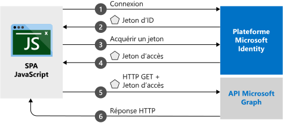

# <a name="quickstart-sign-in-users-and-get-an-access-token-in-a-javascript-spa"></a>Démarrage rapide : Connecter des utilisateurs et obtenir un jeton d’accès dans une application SPA JavaScript

Dans ce guide de démarrage rapide, vous utilisez un exemple de code pour découvrir comment une application monopage JavaScript peut connecter les utilisateurs de comptes personnels, professionnels et scolaires. Une application monopage JavaScript peut également obtenir un jeton d’accès pour appeler l’API Microsoft Graph ou une API web. (Consultez [Fonctionnement de l’exemple](#how-the-sample-works) pour une illustration.)

## <a name="prerequisites"></a>Prérequis

* Abonnement Azure : [créez-en un gratuitement](https://azure.microsoft.com/free/?WT.mc_id=A261C142F)
* [Node.js](https://nodejs.org/en/download/).
* [Visual Studio Code](https://code.visualstudio.com/download) (pour modifier des fichiers projet) ou [Visual Studio 2019](https://visualstudio.microsoft.com/downloads/) (pour exécuter le projet en tant que solution Visual Studio).

> [!div renderon="docs"]
> ## <a name="register-and-download-your-quickstart-application"></a>Inscrire et télécharger votre application de démarrage rapide
> Pour démarrer votre application du guide de démarrage rapide, utilisez une des options suivantes.
>
> ### <a name="option-1-express-register-and-auto-configure-your-app-and-then-download-your-code-sample"></a>Option 1 (Express) : Inscrire et configurer automatiquement votre application, puis télécharger votre exemple de code
>
> 1. Connectez-vous au [portail Azure](https://portal.azure.com) avec un compte professionnel ou scolaire, ou avec un compte personnel Microsoft.
> 1. Si votre compte vous donne accès à plusieurs locataires, sélectionnez le compte en haut à droite, puis définissez votre session de portail sur le locataire Azure Active Directory (Azure AD) que vous voulez utiliser.
> 1. Accédez au nouveau volet [Portail Azure - Inscriptions des applications](https://portal.azure.com/#blade/Microsoft_AAD_RegisteredApps/ApplicationsListBlade/quickStartType/JavascriptSpaQuickstartPage/sourceType/docs).
> 1. Entrez un nom pour votre application, puis sélectionnez **Inscrire**.
> 1. Suivez les instructions pour télécharger et configurer automatiquement votre nouvelle application.
>
> ### <a name="option-2-manual-register-and-manually-configure-your-application-and-code-sample"></a>Option 2 (manuelle) : Inscrire et configurer manuellement vos application et exemple de code
>
> #### <a name="step-1-register-your-application"></a>Étape 1 : Inscrivez votre application
>
> 1. Connectez-vous au [portail Azure](https://portal.azure.com) avec un compte professionnel ou scolaire, ou avec un compte personnel Microsoft.
>
> 1. Si votre compte vous propose un accès à plusieurs locataires, sélectionnez votre compte en haut à droite, puis définissez votre session de portail sur le locataire Azure AD que vous voulez utiliser.
> 1. Accédez à la page [Inscriptions des applications](https://go.microsoft.com/fwlink/?linkid=2083908) de la plateforme d’identités Microsoft pour les développeurs.
> 1. Sélectionnez **Nouvelle inscription**.
> 1. Lorsque la page **Inscrire une application** s’affiche, entrez le nom de votre application.
> 1. Sous **Types de comptes pris en charge**, sélectionnez **Comptes dans un annuaire organisationnel et comptes personnels Microsoft**.
> 1. Sous la section **URI de redirection**, dans la liste déroulante, sélectionnez la plateforme **Web**, puis définissez la valeur sur `http://localhost:30662/`.
> 1. Sélectionnez **Inscription**. Dans la page **Vue d’ensemble**, notez la valeur de **ID d’application (client)** pour une utilisation ultérieure.
> 1. Ce démarrage rapide requiert l’activation du [flux d’octroi implicite](v2-oauth2-implicit-grant-flow.md). Dans le volet gauche de l’application inscrite, sélectionnez **Authentification**.
> 1. Dans la section **Paramètres avancés**, sous **Octroi implicite**, cochez les cases **Jetons d’ID** et **Jetons d’accès**. Les jetons d’ID et les jetons d’accès sont nécessaires, car cette application doit connecter des utilisateurs et appeler une API.
> 1. En haut du volet, sélectionnez **Enregistrer**.

> [!div class="sxs-lookup" renderon="portal"]
> #### <a name="step-1-configure-your-application-in-the-azure-portal"></a>Étape 1 : Configurer votre application dans le portail Azure
> Pour que l’exemple de code de ce guide de démarrage rapide fonctionne, vous devez ajouter un URI de redirection comme `http://localhost:30662/` et activer **Octroi implicite**.
> > [!div renderon="portal" id="makechanges" class="nextstepaction"]
> > [Apporter ces modifications pour moi]()
>
> > [!div id="appconfigured" class="alert alert-info"]
> >  Votre application est configurée avec ces attributs.

#### <a name="step-2-download-the-project"></a>Étape 2 : Téléchargez le projet

Sélectionnez l’option qui convient à votre environnement de développement :

* Pour exécuter le projet avec un serveur web en utilisant Node.js, [téléchargez les fichiers principaux du projet](https://github.com/Azure-Samples/active-directory-javascript-graphapi-v2/archive/quickstart.zip). Pour ouvrir les fichiers, utilisez un éditeur comme [Visual Studio Code](https://code.visualstudio.com/).

* (Facultatif) Pour exécuter le projet avec le serveur IIS, [téléchargez le projet Visual Studio](https://github.com/Azure-Samples/active-directory-javascript-graphapi-v2/archive/vsquickstart.zip). Extrayez le fichier zip dans un dossier local (par exemple, *C:\Azure-Samples*).

#### <a name="step-3-configure-your-javascript-app"></a>Étape 3 : Configurer une application JavaScript

> [!div renderon="docs"]
> Dans le dossier *JavaScriptSPA*, éditez *index.html*, et définissez les valeurs `clientID` et `authority` sous `msalConfig`.

> [!div class="sxs-lookup" renderon="portal"]
> Dans le dossier *JavaScriptSPA*, éditez *index.html* et remplacez `msalConfig` par le code suivant :

```javascript
var msalConfig = {
    auth: {
        clientId: "Enter_the_Application_Id_here",
        authority: "https://login.microsoftonline.com/Enter_the_Tenant_info_here",
        redirectURI: "http://localhost:30662/"
    },
    cache: {
        cacheLocation: "localStorage",
        storeAuthStateInCookie: true
    }
};

```
> [!div renderon="portal"]
> > [!NOTE]
> > Ce guide de démarrage rapide prend en charge Enter_the_Supported_Account_Info_Here.


> [!div renderon="docs"]
>
> Où :
> - *\<Enter_the_Application_Id_here>* est l’**ID d’application (client)** de l’application que vous avez inscrite.
> - *\<Enter_the_Tenant_info_here >* est défini sur une des options suivantes :
>    - Si votre application prend en charge les *Comptes dans cet annuaire organisationnel*, remplacez cette valeur par l’**ID de locataire** ou le **nom du locataire** (par exemple, *contoso.microsoft.com*).
>    - Si votre application prend en charge les *Comptes dans un annuaire organisationnel*, remplacez cette valeur par **organizations**.
>    - Si votre application prend en charge les *Comptes dans un annuaire organisationnel et comptes personnels Microsoft*, remplacez cette valeur par **common**. Pour limiter la prise en charge aux *Comptes Microsoft personnels uniquement*, remplacez cette valeur par **consumers**.
>
> > [!TIP]
> > Pour connaître les valeurs de l’**ID d’Application (client)** , de l’**ID de l’annuaire (locataire)** , et des **Types de comptes pris en charge**, consultez la page **Vue d’ensemble** de l’application dans le Portail Azure.
>

#### <a name="step-4-run-the-project"></a>Étape 4 : Exécuter le projet

* Si vous utilisez [Node.js](https://nodejs.org/en/download/) :

    1. Pour démarrer le serveur, exécutez la commande suivante dans le répertoire du projet :

        ```batch
        npm install
        node server.js
        ```

    1. Ouvrez un navigateur web et accédez à `http://localhost:30662/`.
    1. Sélectionnez **Se connecter** pour démarrer la connexion, puis appelez l’API Microsoft Graph.


* Si vous utilisez [Visual Studio](https://visualstudio.microsoft.com/downloads/), sélectionnez la solution de projet, puis appuyez sur F5 pour exécuter votre projet.

Une fois que l’application est chargée dans le navigateur, sélectionnez **Se connecter**. La première fois que vous vous connectez, vous êtes invité à autoriser l’application à accéder à votre profil et à vous connecter. Une fois que vous êtes connecté, les informations de votre profil utilisateur doivent s’afficher sur la page.

## <a name="more-information"></a>Plus d’informations

### <a name="how-the-sample-works"></a>Fonctionnement de l’exemple



### <a name="msaljs"></a>msal.js

La bibliothèque MSAL connecte les utilisateurs et demande les jetons utilisés pour accéder à une API protégée par la plateforme d’identités Microsoft. Le fichier *index.html* du guide de démarrage rapide contient une référence à la bibliothèque :

```html
<script src="https://secure.aadcdn.microsoftonline-p.com/lib/1.0.0/js/msal.min.js"></script>
```
> [!TIP]
> Vous pouvez remplacer la version précédente par la dernière version publiée sous [Publications MSAL.js](https://github.com/AzureAD/microsoft-authentication-library-for-js/releases).


Sinon, si Node.js est installé, vous pouvez télécharger la dernière version via npm (Node.js Package Manager) :

```batch
npm install msal
```

### <a name="msal-initialization"></a>Initialisation MSAL

Le code du guide de démarrage rapide montre également comment initialiser la bibliothèque MSAL :

```javascript
var msalConfig = {
    auth: {
        clientId: "Enter_the_Application_Id_here",
        authority: "https://login.microsoftonline.com/Enter_the_Tenant_Info_Here",
        redirectURI: "http://localhost:30662/"
    },
    cache: {
        cacheLocation: "localStorage",
        storeAuthStateInCookie: true
    }
};

var myMSALObj = new Msal.UserAgentApplication(msalConfig);
```

> |Where  |  |
> |---------|---------|
> |`clientId`     | ID de l’application inscrite dans le Portail Azure.|
> |`authority`    | (Facultatif) URL de l’autorité qui prend en charge les types de comptes, comme décrit plus haut dans la section de configuration. L’autorité par défaut est `https://login.microsoftonline.com/common`. |
> |`redirectURI`     | URI de réponse/redirection configuré de l’inscription de l’application. Dans ce cas, `http://localhost:30662/`. |
> |`cacheLocation`  | (Facultatif) Définit le stockage du navigateur pour l’état d’authentification. La valeur par défaut est sessionStorage.   |
> |`storeAuthStateInCookie`  | (Facultatif) Bibliothèque qui stocke l’état de la demande d’authentification nécessaire pour la validation des flux d’authentification dans les cookies de navigateur. Ce cookie est défini pour les navigateurs Internet Explorer et Edge afin de limiter l’impact de certains [problèmes connus](https://github.com/AzureAD/microsoft-authentication-library-for-js/wiki/Known-issues-on-IE-and-Edge-Browser#issues). |

Pour plus d’informations sur les options configurables disponibles, consultez [Initialiser les applications clientes](msal-js-initializing-client-applications.md).

### <a name="sign-in-users"></a>Connexion des utilisateurs

L’extrait de code qui suit montre comment connecter des utilisateurs :

```javascript
var requestObj = {
    scopes: ["user.read"]
};

myMSALObj.loginPopup(requestObj).then(function (loginResponse) {
    //Login Success callback code here
}).catch(function (error) {
    console.log(error);
});
```

> |Where  |  |
> |---------|---------|
> | `scopes`   | (Facultatif) Contient les étendues demandées pour le consentement de l’utilisateur au moment de la connexion. Par exemple, `[ "user.read" ]` pour Microsoft Graph ou `[ "<Application ID URL>/scope" ]` pour les API web personnalisées (c’est-à-dire `api://<Application ID>/access_as_user`). |

> [!TIP]
> Vous pouvez également utiliser la méthode `loginRedirect` pour rediriger la page actuelle vers la page de connexion au lieu d’une fenêtre contextuelle.

### <a name="request-tokens"></a>Requête de jetons

MSAL utilise trois méthodes pour acquérir des jetons : `acquireTokenRedirect`, `acquireTokenPopup` et `acquireTokenSilent`

#### <a name="get-a-user-token-silently"></a>Obtenir un jeton d’utilisateur en mode silencieux

La méthode `acquireTokenSilent` gère les acquisitions et renouvellements de jetons sans aucune interaction de l’utilisateur. Quand la méthode `loginRedirect` ou `loginPopup` est exécutée pour la première fois, c’est en général la méthode `acquireTokenSilent` qui est utilisée pour obtenir les jetons permettant d’accéder aux ressources protégées pour les appels suivants. Les appels pour les demandes ou les renouvellements de jetons sont effectués en mode silencieux.

```javascript
var requestObj = {
    scopes: ["user.read"]
};

myMSALObj.acquireTokenSilent(requestObj).then(function (tokenResponse) {
    // Callback code here
    console.log(tokenResponse.accessToken);
}).catch(function (error) {
    console.log(error);
});
```

> |Where  |  |
> |---------|---------|
> | `scopes`   | Contient les étendues que vous avez demandé à retourner dans le jeton d’accès pour l’API. Par exemple, `[ "user.read" ]` pour Microsoft Graph ou `[ "<Application ID URL>/scope" ]` pour les API web personnalisées (c’est-à-dire `api://<Application ID>/access_as_user`).|

#### <a name="get-a-user-token-interactively"></a>Obtenir un jeton d’utilisateur de manière interactive

Il existe des situations dans lesquelles vous devez forcer les utilisateurs à interagir avec le point de terminaison de la plateforme d’identités Microsoft. Par exemple :
* Les utilisateurs doivent réentrer leurs informations d’identification, car leur mot de passe a expiré.
* Votre application demande l’accès à des étendues de ressources supplémentaires pour laquelle l’utilisateur doit donner son consentement.
* Une authentification à 2 facteurs est demandée.

Le modèle habituellement recommandé pour la plupart des applications est de d’abord appeler `acquireTokenSilent`, puis d’intercepter l’exception, puis d’appeler `acquireTokenPopup` (ou `acquireTokenRedirect`) pour démarrer une demande interactive.

L’appel de `acquireTokenPopup` fait apparaître une fenêtre contextuelle pour la connexion. (Ou `acquireTokenRedirect` entraîne la redirection des utilisateurs vers le point de terminaison de la plateforme d’identités Microsoft.) Dans cette fenêtre, les utilisateurs doivent interagir en confirmant leurs informations d’identification, en donnant leur consentement pour la ressource demandée ou en effectuant l’authentification à deux facteurs.

```javascript
var requestObj = {
    scopes: ["user.read"]
};

myMSALObj.acquireTokenPopup(requestObj).then(function (tokenResponse) {
    // Callback code here
    console.log(tokenResponse.accessToken);
}).catch(function (error) {
    console.log(error);
});
```

> [!NOTE]
> Ce guide de démarrage rapide utilise les méthodes `loginRedirect` et `acquireTokenRedirect` avec Microsoft Internet Explorer en raison d’un [problème connu](https://github.com/AzureAD/microsoft-authentication-library-for-js/wiki/Known-issues-on-IE-and-Edge-Browser#issues) lié à la gestion des fenêtres contextuelles par Internet Explorer.

## <a name="next-steps"></a>Étapes suivantes

Pour obtenir un guide pas à pas plus détaillé sur la création de l’application pour ce guide de démarrage rapide, consultez :

> [!div class="nextstepaction"]
> [Tutoriel pour se connecter et appeler MS Graph](https://docs.microsoft.com/azure/active-directory/develop/guidedsetups/active-directory-javascriptspa)

Pour parcourir le dépôt MSAL pour la documentation, le Forum aux questions, les problèmes, etc., consultez :

> [!div class="nextstepaction"]
> [Référentiel GitHub MSAL.js](https://github.com/AzureAD/microsoft-authentication-library-for-js)

Aidez-nous à améliorer la plateforme des identités Microsoft. Faites-nous part de votre avis en répondant à une petite enquête de deux questions.

> [!div class="nextstepaction"]
> [Enquête sur la plateforme des identités Microsoft](https://forms.office.com/Pages/ResponsePage.aspx?id=v4j5cvGGr0GRqy180BHbRyKrNDMV_xBIiPGgSvnbQZdUQjFIUUFGUE1SMEVFTkdaVU5YT0EyOEtJVi4u)
