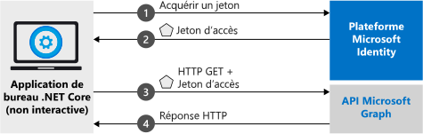

# <a name="quickstart-acquire-a-token-and-call-microsoft-graph-api-using-console-apps-identity"></a>Démarrage rapide : Acquérir un jeton et appeler l'API Microsoft Graph en utilisant l'identité de l'application console

Dans ce guide de démarrage rapide, vous allez découvrir comment écrire une application .NET Core qui obtient un jeton d’accès à l’aide de l’identité de l’application, puis qui appelle l’API Microsoft Graph pour afficher une [liste des utilisateurs](/graph/api/user-list) dans l’annuaire. Ce scénario est utile dans les situations où un travail sans périphérique de contrôle et sans assistance ou un service Windows doit s’exécuter avec une identité d’application au lieu d’une identité d’utilisateur. (Consultez [Fonctionnement de l’exemple](#how-the-sample-works) pour une illustration.)

## <a name="prerequisites"></a>Prérequis

Ce guide de démarrage rapide nécessite [.NET Core 3.1](https://www.microsoft.com/net/download/dotnet-core).

> [!div renderon="docs"]
> ## <a name="register-and-download-your-quickstart-app"></a>Inscrire et télécharger votre application de démarrage rapide

> [!div renderon="docs" class="sxs-lookup"]
>
> Vous disposez de deux options pour démarrer votre application de démarrage rapide : Express (Option 1 ci-dessous) et Manuel (Option 2)
>
> ### <a name="option-1-register-and-auto-configure-your-app-and-then-download-your-code-sample"></a>Option 1 : Inscrire et configurer automatiquement votre application, puis télécharger votre exemple de code
>
> 1. Accédez au nouveau volet [Portail Azure - Inscriptions des applications](https://portal.azure.com/?Microsoft_AAD_RegisteredApps=true#blade/Microsoft_AAD_RegisteredApps/applicationsListBlade/quickStartType/DotNetCoreDaemonQuickstartPage/sourceType/docs).
> 1. Entrez un nom pour votre application, puis sélectionnez **Inscrire**.
> 1. Suivez les instructions pour télécharger et configurer automatiquement votre nouvelle application en un seul clic.
>
> ### <a name="option-2-register-and-manually-configure-your-application-and-code-sample"></a>Option n°2 : Inscrire et configurer manuellement vos application et exemple de code

> [!div renderon="docs"]
> #### <a name="step-1-register-your-application"></a>Étape 1 : Inscrivez votre application
> Pour inscrire votre application et ajouter manuellement les informations d’inscription de l’application à votre solution, procédez comme suit :
>
> 1. Connectez-vous au [portail Azure](https://portal.azure.com) avec un compte professionnel ou scolaire ou avec un compte personnel Microsoft.
> 1. Si votre compte vous propose un accès à plusieurs locataires, sélectionnez votre compte en haut à droite et définissez votre session de portail sur le locataire Azure AD souhaité.
> 1. Accédez à la page [Inscriptions d’applications](https://go.microsoft.com/fwlink/?linkid=2083908) de la plateforme d’identités Microsoft pour les développeurs en recherchant **Inscriptions d’applications** dans la barre de recherche du portail Azure.
> 1. Sélectionnez **Nouvelle inscription**.
> 1. Lorsque la page **Inscrire une application** s’affiche, saisissez les informations d’inscription de votre application.
> 1. Dans la section **Nom**, entrez un nom d’application pertinent qui sera visible par les utilisateurs de l’application, par exemple `Daemon-console`, puis sélectionnez **Inscrire** pour créer l’application.
> 1. Après l’inscription, sélectionnez le menu **Certificats et secrets**.
> 1. Sous **Secrets client** , sélectionnez **+ Nouveau secret client**. Donnez-lui un nom et sélectionnez **Ajouter**. Copiez le secret dans un emplacement sûr. Vous devrez l’utiliser dans votre code, et il ne sera plus réaffiché dans le portail.
> 1. À présent, sélectionnez le menu **Autorisations de l’API**, sélectionnez le bouton **+ Ajouter une autorisation** et sélectionnez **Microsoft Graph**.
> 1. Sélectionnez **Autorisations de l’application**.
> 1. Sous le nœud **Utilisateur**, sélectionnez **User.Read.All**, puis sélectionnez **Ajouter des autorisations**

> [!div class="sxs-lookup" renderon="portal"]
> ### <a name="download-and-configure-your-quickstart-app"></a>Télécharger et configurer votre application de démarrage rapide
>
> #### <a name="step-1-configure-your-application-in-azure-portal"></a>Étape 1 : Configurer votre application dans le portail Azure
> Pour que l’exemple de code fonctionne dans ce guide de démarrage rapide, vous devez créer un secret client et ajouter l’autorisation d’application **User.Read.All** de l’API Graph.
> > [!div renderon="portal" id="makechanges" class="nextstepaction"]
> > [Apporter ces modifications pour moi]()
>
> > [!div id="appconfigured" class="alert alert-info"]
> >  Votre application est configurée avec ces attributs.

#### <a name="step-2-download-your-visual-studio-project"></a>Étape 2 : Télécharger votre projet Visual Studio

> [!div renderon="docs"]
> [Télécharger le projet Visual Studio](https://github.com/Azure-Samples/active-directory-dotnetcore-daemon-v2/archive/master.zip)
>
> Vous pouvez exécuter le projet fourni dans Visual Studio ou Visual Studio pour Mac.


> [!div class="sxs-lookup" renderon="portal"]
> Exécutez le projet à l’aide de Visual Studio 2019.
> [!div class="sxs-lookup" renderon="portal" id="autoupdate" class="nextstepaction"]
> [Téléchargez l’exemple de code](https://github.com/Azure-Samples/active-directory-dotnetcore-daemon-v2/archive/master.zip).

> [!div class="sxs-lookup" renderon="portal"]
> > [!NOTE]
> > `Enter_the_Supported_Account_Info_Here`

> [!div renderon="docs"]
> #### <a name="step-3-configure-your-visual-studio-project"></a>Étape 3 : Configurer votre projet Visual Studio
>
> 1. Extrayez le fichier zip dans un dossier local proche de la racine du disque, par exemple, **C:\Azure-Samples**.
> 1. Ouvrez la solution dans Visual Studio - **1-Call-MSGraph\daemon-console.sln** (facultatif).
> 1. Modifiez **appsettings.json** et remplacez les valeurs des champs `ClientId`, `Tenant` et `ClientSecret` par :
>
>    ```json
>    "Tenant": "Enter_the_Tenant_Id_Here",
>    "ClientId": "Enter_the_Application_Id_Here",
>    "ClientSecret": "Enter_the_Client_Secret_Here"
>    ```
>   Où :
>   - `Enter_the_Application_Id_Here` : est l’**ID d’application (client)** pour l’application que vous avez inscrite.
>   - `Enter_the_Tenant_Id_Here` : remplacez cette valeur par l’**ID du locataire** ou le **nom du locataire** (par exemple, contoso.microsoft.com)
>   - `Enter_the_Client_Secret_Here` : remplacez cette valeur par le secret client créé à l’étape 1.

> [!div renderon="docs"]
> > [!TIP]
> > Pour connaître les valeurs de l’**ID d’application (client)** et de l’**ID de l’annuaire (locataire)** , consultez la page **Vue d’ensemble** de l’application dans le Portail Azure. Pour générer une nouvelle clé, accédez à la page **Certificats et secrets**.

> [!div class="sxs-lookup" renderon="portal"]
> #### <a name="step-3-admin-consent"></a>Étape 3 : Consentement de l’administrateur

> [!div renderon="docs"]
> #### <a name="step-4-admin-consent"></a>Étape 4 : Consentement de l’administrateur

Si vous essayez d’exécuter l’application à ce stade, vous recevez l’erreur *HTTP 403 - Interdit* : `Insufficient privileges to complete the operation`. Cette erreur se produit parce que le consentement de l’administrateur est obligatoire pour toute *autorisation d’application uniquement*. Autrement dit, un administrateur général de votre annuaire doit donner son consentement à votre application. Sélectionnez l’une des options ci-dessous en fonction de votre rôle :

##### <a name="global-tenant-administrator"></a>Administrateur de locataires général

> [!div renderon="docs"]
> Si vous êtes administrateur de locataires général, dans le portail Azure, accédez à **Applications d’entreprise**, cliquez sur votre inscription d’application, puis choisissez **« Autorisations »** dans la section Sécurité du volet de navigation gauche. Cliquez sur le grand bouton intitulé **Accorder un consentement d’administrateur pour {nom du locataire}** (où {nom du locataire} est le nom de votre annuaire).

> [!div renderon="portal" class="sxs-lookup"]
> Si vous êtes administrateur général, accédez à la page **Autorisations de l’API** et sélectionnez **Accorder le consentement de l’administrateur pour Entrer_le_nom_du_locataire_ici**
> > [!div id="apipermissionspage"]
> > [Accéder à la page Autorisations de l’API]()

##### <a name="standard-user"></a>Utilisateur standard

Si vous êtes un utilisateur standard de votre locataire, vous devez demander à un administrateur général de vous accorder son consentement pour votre application. Pour ce faire, donnez l’URL suivante à votre administrateur :

```url
https://login.microsoftonline.com/Enter_the_Tenant_Id_Here/adminconsent?client_id=Enter_the_Application_Id_Here
```

> [!div renderon="docs"]
>> Où :
>> * `Enter_the_Tenant_Id_Here` : remplacez cette valeur par l’**ID du locataire** ou le **nom du locataire** (par exemple, contoso.microsoft.com)
>> * `Enter_the_Application_Id_Here` : est l’**ID d’application (client)** pour l’application que vous avez inscrite.

> [!NOTE]
> Vous pouvez recevoir l’erreur *« AADSTS50011 : aucune adresse de réponse n’est inscrite pour l’application »* après avoir accordé le consentement pour l’application à l’aide de l’URL précédente. La raison est que cette application et l’URL n’ont pas d’URI de redirection. Vous pouvez ignorer l’erreur.

> [!div class="sxs-lookup" renderon="portal"]
> #### <a name="step-4-run-the-application"></a>Étape 4 : Exécution de l'application

> [!div renderon="docs"]
> #### <a name="step-5-run-the-application"></a>Étape 5 : Exécution de l'application

Si vous utilisez Visual Studio ou Visual Studio pour Mac, appuyez sur **F5** pour exécuter l’application ; sinon, exécutez l’application à partir d’une invite de commandes, de la console ou du terminal :

```console
cd {ProjectFolder}\1-Call-MSGraph\daemon-console
dotnet run
```

> Où :
> * *{ProjectFolder}*  est le dossier où vous avez extrait le fichier zip. Par exemple, **C:\Azure-Samples\active-directory-dotnetcore-daemon-v2**

Une liste des utilisateurs dans votre annuaire Azure AD s’affiche normalement.

> [!IMPORTANT]
> Cette application de démarrage rapide utilise un secret client pour s’identifier en tant que client confidentiel. Le secret client étant ajouté en texte brut à vos fichiers projet, il est recommandé, pour des raisons de sécurité, d’utiliser un certificat au lieu d’un secret client avant de considérer l’application comme application de production. Pour plus d’informations sur la façon d’utiliser un certificat, consultez [ces instructions](https://github.com/Azure-Samples/active-directory-dotnetcore-daemon-v2/#variation-daemon-application-using-client-credentials-with-certificates) dans le dépôt GitHub pour cet exemple.

## <a name="more-information"></a>Informations complémentaires

### <a name="how-the-sample-works"></a>Fonctionnement de l’exemple


### <a name="msalnet"></a>MSAL.NET

MSAL ([Microsoft.Identity.Client](https://www.nuget.org/packages/Microsoft.Identity.Client)) est la bibliothèque utilisée pour connecter les utilisateurs et demander des jetons permettant d’accéder à une API protégée par la plateforme d’identités Microsoft. Comme vous l’avez vu, ce guide de démarrage rapide demande des jetons à l’aide de l’identité de l’application au lieu d’autorisations déléguées. Le flux d’authentification utilisé dans ce cas est désigné sous le terme de *[flux d’informations d’identification du client OAuth](v2-oauth2-client-creds-grant-flow.md)* . Pour plus d’informations sur l’utilisation de MSAL.NET avec un flux d’informations d’identification du client, consultez [cet article](https://aka.ms/msal-net-client-credentials).

 Vous pouvez installer MSAL.NET en exécutant la commande suivante dans la **console du gestionnaire de package** de Visual Studio :

```powershell twhitney
```console
dotnet add package Microsoft.Identity.Client
```

### <a name="msal-initialization"></a>Initialisation MSAL

Vous pouvez ajouter la référence de MSAL en ajoutant le code suivant :

```csharp
using Microsoft.Identity.Client;
```

Ensuite, initialisez MSAL à l’aide du code suivant :

```csharp
IConfidentialClientApplication app;
app = ConfidentialClientApplicationBuilder.Create(config.ClientId)
                                          .WithClientSecret(config.ClientSecret)
                                          .WithAuthority(new Uri(config.Authority))
                                          .Build();
```

> | Où : | Description |
> |---------|---------|
> | `config.ClientSecret` | Est le secret client créé pour l’application dans le portail Azure. |
> | `config.ClientId` | Est l’**ID d’application (client)** de l’application inscrite dans le portail Azure. Vous pouvez retrouver cette valeur dans la page **Vue d’ensemble** de l’application dans le portail Azure. |
> | `config.Authority`    | (Facultatif) Point de terminaison STS pour l’utilisateur à authentifier. Généralement `https://login.microsoftonline.com/{tenant}` pour un cloud public, où {tenant} est le nom ou l’ID de votre locataire.|

Pour plus d’informations, consultez la [documentation de référence sur `ConfidentialClientApplication`](/dotnet/api/microsoft.identity.client.iconfidentialclientapplication)

### <a name="requesting-tokens"></a>Demande de jetons

Pour demander un jeton à l’aide de l’identité d’application, utilisez la méthode `AcquireTokenForClient` :

```csharp
result = await app.AcquireTokenForClient(scopes)
                  .ExecuteAsync();
```

> |Où :| Description |
> |---------|---------|
> | `scopes` | Contient les étendues demandées. Pour les clients confidentiels, utilisez un format similaire à `{Application ID URI}/.default`. Ce format indique que les étendues demandées sont celles qui sont définies de manière statique dans l’objet application défini dans le portail Azure (pour Microsoft Graph, `{Application ID URI}` pointe vers `https://graph.microsoft.com`). Pour les API web personnalisées, `{Application ID URI}` est défini sous la section **Exposer une API** dans Inscription de l’application (préversion) sur le portail Azure. |

Pour plus d’informations, consultez la [documentation de référence sur `AcquireTokenForClient`](/dotnet/api/microsoft.identity.client.confidentialclientapplication.acquiretokenforclient)

[!INCLUDE [Help and support](../../../includes/active-directory-develop-help-support-include.md)]

## <a name="next-steps"></a>Étapes suivantes

Pour en savoir plus sur les applications démon, consultez la vue d’ensemble du scénario :

> [!div class="nextstepaction"]
> [Application démon qui appelle des API web](scenario-daemon-overview.md)
