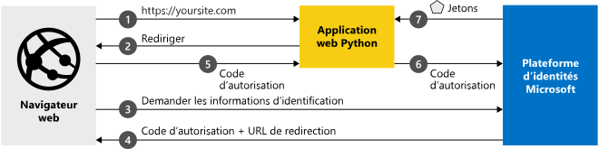

# <a name="quickstart-add-sign-in-with-microsoft-to-a-python-web-app"></a>Démarrage rapide : Ajouter la connexion avec Microsoft à une application web Python

Dans ce guide de démarrage rapide, vous téléchargez et exécutez un exemple de code qui montre comment une application web Python peut connecter des utilisateurs et obtenir un jeton d’accès pour appeler l’API Microsoft Graph. Les utilisateurs avec un compte Microsoft personnel ou un compte de n’importe quelle organisation Azure Active Directory (Azure AD) peuvent se connecter à l’application.

Consultez [Fonctionnement de l’exemple](#how-the-sample-works) pour obtenir une illustration.

## <a name="prerequisites"></a>Prérequis

- Compte Azure avec un abonnement actif. [Créez un compte gratuitement](https://azure.microsoft.com/free/?WT.mc_id=A261C142F).
- [Python 2.7+](https://www.python.org/downloads/release/python-2713) or [Python 3+](https://www.python.org/downloads/release/python-364/)
- [Flask](http://flask.pocoo.org/), [Flask-Session](https://pypi.org/project/Flask-Session/), [requests](https://requests.kennethreitz.org/en/master/)
- [MSAL Python](https://github.com/AzureAD/microsoft-authentication-library-for-python)

> [!div renderon="docs"]
>
> ## <a name="register-and-download-your-quickstart-app"></a>Inscrire et télécharger votre application de démarrage rapide
>
> Vous avez deux options pour démarrer votre application du guide de démarrage rapide : rapide (Option 1) et manuelle (Option 2)
>
> ### <a name="option-1-register-and-auto-configure-your-app-and-then-download-your-code-sample"></a>Option 1 : Inscrire et configurer automatiquement votre application, puis télécharger votre exemple de code
>
> 1. Accédez au [portail Azure - Inscriptions d’applications](https://portal.azure.com/#blade/Microsoft_AAD_RegisteredApps/applicationsListBlade/quickStartType/PythonQuickstartPage/sourceType/docs).
> 1. Entrez un nom pour votre application, puis sélectionnez **Inscrire**.
> 1. Suivez les instructions pour télécharger et configurer automatiquement votre nouvelle application.
>
> ### <a name="option-2-register-and-manually-configure-your-application-and-code-sample"></a>Option n°2 : Inscrire et configurer manuellement vos application et exemple de code
>
> #### <a name="step-1-register-your-application"></a>Étape 1 : Inscrivez votre application
>
> Pour inscrire votre application et ajouter manuellement les informations d’inscription de l’application à votre solution, procédez comme suit :
>
> 1. Connectez-vous au <a href="https://portal.azure.com/" target="_blank">portail Azure<span class="docon docon-navigate-external x-hidden-focus"></span></a>.
> 1. Si vous avez accès à plusieurs locataires, utilisez le filtre **Répertoire + abonnement** :::image type="icon" source="./media/common/portal-directory-subscription-filter.png" border="false"::: dans le menu du haut pour sélectionner le locataire dans lequel vous voulez inscrire une application.
> 1. Sous **Gérer**, sélectionnez **Inscriptions d’applications** > **Nouvelle inscription**.
> 1. Entrez un **nom** pour votre application, tel que `python-webapp`. Les utilisateurs de votre application peuvent voir ce nom, et vous pouvez le changer ultérieurement.
> 1. Sous **Types de comptes pris en charge**, sélectionnez **Comptes dans un annuaire organisationnel et comptes personnels Microsoft**.
> 1. Sélectionnez **Inscription**.
> 1. Dans la page **Vue d’ensemble**, notez la valeur de **ID d’application (client)** pour une utilisation ultérieure.
> 1. Sous **Gérer**, sélectionnez **Authentification**.
> 1. Sélectionnez **Ajouter une plateforme** > **Web**.
> 1. Ajoutez `http://localhost:5000/getAToken` en tant qu’**URI de redirection**.
> 1. Sélectionnez **Configurer**.
> 1. Sous **Gérer**, sélectionnez **Certificats et secrets**, puis dans la section **Secrets client**, sélectionnez **Nouveau secret client**.
> 1. Tapez une description de clé (par exemple, un secret d’application), laissez l’expiration par défaut et sélectionnez **Ajouter**.
> 1. Notez la **Valeur** de la **clé secrète client** pour une utilisation ultérieure.
> 1. Sous **Gérer**, sélectionnez **Autorisations de l’API** > **Ajouter une autorisation**.
>1.  Vérifiez ensuite que l’onglet **API Microsoft** est sélectionné.
> 1. Dans la section *API Microsoft couramment utilisées*, sélectionnez **Microsoft Graph**.
> 1. Dans la section **Autorisations déléguées**, vérifiez que les autorisations appropriées sont cochées : **User.ReadBasic.All**. Utilisez la zone de recherche au besoin.
> 1. Sélectionnez le bouton **Ajouter des autorisations**.
>
> [!div class="sxs-lookup" renderon="portal"]
>
> #### <a name="step-1-configure-your-application-in-azure-portal"></a>Étape 1 : Configurer votre application dans le portail Azure
>
> Pour que l’exemple de code de ce guide de démarrage rapide fonctionne, vous devez :
>
> 1. Ajoutez une URL de réponse sous la forme `http://localhost:5000/getAToken`.
> 1. Créer un secret client.
> 1. Ajoutez la permission déléguée User.ReadBasic.All de l’API Microsoft Graph.
>
> > [!div renderon="portal" id="makechanges" class="nextstepaction"]
> > [Apporter ces modifications pour moi]()
> > [!div id="appconfigured" class="alert alert-info"]
> >  Votre application est configurée avec cet attribut.

#### <a name="step-2-download-your-project"></a>Étape 2 : Télécharger votre projet
> [!div renderon="docs"]
> [Télécharger l'exemple de code](https://github.com/Azure-Samples/ms-identity-python-webapp/archive/master.zip)

> [!div class="sxs-lookup" renderon="portal"]
> Téléchargez le projet et extrayez le fichier zip dans un dossier local proche du dossier racine (par exemple, **C:\Azure-Samples**)
> [!div class="sxs-lookup" renderon="portal" id="autoupdate" class="nextstepaction"]
> [Téléchargez l’exemple de code](https://github.com/Azure-Samples/ms-identity-python-webapp/archive/master.zip).

> [!div class="sxs-lookup" renderon="portal"]
> > [!NOTE]
> > `Enter_the_Supported_Account_Info_Here`

> [!div renderon="docs"]
> #### <a name="step-3-configure-the-application"></a>Étape 3 : Configurer l’application
>
> 1. Extrayez le fichier zip dans un dossier local proche du dossier racine (par exemple, **C:\Azure-Samples**)
> 1. Si vous utilisez un environnement de développement intégré, ouvrez l’exemple dans votre IDE habituel (facultatif).
> 1. Ouvrez le fichier **app_config.py** qui se trouve dans le dossier racine, puis remplacez son contenu par l’extrait de code suivant :
>
> ```python
> CLIENT_ID = "Enter_the_Application_Id_here"
> CLIENT_SECRET = "Enter_the_Client_Secret_Here"
> AUTHORITY = "https://login.microsoftonline.com/Enter_the_Tenant_Name_Here"
> ```
> Où :
>
> - `Enter_the_Application_Id_here` - est l’ID de l’application pour l’application que vous avez inscrite.
> - `Enter_the_Client_Secret_Here` - correspond au **secret client** que vous avez créé dans **Certificats et secrets** pour l’application que vous avez inscrite.
> - `Enter_the_Tenant_Name_Here` – est la valeur **ID de l’annuaire (locataire)** de l’application que vous avez inscrite.

> [!div class="sxs-lookup" renderon="portal"]
> #### <a name="step-3-run-the-code-sample"></a>Étape 3 : Exécuter l’exemple de code

> [!div renderon="docs"]
> #### <a name="step-4-run-the-code-sample"></a>Étape 4 : Exécuter l’exemple de code

1. Vous devez installer la bibliothèque Python MSAL, le framework Flask, des Flask-Sessions pour la gestion des sessions côté serveur et la bibliothèque Requests avec PIP, comme suit :

    ```Shell
    pip install -r requirements.txt
    ```

2. Exécutez app.py à partir de l’interpréteur de commandes ou de la ligne de commande :

    ```Shell
    python app.py
    ```
   > [!IMPORTANT]
   > Cette application de démarrage rapide utilise un secret client pour s’identifier en tant que client confidentiel. Le secret client étant ajouté en texte brut à vos fichiers projet, il est recommandé, pour des raisons de sécurité, d’utiliser un certificat au lieu d’un secret client avant de considérer l’application comme application de production. Pour savoir plus en détails comment utiliser un certificat, voir [ces instructions](./active-directory-certificate-credentials.md).

## <a name="more-information"></a>Informations complémentaires

### <a name="how-the-sample-works"></a>Fonctionnement de l’exemple


### <a name="getting-msal"></a>Obtention de MSAL
MSAL est la bibliothèque utilisée pour connecter les utilisateurs et demander des jetons permettant d’accéder à une API protégée par la Plateforme d’identités Microsoft.
Pour ajouter MSAL Python à votre application, vous pouvez utiliser Pip.

```Shell
pip install msal
```

### <a name="msal-initialization"></a>Initialisation MSAL
Pour ajouter la référence à MSAL Python, ajoutez le code suivant au début du fichier où vous allez utiliser MSAL :

```Python
import msal
```

[!INCLUDE [Help and support](../../../includes/active-directory-develop-help-support-include.md)]

## <a name="next-steps"></a>Étapes suivantes

Découvrez-en plus sur les applications web qui connectent les utilisateurs dans notre série de scénarios en plusieurs parties.

> [!div class="nextstepaction"]
> [Scénario : application web qui connecte les utilisateurs](scenario-web-app-sign-user-overview.md)
