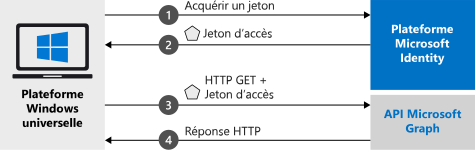

# <a name="quickstart-call-the-microsoft-graph-api-from-a-universal-windows-platform-uwp-application"></a>Démarrage rapide : Appeler l’API Microsoft Graph à partir d’une application de plateforme Windows universelle (UWP)

Ce guide de démarrage rapide contient un exemple de code qui montre comment une application de plateforme Windows universelle (UWP) peut connecter des utilisateurs avec des comptes personnels ou des comptes professionnels et scolaires, obtenir un jeton d’accès et appeler l’API Microsoft Graph.



> [!div renderon="docs"]
> ## <a name="register-and-download-your-quickstart-app"></a>Inscrire et télécharger votre application de démarrage rapide
> [!div renderon="docs" class="sxs-lookup"]
> Vous disposez de deux options pour démarrer votre application de démarrage rapide :
> * [Express] [Option 1 : Inscrire et configurer automatiquement votre application, puis télécharger votre exemple de code](#option-1-register-and-auto-configure-your-app-and-then-download-your-code-sample)
> * [Manuel] [Option 2 : Inscrire et configurer manuellement vos application et exemple de code](#option-2-register-and-manually-configure-your-application-and-code-sample)
>
> ### <a name="option-1-register-and-auto-configure-your-app-and-then-download-your-code-sample"></a>Option 1 : Inscrire et configurer automatiquement votre application, puis télécharger votre exemple de code
>
> 1. Accédez au nouveau volet [Portail Azure - Inscriptions des applications](https://portal.azure.com/#blade/Microsoft_AAD_RegisteredApps/applicationsListBlade/quickStartType/UwpQuickstartPage/sourceType/docs).
> 1. Saisissez un nom pour votre application et cliquez sur **Inscrire**.
> 1. Suivez les instructions pour télécharger et configurer automatiquement votre nouvelle application pour vous en un seul clic.
>
> ### <a name="option-2-register-and-manually-configure-your-application-and-code-sample"></a>Option 2 : Inscrire et configurer manuellement vos application et exemple de code
> [!div renderon="docs"]
> #### <a name="step-1-register-your-application"></a>Étape 1 : Inscrivez votre application
> Pour inscrire votre application et ajouter les informations d’inscription de l’application à votre solution, procédez comme suit :
> 1. Connectez-vous au [portail Azure](https://portal.azure.com) avec un compte professionnel ou scolaire ou avec un compte personnel Microsoft.
> 1. Si votre compte vous propose un accès à plusieurs locataires, sélectionnez votre compte en haut à droite et définissez votre session de portail sur le locataire Azure AD souhaité.
> 1. Accédez à la page [Inscriptions des applications](https://aka.ms/MobileAppReg) de la plateforme d’identité Microsoft pour les développeurs.
> 1. Sélectionnez **Nouvelle inscription**.
> 1. Lorsque la page **Inscrire une application** s’affiche, saisissez les informations d’inscription de votre application :
>      - Dans la section **Nom**, saisissez un nom d’application cohérent qui s’affichera pour les utilisateurs de l’application, par exemple `UWP-App-calling-MsGraph`.
>      - Dans la section **Types de comptes pris en charge**, sélectionnez **Comptes dans un annuaire organisationnel et comptes personnels Microsoft (par exemple, Skype, Xbox, Outlook.com)** .
>      - Sélectionnez **Inscrire** pour créer l’application.
> 1. Dans la liste des pages de l’application, sélectionnez **Authentification**.
> 1. Développez la section **Bureau + appareils**.  (Si vous ne voyez pas **Bureau + appareils**, cliquez d’abord sur la bannière supérieure pour voir l’aperçu de l’expérience d’authentification)
> 1. Sous la section **URI de redirection**, sélectionnez **Ajouter un URI**.  Tapez **urn:ietf:wg:oauth:2.0:oob**.
> 1. Sélectionnez **Enregistrer**.

> [!div renderon="portal" class="sxs-lookup"]
> #### <a name="step-1-configure-your-application"></a>Étape 1 : Configuration de votre application
> Pour que l’exemple de code de ce démarrage rapide fonctionne, vous devez ajouter un URI de redirection tel que **urn:ietf:wg:oauth:2.0:oob**.
> > [!div renderon="portal" id="makechanges" class="nextstepaction"]
> > [Apporter cette modification pour moi]()
>
> > [!div id="appconfigured" class="alert alert-info"]
> >  Votre application est configurée avec ces attributs.

#### <a name="step-2-download-your-visual-studio-project"></a>Étape 2 : Télécharger votre projet Visual Studio

 - [Télécharger le projet Visual Studio](https://github.com/Azure-Samples/active-directory-dotnet-native-uwp-v2/archive/msal3x.zip)

#### <a name="step-3-configure-your-visual-studio-project"></a>Étape 3 : Configurer votre projet Visual Studio

1. Extrayez le fichier zip dans un dossier local proche de la racine du disque, par exemple, **C:\Azure-Samples**.
1. Ouvrez le projet dans Visual Studio. Vous pouvez être invité à installer un SDK UWP. Si c’est le cas, acceptez.
1. Modifiez **MainPage.Xaml.cs** en remplaçant les valeurs du champ `ClientId` :

    ```csharp
    private const string ClientId = "Enter_the_Application_Id_here";
    ```
> [!div class="sxs-lookup" renderon="portal"]
> > [!NOTE]
> > Ce guide de démarrage rapide prend en charge Enter_the_Supported_Account_Info_Here.    

> [!div renderon="docs"]
> Où :
> - `Enter_the_Application_Id_here` - est l’ID de l’application pour l’application que vous avez inscrite.
>
> > [!TIP]
> > Pour connaître la valeur du champ *ID d’application*, accédez à la section **Vue d’ensemble** du portail.

#### <a name="step-4-run-your-application"></a>Étape 4 : Exécuter votre application

Si vous voulez suivre le guide de démarrage rapide sur votre ordinateur Windows :

1. Dans la barre d’outils Visual Studio, choisissez la bonne plateforme (probablement **x64** ou **x86**, mais pas ARM).
   > Notez que l’appareil cible passe de *Appareil* à *Machine locale*.
1. Sélectionnez Déboguer | **Démarrer sans débogage**.

## <a name="more-information"></a>Plus d’informations

Cette section fournit plus d’informations sur le démarrage rapide.

### <a name="msalnet"></a>MSAL.NET

MSAL ([Microsoft.Identity.Client](https://www.nuget.org/packages/Microsoft.Identity.Client)) est la bibliothèque utilisée pour connecter les utilisateurs et demander des jetons de sécurité. Les jetons de sécurité sont utilisés par les développeurs pour accéder à une API protégée par la plateforme d’identités Microsoft. Vous pouvez installer MSAL en exécutant la commande suivante dans la *console du gestionnaire de package* de Visual Studio :

```powershell
Install-Package Microsoft.Identity.Client -IncludePrerelease
```

### <a name="msal-initialization"></a>Initialisation MSAL

Vous pouvez ajouter la référence de MSAL en ajoutant le code suivant :

```csharp
using Microsoft.Identity.Client;
```

MSAL est ensuite initialisé à l’aide du code suivant :

```csharp
public static IPublicClientApplication PublicClientApp;
PublicClientApp = PublicClientApplicationBuilder.Create(ClientId)
                                                    .Build();
```

> |Où : ||
> |---------|---------|
> | `ClientId` | Est l’**ID d’application (client)** de l’application inscrite dans le portail Azure. Vous pouvez retrouver cette valeur dans la page **Vue d’ensemble** de l’application dans le portail Azure. |

### <a name="requesting-tokens"></a>Demande de jetons

MSAL utilise deux méthodes d’acquisition de jetons dans une application UWP : `AcquireTokenInteractive` et `AcquireTokenSilent`.

#### <a name="get-a-user-token-interactively"></a>Obtenir un jeton d’utilisateur de manière interactive

Certaines situations nécessitent d’obliger les utilisateurs à interagir avec un point de terminaison de la plateforme d’identités Microsoft par le biais d’une fenêtre contextuelle pour valider leurs informations d’identification ou donner leur consentement. Voici quelques exemples :

- Lorsque des utilisateurs se connectent pour la première fois à l’application
- Quand les utilisateurs doivent de nouveau entrer leurs informations d’identification, car le mot de passe a expiré
- Lorsque votre application demande l’accès à une ressource pour laquelle l’utilisateur doit donner son consentement
- Lorsqu’une authentification à 2 facteurs est requise

```csharp
authResult = await App.PublicClientApp.AcquireTokenInteractive(scopes)
                      .ExecuteAsync();
```

> |Où :||
> |---------|---------|
> | `scopes` | Contient les étendues demandées, telles que `{ "user.read" }` pour Microsoft Graph ou `{ "api://<Application ID>/access_as_user" }` pour les API web personnalisées. |

#### <a name="get-a-user-token-silently"></a>Obtenir un jeton d’utilisateur en mode silencieux

Utilisez la méthode `AcquireTokenSilent` pour obtenir des jetons d’accès aux ressources protégées après la méthode `AcquireTokenInteractive` initiale. Vous ne voulez pas obliger l’utilisateur à valider ses informations d’identification chaque fois qu’il doit accéder à une ressource. La plupart du temps, vous voulez que les acquisitions et renouvellements de jetons se fassent sans aucune interaction de l’utilisateur.

```csharp
var accounts = await App.PublicClientApp.GetAccountsAsync();
var firstAccount = accounts.FirstOrDefault();
authResult = await App.PublicClientApp.AcquireTokenSilent(scopes, firstAccount)
                                      .ExecuteAsync();
```

> |Où : ||
> |---------|---------|
> | `scopes` | Contient les étendues demandées, telles que `{ "user.read" }` pour Microsoft Graph ou `{ "api://<Application ID>/access_as_user" }` pour les API web personnalisées |
> | `firstAccount` | Spécifie le compte du premier utilisateur dans le cache (MSAL prend en charge plusieurs utilisateurs dans une même application) |

[!INCLUDE [Help and support](../../../includes/active-directory-develop-help-support-include.md)]

## <a name="next-steps"></a>Étapes suivantes

Essayez le didacticiel de bureau Windows pour apprendre à créer, étape par étape, des applications et des fonctionnalités, y compris une explication complète de ce démarrage rapide.

> [!div class="nextstepaction"]
> [Didacticiel UWP : Appeler l’API Graph](tutorial-v2-windows-uwp.md)

Aidez-nous à améliorer la plateforme des identités Microsoft. Faites-nous part de votre avis en répondant à une petite enquête de deux questions.

> [!div class="nextstepaction"]
> [Enquête sur la plateforme des identités Microsoft](https://forms.office.com/Pages/ResponsePage.aspx?id=v4j5cvGGr0GRqy180BHbRyKrNDMV_xBIiPGgSvnbQZdUQjFIUUFGUE1SMEVFTkdaVU5YT0EyOEtJVi4u)
