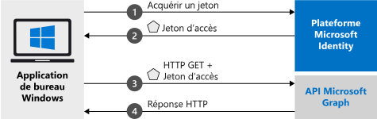

# <a name="quickstart-acquire-a-token-and-call-microsoft-graph-api-from-a-windows-desktop-app"></a>Démarrage rapide : Acquérir un jeton et appeler l’API Microsoft Graph à partir d’une application de bureau Windows

Dans ce démarrage rapide, vous allez apprendre comment concevoir une application de bureau Windows .NET (WPF) capable de connecter des comptes personnels, professionnels et scolaires, d’obtenir un jeton d’accès et d’appeler l’API Microsoft Graph. (Consultez [Fonctionnement de l’exemple](#how-the-sample-works) pour une illustration.)

> [!div renderon="docs"]
> ## <a name="register-and-download-your-quickstart-app"></a>Inscrire et télécharger votre application de démarrage rapide
> Vous disposez de deux options pour démarrer votre application de démarrage rapide :
> * [Express] [Option 1 : Inscrire et configurer automatiquement votre application, puis télécharger votre exemple de code](#option-1-register-and-auto-configure-your-app-and-then-download-your-code-sample)
> * [Manuel] [Option 2 : Inscrire et configurer manuellement vos application et exemple de code](#option-2-register-and-manually-configure-your-application-and-code-sample)
>
> ### <a name="option-1-register-and-auto-configure-your-app-and-then-download-your-code-sample"></a>Option 1 : Inscrire et configurer automatiquement votre application, puis télécharger votre exemple de code
>
> 1. Accédez au nouveau volet [Portail Azure - Inscriptions des applications](https://portal.azure.com/#blade/Microsoft_AAD_RegisteredApps/applicationsListBlade/quickStartType/WinDesktopQuickstartPage/sourceType/docs).
> 1. Entrez un nom pour votre application, puis sélectionnez **Inscrire**.
> 1. Suivez les instructions pour télécharger et configurer automatiquement votre nouvelle application en un seul clic.
>
> ### <a name="option-2-register-and-manually-configure-your-application-and-code-sample"></a>Option n°2 : Inscrire et configurer manuellement vos application et exemple de code
>
> #### <a name="step-1-register-your-application"></a>Étape 1 : Inscrivez votre application
> Pour inscrire votre application et ajouter manuellement les informations d’inscription de l’application à votre solution, procédez comme suit :
>
> 1. Connectez-vous au [portail Azure](https://portal.azure.com) avec un compte professionnel ou scolaire ou avec un compte personnel Microsoft.
> 1. Si votre compte vous propose un accès à plusieurs locataires, sélectionnez votre compte en haut à droite et définissez votre session de portail sur le locataire Azure AD souhaité.
> 1. Accédez au panneau [Inscriptions d’applications](https://aka.ms/MobileAppReg) pour Azure Active Directory sur le portail Azure.
> 1. Sélectionnez **Nouvelle inscription**.
>      - Dans la section **Nom**, saisissez un nom d’application cohérent qui s’affichera pour les utilisateurs de l’application, par exemple `Win-App-calling-MsGraph`.
>      - Dans la section **Types de comptes pris en charge**, sélectionnez **Comptes dans un annuaire organisationnel et comptes personnels Microsoft (par exemple, Skype, Xbox, Outlook.com)** .
>      - Sélectionnez **Inscrire** pour créer l’application.
> 1. Dans la liste des pages de l’application, sélectionnez **Authentification**.
> 1. Dans la section **URI de redirection** | **URI de redirection suggérés pour les clients publics (mobile, bureau)** , utilisez **https://login.microsoftonline.com/common/oauth2/nativeclient** .
> 1. Sélectionnez **Enregistrer**.

> [!div class="sxs-lookup" renderon="portal"]
> #### <a name="step-1-configure-your-application-in-azure-portal"></a>Étape 1 : Configurer votre application dans le portail Azure
> Pour que l’exemple de code de ce guide de démarrage rapide fonctionne, vous devez ajouter une URL de réponse telle que **https://login.microsoftonline.com/common/oauth2/nativeclient** .
> > [!div renderon="portal" id="makechanges" class="nextstepaction"]
> > [Apporter cette modification pour moi]()
>
> > [!div id="appconfigured" class="alert alert-info"]
> >  Votre application est configurée avec ces attributs.

#### <a name="step-2-download-your-visual-studio-project"></a>Étape 2 : Télécharger votre projet Visual Studio

> [!div renderon="docs"]
> [Télécharger le projet Visual Studio](https://github.com/Azure-Samples/active-directory-dotnet-desktop-msgraph-v2/archive/msal3x.zip)

> [!div class="sxs-lookup" renderon="portal"]
> Exécutez le projet à l’aide de Visual Studio 2019.
> [!div renderon="portal" id="autoupdate" class="nextstepaction"]
> [Téléchargez l’exemple de code](https://github.com/Azure-Samples/active-directory-dotnet-desktop-msgraph-v2/archive/msal3x.zip).

> [!div class="sxs-lookup" renderon="portal"]
> #### <a name="step-3-your-app-is-configured-and-ready-to-run"></a>Étape 3 : Votre application est configurée et prête à être exécutée
> Nous avons configuré votre projet avec les valeurs des propriétés de votre application et il est prêt à être exécuté.

> [!div class="sxs-lookup" renderon="portal"]
> > [!NOTE]
> > `Enter_the_Supported_Account_Info_Here`

> [!div renderon="docs"]
> #### <a name="step-3-configure-your-visual-studio-project"></a>Étape 3 : Configurer votre projet Visual Studio
> 1. Extrayez le fichier zip dans un dossier local proche de la racine du disque, par exemple, **C:\Azure-Samples**.
> 1. Ouvrez le projet dans Visual Studio.
> 1. Modifiez **App.Xaml.cs** et remplacez les valeurs des champs `ClientId` et `Tenant` par le code suivant :
>
>    ```csharp
>    private static string ClientId = "Enter_the_Application_Id_here";
>    private static string Tenant = "Enter_the_Tenant_Info_Here";
>    ```
>
> Où :
> - `Enter_the_Application_Id_here` : est l’**ID d’application (client)** pour l’application que vous avez inscrite.
> - `Enter_the_Tenant_Info_Here` : est défini sur l’une des options suivantes :
>   - Si votre application prend en charge **Comptes dans cet annuaire organisationnel**, remplacez cette valeur avec l’**ID de locataire** ou le **nom du locataire** (par exemple, contoso.microsoft.com)
>   - Si votre application prend en charge **Comptes dans un annuaire organisationnel**, remplacez cette valeur par `organizations`
>   - Si votre application prend en charge **Comptes dans un annuaire organisationnel et comptes personnels Microsoft**, remplacez cette valeur par `common`
>
> > [!TIP]
> > Pour connaître les valeurs de l’**ID d’Application (client)** , de l’**ID de l’annuaire (locataire)** , et des **Types de comptes pris en charge**, consultez la page **Vue d’ensemble** de l’application dans le Portail Azure.

## <a name="more-information"></a>Informations complémentaires

### <a name="how-the-sample-works"></a>Fonctionnement de l’exemple


### <a name="msalnet"></a>MSAL.NET
MSAL ([Microsoft.Identity.Client](https://www.nuget.org/packages/Microsoft.Identity.Client)) est la bibliothèque utilisée pour connecter les utilisateurs et demander des jetons permettant d’accéder à une API protégée par la plateforme d’identités Microsoft. Vous pouvez installer MSAL en exécutant la commande suivante dans la **console du gestionnaire de package** de Visual Studio :

```powershell
Install-Package Microsoft.Identity.Client -IncludePrerelease
```

### <a name="msal-initialization"></a>Initialisation MSAL

Vous pouvez ajouter la référence de MSAL en ajoutant le code suivant :

```csharp
using Microsoft.Identity.Client;
```

Ensuite, initialisez MSAL à l’aide du code suivant :

```csharp
public static IPublicClientApplication PublicClientApp;
PublicClientApplicationBuilder.Create(ClientId)
                .WithRedirectUri("https://login.microsoftonline.com/common/oauth2/nativeclient")
                .WithAuthority(AzureCloudInstance.AzurePublic, Tenant)
                .Build();
```

> |Où : | Description |
> |---------|---------|
> | `ClientId` | Est l’**ID d’application (client)** de l’application inscrite dans le portail Azure. Vous pouvez retrouver cette valeur dans la page **Vue d’ensemble** de l’application dans le portail Azure. |

### <a name="requesting-tokens"></a>Demande de jetons

MSAL utilise deux méthodes d’acquisition de jetons : `AcquireTokenInteractive` et `AcquireTokenSilent`.

#### <a name="get-a-user-token-interactively"></a>Obtenir un jeton d’utilisateur de manière interactive

Certaines situations nécessitent d’obliger les utilisateurs à interagir avec un point de terminaison de la plateforme d’identités Microsoft via une fenêtre contextuelle pour valider leurs informations d’identification ou donner leur consentement. Voici quelques exemples :

- La première connexion des utilisateurs à l’application
- Quand les utilisateurs doivent de nouveau entrer leurs informations d’identification, car le mot de passe a expiré
- Lorsque votre application demande l’accès à une ressource pour laquelle l’utilisateur doit donner son consentement
- Lorsqu’une authentification à 2 facteurs est requise

```csharp
authResult = await App.PublicClientApp.AcquireTokenInteractive(_scopes)
                                      .ExecuteAsync();
```

> |Où :| Description |
> |---------|---------|
> | `_scopes` | Contient les étendues demandées, comme `{ "user.read" }` pour Microsoft Graph ou `{ "api://<Application ID>/access_as_user" }` pour les API web personnalisées. |

#### <a name="get-a-user-token-silently"></a>Obtenir un jeton d’utilisateur en mode silencieux

Vous ne voulez pas obliger l’utilisateur à valider ses informations d’identification à chaque fois qu’il doit accéder à une ressource. La plupart du temps, vous souhaitez que les acquisitions et renouvellements de jetons se fassent sans aucune interaction de l’utilisateur. Vous pouvez utiliser la méthode `AcquireTokenSilent` pour obtenir des jetons pour accéder aux ressources protégées après la méthode `AcquireTokenInteractive` initiale :

```csharp
var accounts = await App.PublicClientApp.GetAccountsAsync();
var firstAccount = accounts.FirstOrDefault();
authResult = await App.PublicClientApp.AcquireTokenSilent(scopes, firstAccount)
                                      .ExecuteAsync();
```

> |Où : | Description |
> |---------|---------|
> | `scopes` | Contient les étendues demandées, comme `{ "user.read" }` pour Microsoft Graph ou `{ "api://<Application ID>/access_as_user" }` pour les API web personnalisées. |
> | `firstAccount` | Spécifie le premier utilisateur dans le cache (MSAL prend en charge plusieurs utilisateurs dans une seule application). |

[!INCLUDE [Help and support](../../../includes/active-directory-develop-help-support-include.md)]

## <a name="next-steps"></a>Étapes suivantes

Essayez le didacticiel de bureau Windows pour apprendre à créer, étape par étape, des applications et des fonctionnalités, y compris une explication complète de ce démarrage rapide.

> [!div class="nextstepaction"]
> [Didacticiel pour appeler l’API Graph](https://docs.microsoft.com/azure/active-directory/develop/guidedsetups/active-directory-windesktop)
