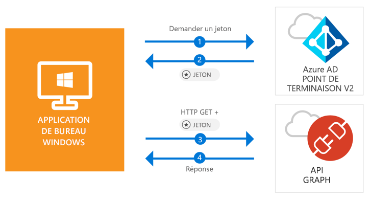

# <a name="quickstart-acquire-a-token-and-call-microsoft-graph-api-from-a-windows-desktop-app"></a>Démarrage rapide : Acquérir un jeton et appeler un API Microsoft Graph à partir d’une application de bureau Windows

[!INCLUDE [active-directory-develop-applies-v2-msal](../../../includes/active-directory-develop-applies-v2-msal.md)]

Dans ce démarrage rapide, vous allez apprendre comment une application de bureau Windows .NET (WPF) peut connecter des comptes personnels, professionnels et scolaires, obtenir un jeton d'accès et appeler l’API Microsoft Graph.



> [!div renderon="docs"]
> ## <a name="register-and-download"></a>Inscrire et télécharger
> ### <a name="register-and-configure-your-application-and-code-sample"></a>Inscrire et configurer votre exemple de code et d’application
> #### <a name="step-1-register-your-application"></a>Étape 1 : Inscrivez votre application
> Pour inscrire votre application et ajouter les informations d’inscription de l’application à votre solution, procédez comme suit :
> 1. Accédez au [portail d’inscription des applications de Microsoft](https://apps.dev.microsoft.com/portal/register-app) pour inscrire une application.
> 1. Dans la zone **Nom de l’application**, attribuez un nom à votre application.
> 1. Vérifiez que la case **Guided Setup** (Installation guidée) est décochée et sélectionnez **Créer**.
> 1. Sélectionnez **Ajouter une plateforme**, puis **Application native**, et cliquez sur **Enregistrer**.

> [!div renderon="portal" class="sxs-lookup"]
> #### <a name="step-1-configure-your-application"></a>Étape 1 : configurer votre application
> Pour que l’exemple de code de ce démarrage rapide fonctionne, vous devez ajouter une URL de réponse telle que **urn:ietf:wg:oauth:2.0:oob**.
> > [!div renderon="portal" id="makechanges" class="nextstepaction"]
> > [Apporter cette modification pour moi]()
>
> > [!div id="appconfigured" class="alert alert-info"]
> >  Votre application est configurée avec ces attributs

#### <a name="step-2-download-your-visual-studio-project"></a>Étape 2 : télécharger votre projet Visual Studio

[Télécharger le projet Visual Studio 2017](https://github.com/Azure-Samples/active-directory-dotnet-desktop-msgraph-v2/archive/master.zip)

#### <a name="step-3-configure-your-visual-studio-project"></a>Étape 3 : configurer votre projet Visual Studio

1. Extrayez le fichier zip dans un dossier local (par exemple, **C:\Azure-Samples**)
1. Ouvrez le projet dans Visual Studio.
1. Modifiez **App.Xaml.cs** et remplacez la ligne commençant par `private static string ClientId` par l’ID de l’application que vous venez d’inscrire :

```csharp
private static string ClientId = "Enter_the_Application_Id_here";
```

## <a name="more-information"></a>Plus d’informations

### <a name="msalnet"></a>MSAL.NET

MSAL ([Microsoft.Identity.Client](https://www.nuget.org/packages/Microsoft.Identity.Client)) est la bibliothèque utilisée pour connecter des utilisateurs et demander des jetons permettant d’accéder à une API protégée par Microsoft Azure Active Directory (Azure AD). Vous pouvez l’installer en exécutant la commande suivante dans la **console du gestionnaire de package** de Visual Studio :

```powershell
Install-Package Microsoft.Identity.Client -Pre
```

### <a name="msal-initialization"></a>Initialisation MSAL

Vous pouvez ajouter la référence de MSAL en ajoutant le code suivant :

```csharp
using Microsoft.Identity.Client;
```

Ensuite, initialisez MSAL à l’aide du code suivant :

```csharp
public static PublicClientApplication PublicClientApp = new PublicClientApplication(ClientId);
```

> |Où : ||
> |---------|---------|
> | `ClientId` | L’ID d’application de l’application inscrite dans *portal.microsoft.com* |

### <a name="requesting-tokens"></a>Demande de jetons

MSAL utilise deux méthodes pour acquérir des jetons : `AcquireTokenAsync` et `AcquireTokenSilentAsync`.

#### <a name="get-a-user-token-interactively"></a>Obtenir un jeton d’utilisateur de manière interactive

Certaines situations nécessitent de forcer des utilisateurs à interagir avec un point de terminaison Azure AD v2.0 via une fenêtre contextuelle pour valider leurs informations d’identification ou donner un consentement. Voici quelques exemples :

- La première connexion des utilisateurs à l’application
- Quand les utilisateurs doivent réentrer leurs informations d’identification, car le mot de passe a expiré
- Quand votre application demande l’accès à une ressource pour laquelle l’utilisateur doit donner son consentement
- Quand une authentification à 2 facteurs est requise

```csharp
authResult = await App.PublicClientApp.AcquireTokenAsync(_scopes);
```

> |Où :||
> |---------|---------|
> | `_scopes` | Contient les étendues demandées (c’est-à-dire `{ "user.read" }` pour Microsoft Graph ou `{ "api://<Application ID>/access_as_user" }` pour les API web personnalisées) |

#### <a name="get-a-user-token-silently"></a>Obtenir un jeton d’utilisateur en mode silencieux

Vous ne voulez pas obliger l’utilisateur à valider ses informations d'identification à chaque fois qu’il doit accéder à une ressource. La plupart du temps, vous souhaitez que les acquisitions et renouvellements de jetons se fassent sans aucune interaction de l’utilisateur. Vous pouvez utiliser la méthode `AcquireTokenSilentAsync` pour obtenir des jetons pour accéder aux ressources protégées après la méthode `AcquireTokenAsync` initiale :

```csharp
var accounts = await App.PublicClientApp.GetAccountsAsync();
authResult = await App.PublicClientApp.AcquireTokenSilentAsync(scopes, accounts.FirstOrDefault());
```

> |Où : ||
> |---------|---------|
> |étendues | Contient les étendues demandées (par exemple, `{ "user.read" }` pour Microsoft Graph ou `{ "api://<Application ID>/access_as_user" }` pour les API web personnalisées) |
> |accounts.FirstOrDefault() | Le premier utilisateur dans le cache (MSAL prend en charge plusieurs utilisateurs dans une seule application) |

## <a name="next-steps"></a>Étapes suivantes

Essayez le didacticiel de bureau Windows pour apprendre à créer, étape par étape, des applications et des fonctionnalités, y compris une explication complète de ce démarrage rapide.

### <a name="learn-the-steps-to-create-the-application-used-in-this-quickstart"></a>Découvrez les étapes permettant de créer l’application utilisée dans ce démarrage rapide

> [!div class="nextstepaction"]
> [Didacticiel pour appeler l’API Graph](https://docs.microsoft.com/azure/active-directory/develop/guidedsetups/active-directory-windesktop)

[!INCLUDE [Help and support](../../../includes/active-directory-develop-help-support-include.md)]
