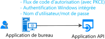

# Scénario : Application de bureau qui appelle des API web

Découvrez tout ce que dont vous avez besoin pour générer une application de bureau qui appelle des API web.

## Prérequis

[!INCLUDE [Pre-requisites](../../../includes/active-directory-develop-scenarios-prerequisites.md)]

## Bien démarrer

Si ce n’est déjà fait, créez votre première application en suivant le Guide de démarrage rapide du bureau .NET, de la plateforme Windows universelle (UWP) ou de l’application native macOS :

> [!div class="nextstepaction"]
> [Démarrage rapide : Acquérir un jeton et appeler l’API Microsoft Graph à partir d’une application de bureau Windows](./quickstart-v2-windows-desktop.md)

> [!div class="nextstepaction"]
> [Démarrage rapide : Acquérir un jeton et appeler l’API Microsoft Graph à partir d’une application UWP](./quickstart-v2-uwp.md)

> [!div class="nextstepaction"]
> [Démarrage rapide : Acquérir un jeton et appeler l’API Microsoft Graph à partir d’une application native macOS](./quickstart-v2-ios.md)

## Vue d’ensemble

Vous écrivez une application de bureau et voulez connecter des utilisateurs à votre application, ainsi qu’appeler des API web telles que Microsoft Graph, d’autres API Microsoft ou votre propre API web. Vous avez plusieurs possibilités :

- Vous pouvez utiliser l’acquisition de jetons interactive :

  - Si votre application de bureau prend en charge les contrôles graphiques, par exemple s’il s’agit d’une application Windows.Form, d’une application WPF ou d’une application native macOS.
  - Ou s’il s’agit d’une application .NET Core et que vous acceptez que l’interaction d’authentification avec Azure Active Directory (Azure AD) se produise dans le navigateur système.

- Pour des applications hébergées sous Windows, il est également possible que des applications s’exécutant sur des ordinateurs reliés à un domaine Windows ou joints à Azure AD acquièrent un jeton en silence en utilisant l’authentification Windows intégrée.
- Enfin, et bien que ce ne soit pas recommandé, vous pouvez utiliser un nom d’utilisateur et un mot de passe dans des applications clientes publiques. Ce flux est toujours nécessaire dans certains scénarios, par exemple, de DevOps. Son utilisation impose des contraintes sur votre application. Par exemple, il ne peut pas connecter un utilisateur qui a besoin d’effectuer une authentification multifacteur (accès conditionnel). De plus, votre application ne bénéficiera pas de l’authentification unique (SSO).

  Il va également à l’encontre des principes de l’authentification moderne et n’est fourni que pour des raisons d’héritage.

  

- Si vous écrivez un outil en ligne de commande portable, probablement une application .NET Core fonctionnant sous Linux ou Mac, et si vous acceptez que l’authentification soit déléguée au navigateur système, vous pouvez utiliser une authentification interactive. .NET Core ne fournissant pas de [navigateur web](https://aka.ms/msal-net-uses-web-browser), l’authentification se produit dans le navigateur système. Autrement, la meilleure option dans ce cas consiste à utiliser un flux de code d’appareil. Ce flux est également utilisé pour les applications sans navigateur, telles que les applications IoT.

  

## Spécificités

Les applications de bureau ont un certain nombre de spécificités. Elles dépendent principalement du fait que votre application utilise ou non une authentification interactive.

## Étapes suivantes

> [!div class="nextstepaction"]
> [Application de bureau : inscription d’application](scenario-desktop-app-registration.md)
