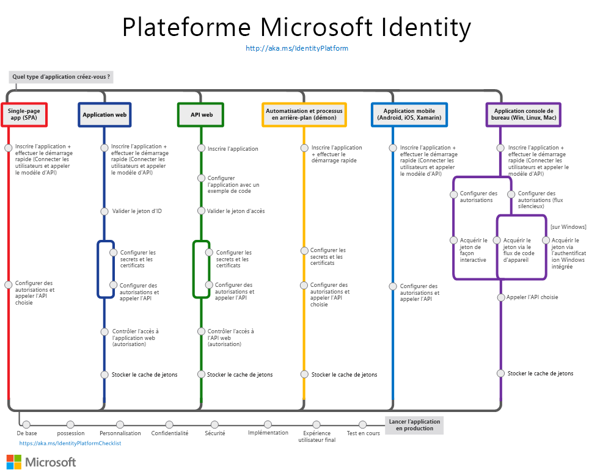

# Présentation de la plateforme d’identités Microsoft

La plateforme d’identités Microsoft vous permet de créer des applications auxquelles vos utilisateurs et clients peuvent se connecter au moyen de leurs identités Microsoft ou comptes de réseaux sociaux ; elle vous fournit également un accès autorisé à vos propres API ou aux API Microsoft telles que Microsoft Graph.

Plusieurs composants constitue la plateforme d’identités Microsoft :

- **Service d’authentification conforme aux standards OAuth 2.0 et OpenID Connect** permettant aux développeurs d’authentifier plusieurs types d’identités, notamment :
  - Comptes professionnels ou scolaires, provisionnés par le biais d’Azure AD
  - Compte Microsoft personnel, comme Skype, Xbox et Outlook.com
  - Comptes locaux ou de réseaux sociaux, en utilisant Azure AD B2C
- **Bibliothèques open source** : bibliothèques MSAL (Microsoft Authentication Libraries) et prise en charge des autres bibliothèques conformes aux normes
- **Portail de gestion des applications** : expérience d’inscription et de configuration dans le portail Azure, avec les autres possibilités de gestion Azure.
- **API de configuration des applications et PowerShell** : configuration programmatique de vos applications avec l’API Microsoft Graph et PowerShell, vous permettant ainsi d’automatiser vos tâches DevOps.
- **Contenu pour les développeurs** : documentation technique incluant guides de démarrage rapide, tutoriels, guides pratiques et exemples de code.

Pour les développeurs, la plateforme d’identités Microsoft offre l’intégration d’innovations modernes dans l’espace d’identité et de sécurité, telles que l’authentification sans mot de passe, l’authentification renforcée et l’accès conditionnel. Vous n’avez pas besoin d’implémenter ces fonctionnalités vous-même : les applications intégrées à la plateforme d’identités Microsoft tirent parti de ces innovations de manière native.

Avec la plateforme d’identités Microsoft, vous pouvez écrire du code une seule fois et atteindre tous les utilisateurs. Vous pouvez générer une application une seule fois et la faire fonctionner dans de nombreuses plateformes, ou générer une application qui fonctionne en tant que client et aussi qu’application de ressource (API).

## Prise en main

Choisissez le [scénario d’application](authentication-flows-app-scenarios.md) que vous souhaitez générer. Chacun de ces chemins de scénarios commence par une présentation et renvoie à un guide de démarrage rapide qui vous permet de vous familiariser :

- [Application monopage (SPA)](scenario-spa-overview.md)
- [Application web qui connecte les utilisateurs](scenario-web-app-sign-user-overview.md)
- [Application web qui appelle des API web](scenario-web-app-call-api-overview.md)
- [API web protégée](scenario-protected-web-api-overview.md)
- [API web qui appelle des API web](scenario-web-api-call-api-overview.md)
- [Application de bureau](scenario-desktop-overview.md)
- [Application démon](scenario-daemon-overview.md)
- [Application mobile](scenario-mobile-overview.md)

Lorsque vous travaillez avec la plateforme d’identités Microsoft pour intégrer l’authentification et l’autorisation à vos applications, vous pouvez vous référer à cette image qui donne un aperçu des scénarios d’application les plus courants avec leurs composants d’identité. Sélectionnez l’image pour l’afficher en plein écran.

## Découvrir les concepts d’authentification

Découvrez dans ces quelques articles conseillés comment l’authentification de base et les concepts d’Azure AD s’appliquent à la plateforme d’identités Microsoft :

- [Principes fondamentaux de l’authentification](./authentication-vs-authorization.md)
- [Applications et principaux de service](app-objects-and-service-principals.md)
- [Audiences](v2-supported-account-types.md)
- [Autorisations et consentement](v2-permissions-and-consent.md)
- [Jetons d’ID](id-tokens.md)
- [Jetons d’accès](access-tokens.md)
- [Flux d’authentification et scénarios d’applications](authentication-flows-app-scenarios.md)

## Plus d’options de gestion de l’identité et de l’accès

[Azure AD B2C](../../active-directory-b2c/overview.md) – Créez des applications destinées aux clients, auxquelles vos utilisateurs peuvent se connecter au moyen de leurs comptes de réseaux sociaux, tels que Facebook ou Google, ou d’une adresse e-mail et d’un mot de passe.

[Azure AD B2B](../external-identities/what-is-b2b.md) – Invitez des utilisateurs externes en tant qu’utilisateurs « invités » dans votre locataire Azure AD, et affectez des autorisations qui leur permettent d’utiliser leurs informations d’identification existantes pour l’authentification.

[Azure Active Directory pour les développeurs (v1.0)](../azuread-dev/v1-overview.md) – Affiché ici pour les développeurs dont les applications utilisent l’ancien point de terminaison v1.0. **N’utilisez pas** v1.0 pour les nouveaux projets.

## Étapes suivantes

Si vous disposez d’un compte Azure, vous avez déjà accès à un locataire Azure Active Directory, mais la plupart des développeurs de plateforme d’identités Microsoft ont besoin de leur propre locataire Azure AD, en fait d’un « locataire de développeur », pour s’en servir lors du développement d’applications.

Apprenez à créer votre propre locataire pour l’utiliser pendant la création de vos applications :

[Démarrage rapide : Configurer un locataire Azure AD](quickstart-create-new-tenant.md)
