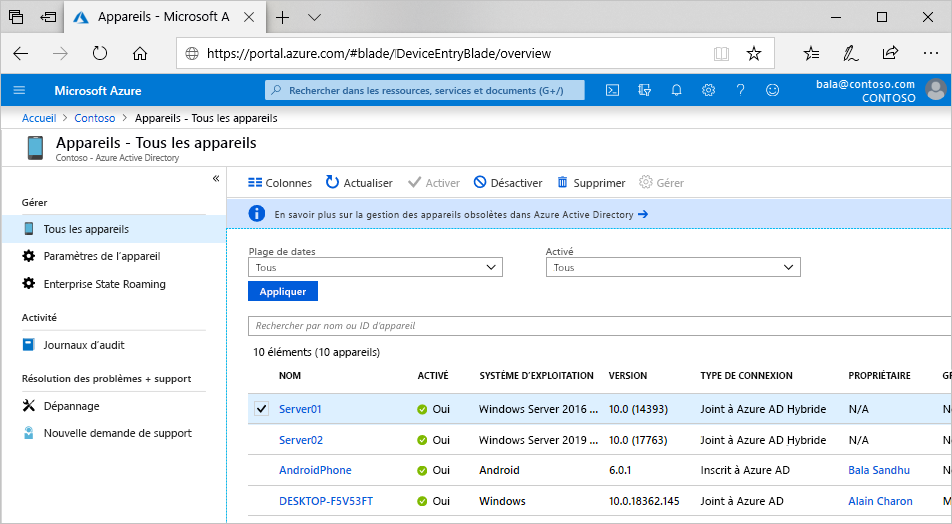

# Qu’est-ce qu’une identité d’appareil ?

Avec la prolifération des appareils de toutes formes et toutes tailles le concept Bring Your Own Device (BYOD), les professionnels de l’informatique sont confrontés à deux objectifs somme toute contradictoires :

- Permettre aux utilisateurs finaux d’être productifs où et quand ils le veulent
- Protéger les ressources de l’entreprise

Pour protéger ces ressources, le personnel informatique doit tout d’abord gérer les identités des appareils. Le personnel informatique peut s’appuyer sur l’identité de l’appareil avec des outils tels que Microsoft Intune pour garantir le respect des normes de sécurité et de conformité. Azure Active Directory (Azure AD) active l’authentification unique aux appareils, applications et des services depuis n’importe quel endroit par le biais de ces appareils.

- Vos utilisateurs ont accès aux ressources de votre organisation dont ils ont besoin. 
- Votre personnel informatique obtient les contrôles nécessaires pour sécuriser votre organisation.

La gestion des identités d’appareils est à la base de [l’accès conditionnel basé sur les appareils](../conditional-access/require-managed-devices.md). Avec les stratégies d’accès conditionnel basé sur les appareils, vous pouvez faire en sorte que l’accès aux ressources de votre environnement soit possible seulement avec des appareils managés.

## Obtenir des appareils dans Azure AD

Pour obtenir un appareil à Azure AD, vous avez plusieurs options :

- **Appareils inscrits sur Azure AD**
   - Les appareils qui sont inscrits auprès d’Azure AD sont généralement des appareils personnels ou mobiles connectés à un compte personnel Microsoft ou à un autre compte local.
      - Windows 10
      - iOS
      - Android
      - MacOS
- **Appareil joints à Azure AD**
   - Les appareils joints à Azure AD appartiennent à une organisation et sont connectés avec un compte Azure AD appartenant à cette organisation. Ils existent uniquement dans le cloud.
      - Windows 10 
      - [Machines virtuelles Windows Server 2019 s’exécutant dans Azure](howto-vm-sign-in-azure-ad-windows.md) (Server Core n’est pas pris en charge)
- **joints à Azure AD hybrides**
   - Les appareils joints à une version hybride d’Azure AD appartiennent à une organisation et la connexion à ces appareils s’effectue avec un compte des services de domaine Active Directory appartenant à cette organisation. Ils existent dans le cloud et en local.
      - Windows 7, 8.1 ou 10
      - Windows Server 2008 ou version ultérieure

> [!NOTE]
> Un état hybride fait référence à plus que le simple état d’un appareil. Pour qu’un état hybride soit valide, un utilisateur Azure AD valide est également requis.

## Gestion des appareils

Vous pouvez gérer les appareils Azure AD avec des outils de gestion des appareils mobiles (MDM) tels que Microsoft Intune, Microsoft Endpoint Configuration Manager, la stratégie de groupe (jonction hybride Azure AD), Mobile Application Management (MAM) ou autres outils tiers.

## Accès aux ressources

L’inscription et la jonction d’appareils à Azure AD permet aux utilisateurs de se connecter aux ressources cloud à l’aide de l’authentification unique (SSO) fluide. Ce processus permet également aux administrateurs d’appliquer des stratégies d’accès conditionnel aux ressources en fonction de l’appareil utilisé pour y accéder. 

> [!NOTE]
> Les stratégies d’accès conditionnel en fonction de l’appareil s’appliquent uniquement à des appareils joints à Azure AD Hybride ou à des appareils conformes joints à Azure AD ou inscrits auprès d’Azure AD.

Le jeton d’actualisation principal contient des informations sur l’appareil, et il est obligatoire pour l’authentification unique. Si vous avez défini une stratégie d’accès conditionnel basé sur l’appareil sur une application, sans jeton d’actualisation principal l’accès est refusé. Les stratégies d’accès conditionnel hybride nécessitent un appareil à l’état hybride et un utilisateur valide qui est connecté.

Les appareils qui sont des appareils Azure AD joints ou des appareils Azure AD joints hybrides bénéficient de l’authentification unique aux ressources sur site de votre organisation ainsi qu’aux ressources cloud. Pour plus d’informations, consultez [Fonctionnement de l’authentification unique auprès de ressources locales sur des appareils joints à Azure AD](azuread-join-sso.md).

## Sécurité des appareils

- Les **appareils Azure AD inscrits** utilisent un compte géré par l’utilisateur final, ce compte est soit un compte Microsoft ou un autre compte géré localement sécurisé avec un ou plusieurs des éléments suivants.
   - Mot de passe
   - PIN
   - Modèle
   - Windows Hello
- Les **appareils joints Azure AD ou joints Azure AD hybrides** utilisent un compte professionnel dans Azure AD sécurisé avec un ou plusieurs des éléments suivants.
   - Mot de passe
   - Windows Hello Entreprise

## Approvisionnement

L’ajout d’appareils à Azure AD est possible en libre-service ou par un processus d’approvisionnement contrôlé par des administrateurs.

## Résumé

La gestion des identités d’appareils dans Azure AD vous permet de :

- Simplifier le processus consistant à apporter et gérer des appareils dans Azure AD
- Fournir à vos utilisateurs un accès facile aux ressources basées sur le cloud de votre organisation

## Conditions de licence :

[!INCLUDE [Active Directory P1 license](../../../includes/active-directory-p1-license.md)]

## Étapes suivantes

- En savoir plus sur les [appareils inscrits Azure AD](concept-azure-ad-register.md)
- En savoir plus sur les [appareils joints à Azure AD](concept-azure-ad-join.md)
- En savoir plus sur les [appareils hybrides joints à Azure AD](concept-azure-ad-join-hybrid.md)
- Pour obtenir une vue d’ensemble de la gestion des identités dans le portail Azure, consultez [Gestion des identités d’appareils via le portail Azure](device-management-azure-portal.md).
- Pour plus d’informations sur l’accès conditionnel basé sur les appareils, consultez [Configurer les stratégies d’accès conditionnel basé sur les appareils Azure Active Directory](../conditional-access/require-managed-devices.md).
