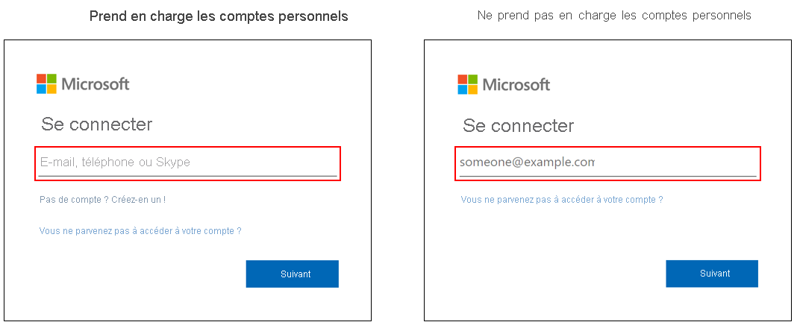

# Options de connexion pour les comptes Microsoft dans Azure Active Directory

La page de connexion Microsoft 365 pour Azure Active Directory (Azure AD) prend en charge les comptes scolaires et professionnels, ainsi que les comptes Microsoft, mais, selon la situation de l’utilisateur, il peut s’agit d’un type de copte, de l’autre ou des deux. Par exemple, la page de connexion Azure AD prend en charge :

* les applications qui acceptent les connexions à partir des deux types de comptes ;
* les organisations qui acceptent des invités.

## Identification
Vous pouvez déterminer si la page de connexion que votre organisation utilise prend en charge les comptes Microsoft en examinant le texte d’information dans le champ du nom d’utilisateur. Si le texte d’information est « Courrier, téléphone ou Skype », la page de connexion prend en charge les comptes Microsoft.

[Les options de connexion supplémentaires fonctionnent uniquement pour les comptes Microsoft personnels.](https://azure.microsoft.com/updates/microsoft-account-signin-options/ ) Elles ne peuvent pas être utilisées pour accéder à des ressources de compte professionnel ou scolaire.

## Étapes suivantes

[Ajouter votre nom de domaine personnalisé](../fundamentals/add-custom-domain.md)