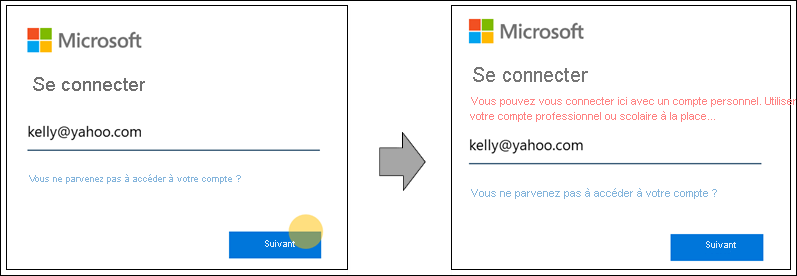
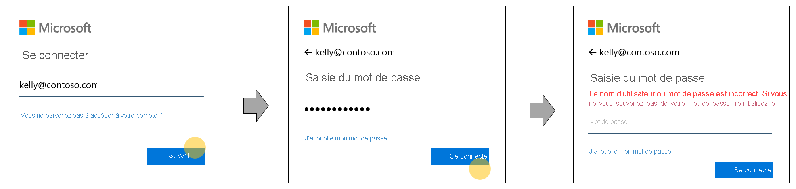

# Découverte du domaine d’accueil pour les pages de connexion Azure Active Directory

Nous modifions notre comportement de connexion à Azure Active Directory (Azure AD) pour laisser place à de nouvelles méthodes d’authentification et améliorer la convivialité. Lors de la connexion, Azure AD détermine où un utilisateur doit s’authentifier. Azure AD prend des décisions intelligentes en lisant les paramètres d’organisation et d’utilisateur qui s’appliquent au nom d’utilisateur entré sur la page de connexion. Il s’agit d’un pas en avant vers un avenir sans mot de passe avec la possibilité d’utiliser des informations d’identification supplémentaires telles que FIDO 2.0.

## Comportement de la découverte du domaine d’accueil

Historiquement, la découverte du domaine d’accueil était régie par le domaine fourni lors de la connexion ou par une politique de découverte du domaine d’accueil pour certaines applications héritées. Par exemple, dans notre comportement de découverte, lorsqu’un utilisateur Azure Active Directory saisit mal son nom d’utilisateur, il a quand même accès à l’écran de collecte des informations d’identification de son organisation. Cela se produit lorsque l’utilisateur entre correctement le nom de domaine de l’organisation « contoso.com ». Ce comportement n’offre pas la granularité nécessaire pour personnaliser l’expérience d’un utilisateur individuel.

Afin de prendre en charge un plus grand nombre d’informations d’identification et d’augmenter la convivialité, le comportement de recherche de nom d’utilisateur d’Azure Active Directory pendant le processus de connexion est maintenant mis à jour. Le nouveau comportement prend des décisions intelligentes en lisant les paramètres au niveau de l’organisation et au niveau de l’utilisateur en fonction du nom d’utilisateur entré sur la page de connexion. Pour que ceci soit possible, Azure Active Directory vérifiera si le nom d’utilisateur entré sur la page de connexion existe dans le domaine spécifié ou redirigera l’utilisateur pour qu’il fournisse ses informations d’identification.

Un autre avantage de ce travail est l’amélioration de la messagerie d’erreur. Voici quelques exemples de la messagerie d’erreur améliorée lors de la connexion à une application qui supporte uniquement les utilisateurs Azure Active Directory.

- Le nom d’utilisateur est mal orthographié ou n’a pas encore été synchronisé avec Azure AD :
  
    
  
- Le nom de domaine est mal orthographié :
  
    
  
- L’utilisateur tente de se connecter avec un domaine de consommateur connu :
  
    
  
- Le mot de passe est mal orthographié, mais le nom d’utilisateur est correct :  
  
    
  
> [!IMPORTANT]
> Cette fonctionnalité peut impacter les domaines fédérés s’appuyant sur l’ancien niveau de domaine de la découverte du domaine d’accueil pour forcer la fédération. Pour savoir quand les mises à jour permettant la prise en charge des domaines fédérés seront ajoutées, veuillez consulter [Découverte du domaine d’accueil lors de la connexion aux services Microsoft 365](https://azure.microsoft.com/updates/signin-hrd/). Entre-temps, certaines organisations ont formé leurs employés à se connecter avec un nom d’utilisateur qui n’existe pas dans Azure Active Directory mais qui contient le nom de domaine propre, car les noms de domaine acheminent actuellement les utilisateurs vers le point de terminaison du domaine de leur organisation. Le nouveau comportement de connexion ne le permet pas. L’utilisateur est invité à corriger son nom d’utilisateur, et il n’est pas autorisé à se connecter avec un nom d’utilisateur qui n’existe pas dans Azure Active Directory.
>
> Si vos pratiques reposent sur l’ancien comportement, les administrateurs de votre organisation doivent mettre à jour la documentation de connexion et d’authentification des employés, et former ces derniers à utiliser leur nom d’utilisateur Azure Active Directory pour se connecter.
  
Si vous avez des inquiétudes concernant le nouveau comportement, veuillez nous transmettre vos remarques dans la section **Commentaires** de cet article.  

## Étapes suivantes

[Ajouter votre nom de domaine personnalisé](../fundamentals/add-custom-domain.md)
