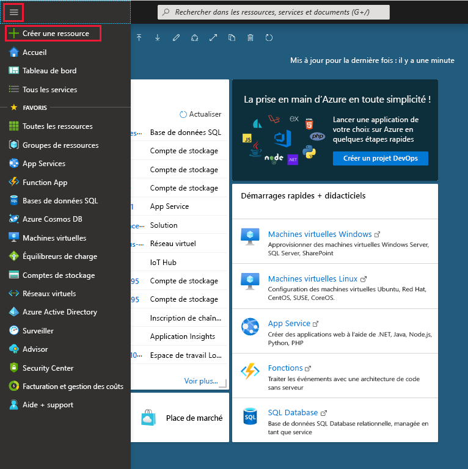
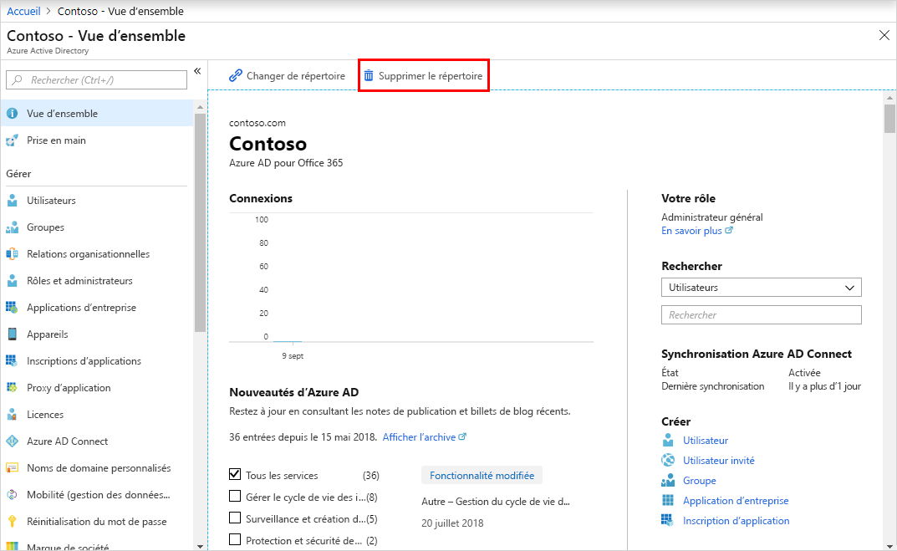

# Démarrage rapide : Créer un locataire dans Azure Active Directory
Vous pouvez effectuer toutes vos tâches d’administration à l’aide du portail Azure Active Directory (Azure AD), notamment la création d’un locataire pour votre organisation. 

Dans ce guide de démarrage rapide, vous découvrez comment accéder au portail Azure et à Azure Active Directory, et comment créer un locataire de base pour votre organisation.

Si vous n’avez pas d’abonnement Azure, créez un [compte gratuit](https://azure.microsoft.com/free/) avant de commencer.

## Créer un locataire pour votre organisation
Une fois connecté au portail Azure, vous pouvez créer un locataire pour votre organisation. Votre nouveau locataire représente votre organisation et vous permet de gérer une instance particulière des services cloud de Microsoft pour vos utilisateurs internes et externes.

### Pour créer un locataire

1. Connectez-vous au [portail Azure](https://portal.azure.com/) de votre organisation.

1. Dans le menu du Portail Azure, sélectionnez **Créer une ressource**.  

    

1. Recherchez et sélectionnez **Azure Active Directory**.

    La page **Créer un annuaire** s’affiche.

    

1.  Dans la page **Créer un annuaire**, indiquez les informations suivantes :
    
    - Tapez _Contoso_ dans la zone **Nom de l’organisation**.

    - Tapez _Contoso_ dans la zone **Nom de domaine initial**.

    - Laissez l’option _États-Unis_ dans la zone **Pays ou région**.

1. Sélectionnez **Create** (Créer).

Votre nouveau locataire est créé avec le domaine contoso.onmicrosoft.com.

## Nettoyer les ressources
Si vous ne prévoyez pas de continuer à utiliser cette application, vous pouvez supprimer le locataire en effectuant les étapes suivantes :

- Veillez à être connecté à l’annuaire que vous souhaitez supprimer via le filtre **Répertoire + abonnement** dans le portail Azure, puis basculez vers l’annuaire cible si nécessaire.
- Sélectionnez **Azure Active Directory** puis, dans la page **Contoso - Vue d’ensemble**, sélectionnez **Supprimer l’annuaire**.

    Le locataire et ses informations associées sont supprimés.

    

## Étapes suivantes
- Pour modifier ou ajouter des noms de domaine supplémentaires, consultez [Guide pratique pour ajouter un nom de domaine personnalisé à Azure Active Directory](add-custom-domain.md).

- Pour ajouter des utilisateurs, consultez [Ajouter ou supprimer un nouvel utilisateur](add-users-azure-active-directory.md)

- Pour ajouter des groupes et des membres, consultez [Créer un groupe de base et ajouter des membres](active-directory-groups-create-azure-portal.md)

- Découvrez l’[accès en fonction du rôle avec Privileged Identity Management](../../role-based-access-control/best-practices.md) et l’[accès conditionnel](../../role-based-access-control/conditional-access-azure-management.md) permettant de gérer l’accès aux ressources et aux applications de votre organisation.

- En savoir plus sur Azure AD, notamment sur [les informations de base des licences, la terminologie et les fonctionnalités associées](active-directory-whatis.md).
