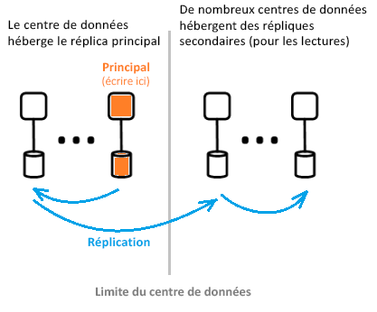

# Qu’est-ce que l’architecture Azure Active Directory ?

Azure Active Directory (Azure AD) vous permet de gérer en toute sécurité l’accès aux ressources et aux services Azure pour vos utilisateurs. Azure AD comprend une suite complète de fonctionnalités de gestion des identités. Pour plus d’informations sur les fonctionnalités d’Azure AD, voir [Qu’est Azure Active Directory ?](active-directory-whatis.md)

Azure AD permet de créer et de gérer des utilisateurs et des groupes, et d’activer des autorisations pour octroyer et refuser l’accès aux ressources d’entreprise. Pour plus d’informations sur la gestion des identités, voir [Principes de base de la gestion des identités Azure](active-directory-whatis.md).

## Architecture Azure AD

L’architecture distribuée géographiquement d’Azure AD combine des fonctionnalités de surveillance complète, de redirection automatique, de basculement et de récupération qui apportent disponibilité et performances à l’échelle de l’entreprise.

Les éléments d’architecture suivants sont traités dans cet article :

*   Conception de l’architecture de service
*   Extensibilité
*   Disponibilité continue
*   Centres de données

### Conception de l’architecture de service

La méthode la plus courante pour créer un système riche en données, accessible et pratique, consiste à s’appuyer sur des éléments fondamentaux indépendants : des unités d’échelle. Au niveau des données Azure AD, les unités d’échelle s’appellent des *partitions*.

Le niveau de données possède plusieurs services frontaux offrant une fonctionnalité de lecture-écriture. Le diagramme suivant montre comment les composants d’une partition à répertoire unique sont délivrés entre des centres de données géographiquement distribués.

  

Les composants de l’architecture Azure AD incluent un réplica principal et des réplicas secondaires.

#### Réplica principal

Le *réplica principal* reçoit tous les *écrits* pour la partition à laquelle il appartient. Toute opération d’écriture est immédiatement répliquée vers un réplica secondaire dans un autre centre de données avant de renvoyer une notification de réussite à l’appelant, afin de garantir la durabilité géo-redondante des écritures.

#### Réplicas secondaires

Toutes les *lectures* de répertoire sont traitées à partir des *réplicas secondaires* qui se trouvent dans des centres de données répartis entre différentes zones géographiques. Il existe plusieurs réplicas secondaires, car les données sont répliquées de manière asynchrone. Les lectures de répertoire, notamment les requêtes d’authentification, sont traitées à partir de centres de données proches des clients. Les réplicas secondaires sont responsables de l’évolutivité de lecture.

### Extensibilité

L’évolutivité est la capacité d’un service à se développer pour répondre aux exigences croissantes en matière de performances. L’évolutivité d’écriture est obtenue en partitionnant les données. L’évolutivité de lecture est obtenue en répliquant les données d’une partition vers plusieurs réplicas secondaires répartis dans le monde.

Les requêtes à partir d’applications de répertoire sont routées vers le centre de données le plus proche. Les écritures sont redirigées en toute transparence vers le réplica principal pour assurer la cohérence en lecture-écriture. Les réplicas secondaires développent de manière significative l’échelle des partitions, car les répertoires traitent généralement les lectures.

Les applications de répertoire se connectent aux centres de données les plus proches. Cette connexion améliore les performances, et une montée en charge devient donc possible. Dans la mesure où une partition de répertoire peut avoir plusieurs réplicas secondaires, ces derniers peuvent être placés plus près des clients de répertoire. Seuls les composants de service de répertoire interne gourmands en écriture ciblent directement le réplica principal actif.

### Disponibilité continue

La disponibilité (ou le temps d’activité) définit la capacité d’un système à s’exécuter sans interruption. La haute disponibilité d’Azure AD s’appuie sur le fait que les services peuvent transmettre rapidement le trafic entre plusieurs centres de données répartis géographiquement. Chaque centre de données est indépendant, ce qui permet les modes d’échec décorrélés. Dans cette conception haute disponibilité, Azure AD n’exige aucun temps d’arrêt pour les activités de maintenance.

La conception de partition Azure AD est simplifiée par rapport à la conception d’AD entreprise, grâce à une conception principale unique qui inclut un processus de basculement du réplica principal soigneusement orchestré et déterministe.

#### Tolérance de panne

Un système est plus disponible s’il est tolérant aux pannes de matériel, de logiciel et de réseau. Pour chaque partition sur le répertoire, il existe un réplica maître hautement disponible : le réplica principal. Seules les écritures sur la partition sont effectuées sur ce réplica. Ce réplica est en cours de surveillance étroite et continue, et les écritures peuvent être basculées immédiatement vers un autre réplica (qui devient alors le nouveau réplica) si une défaillance est détectée. Pendant le basculement, une perte de disponibilité de l’écriture de 1 à 2 minutes est possible. La disponibilité de lecture n’est pas affectée pendant cette période.

Les opérations de lecture (largement supérieures aux opérations d’écriture) s’effectuent uniquement dans les réplicas secondaires. Étant donné que les réplicas secondaires sont idempotents, la perte d’un réplica dans une partition donnée est facilement compensée en dirigeant les lectures vers un autre réplica, généralement situé dans le même centre de données.

#### Durabilité des données

Avant d’être acceptée, une écriture doit être validée durablement sur au moins deux centres de données. Cela se produit lorsque vous commencez par valider l’écriture sur le serveur principal et que vous répliquez immédiatement l’écriture dans au moins l’un des autres centres de données. Grâce à cette action d’écriture, le risque de perte catastrophique du centre de données hébergeant le réplica principal n’entraîne pas de perte de données.

Azure AD maintient un [objectif de délai de récupération (RTO)](https://en.wikipedia.org/wiki/Recovery_time_objective) de zéro pour ne pas perdre de données lors des basculements. notamment :

* Émission de jeton et lectures de répertoire
* RTO de 5 minutes environ seulement possible pour les écritures de répertoire

### Centres de données

Les réplicas d’Azure AD sont stockés dans des centres du monde entier. Pour plus d’informations, consultez l’article [Infrastructure globale Azure](https://azure.microsoft.com/global-infrastructure/).

Azure AD fonctionne dans les centres de données avec les caractéristiques suivantes :

* Les services AD Authentication, Graph et autres se trouvent derrière le service de passerelle. La passerelle gère l’équilibrage de charge de ces services. Elle bascule automatiquement si des serveurs défaillants sont détectés par les sondes d’intégrité transactionnelles. En fonction de ces sondes d’intégrité, la passerelle achemine dynamiquement le trafic vers les centres de données sains.
* Pour les *lectures*, le répertoire possède des réplicas secondaires et des services frontaux correspondants dans une configuration en mode actif/actif opérant dans plusieurs centres de données. En cas de défaillance complète d’un centre de données, le trafic sera automatiquement redirigé vers un autre centre de données.
 *Pour les *écritures*, le répertoire bascule le réplica principal (maître) vers les centres de données via les procédures de basculement planifié (le nouveau réplica principal est synchronisé avec l’ancien) ou d’urgence. La durabilité des données est obtenue en répliquant toute validation vers au moins deux centres de données.

#### Cohérence des données

Le modèle de répertoire est l’une des cohérences finales. Un problème classique avec les systèmes de réplication distribués asynchrones est que les données renvoyées à partir d’un réplica « spécifique » ne sont peut-être pas à jour. 

Azure AD fournit une cohérence en lecture-écriture pour les applications qui ciblent un réplica secondaire en routant ses écritures vers le réplica principal et en extrayant simultanément les écritures sur le réplica secondaire.

Les écritures d’application utilisant l’API Microsoft Graph d’Azure AD n’ont pas à conserver des affinités avec le réplica de répertoire pour la cohérence en lecture-écriture. Le service API Microsoft Graph conserve une session logique qui a une affinité avec un réplica secondaire utilisé pour les lectures. L’affinité est capturée dans un « jeton de réplica » mis en cache par le service à l’aide d’un cache distribué dans le centre de données de réplica secondaire. Ce jeton est ensuite utilisé pour les opérations suivantes dans la même session logique. Pour continuer à utiliser la même session logique, les demandes suivantes doivent être acheminées vers le même centre de données Azure AD. Vous ne pouvez pas poursuivre une session logique si les demandes client de répertoire sont acheminées vers plusieurs centres de données Azure AD. Dans cette situation, le client a plusieurs sessions logiques présentant des cohérences en lecture-écriture indépendantes.

 >[!NOTE]
 >Les écritures sont immédiatement répliquées sur le réplica secondaire pour lequel les lectures de la session logique ont été émises.

#### Protection de la sauvegarde

Le répertoire implémente les suppressions récupérables, plutôt que les suppressions définitives, pour les utilisateurs et les clients afin de faciliter la récupération en cas de suppression accidentelle par un client. Si votre administrateur client supprime accidentellement des utilisateurs, il peut facilement annuler son action et restaurer les utilisateurs supprimés.

Azure AD implémente les sauvegardes quotidiennes de toutes les données et peut, par conséquent, restaurer avec autorité les données dans le cas de suppressions logiques ou de corruptions. Le niveau de données employant des codes de correction d’erreur, il peut détecter les erreurs et corriger automatiquement certains types d’erreurs de disque.

#### Métriques et supervision

L’exécution d’un service haute disponibilité requiert des mesures et des capacités d’analyse hautes performances. Azure AD analyse et signale en permanence les mesures d’intégrité des services clés et les critères de réussite pour chacun de ses services. Nous développons et affinons en permanence les mesures, surveillant et alertant pour chaque scénario au sein de chaque service Azure AD, mais aussi sur tous les autres services.

Si un quelconque service Azure AD ne fonctionne pas comme prévu, les mesures nécessaires à sa restauration sont prises immédiatement. La mesure la plus importante suivie par Azure AD est la vitesse à laquelle un problème sur site peut être détecté et résolu. Nous investissons massivement dans la surveillance et les alertes pour réduire le temps de détection (cible TTD : <5 minutes)et dans la disponibilité opérationnelle pour réduire le temps de résolution (cible TTM : <30 minutes).

#### Opérations sécurisées

Utilisation de contrôles opérationnels, tels que l’authentification multifacteur (MFA) pour toute opération, ainsi que l’audit de toutes les opérations. Utilisation également et en permanence d’un système d’élévation juste-à-temps pour accorder l’accès temporaire nécessaire à toute tâche opérationnelle à la demande. Pour plus d’informations, voir [Cloud de confiance](https://azure.microsoft.com/support/trust-center).

## Étapes suivantes

[Guide du développeur Azure Active Directory](../develop/index.yml)