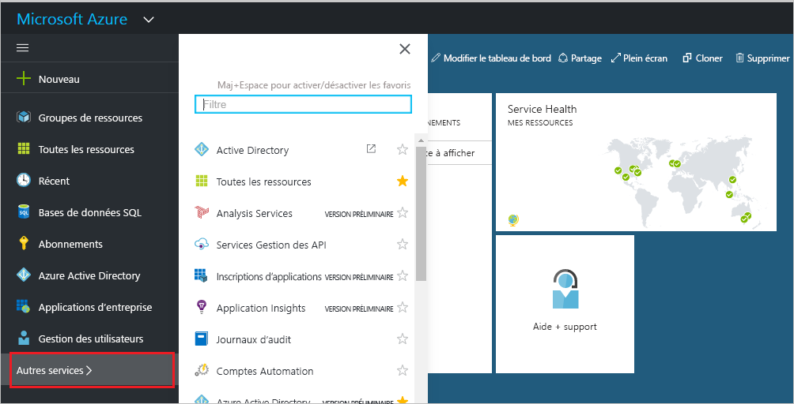
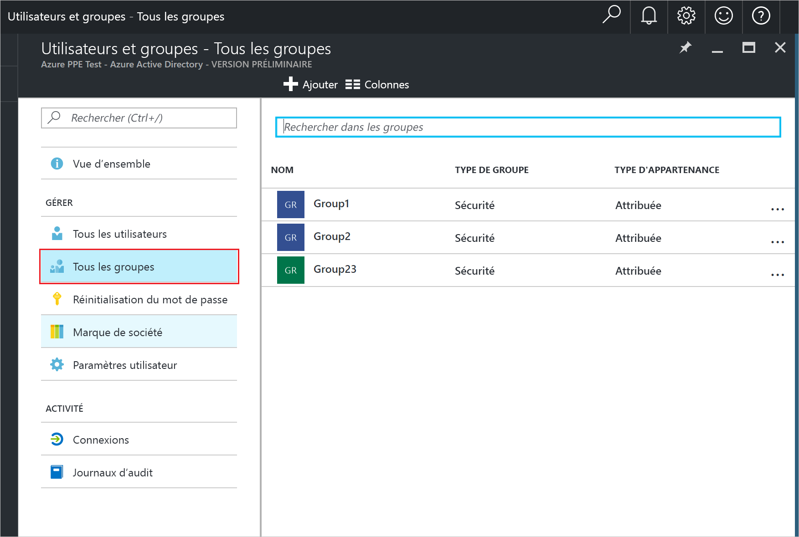
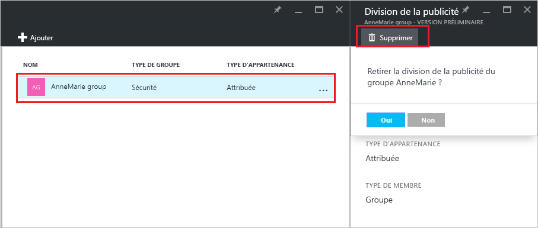

# Gérer les groupes auxquels un groupe appartient dans votre client Azure Active Directory
Les groupes peuvent contenir d’autres groupes dans Azure Active Directory. Voici comment gérer ces adhésions.

## Comment trouver les groupes dont le mien fait partie ?
1. Connectez-vous au [centre d’administration Azure AD](https://aad.portal.azure.com) en utilisant un compte d’administrateur général pour le répertoire.
2. Sélectionnez **Utilisateurs et groupes**.

   
1. Sélectionnez **Tous les groupes**.

   
1. Sélectionnez un groupe.
2. Sélectionnez **Appartenances aux groupes**.

   
1. Pour ajouter votre groupe en tant que membre d’un autre groupe, dans le panneau **Groupe - Appartenances aux groupes**, sélectionnez la commande **Ajouter**.
2. Sélectionnez un groupe à partir du panneau **Sélectionner un groupe**, puis cliquez sur le bouton **Sélectionner** en bas du panneau. Vous pouvez ajouter votre groupe à un seul groupe à la fois. La zone **Utilisateur** filtre l’affichage en fonction de la correspondance de votre entrée avec une partie ou l’intégralité d’un nom d’utilisateur ou d’appareil. Dans cette zone aucun caractère générique n’est accepté.

   
8. Pour supprimer votre groupe en tant que membre d’un autre groupe, dans le panneau **Groupe - Appartenances aux groupes** , sélectionnez un groupe.
9. Sélectionnez la commande **Supprimer**, puis confirmez votre choix dans l’invite de commandes.

   
10. Lorsque vous avez terminé de modifier les appartenances aux groupes de votre groupe, sélectionnez **Enregistrer**.

## Informations supplémentaires
Ces articles fournissent des informations supplémentaires sur Azure Active Directory.

* [Consulter les groupes existants](active-directory-groups-view-azure-portal.md)
* [Création d’un nouveau groupe et ajout de membres](active-directory-groups-create-azure-portal.md)
* [Gérer les paramètres d’un groupe](active-directory-groups-settings-azure-portal.md)
* [Gérer les membres d’un groupe](active-directory-groups-members-azure-portal.md)
* [Gérer les règles dynamiques pour les utilisateurs dans un groupe](../users-groups-roles/groups-dynamic-membership.md)
